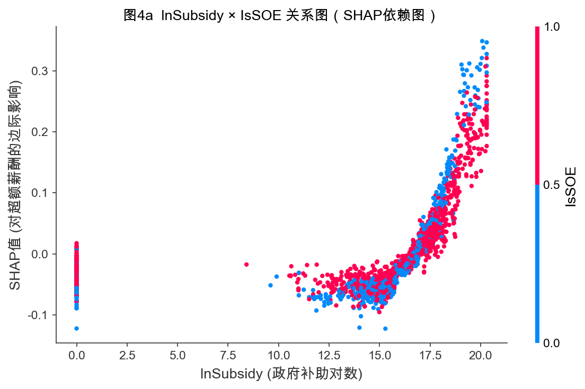
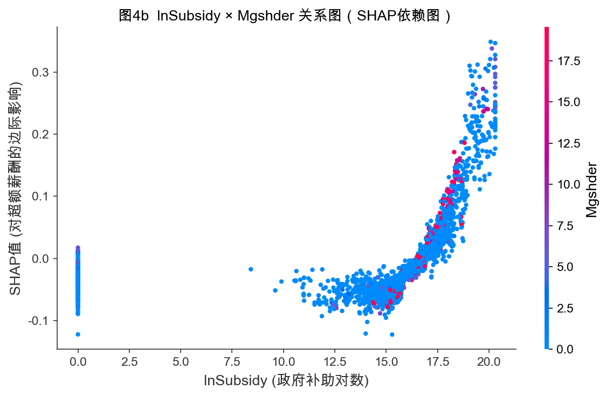

# 基于数据挖掘的上市公司财政补贴与高管超额薪酬研究

---

**摘　要**

财政补贴规模在近年来持续扩张，上市公司高管薪酬问题也同期引发大量争议，二者之间的潜在关联，学术上涉及治理效率与代理成本，实践上则直接关系到财政资金的使用效率。本文以2003—2024年沪深A股非金融上市公司为样本，在管理者权力理论与代理理论框架下，考察财政补贴强度与高管超额薪酬之间的条件相关关系，并观察其在不同制度环境下的异质表现。参照Core等（1999）的期望薪酬模型，本文将模型1的回归残差直接界定为高管超额薪酬（Overpay），将未披露政府补助的公司年度取0处理，由此构造核心解释变量$\ln(1+\text{Subsidy})$，并依次引入固定效应回归、工具变量、中介效应、异质性分析以及机器学习补充检验等方法。实证部分的主要发现是：在公司和年份固定效应下，滞后一期财政补贴对高管超额薪酬的系数虽为正，但未达到常用显著性水平（$\beta = 0.0005$，$p = 0.603$），全样本层面的直接关联并不稳固；稳健性检验进一步表明，这一关系会随因变量口径、解释变量定义和样本范围的变化而波动。基于FA口径的机制检验中，补贴对管理层权力的路径$a$为正但未达显著水平（$p = 0.119$），管理层权力对超额薪酬的路径$b$显著为正，间接效应约为0.000055，Bootstrap 95%置信区间为[-0.000004, 0.000132]，Sobel检验亦未达到常用显著性水平，因此本文未获得稳健的中介效应支持。分组回归未呈现产权性质、行业管制强度及央地国企分类下清晰一致的差异化模式，现有结果更适合被理解为尚未观察到稳健的直接异质性线索。机器学习补充结果显示，非线性模型的拟合表现优于线性基准，财政补贴在自动特征筛选和SHAP重要性排序中仍位于较前位置，但其增量解释力有限，更适合作为对潜在非线性和交互结构的探索性提示。本文为理解财政补贴与高管薪酬治理间的关系补充了经验证据，并提示相关结论需要结合变量口径的敏感性与识别局限来审慎对待。

**关键词**：财政补贴；高管超额薪酬；管理层权力；中介效应；数据挖掘

---

## 第一章 绪论

### 1.1 研究背景与问题提出

党的二十大报告提出，中国经济已从高速增长阶段转向高质量发展阶段。这一判断深刻改变了政府与市场之间的关系格局，也使财政政策的工具属性和治理含义更加突出。在产业政策层面，财政补贴长期用于推动战略性新兴产业培育、激励企业技术创新、纾困市场主体以及稳就业保民生。根据CSMAR数据库样本统计，2003年至2024年间，沪深A股上市公司（剔除金融行业）的政府补助总体规模持续扩张，获得补贴的企业数量和单家企业的平均补贴强度均呈上升趋势。随着更多公共资金流向企业部门，财政补贴已成为中国资本市场中难以回避的重要制度变量。

同时，上市公司高管薪酬问题持续引发争议。学术层面，这一问题涉及激励契约设计、代理成本控制与公司治理效率等核心命题；放在公共讨论中，则直接触及收入分配公平性、政策资源使用效率和社会信任基础。近年来，一个反复出现的质疑是：企业在大规模获得政府补贴的同时，高管薪酬是否也随之抬升？那些原本应服务于产业发展和公共利益的政策性资源，会不会在信息不对称与治理约束不足的条件下，部分转化为高管的个人收益？这些问题超出了舆论层面的讨论，直接指向财政资金的实际效率和企业内部利益分配的合理性。

解释高管薪酬偏离“合理”水平的原因，学界存在两种思路。“最优契约说”认为，在经理人市场充分竞争和有效治理结构的前提下，薪酬是董事会与高管理性博弈的均衡结果，反映的是高管所创造的边际价值。“管理权力说”则认为，在所有权与控制权高度分离的现代公司里，高管凭借对董事会构成和薪酬委员会决策的影响力，能够完整地从薪酬契约中提取超额收益。结合中国上市公司的实际情况，后一种解释通常更有说服力：信息不对称程度较高、内部控制质量参差不齐、独立董事独立性有限，这些制度性缺陷都为管理层的自利行为创造了空间。财政补贴作为重要的外部资源注入企业后，既扩大了企业可支配资源，也为高管提供了更多的薪酬议价筹码和寻租机会——这正是本文的研究出发点。

围绕这一问题，本文主要尝试回答四个相互关联的核心问题：在控制企业规模、盈利能力、财务杠杆等基本特征后，财政补贴是否与高管超额薪酬存在显著且稳健的正相关关系？管理层权力是否在两者之间发挥统计意义上的中介传导作用，即补贴变动会不会经由权力变化部分影响超额薪酬？这种关系在不同产权性质、行业管制强度和区域制度环境下是否存在差异，哪些制度因素可能放大或抑制这一关联？最后，基于机器学习的补充分析能否从非线性关系、交互效应和变量重要性三个角度，为主回归提供进一步佐证？

### 1.2 研究目的与研究意义

**理论意义**方面，本研究的贡献体现在三个层次。在分析框架上，本文把政府补贴这一政策变量系统纳入高管超额薪酬的决定因素分析，从“外部资源约束”与“内部权力结构”的交互视角，丰富了管理者权力理论在中国情境下的经验讨论，突破了现有文献多以公司内部治理变量为核心解释变量的局限。在变量测量上，本文以FA构造管理层权力的经验性综合指标，并在正文中仅沿用这一口径开展机制分析，同时明确不将其表述为统计上更优的唯一方案。在研究方法上，本文将固定效应、工具变量、中介效应检验等传统计量经济学方法与Lasso、随机森林、XGBoost等数据挖掘工具结合，使线性关联分析与探索性的非线性特征刻画形成互补。

**现实意义**方面，本研究的应用价值覆盖多个层面。对财政监管部门而言，实证证据提示补贴与高管薪酬的关系并不是一条简单的线性链条，而更可能受到变量口径、治理约束和制度情境的共同塑造，这为补贴政策附加资金用途约束、事后审计机制和信息披露要求提供了经验参考。对资本市场监管机构而言，机器学习补充检验识别出的高补贴区间和治理特征组合，只能作为筛查重点情境的辅助线索，而不宜直接替代正式监管判断。投资者和公众若能理解财政补贴对高管薪酬的潜在影响及其不稳定性，也有助于更完整地评估上市公司的治理质量与补贴政策的实际效率。

### 1.3 国内外研究现状

#### 1.3.1 高管超额薪酬的界定与测量方法

围绕高管超额薪酬的研究，真正困难的地方不在于观察到“薪酬高”，而在于判断其中哪些部分属于正常激励，哪些已经偏离了合理边界。早期文献常直接使用CEO绝对薪酬水平作为代理变量，这种处理便于操作，却很难把企业规模、业绩补偿和治理失灵造成的额外收益区分开来。Bebchuk和Fried（2003）[1]之所以成为这一领域的关键文献，正在于他们把讨论重点从“薪酬水平高低”转向了“薪酬契约是如何形成的”。在他们看来，所有权分散的上市公司里，管理层能够通过影响董事会提名、薪酬委员会构成以及具体条款设计，把本应接受监督的薪酬安排转化为自身议价能力的体现。因此，期权、退休福利和其他隐性收益不再只是支付形式问题，而成为识别管理权力的重要观察窗口。

Core等（1999）[3]则把这一问题推进到了可操作的计量层面。其做法并不复杂，却影响很大：利用公司治理、规模、业绩、风险、行业和年份等变量估计CEO在一般条件下应获得的薪酬水平，再把该模型的残差视为超额薪酬。这样处理的好处是，研究者不必把所有高薪都视为异常，而是先给出一个“应得薪酬”的基准，再讨论偏离基准的部分是否与权力结构有关。后续大量文献沿用了这一残差口径，本文也是在这个框架下展开，只是结合中国上市公司数据做了本土化调整。

在中国样本中，这一路径也得到了进一步延伸。Bu等（2019）[4]更关注高管与员工之间的薪酬差距，罗昆、曹光宇（2015）[13]则直接用残差法刻画超额薪酬，二者处理角度不同，但都把政府补贴纳入了解释框架，并得出了补贴与高管额外收益存在正向关联的判断。吴妍（2019）[24]、张莉莉（2019）[25]等学位论文则提供了更贴近中国制度环境的变量设定和样本处理经验。这些研究的价值更在于：它们说明在中国资本市场语境下，超额薪酬确实可以被构造为一个可检验、可比较的经验变量。

#### 1.3.2 财政补贴的分配逻辑与公司行为效应

关于财政补贴本身，现有文献首先提醒我们不要把它理解成随机进入企业账户的外部资金。唐清泉和罗党论（2007）[16]指出，中国上市公司的补贴分配同时带有产业政策导向和政治关联色彩，这意味着补贴的获得已经包含了企业特征和制度关系的选择过程。潘红波、夏新平和余明桂（2008）[17]进一步表明，政治关联更强的企业更容易拿到政策支持。在这样的制度背景下，补贴既是财务资源，又是治理关系的一部分；它进入企业之后，改变的不只是利润表，还有管理层在企业内部的资源支配位置。

Jiang等（2025）[6]把这个问题往企业内部再推进了一步。他们考察的不是补贴有没有到账，而是补贴到账以后资源如何被消化，结果发现政府补贴与管理冗余显著正相关，而且这种关系在内部控制较弱、社会信任水平较低的企业里更明显。补贴未必自动转化为效率改进，有时会变成管理层可以占用的松弛空间。李哲、王文翰和王遥（2022）[14]则从信息披露端提供了另一条证据：部分企业会通过强化年报中的政策导向表述来提升补贴获取概率。这条线索对本文同样重要，因为它提示补贴的形成过程本身就带有信息策略和治理差异，而不是单纯的政策执行结果。

#### 1.3.3 内部治理机制对补贴—薪酬关联的调节

补贴是否会外溢到薪酬端，很大程度上取决于企业内部有没有足够强的治理约束——这一判断在已有研究中反复出现。步丹璐和王晓艳（2014）[15]发现，政府补助会扩大高管与员工之间的薪酬差距；在治理约束更弱的企业中，这一效应往往表现得更为突出。陈冬华、陈信元和万华林（2005）[18]讨论国有企业时也指出，显性薪酬一旦受到限制，管理层往往会转向在职消费、差旅费等更隐蔽的补偿渠道。把这两类证据合起来看，补贴影响薪酬并不一定表现为工资单上的直接增加，也会借助治理薄弱环节转化为更隐性的收益安排。

与之相对，卢锐、柳建华和许宁（2011）[19]的结果表明，内控质量越高，高管薪酬对业绩变化越敏感，这意味着更完善的内部约束能把薪酬重新拉回到激励逻辑上。罗进辉（2018）[20]从媒体监督角度得到类似结论：外部关注越强，薪酬与经营表现之间的对应关系越清晰，国有企业中这一作用尤其明显。对本文而言，这些文献的意义在于明确了一个判断标准：补贴能否推高异常薪酬，不只取决于补贴规模，更取决于企业内外部监督是否足以切断管理层的自利空间。

王克敏、王华杰、李栋栋等（2018）[21]则把视角推进到年报文本本身。他们发现，在业绩不佳或存在不利信息时，企业更倾向于使用复杂的年报表述；而年报可读性越低的企业，高管超额薪酬也相应偏高。这说明信息披露并不只是被动呈现事实，也可以被管理层用来抬高解读成本、削弱外部监督。连君莎（2020）[26]、章海浪（2021）[27]、徐坤（2021）[28]关于内部控制、薪酬公平和管理层语调的讨论，切入点各有侧重，但归到一处都在补充同一件事：补贴、治理和薪酬之间的关系，需要放在信息透明度和监督强度的差异中来理解。

#### 1.3.4 机器学习与数据挖掘方法在会计金融研究中的应用

机器学习文献与本文的关联，不在于它代表更“新”的方法，而在于它能处理线性回归不擅长回答的问题。Li（2008）[2]较早把文本特征与经济后果联系起来，说明非结构化信息可以进入会计研究。Perols、Bowen、Zimmermann等（2017）[5]在财务舞弊识别中发现，随机森林、神经网络和Boosting等方法较传统逻辑回归有更好的预测表现，背后并不是简单换了算法名称，而是模型能够自动识别变量间更高阶的交互。陆瑶、张叶青、黎波和赵浩宇（2020）[22]将梯度提升树用于高管特征与公司业绩的关系分析，得到类似的判断：某些变量的作用不是线性展开，而是在特定区间或特定组合下才会明显增强。

后续研究把这种思路进一步扩展到文本分析和异常识别。马长峰、陈志娟和张顺明（2020）[23]在综述中强调，机器学习更适合承担探索性和补充性任务，而不是直接替代因果推断。Rjiba、Saadi、Boubaker等（2021）[7]证明了年报可读性会影响权益资本成本，Bhattacharya和Mićković（2024）[8]、Ketelaar和Mićković（2025）[9]则把上下文语言学习与人工智能方法用于舞弊和异常识别。对本文来说，这些文献提供的启发很明确：当我们怀疑财政补贴与超额薪酬之间可能存在区间效应、交互效应或非线性结构时，机器学习可以作为补充观察工具，而不是替代主回归的主方法。

#### 1.3.5 研究述评与现有文献的局限

把前述文献放在一起看，现有研究已经把三个问题讨论得比较充分：超额薪酬如何界定与测量，已形成较稳定的方法路径；财政补贴是否影响高管收入，在中国情境下积累了相当数量的经验证据；内部控制、媒体监督和信息披露复杂性等变量，也已让我们看到治理约束会改变补贴效应的强弱。

但现有研究之间的空白同样清晰。很多研究仍然使用薪酬水平或薪酬差距作为结果变量，会把企业规模和绩效带来的正常差异混入其中；关于管理层权力是否承担了补贴影响薪酬的传导作用，讨论虽有，但结合固定效应与滞后设定的系统检验并不多见；机器学习方法现有文献更多用于舞弊识别或文本分类，放到补贴与超额薪酬关系中做非线性和交互结构的补充检验，较为少见。本文的实证设计，正是围绕这三处缺口展开。

### 1.4 研究方法与技术路线

本文的技术路线并不是把多种方法并排摆放，而是让它们依次回答不同层面的问题。文献梳理和理论推演部分先明确本文要检验的两条主线，即财政补贴与超额薪酬的关联，以及管理层权力可能承担的中介作用。随后进入基准计量分析，利用CSMAR面板数据和Core等（1999）[3]的框架构造超额薪酬变量，在公司和年份固定效应下检验滞后一期财政补贴的主效应，并观察这一关系在稳健性检验中是否保持稳定。此后，本文先用工具变量检验收紧主回归的识别边界，再考察管理层权力路径是否存在，最后用异质性分析考察这一关系是否在不同制度情境下呈现差异。机器学习部分放在最后，承担的是补充观察任务：通过Lasso、随机森林和XGBoost识别非线性和交互结构，再结合SHAP结果判断财政补贴在更灵活模型中的位置。

---
## 第二章 理论基础与文献综述
### 2.1 相关概念界定

#### 2.1.1 财政补贴

在本文语境下，财政补贴首先被理解为政府基于特定政策目标向企业投放的资金支持。它既可以表现为技术创新、节能减排等专项补助，也可以采取税收返还、政策性贷款贴息、研发费用加计扣除等形式。按照现行会计准则，这类政府补助通常区分为“与资产相关”和“与收益相关”两类：前者借助递延收益逐期摊销进入利润，后者则在满足条件后一次性或分期计入当期损益。它的到账时间、规模大小和使用约束，都会直接影响企业的资源配置和财务报表表现。此外，我国财政补贴有使用约束较弱、事后监督不足的特征，容易成为管理层权力寻租的渠道。从经济含义上看，财政补贴并不是企业依靠市场竞争自行创造的经营收入，而是一种带有政策来源的外部资源输入。对上市公司而言，这种处理差异既会影响利润表呈现，也会左右管理层对资源使用节奏的安排。本文正是基于这一点，把财政补贴放在补贴—治理—薪酬关系的起点位置。不过，这种外部资源属性并不自动带来准自然实验式的识别条件，因此本文仍把它视为须谨慎处理的解释变量。在具体度量上，本文沿用企业年度政府补助金额经零值保留处理后的对数形式（$\ln(1+\text{Subsidy})$）表示补贴强度，以平滑分布右偏并保留零补助公司年度观测。若把时间拉长来看，上市公司获得补贴的方式和规模都在变化。加入世界贸易组织后，政府补贴逐步从早期更偏全面覆盖的价格补贴，转向技术创新、节能环保和战略性新兴产业导向更强的选择性支持。2007年《企业会计准则第16号——政府补助》的发布，则进一步提升了上市公司补贴数据的可比性和可识别性，为后续大样本研究奠定了基础。同一时期，补贴项目越细、规模越大，申报与使用过程中的信息不对称也越突出，主管部门很难长期跟踪每笔补贴的实际去向，而企业高管在项目论证和资源配置中往往掌握更多内部信息。

#### 2.1.2 高管超额薪酬

本文所说的高管超额薪酬，并非泛指“薪酬较高”，而是指在控制企业规模、盈利能力、资产结构、区域与行业等客观因素后，仍高于正常基准的那部分薪酬。这个概念的关键，在于先回答“在治理约束较为有效的条件下，高管通常应获得怎样的报酬”，再将实际薪酬相对该基准的偏离识别为可能的异常成分。若实际薪酬持续高于这一基准，就可以把偏离部分理解为代理成本的一种表现，也就是管理层借助信息优势或组织权力取得的额外收益。在具体操作上，本文沿用Core等（1999）[3]的期望薪酬框架，先用公司特征变量估计“正常薪酬水平”，再将模型残差直接作为超额薪酬。这样处理的好处在于，企业规模、经营绩效等对薪酬的常规影响已在期望薪酬模型中得到吸收，残差因而更接近本文真正关注的非正常部分。数值上，它反映的是实际薪酬相对拟合基准的偏离；在实证操作中，本文直接使用残差序列，不再另行做“实际值减预测值”的二次计算。由于这一变量本身就是回归残差，其样本均值理论上接近0，因此本文不再对其进行二次缩尾，以保留其统计含义。与直接使用薪酬水平、薪酬差距或薪酬—绩效敏感性等口径相比，残差法的优势在于先建立一个相对客观的“应得薪酬”基准，再讨论实际薪酬偏离该基准的程度。直接使用薪酬水平虽然简洁，却难以区分哪些部分原本就应由规模、行业和经营绩效决定；使用高管与员工薪酬之比可以刻画内部公平，但仍难以清楚区分“应得”与“超得”；考察薪酬—绩效敏感性则更侧重激励契约强度，也不直接回答契约本身是否已经被管理层扭曲。

#### 2.1.3 管理层权力

管理层权力（Managerial Power）在本文中指高管对企业关键决策施加实际影响的能力，尤其体现在薪酬契约、资源配置和战略议程上的控制程度。它并非单一维度变量，而更接近需要由多项指标共同逼近的潜在构念。现有研究通常从三个方向刻画这一概念：一是由正式职位和董事会结构体现的**结构性权力**，如两职合一、内部董事比例和董事会规模；二是由高管持股体现的**所有权权力**；三是由任期、声望和组织关系积累形成的**关系性权力**。因此，本文使用两职合一、任期、内部董事比例等可观测变量构造权力指数，本质上是一种在数据约束下的近似。国有企业高管的权力基础往往同时带有行政授权和市场地位两层属性；在民营企业中，大股东和实际控制人的意志又常常深度影响高管的实际空间。也就是说，同样被称为“管理层权力”，其形成机制在不同所有制下并不完全一致。本文因此沿用五个底层指标构造综合指数，希望在有限数据条件下尽量兼顾这些差异化来源。还需说明的是，在中国公司治理结构中，党委、董事会和管理层之间的权力边界并不总是清晰，国有企业尤其如此。许多真正影响高管地位的因素，如党政体系中的关系网络、与上级主管部门的信任程度，在公开年报中几乎无法直接量化。把这一概念放到中国上市公司语境中，其复杂性也明显高于西方主流文献中的标准设定。这样的处理保留了可操作性，但也意味着国有企业中的非正式权力渠道可能被低估，后文将国有与民营企业分开检验，部分也是为了缓解这一问题。

### 2.2 相关理论基础

#### 2.2.1 管理者权力理论

管理者权力理论（Managerial Power Theory）是本文理解补贴与薪酬关系的重要基础。Bebchuk和Fried（2003）[1]提出这一理论时，针对的正是“最优契约说”过于理想化的问题。后者假定董事会能够代表股东客观制定薪酬契约，高管薪酬大体等于其边际贡献；管理者权力理论则认为，现实中的董事会、薪酬委员会和经理人市场并不总能有效约束高管，高管往往掌握更强的议程设置权，因此薪酬契约本身就可能受到其影响。在权力来源的维度划分上，Finkelstein（1992）较早将高管权力区分为结构性权力、所有权权力、专家性权力和声望性权力四类，这一框架也为后续实证研究提供了可操作化思路。本文使用两职合一、董事会规模、内部董事比例、高管持股和任期五个底层指标构造管理层权力综合指数，逻辑上正来自这种多维权力结构。

若具体到作用机制，高管影响薪酬安排通常主要通过以下几种方式实现：他们可能通过影响董事会成员的形成和依赖关系，在谈判中占据更有利的位置；也可能通过设计更复杂的薪酬结构，提高外部识别成本；还可能通过控制与薪酬相关的信息披露，把显性收益与隐性收益一并包入合同。Core等（1999）[3]之所以重要，正因为其将这些机制与更高薪酬、较差绩效联系起来，为管理者权力视角提供了计量支持。放到中国上市公司语境中，这一理论的解释力并未减弱，反而更有现实针对性。国有企业中，党委会、董事会与经理层之间的权力边界并非始终清晰，高管的任命与考核还受到组织人事体系和市场化聘任的双重影响。民营企业中，“一股独大”、实控人与管理层关系紧密、独立董事独立性有限等情形也较常见，正式制衡机制未必能够充分约束薪酬决策。在这样的制度环境下，高管对薪酬安排的影响未必减弱，甚至可能得到大股东或实控人的默许。对本文而言，该理论最重要的启发在于，它解释了财政补贴为何可能经由组织内部结构传导至薪酬端：补贴作为外部资源进入企业后，既扩大了可分配资源，也可能因为申请、协调和使用过程高度依赖高管而进一步强化其组织地位。由此，补贴不仅是财务变量，也可能成为高管提升薪酬议价能力的条件。基于这一判断，本文不直接使用薪酬水平作为因变量，而采用期望薪酬残差，并将补贴滞后一期进入模型，尽量区分“补贴改善绩效后合理推高薪酬”与“补贴带来异常收益”这两条路径。Bu等（2019）[4]和步丹璐、王晓艳（2014）[15]在治理较弱企业中观察到更强的正向关系，也与这一判断一致。

#### 2.2.2 代理理论

代理理论（Agency Theory）是本文理解补贴与薪酬关系的另一条基础线索。Jensen和Meckling（1976）[10]将股东与管理层的关系界定为一种典型的委托—代理安排：股东把经营权交给管理层，但双方掌握的信息并不对称，目标函数也不完全一致。只要监督不充分，管理层就会把资源使用方向调整到更有利于自身的位置，由此形成道德风险和代理成本。在薪酬场景中，代理问题并不只表现为工资单上的数字偏高。最容易观察到的是显性薪酬过度，即管理层借助调整绩效基准或薪酬结构，拿到高于边际贡献的报酬，更难识别的是隐性收益，例如在职消费、差旅安排和灰色收入渠道。还有一种常见情形是跨期扭曲，高管把短期业绩做得更好看，却把长期成本留给后续年份。这类问题在预算软约束较强的国有企业中往往更突出。理想状态下，激励契约应当让高管薪酬尽量与企业长期价值挂钩。但财政补贴进入企业后，这一对应关系可能被打乱，原因并不复杂：补贴常会进入当期损益，直接改善账面利润；如果薪酬契约没有把这部分政策性收益剔除，高管就会在经营努力并未明显提升的情况下拿到更高绩效薪酬。已有研究在财务困境企业中观察到，补贴增加与超额薪酬上升会同时出现，这正是代理理论所强调的资源侵占逻辑，本文后面之所以要做产权异质性分析，也可以从代理理论得到解释。国有企业受到国资委、审计和限薪制度等多重约束，私营企业则更多依赖大股东和市场约束。两类企业的监督结构存在本质差异。补贴进入企业后，能否经由薪酬渠道产生外溢效应，在不同产权属性的企业间也不宜预设同等强度。在中国语境下，尤其是国有企业内部，委托—代理关系还会出现多层嵌套。若把链条展开，往往是最终公众、财政部或国资委、董事会、高管团队依次衔接，每一层的信息不对称都会往下传导。财政补贴在这条链中本来是一种政策资源工具，但资源一旦进入企业，高管拥有的具体使用信息却很难被上层完整观察。由此就会出现一个悖论：补贴越多，政策资源与真实努力越不容易区分，薪酬契约识别努力的精度反而可能下降。这一链条中的“监督断点”在不同层级呈现不同特征：财政部门关心资金是否合规使用，国资委留意国有资产保值增值，董事会则应当对高管薪酬开展约束，但三者各自掌握的信息片段不足以形成完整的监督回路。补贴的申报、使用和绩效评价恰好分布在这条链的不同环节，高管因此有可能借用层级之间的信息盲区，在补贴使用过程中为自身谋取更多利益。陈冬华、陈信元和万华林（2005）[18]关于名义限薪下隐性收益上升的发现，也从侧面说明了这一点。代理理论里一个很关键的概念是薪酬—绩效敏感性（Pay-Performance Sensitivity）。理想的契约应当对真实经营绩效敏感，而对外部运气收益相对不敏感。财政补贴恰恰容易破坏这一点，因为它会直接抬高账面利润。若契约没有把补贴带来的利润改善从绩效基数中剔除，高管就会在没有额外管理努力的情况下同步受益。卢锐、柳建华和许宁（2011）[19]关于内控质量越高、薪酬—绩效敏感性越强的后果，也支持了这种理解。本文之所以使用期望薪酬残差（Overpay）而不是薪酬水平本身，正是为了尽量把这条“补贴改善绩效后正常推高薪酬”的路径剥离出去。

#### 2.2.3 信号传递理论

信号传递理论（Signaling Theory）为本文补充了另一种解释思路。Spence（1973）[11]讨论的是，在信息不对称氛围里，掌握更多信息的一方会主动发送外部可观察的信号，以便让信息较少的一方对其质量形成判断。这一框架后来被广泛应用于企业财务、资本市场和公司治理研究中，信息披露质量、股利和资本结构都可以被放进同样的逻辑里理解。落到本文的问题上，这个理论能从三个方向提供帮助。企业会向政府发送信号以争取补贴，例如借助年报文本强化创新、环保或政策契合度表达，让自己看起来更符合补贴优先级；已有研究表明，部分政策导向表述的增强与补贴获取更相关，与真实绩效的对应关系则较弱。与此不同，政府补贴本身也会被市场当作一种背书信号，投资者、合作伙伴甚至高管候选人可能把它理解为政府对企业质量的认可，这会间接提升高管在薪酬谈判中的筹码。还有一点容易被忽视：信息复杂化本身也可能是一种信号策略，管理层借助拉高披露复杂度，让外部监督更难直接识别薪酬异常。因此，信号传递理论并不单独解释补贴或薪酬，而是帮助本文理解补贴申请、外部背书和信息复杂化这几个环节如何连在一起。从这个角度看，补贴获取本身就会改动高管在外部市场中的声誉和议价地位：一位被视为能够持续帮助企业获得政策资源的高管，在经理人市场上的替代成本通常更高，这反过来又给了他在薪酬谈判中要求更高报酬的理由。这条从补贴到高管地位再到薪酬的传导路径，恰好与管理者权力理论关于权力强化的预测形成呼应，也为后文H2假设给出了信号层面的理论补充。如果把它再往前推一步，会发现补贴分配过程面临一个很现实的困难：政府希望把资源投向真正高质量的企业。但在信息不对称下，更擅长组织材料、调整表达和发送信号的管理团队，也可能以较低成本模仿出“高质量企业”的外在形象，这样一来，补贴就未必流向真实效率最高的企业，而更可能流向信号生产能力更强的企业。对本文来说，这一点很重要，因为这种信号生产能力往往和管理层掌握的信息控制权相伴而生，后者又会回到薪酬谈判过程之中。李哲、王文翰和王遥（2022）[14]、王克敏等（2018）[21]的研究分别从补贴获取和薪酬掩护两个端口，给出了这条逻辑的经验支持。

#### 2.2.4 三种理论视角的比较与内在张力

把管理者权力理论、代理理论和信号传递理论放在一起，关键不是让三套理论分别解释同一后果，而是看它们各自负责哪一层问题。当然，这三套理论都不是为中国上市公司制度环境量身定做的。前两者主要聚焦企业内部，后一者把视角延伸到企业与政府、投资者和外部监督者之间的信息互动。代理理论更适合回答“在什么条件下补贴可能被管理层截留”，管理者权力理论更适合回答“这种截留是借助什么组织机制发生的”，而信号传递理论则补充了“信息环境为什么会改动这一过程的强弱”。就本文而言，三者并不是彼此竞争，而是分别对应条件、机制和情境这三个层面。管理者权力理论默认股权分散更常见，而中国企业里真正的制衡者往往是大股东；代理理论在国有企业中会碰到多层委托链条；信号传递理论则假设低质量发送者模仿高质量发送者的成本更高，但这一前提在信息披露监管尚不充分的市场中能否稳定成立，本身也是一个条件性判断。因此，本文把这些理论作为剖析参照，而不是把任何一条结论直接理解为对理论本身的证实或证伪。

### 2.3 理论框架的整合与研究假设推演

以此为起点，本文把三套理论组合成一个分层框架，用来解释财政补贴与高管超额薪酬之间的关系。从代理理论看，财政补贴首先扩大了企业可支配资源。只要监督不够强，这部分新增资源就不一定转化为效率提升，也可能以更隐蔽的方式流向管理层收益，这就是H1的基础逻辑。代理理论还预期，制度约束越强，资源侵占路径越不容易展开。管理者权力理论则认为，补贴的作用不只在资源层面。补贴的申报、协调和使用往往须高管深度参与，这会提升其对信息渠道和组织议程的掌控程度，进而增强薪酬谈判中的议价地位，这正是H2的理论起点。信号传递理论则补充了外部信息环境这一层。政府补贴可能被市场理解为一种质量背书，提升企业和高管在外部声誉市场中的议价空间；管理层也可能借助更复杂的信息披露，降低外部识别薪酬异常的难度。这样一来，补贴—薪酬关系就更容易在信息透明度较低的氛围里被放大。把三者合起来，本文就能分别回答三个问题：为什么补贴可能流向高管薪酬、这一过程可能借助什么机制发生、以及哪些信息环境会放大或压缩这种传导。后文控制变量、中介效应和异质性维度的设计，也都来自这一分层框架。

### 2.4 中国制度情境下的理论延展

为了研究的严谨性，需要将中国制度环境引入。中国上市公司的特殊性在于，财政补贴并不只是普通现金流入，它还叠加了地方政府竞争、产业政策导向、国资监管层级差异和信息透明度不均衡等条件。也正因为如此，补贴同时具有资源属性和制度属性，它会改变的不只是利润表，还有高管与政府、董事会及投资者之间的权力和信息关系。具体来看，中国情境下的补贴至少有三个制度特征值得关注。补贴分配往往带有明显的政策导向和选择性，高管个人在申报、沟通和协调中的作用会被放大。补贴到账后，约束和追踪在不同地区、不同所有制企业之间并不均衡，部分企业面对的外部监督较弱。地方政府之间还存在明显的财政竞争，各地在招商引资和产业培育过程中竞相推出补贴政策，这使得补贴分配既反映中央产业政策意图，也受到地方政府自身财政余裕和招商策略的波及。本文工具变量所使用的“同城市同年度其他公司平均补助”，其背后的制度逻辑正是这种地方财政政策的共同波动。这样一来，“补贴增加资源”与“补贴扩大管理层可支配空间”就可能同时发生。因此，本文并不把补贴仅仅视作财务变量，而是把它理解为会同时触发资源扩张、权力重配和信号强化的复合性冲击。此外，2015年以来国有企业薪酬制度改革对高管薪酬形成了更明确的约束。中央出台的限薪令直接限制了央企和地方国企主要负责人的薪酬上限，并要求薪酬水平与企业绩效、职工收入等挂钩。这一制度变化使得国有企业高管即便获得较多补贴，其薪酬空间也受到行政性天花板的制约。相比之下，私营企业的薪酬安排更多依赖市场化机制和大股东意志，行政限薪的外部约束相对较弱。这种制度差异为后文考察产权异质性给出了理论动因，但是否形成显著的组间差异，仍需由实证结果进一步判断。正是在这一背景下，本文将固定效应、中介效应和机器学习补充分析放到同一套设计里。固定效应和滞后设定帮助区分“企业原本就不同”和“补贴变化后发生了什么”；中介效应检验用来考察权力渠道；机器学习则负责观察高补贴区间、不同产权情境或特定权力结构下是否会出现额外放大。第二章的理论推演，因而和后文实证设计是一一对应的。顺着这一思路，也能理解为什么本文把产权性质和行业监管强度作为重点异质性维度。国有企业里，补贴更常见，但预算约束、审计监督和薪酬管制也更强；私营企业中，补贴一旦进入企业内部，则更可能在缺少强制性薪酬上限和行政问责的氛围里转化为高管的议价资源。行业层面同理，强管制行业里的补贴通常伴随更强监管，非管制行业中则更容易表现为自由现金流的额外补充。因此，第二章真正要回答的，不只是补贴为什么可能影响超额薪酬，还包括这种影响为什么不会在所有企业里同样明显。

---

## 第三章 研究设计

### 3.1 研究思路与分析框架

本文的整体分析框架可以概括为两条主线。第一条主线关注财政补贴与高管超额薪酬之间是否存在稳定的条件相关关系；第二条主线关注这种关系是否会经由管理层权力部分传导。产权性质、行业管制强度等制度因素则作为情境变量，用于考察上述关系在不同环境下是否呈现差异。企业获得财政补贴后，最直接的变化是可支配资源增加，账面利润也可能随之改善，这会改变薪酬安排所面临的资源约束；同时，补贴从申请到使用通常都需要高管深度介入，这又可能提升其在组织内部的议程设置权和资源支配权。基于这一逻辑，后文的实证部分按四步展开：先用基准回归确认主关联，再用稳健性检验考察关系是否稳定；随后开展工具变量检验、中介效应分析和异质性分析，尽量把识别边界、传导路径与制度情境差异说明清楚；最后再借助机器学习补充观察线性模型未充分展开的非线性与交互结构。这样的安排旨在让不同方法分别回答不同问题，而不是简单叠加方法以堆砌结论。

### 3.2 研究假设提出

基于上述理论框架，本文正式提出以下两个核心研究假设：

**假设H1（主效应假设）**：财政补贴与高管超额薪酬呈显著正相关关系。在信息不对称和薪酬约束不足的条件下，财政补贴扩大了企业可支配资源规模；如果薪酬治理机制无法对管理层的资源提取行为形成有效约束，这类外部资源就可能与更高水平的高管超额薪酬相伴随。H1的理论支撑主要来自代理理论的资源侵占逻辑：补贴进入企业账面后，若激励契约未能将这部分“非经营性收益”从绩效薪酬基数中剔除，高管便可能在未作出相应经营努力的情况下受益；同时，补贴带来的资源扩张也可能放松董事会在薪酬谈判中的支付能力约束。由此，H1预期财政补贴与高管超额薪酬之间存在正向关联，并在较严格的控制设定下仍能观察到这一关系。
**假设H2（中介效应假设）**：管理层权力可能在财政补贴与高管超额薪酬的关联过程中发挥中介作用。财政补贴的获取和使用可能强化高管在资源配置中的核心地位，并进一步提升其在薪酬谈判中的议价能力；若控制管理层权力后，补贴对超额薪酬的直接效应收窄，且管理层权力的系数显著为正，则可将其视为存在间接传导的经验线索。H2的理论支撑来自管理者权力理论：补贴获取过程中高管的深度介入，客观上可能强化其在组织内部的议程设置权；补贴使用中的自由裁量空间越大，高管将补贴资源转化为薪酬议价筹码的可能性也越高。有必要说明的是，管理层权力的测度方式会直接影响机制检验的稳定性，本文仅以FA口径作为正文中的经验性综合测度，并对该路径结果保持审慎解释。第四章的中介效应检验即围绕这一链条展开。

### 3.3 样本挑选与数据来源

本文以2003—2024年沪深A股上市公司为研究总体，所需数据均来自国泰安（CSMAR）数据库，包括政府补助数据、高管薪酬数据、公司财务数据（资产负债表、利润表）、公司治理数据（董事会构成、股权结构）以及企业性质和地区分类信息。样本清理的思路是先保证可比性，再处理极端值和缺失问题。金融行业被首先剔除，因为其资产负债结构和监管氛围与一般实业企业差异过大，直接并入会让薪酬与补贴的比较基准失真。研究期间被 ST、\*ST、S\*ST、SST、PT 或处于退市整理期的公司也不保留；由于仓库中未能获得更权威的独立 ST 状态维表，本文按合并后简称字段中的标签进行识别和剔除，目的是排除财务异常、退市风险和极端经营状态的样本，尽量保证不同公司之间薪酬与补贴比较基准的可比性。对于政府补助数据，若公司年度未披露补助项目，则该年度补助金额记为0，以避免零补贴观测在对数处理时被机械删除；少量负值观测在构造基准对数变量时按0处理。核心变量缺失严重的观测值随后被删除，主要连续变量（Overpay除外）则统一在1%和99%分位数处做Winsorize缩尾。原始薪酬数据沿用CSMAR数据库既有缩尾口径，不再重复处理。经过这些步骤，原始公司—年度观测为70,559条；剔除金融行业后为69,142条；再剔除特殊处理样本后为63,011条；满足关键变量完整要求的样本为53,003条；满足期望薪酬模型完整案例要求的样本为52,828条；纳入管理层权力底层指标后，可用于构造 Power 的样本为45,679条；在主回归中加入滞后一期补助变量后，模型2样本为49,775条；在中介效应检验中要求 Overpay、Power 与滞后补助均完整后，统一样本为42,589条；机器学习部分在进一步要求 `IsSOE` 等特征完整后，可用样本为45,331条。时间窗口的设定也有明确考虑：样本从2003年开始，一是因为加入世贸组织后上市公司信息披露逐步规范，CSMAR 在2003年前后的数据完整性和可比性明显改善；二是，政府补助作为独立披露科目的规范化要求也是在这一阶段逐步清晰的，若把更早期数据混入，口径差异会带来额外误差。样本截至2024年，既尽量利用最新可得数据，也为滞后变量保留了足够年份。剔除金融行业后，样本覆盖制造业、信息技术、批发零售、房地产、交通运输等17个行业门类，整体行业结构与沪深A股分布基本一致。

### 3.4 变量设定与说明

#### 3.4.1 被解释变量：高管超额薪酬（Overpay）

高管超额薪酬以期望薪酬模型的回归残差直接度量。本文以高管前三名薪酬总额的对数 lnSalary 为被解释变量，把企业规模 lnSale、盈利能力 Roa、无形资产占比 IA 和地区虚拟变量 Zone 作为核心解释变量，并控制行业和年份固定效应。对应的期望薪酬模型为：

$$
\ln\text{Salary}_{it} = \alpha_0 + \beta_1 \ln\text{Sale}_{it} + \beta_2 \text{Roa}_{it} + \beta_3 \text{IA}_{it} + \beta_4 \text{Zone}_{it} + \sum_{j=1}^{J} \delta_j \text{Industry}_{j} + \sum_{t=1}^{T} \gamma_t \text{Year}_{t} + \varepsilon_{it}
$$

期望薪酬模型的残差项 $\varepsilon_{it}$ 直接定义为 $\text{Overpay}_{it}$，不再将其展开为“实际值减预测值”的二次计算口径。之所以使用高管前三名薪酬总额而不是单个CEO薪酬，一方面是为了降低个别年份单一职位数据缺失或异常的影响；另一方面也因为中国上市公司重大决策往往由高管团队共同完成，团队层面的薪酬安排更能反映企业的整体激励取向。$\text{Overpay}_{it}>0$ 表示该企业高管获得了高于基准的薪酬，$\text{Overpay}_{it}<0$ 则表示其薪酬低于基准，这一情况在部分受薪酬管制约束的国有企业中并不少见。

#### 3.4.2 解释变量：财政补贴强度（lnSubsidy）

核心解释变量为企业年度政府补助金额的对数值：

$$\ln\text{Subsidy}_{it} = \ln\!\bigl(1+\max(\text{GovernmentSubsidy}_{it},0)\bigr)$$

这里沿用$\ln(1+\text{Subsidy})$作为基准口径，主要有两点考虑。政府补助金额分布右偏明显，企业间规模差异较大，对数化有助于压缩极端值带来的波动。同时，若直接对补助金额取自然对数，则零补助公司年度会被剔除，不利于在全体样本上讨论补贴强弱差异，以此为出发点，本文将未披露补助的公司年度记为0，并在基准回归中使用$\ln(1+\text{Subsidy})$。稳健性检验部分另行使用“仅对正补助取对数”的替代口径，以检验结论对补贴定义方式是否敏感。

#### 3.4.3 路径变量：管理层权力（Power）

管理层权力在理论上并不难理解，但在经验研究里很难用单一指标直接观察。为尽量贴近这一潜在构念（Latent Construct），本文参考Bebchuk和Fried（2003）[1]、Core等（1999）[3]关于权力来源的讨论，并结合中国上市公司的治理特征，从五个维度构造底层指标：

（1）**高管任期**（Tenure）：任期越长，高管在公司中积累的人脉关系、行业知识和组织影响力越深厚，薪酬议价能力相应越强；

（2）**两职合一**（Dual）：董事长兼任CEO时取1，否则取0。两职合一在结构上消除了董事会对高管的制衡，使高管得以直接主导薪酬制定议程；

（3）**董事会规模**（Boardsize）：董事会规模越大，集体行动问题越突出，对高管的有效监督越难形成，为高管的影响力扩张给出了客观空间；

（4）**内部董事比例**（Insider）：内部董事占董事会总人数的比例。内部人比例越高，董事会的独立性越弱，高管对董事会决策的掌控力越强；

（5）**高管持股比例**（Mgshder）：高管自身持股使其兼具股东和管理者的双重身份，一定程度上代表了其在公司中的正式权力基础。这些指标分别反映了正式职位、董事会结构、所有权和任期积累等不同来源的权力。考虑到单一变量都不足以完整刻画管理层权力，本文以**因子分析法（FA）**对五个底层指标开展降维整合，形成综合权力指数$\text{Power}$，并将其作为正文中的经验性综合口径。需要说明的是，该指标的统计支撑并不强：整体 KMO 约为0.574，单因子方差解释率约为22.37%，其中 Tenure 的共同度接近0。这说明五个底层指标的共同潜变量结构较弱，因此后续涉及 Power 的结果只宜理解为条件性的机制线索，而不应被表述为对管理层权力的精确刻画或方法上的稳健优势。

#### 3.4.4 控制变量

控制变量的设置分成两个阶段。第一阶段的期望薪酬模型主要控制**企业规模**（$\ln\text{Sale}$）、**盈利能力**（Roa）、**无形资产占比**（IA）和**地区虚拟变量**（Zone）；第二阶段的主回归、中介效应、异质性分析和稳健性检验主要控制**盈利能力**（Roa）、**财务杠杆**（Lever）和**第一大股东持股比例**（Top1），并统一加入公司和年份固定效应。这样安排的逻辑是：企业规模用于刻画正常薪酬基准，财务杠杆反映债务约束，第一大股东持股比例代表大股东监督能力。无形资产占比对应企业对知识资本的依赖程度；而Zone作为公司层面基本稳定的地区变量，在第二阶段的公司固定效应设定下会被稳定个体差异吸收，因此不再单独纳入。主要变量的定义汇总见表3-1。

**表3-1 主要变量定义**

<table>
  <thead>
    <tr>
      <th>变量名</th>
      <th>符号</th>
      <th>定义</th>
    </tr>
  </thead>
  <tbody>
    <tr>
      <td>高管超额薪酬</td>
      <td>Overpay</td>
      <td>期望薪酬模型回归残差，正值表示薪酬高于基准</td>
    </tr>
    <tr>
      <td>财政补贴强度</td>
      <td>lnSubsidy</td>
      <td>ln(1+政府补助)，未披露补助记为0</td>
    </tr>
    <tr>
      <td>管理层权力</td>
      <td>Power</td>
      <td>基于FA的五维综合得分</td>
    </tr>
    <tr>
      <td>业绩</td>
      <td>Roa</td>
      <td>净利润/总资产</td>
    </tr>
    <tr>
      <td>财务杠杆</td>
      <td>Lever</td>
      <td>总负债/总资产</td>
    </tr>
    <tr>
      <td>大股东持股</td>
      <td>Top1</td>
      <td>第一大股东持股比例（%）</td>
    </tr>
    <tr>
      <td>地区</td>
      <td>Zone</td>
      <td>中西部地区=1，东部地区=0</td>
    </tr>
    <tr>
      <td>企业规模</td>
      <td>lnSale</td>
      <td>营业收入自然对数</td>
    </tr>
    <tr>
      <td>无形资产占比</td>
      <td>IA</td>
      <td>无形资产/总资产</td>
    </tr>
  </tbody>
</table>

### 3.5 模型构建

#### 3.5.1 第一阶段：期望薪酬模型
期望薪酬模型直接沿用Core等（1999）[3]的基本思路：

$$\ln\text{Salary}_{it} = \alpha_0 + \beta_1 \ln\text{Sale}_{it} + \beta_2 \text{Roa}_{it} + \beta_3 \text{IA}_{it} + \beta_4 \text{Zone}_{it} + \sum_{j=1}^{J} \delta_j \text{Industry}_{j} + \sum_{t=1}^{T} \gamma_t \text{Year}_{t} + \varepsilon_{it} \tag{1}$$

其中，$\ln\text{Salary}_{it}$ 表示第 $i$ 家公司第 $t$ 年高管前三名薪酬总额的对数值，$\varepsilon_{it}$ 为随机扰动项。残差序列 $\varepsilon_{it}$ 直接作为超额薪酬的代理变量，即 $\text{Overpay}_{it} \equiv \varepsilon_{it}$，正值表示实际薪酬高于基准水平，负值则相反。

#### 3.5.2 第二阶段：主回归模型

主回归阶段以超额薪酬（Overpay）为被解释变量，将滞后一期财政补贴强度（$\ln\text{Subsidy}_{i,t-1}$）作为核心解释变量，并加入企业层面控制变量、公司固定效应和年份固定效应：
$$\text{Overpay}_{it} = \alpha + \beta_1 \ln\text{Subsidy}_{i,t-1} + \beta_2 \text{Roa}_{it} + \beta_3 \text{Lever}_{it} + \beta_4 \text{Top1}_{it} + \mu_i + \lambda_t + \varepsilon_{it} \tag{2}$$

这里的 $\mu_i$ 表示公司固定效应，$\lambda_t$ 表示年份固定效应。本文最关注的是 $\beta_1$ 的方向、大小及其统计显著性：如果 $\hat{\beta}_1 > 0$ 且统计显著，就说明在控制公司层面稳定差异和年度共同冲击之后，补贴增加仍与更高的超额薪酬相伴随。核心解释变量使用滞后一期补助，是为了尽量把时间顺序固定为“补贴在前、薪酬在后”，以减轻同期反向因果带来的干扰。

#### 3.5.3 工具变量模型

考虑到财政补贴可能受到选择性配置和反向因果的干扰，本文在公司固定效应框架下使用两阶段最小二乘法（2SLS）开展工具变量检验。工具变量设定为“同城市同年度其他公司平均补助”的滞后一期值，即 $IV_{\ln\text{Subsidy}_{i,t-1}}$。这一变量试图利用同城企业共同受到地方财政政策波动影响这一特征，提取企业个体补助中的外生成分；其有效性最终仍需结合第一阶段统计量和第二阶段估计结果共同判断。

#### 3.5.4 中介效应模型

在完成主回归与工具变量检验之后，本文再按照Baron和Kenny（1986）[12]的经典中介分析思路，检验财政补贴是否会经由管理层权力这一渠道影响超额薪酬，并辅以 Sobel 检验和公司层面 Cluster Bootstrap（300次重抽样）作为补充统计检验。由于主效应本身并不稳固，后文对这部分结果更强调“路径线索”，而不将其解释为严格的经典中介识别。为与正文呈现顺序保持一致，中介模型依次编号为模型3至模型5，对应的三步回归如下：

**第一步**（估计总效应 $c$，对应方程2）：

$$\text{Overpay}_{it} = \alpha + c \cdot \ln\text{Subsidy}_{i,t-1} + \boldsymbol{\beta}'\mathbf{X}_{it} + \mu_i + \lambda_t + \varepsilon_{it} \tag{3}$$

**第二步**（估计路径 $a$，补贴对权力的影响）：
$$\text{Power}_{it} = \alpha + a \cdot \ln\text{Subsidy}_{i,t-1} + \boldsymbol{\beta}'\mathbf{X}_{it} + \mu_i + \lambda_t + \varepsilon_{it} \tag{4}$$

**第三步**（同时纳入补贴和权力，估计控制 Power 后的补贴系数 $c'$ 与路径 $b$）：

$$\text{Overpay}_{it} = \alpha + c' \cdot \ln\text{Subsidy}_{i,t-1} + b \cdot \text{Power}_{it} + \boldsymbol{\beta}'\mathbf{X}_{it} + \mu_i + \lambda_t + \varepsilon_{it} \tag{5}$$

其中，模型3对应统一样本上的总效应检验，模型4对应路径 $a$，模型5另外给出路径 $b$ 与控制 Power 后的直接效应 $c'$；$\mathbf{X}_{it}$ 为控制变量向量。间接效应记为 $a \times b$，Sobel 检验统计量为：

$$z_{\text{Sobel}} = \frac{a \times b}{\sqrt{b^2 s_a^2 + a^2 s_b^2}}$$

其中 $s_a$ 和 $s_b$ 分别是路径系数 $a$ 与 $b$ 的标准误。间接效应的相对大小用 $a \times b / c \times 100\%$ 表示，用来衡量管理层权力渠道在总体关联中的占比。若路径 $a$、路径 $b$ 均显著，且 Bootstrap 的95%置信区间不包含0，则可以把样本结果理解为存在一定间接传导线索；若任一路径或间接效应未达到常用显著性水平，则不将 H2 视为得到支持。

#### 3.5.5 计量诊断说明

本文的数据结构是“公司-年度”二维面板，因此后续主回归、中介效应、异质性分析和稳健性检验统一沿用**公司层面的聚类稳健标准误**（Cluster-robust standard errors），以尽量缓解面板数据中异方差和公司内序列相关对统计推断的影响。进一步看，基于模型1残差开展的 BP 异方差检验显著拒绝同方差原假设（p < 0.001），基于模型2口径开展的 Wooldridge 面板序列相关检验也显著（p < 0.001），说明若继续使用常规标准误，统计推断容易失真。VIF检验显示，各解释变量的VIF值都明显低于经验阈值10，最大值约为1.67，均值约为1.25。就多重共线性风险而言，诊断结果并不令人担忧。

### 3.6 潜在内生性来源与识别局限

本文面临的核心识别难点，是财政补贴与高管超额薪酬之间可能同时存在选择性、反向因果和遗漏变量问题，这里先把这些风险说清楚，有助于理解后文各项设定分别在处置什么问题。**第一类威胁是补贴获取的选择性。** 规模更大、政治关联更强、盈利能力更好的企业往往更容易拿到补贴，而这类企业本来就可能支付更高的高管薪酬。如果直接比较不同企业，会把“高薪企业更易获补贴”的横截面差异误当成补贴的动态效应。本文因此引入公司固定效应，把企业层面那些相对稳定的差异先吸收掉，再转向公司内部跨期变化的维度识别补贴与超额薪酬的关系，**第二类威胁是反向因果。** 某些高超额薪酬企业中的管理层，可能本来就更擅长政府沟通，因此会在补贴和薪酬两端同时受益，使“高薪带来多补贴”与“多补贴带来高薪”在同期数据中缠在一起。本文使用滞后一期补贴作为核心解释变量，至少先把时间顺序固定为“补贴在前、薪酬在后”。工具变量设计则更尝试把由地方财政政策共同波动带来的外生成分分离出来，不过由于第二阶段估计有局限，它更适合作为对主回归的辅助参照，而不是完全独立的因果证据。**第三类威胁是不可观测的遗漏变量。** 例如企业管理文化、高管能力的时变特征或行业景气变化，都会同时影响补贴获取和超额薪酬水平。公司固定效应可以处理企业稳定不变的不可观测因素，年份固定效应可以吸收各企业共同面对的宏观冲击，但那些随时间变化且又带有企业差异的因素仍然难以彻底排除。因此，本文始终将相关结果理解为在多重识别设定下获得的条件相关证据，不将其上升为严格意义上的因果效应估计。

---

## 第四章 财政补贴与高管超额薪酬的实证分析
### 4.1 描述性统计与变量诊断

表4-1报告了主要变量的描述性统计结果。剔除金融行业后，样本为69,142条；进一步按公司简称标签剔除 ST、\*ST、S\*ST、SST、PT 及退市整理期样本后，剩余63,011条；在关键变量完整且政府补助缺失按0处理的口径下，可用于基础统计分析的样本为53,003条；在期望薪酬模型中，因 `lnSale` 与 `IA` 缺失，最终可用样本为52,828条；纳入管理层权力指标所需底层变量后，可用于构造 Power 的样本为45,679条；在主回归模型中构造滞后一期补助后，模型2样本为49,775条；在中介效应检验中要求 Overpay、Power 与滞后补助均完整后，统一样本为42,589条。

#### 4.1.1 描述性统计

**表4-1 主要变量描述性统计**

<table>
  <thead>
    <tr>
      <th>变量</th>
      <th>N</th>
      <th>均值</th>
      <th>中位数</th>
      <th>标准差</th>
      <th>最小值</th>
      <th>最大值</th>
    </tr>
  </thead>
  <tbody>
    <tr><td>高管前三名薪酬总额（元）</td><td>53,003</td><td>2.63×10^6</td><td>1.91×10^6</td><td>3.04×10^6</td><td>10,000.00</td><td>1.18×10^8</td></tr>
    <tr><td>政府补助（元）</td><td>53,003</td><td>4.99×10^7</td><td>1.09×10^7</td><td>4.33×10^8</td><td>-6.33×10^7</td><td>8.41×10^10</td></tr>
    <tr><td>财政补贴强度（lnSubsidy=ln(1+Subsidy)）</td><td>53,003</td><td>14.6605</td><td>16.2032</td><td>5.2466</td><td>0.0000</td><td>20.3012</td></tr>
    <tr><td>高管前三名薪酬对数</td><td>53,003</td><td>14.4334</td><td>14.4650</td><td>0.8347</td><td>9.2103</td><td>18.5820</td></tr>
    <tr><td>企业规模（lnSale）</td><td>52,995</td><td>21.4561</td><td>21.3003</td><td>1.4498</td><td>18.3837</td><td>25.6488</td></tr>
    <tr><td>无形资产占比（IA）</td><td>52,836</td><td>0.0444</td><td>0.0310</td><td>0.0507</td><td>0.0000</td><td>0.3226</td></tr>
    <tr><td>超额薪酬（Overpay）</td><td>52,828</td><td>0.0000</td><td>−0.0163</td><td>0.5814</td><td>−3.4021</td><td>3.7307</td></tr>
    <tr><td>管理层权力（Power，FA）</td><td>45,679</td><td>0.0000</td><td>0.2892</td><td>1.1905</td><td>−4.8658</td><td>6.3642</td></tr>
    <tr><td>业绩（Roa）</td><td>53,003</td><td>0.0351</td><td>0.0363</td><td>0.0615</td><td>−0.2338</td><td>0.1936</td></tr>
    <tr><td>财务杠杆（Lever）</td><td>53,003</td><td>0.4228</td><td>0.4167</td><td>0.2062</td><td>0.0517</td><td>0.8949</td></tr>
    <tr><td>第一大股东持股比例（Top1，%）</td><td>53,003</td><td>34.5377</td><td>32.2700</td><td>15.0246</td><td>8.4804</td><td>74.3000</td></tr>
    <tr><td>地区（Zone，中西部=1）</td><td>53,003</td><td>0.3727</td><td>0.0000</td><td>0.4835</td><td>0</td><td>1</td></tr>
  </tbody>
</table>

注：政府补助和高管薪酬单位为元，Overpay直接使用期望薪酬模型残差，不再开展二次缩尾；其余连续变量在1%/99%分位数处开展Winsorize缩尾处理。未披露政府补助的公司年度记为0，因此`lnSubsidy`的最小值为0。

#### 4.1.2 相关性分析与多重共线性检验

在开展主回归之前，本文对主要解释变量开展了皮尔逊相关性分析和方差膨胀因子（VIF）检验，以排除多重共线性干扰。

**表4-2 主要变量相关系数矩阵**

<table>
  <thead>
    <tr>
      <th></th>
      <th>lnSubsidy</th>
      <th>lnSale</th>
      <th>Roa</th>
      <th>IA</th>
      <th>Lever</th>
      <th>Top1</th>
      <th>Zone</th>
    </tr>
  </thead>
  <tbody>
    <tr><td>lnSubsidy</td><td>1</td><td>—</td><td>—</td><td>—</td><td>—</td><td>—</td><td>—</td></tr>
    <tr><td>lnSale</td><td>0.2172</td><td>1</td><td>—</td><td>—</td><td>—</td><td>—</td><td>—</td></tr>
    <tr><td>Roa</td><td>0.0787</td><td>0.1041</td><td>1</td><td>—</td><td>—</td><td>—</td><td>—</td></tr>
    <tr><td>IA</td><td>0.0264</td><td>0.0084</td><td>−0.0454</td><td>1</td><td>—</td><td>—</td><td>—</td></tr>
    <tr><td>Lever</td><td>−0.0475</td><td>0.4561</td><td>−0.3686</td><td>0.0341</td><td>1</td><td>—</td><td>—</td></tr>
    <tr><td>Top1</td><td>−0.0326</td><td>0.1818</td><td>0.1519</td><td>0.0083</td><td>0.0389</td><td>1</td><td>—</td></tr>
    <tr><td>Zone</td><td>−0.0357</td><td>−0.0063</td><td>−0.0218</td><td>0.0859</td><td>0.0676</td><td>0.0097</td><td>1</td></tr>
  </tbody>
</table>

注：样本量为52,828（完整样本，缩尾处理后）。相关系数中绝对值最高的是 `lnSale` 与 `Lever` 之间的0.4561，其余变量两两相关系数整体不高，未显示出严重共线性问题。

**表4-3 方差膨胀因子（VIF）检验**

<table>
  <thead>
    <tr>
      <th>变量</th>
      <th>VIF</th>
    </tr>
  </thead>
  <tbody>
    <tr><td>lnSubsidy</td><td>1.0900</td></tr>
    <tr><td>lnSale</td><td>1.5589</td></tr>
    <tr><td>Roa</td><td>1.3215</td></tr>
    <tr><td>IA</td><td>1.0109</td></tr>
    <tr><td>Lever</td><td>1.6732</td></tr>
    <tr><td>Top1</td><td>1.0615</td></tr>
    <tr><td>Zone</td><td>1.0146</td></tr>
  </tbody>
</table>

注：所有变量 VIF 均低于经验阈值10，最大值为1.6732（Lever），均值约为1.2472，多重共线性风险整体较低。描述性统计结果有几点值得注意。政府补助的均值约为4,991万元而标准差高达4.33亿元，分布依然明显右偏；原始补助金额中仍有少量负值观测，说明样本中确有补助冲减或返还情形。基准解释变量 `lnSubsidy` 的最小值为0、均值14.66、中位数16.20，说明在将零补助公司年度纳入后，补贴分布的下端被明显拉长。超额薪酬（Overpay）的均值接近0，标准差为0.5814，样本内分散程度较高。第一大股东平均持股比例约34.54%，仍呈现出我国上市公司股权相对集中的典型特征。至于管理层权力指标，本文仅把 FA 得分作为经验性综合口径：它有助于把多个底层指标压缩进统一框架，但其潜变量结构较弱，因此相关结果只宜作谨慎解读。

### 4.2 基准回归结果分析

#### 4.2.1 期望薪酬模型估计

表4-4报告了方程（1）的估计结果，这是构造超额薪酬变量的基础。

**表4-4 第一阶段期望薪酬模型估计结果（模型1）**

<table>
  <thead>
    <tr>
      <th>变量</th>
      <th>系数</th>
      <th>说明</th>
    </tr>
  </thead>
  <tbody>
    <tr><td>lnSale</td><td>0.1968***</td><td>企业规模越大，期望薪酬越高</td></tr>
    <tr><td>Roa</td><td>1.9231***</td><td>盈利能力越强，期望薪酬越高</td></tr>
    <tr><td>IA</td><td>−0.3140***</td><td>无形资产占比较高时，期望薪酬相对较低</td></tr>
    <tr><td>Zone</td><td>−0.2431***</td><td>中西部地区样本的期望薪酬相对较低</td></tr>
    <tr><td>行业固定效应</td><td>控制</td><td>17个行业虚拟变量</td></tr>
    <tr><td>年份固定效应</td><td>控制</td><td>21个年份虚拟变量</td></tr>
    <tr><td>N</td><td>52,828</td><td>—</td></tr>
    <tr><td>R²</td><td>0.5153</td><td>—</td></tr>
    <tr><td>调整后R²</td><td>0.5149</td><td>—</td></tr>
    <tr><td>F统计量</td><td>1335.90***</td><td>整体模型在1%水平上显著</td></tr>
  </tbody>
</table>

注：因变量为 $\ln\text{Salary}$（高管前三名薪酬总额的对数）。*** 表示在1%水平上显著。该模型用于估计正常薪酬水平，其残差直接定义为超额薪酬 Overpay。估计结果显示，企业规模（$\ln\text{Sale}$）的系数为0.1968，在1%水平上显著为正，与既有薪酬—规模关系的经验发现一致：规模更大的企业管理复杂度更高、外部经理人市场对高管技能的竞争更激烈，因而需要支付更高的市场均衡薪酬。盈利能力（Roa）的系数为1.9231，同样在1%水平上显著为正，符合薪酬—绩效敏感性的理论预期；无形资产占比（IA）的系数为−0.3140，说明无形资产比例较高的企业高管期望薪酬相对偏低。地区虚拟变量（Zone）的系数为−0.2431；在 `Zone=1` 表示中西部、`Zone=0` 表示东部的编码下，这意味着中西部企业的期望薪酬显著低于东部企业。该模型的 $R^2$ 为0.5153，F统计量为1335.90，并在1%水平上显著；其 $R^2$ 处于同类研究的常见区间，可作为后续提取超额薪酬残差的经验基准。

#### 4.2.2 主回归结果

在获得超额薪酬（Overpay）变量后，基于式（2）估计模型2。表4-5报告了公司固定效应、年份固定效应和公司层面聚类稳健标准误口径下的主回归结果。由于主回归并不要求管理层权力指标完整，因此其样本量高于后续中介分析的统一样本。

**表4-5 主回归结果（模型2，公司与年份固定效应）**

<table>
  <thead>
    <tr>
      <th>变量</th>
      <th>模型2 因变量：Overpay</th>
    </tr>
  </thead>
  <tbody>
    <tr><td>lnSubsidy_l1</td><td>0.0005（0.52）</td></tr>
    <tr><td>Roa</td><td>−0.8620***（−12.14）</td></tr>
    <tr><td>Lever</td><td>−0.1082***（−2.68）</td></tr>
    <tr><td>Top1</td><td>−0.0027***（−3.61）</td></tr>
    <tr><td>公司固定效应</td><td>控制</td></tr>
    <tr><td>年份固定效应</td><td>控制</td></tr>
    <tr><td>N</td><td>49,775</td></tr>
    <tr><td>R²</td><td>0.0150</td></tr>
    <tr><td>F统计量</td><td>43.94***</td></tr>
  </tbody>
</table>

注：括号内为 $t$ 值；***、**、* 分别表示在1%、5%、10%水平上显著。标准误为公司层面聚类稳健标准误。表4-5显示，滞后一期财政补贴（lnSubsidy_l1）的系数为0.0005，符号为正，但未达到常用显著性水平。这意味着在剔除特殊处理样本并使用 $\ln(1+\text{Subsidy})$ 口径之后，财政补贴与超额薪酬之间的全样本平均直接关系并不稳固。控制变量维度，业绩（Roa）和财务杠杆（Lever）系数均显著为负，说明在固定效应设定下，盈利改善和债务约束增强都与较低的超额薪酬残差相伴随；第一大股东持股比例（Top1）同样显著为负，反映出大股东监督也能压缩高管额外攫取的空间。由于模型2只要求 Overpay、滞后补助和控制变量完整，样本量达到49,775条，比中介模型的统一样本更大，因此这里仍是全文的主回归口径。模型整体 F 统计量为43.94，并在1%水平上显著，说明控制变量与固定效应设定整体有效，但这并不意味着财政补贴变量本身已经形成稳定显著的平均效应。因此，就基准回归而言，H1 在全样本口径下未得到直接支持。

### 4.3 工具变量检验

内生性问题首先对应主回归模型（模型2），因此本文先在中介分析之前对其开展工具变量检验。公司固定效应框架下沿用“同城市同年度其他公司平均补助”的滞后一期值作为工具变量，对滞后一期财政补贴开展两阶段最小二乘（2SLS）估计，结果见表4-6。

**表4-6 工具变量（FE-2SLS）估计结果**

<table>
  <thead>
    <tr>
      <th>阶段</th>
      <th>因变量</th>
      <th>系数</th>
      <th>统计量</th>
      <th>N</th>
    </tr>
  </thead>
  <tbody>
    <tr><td>第一阶段</td><td>lnSubsidy_l1</td><td>0.1202***</td><td>Partial F = 22.64</td><td>46,670</td></tr>
    <tr><td>第二阶段</td><td>Overpay</td><td>−0.0334</td><td>t = -1.5335</td><td>46,670</td></tr>
  </tbody>
</table>

注：第一阶段报告工具变量系数；Partial $R^2$ 为0.0019，说明工具变量具有统计相关性但解释力度有限。标准误为公司层面聚类稳健标准误，工具变量检验进一步约束了因果解释的边界。第一阶段 Partial F 达到22.64，说明工具变量与企业自身补贴确有统计相关性；但第二阶段系数为−0.0334且并未达到常用显著性水平，这意味着在工具变量识别策略下，尚不能将财政补贴的影响表述为稳健的因果结论。综合而言，基准固定效应回归未形成显著直接效应，工具变量检验也提示因果解释需要维持审慎。

### 4.4 中介效应检验

在完成工具变量检验后，本文将基于 FA 构造的管理层权力指标纳入中介效应分析框架。为保证模型3至模型5之间具有可比性，这一部分统一使用同时具备 Overpay、Power 和滞后补助信息的42,589个样本，结果见表4-7。

**表4-7 管理层权力的中介效应检验结果（模型3至模型5，FA口径）**

<table>
  <thead>
    <tr>
      <th>路径</th>
      <th>系数</th>
      <th>标准误（cluster）</th>
      <th>Bootstrap 95%CI</th>
    </tr>
  </thead>
  <tbody>
    <tr><td>模型3 总效应 c：lnSubsidy_l1 → Overpay</td><td>0.0007</td><td>0.0009</td><td>—</td></tr>
    <tr><td>模型4 路径 a：lnSubsidy_l1 → Power（FA）</td><td>0.0024</td><td>0.0015</td><td>—</td></tr>
    <tr><td>模型5 路径 b：Power（FA） → Overpay</td><td>0.0227***</td><td>0.0068</td><td>—</td></tr>
    <tr><td>模型5 直接效应 c'：lnSubsidy_l1 → Overpay</td><td>0.0007</td><td>0.0009</td><td>—</td></tr>
    <tr><td>间接效应 a×b</td><td>0.000055</td><td>—</td><td>[-0.000004, 0.000132]</td></tr>
    <tr><td>Sobel p 值</td><td>0.1580</td><td>—</td><td>—</td></tr>
    <tr><td>中介效应占比（a×b/c）</td><td>7.40%</td><td>—</td><td>—</td></tr>
  </tbody>
</table>

注：***、**、* 分别表示在1%、5%、10%水平上显著。Bootstrap 为公司层面 cluster bootstrap，300次重抽样。
表4-7最关键的信息，是总效应与间接路径并未形成一致支撑。统一样本上的总效应（模型3）系数为0.0007，未达到常用显著性水平；其次，路径 $a$ 为正，但同样未达到常用显著性水平；同时，在模型5中，Power 的系数为0.0227，在1%水平上显著为正，而补贴的直接效应 $c'$ 仍未显著。同一时期，间接效应的 Bootstrap 95%置信区间为[-0.000004, 0.000132]，跨越0，Sobel 检验 $p=0.1580$。这说明在当前样本和 FA 口径下，管理层权力尚不足以为财政补贴与高管超额薪酬之间的关系提供稳健的中介效应支持。更稳妥的理解是：管理层权力对超额薪酬本身具有独立解释力，但“补贴先影响权力、再影响超额薪酬”的完整链条并未得到统计支持，因此 H2 在本文中未获支持，只能保留为探索性的机制讨论。

### 4.5 稳健性检验

为验证主回归结论在不同设定下的稳健性，本文从被解释变量选取、样本期区间、行业覆盖面和解释变量定义四个维度开展扰动检验，结果汇总于表4-8。

**表4-8 稳健性检验结果（聚类标准误）**

<table>
  <thead>
    <tr>
      <th>检验内容</th>
      <th>被解释变量</th>
      <th>lnSubsidy系数</th>
      <th>t 值</th>
      <th>N</th>
      <th>R²</th>
    </tr>
  </thead>
  <tbody>
    <tr><td>(1) 替换因变量</td><td>高管前三名薪酬对数</td><td>0.0036***</td><td>3.7716</td><td>49,940</td><td>0.0430</td></tr>
    <tr><td>(2) 缩小样本期（2010—2020）</td><td>Overpay</td><td>0.0010</td><td>0.9511</td><td>26,449</td><td>0.0225</td></tr>
    <tr><td>(3) 仅制造业</td><td>Overpay</td><td>−0.0003</td><td>−0.2180</td><td>32,515</td><td>0.0131</td></tr>
    <tr><td>(4) 替换解释变量ln(补助，仅正值)</td><td>Overpay</td><td>0.0094***</td><td>2.8145</td><td>43,442</td><td>0.0208</td></tr>
  </tbody>
</table>

注：***、**、* 分别表示在1%、5%、10%水平上显著，所有模型均控制Roa、Lever、Top1以及公司和年份固定效应。标准误为公司层面聚类稳健标准误。

#### 4.5.1 替换被解释变量

将被解释变量由超额薪酬（Overpay）替换为高管前三名薪酬总额对数后，补贴系数为0.0036，并在1%水平上显著为正。这说明财政补贴与薪酬总水平之间仍有更容易被观察到的正向关系，但当因变量改为剔除正常部分后的超额薪酬残差时，这种关系会明显减弱。

#### 4.5.2 缩小样本期

将样本期限缩至2010—2020年后，补贴系数为0.0010，未达到常用显著性水平，这说明在较短样本窗口下，补贴与超额薪酬的关系并未表现出更稳固的统计支撑。

#### 4.5.3 仅保留制造业样本

仅保留制造业（样本量32,515）后，补贴系数接近于0且不显著。这说明在制造业单一行业内部，财政补贴与超额薪酬的平均直接关系并未形成稳定证据。

#### 4.5.4 替换解释变量度量方式

将核心解释变量替换为“仅对正补助取自然对数”的滞后项后，系数为0.0094，并在1%水平上显著为正。这说明当研究对象收窄为正补助样本中的补助强弱差异时，补贴—超额薪酬的正向关系会更明显。综合四项检验可以看到，财政补贴系数在不同设定下的表现并不一致：在薪酬总水平口径和正补助对数口径下，系数为正且显著；但在缩小样本期和仅制造业样本下，统计显著性消失。因此，H1并未表现出强稳健性，更稳妥的结论是：补贴与薪酬之间的关系对变量定义和样本设定较为敏感。

### 4.6 异质性分析

#### 4.6.1 产权性质差异

按照产权性质划分样本后，本文分别在国有企业样本与产权明确的私营企业样本中重复估计主回归模型，结果见表4-9。

**表4-9 产权性质分组主回归结果（模型2）**
<table>
  <thead>
    <tr>
      <th>变量</th>
      <th>国有企业</th>
      <th>私营企业</th>
    </tr>
  </thead>
  <tbody>
    <tr><td>lnSubsidy_l1</td><td>−0.0000（−0.01）</td><td>−0.0002（−0.12）</td></tr>
    <tr><td>Roa</td><td>−0.1762（−1.35）</td><td>−1.2419***（−14.91）</td></tr>
    <tr><td>Lever</td><td>−0.1769***（−2.72）</td><td>−0.0767（−1.39）</td></tr>
    <tr><td>Top1</td><td>−0.0022*（−1.94）</td><td>−0.0007（−0.70）</td></tr>
    <tr><td>公司固定效应</td><td>控制</td><td>控制</td></tr>
    <tr><td>年份固定效应</td><td>控制</td><td>控制</td></tr>
    <tr><td>N</td><td>20,252</td><td>25,126</td></tr>
    <tr><td>R²</td><td>0.0040</td><td>0.0319</td></tr>
  </tbody>
</table>

注：括号内为 $t$ 值；***、**、* 分别表示在1%、5%、10%水平上显著，标准误为公司层面聚类稳健标准误。产权性质分组的核心信息比较直接：国有企业组和私营企业组的补贴系数都未达到统计显著水平，因此在这两个分组中都没有观察到稳定的主回归关系。若只比较点估计，私营企业组的系数绝对值略高于国有企业组，但两组都非常接近于0，经济含义有限。两类企业的薪酬约束机制虽有差异，但在当前基准口径下，这种差异尚未表现为稳健的补贴—超额薪酬分组差别。由于组内系数均未达显著水平，以上仅作制度背景下的方向性讨论，不构成稳健异质性结论。

#### 4.6.2 行业管制强度差异

按行业监管强度将样本划分为管制行业与非管制行业两组，并在各组内分别重复估计主回归模型，结果见表4-10。

**表4-10 行业管制强度分组主回归结果（模型2）**

<table>
  <thead>
    <tr>
      <th>变量</th>
      <th>管制行业</th>
      <th>非管制行业</th>
    </tr>
  </thead>
  <tbody>
    <tr><td>lnSubsidy_l1</td><td>−0.0005（−0.31）</td><td>0.0008（0.78）</td></tr>
    <tr><td>Roa</td><td>−1.4192***（−11.09）</td><td>−0.8220***（−10.49）</td></tr>
    <tr><td>Lever</td><td>−0.1303**（−2.05）</td><td>−0.0664（−1.47）</td></tr>
    <tr><td>Top1</td><td>−0.0044***（−3.18）</td><td>−0.0024***（−3.06）</td></tr>
    <tr><td>公司固定效应</td><td>控制</td><td>控制</td></tr>
    <tr><td>年份固定效应</td><td>控制</td><td>控制</td></tr>
    <tr><td>N</td><td>8,333</td><td>41,442</td></tr>
    <tr><td>R²</td><td>0.0528</td><td>0.0133</td></tr>
  </tbody>
</table>

注：括号内为 $t$ 值；***、**、* 分别表示在1%、5%、10%水平上显著，标准误为公司层面聚类稳健标准误。行业管制分组下，两组系数都未达到统计显著水平，因此没有哪一组可以被写成稳定显著的补贴效应。若只比较点估计，非管制行业组系数为正且略高，管制行业组为负，这与强监管行业补贴用途约束更强的制度背景大体一致。由于组内系数均未达显著水平，以上仅作制度背景下的方向性讨论，不构成稳健异质性结论。

#### 4.6.3 央企与地方国企差异

在可识别央地属性的国有样本内进一步细分后，本文分别在央企组和地方国企组中重复估计主回归模型，结果见表4-11。

**表4-11 央企与地方国企分组主回归结果（模型2）**

<table>
  <thead>
    <tr>
      <th>变量</th>
      <th>央企</th>
      <th>地方国企</th>
    </tr>
  </thead>
  <tbody>
    <tr><td>lnSubsidy_l1</td><td>−0.0006（−0.32）</td><td>−0.0013（−0.91）</td></tr>
    <tr><td>Roa</td><td>−0.1738（−0.67）</td><td>−0.1676（−1.01）</td></tr>
    <tr><td>Lever</td><td>−0.0141（−0.09）</td><td>−0.1513**（−1.99）</td></tr>
    <tr><td>Top1</td><td>−0.0014（−0.77）</td><td>−0.0033**（−2.14）</td></tr>
    <tr><td>公司固定效应</td><td>控制</td><td>控制</td></tr>
    <tr><td>年份固定效应</td><td>控制</td><td>控制</td></tr>
    <tr><td>N</td><td>4,647</td><td>10,503</td></tr>
    <tr><td>R²</td><td>0.0012</td><td>0.0059</td></tr>
  </tbody>
</table>

注：括号内为 $t$ 值；***、**、* 分别表示在1%、5%、10%水平上显著。标准误为公司层面聚类稳健标准误。央地可识别比例为74.50%。在国有企业内部区分央企和地方国企后，两组的补贴系数都未达到统计显著水平，因此同样不能说哪一组存在稳定显著的补贴效应。若只比较点估计，地方国企组的负向系数绝对值略大，这与地方国企面临更直接的财政和审计约束这一制度背景并不冲突。由于组内系数均未达显著水平，以上仅作制度背景下的方向性讨论，不构成稳健异质性结论。

### 4.7 基于机器学习的非线性补充分析与结构线索识别

前文计量回归已在固定效应、滞后设定和工具变量检验下，回答了财政补贴与超额薪酬在平均意义上的条件相关关系。由于主回归和中介检验都未给出强支撑，所以引入机器学习，把它作为补充观察工具：一是看看财政补贴效应是否存在线性平均斜率难以概括的非线性结构；二是观察产权性质和权力相关特征是否与补贴变量共同形成局部结构差异；三是检验财政补贴变量在更灵活模型里是否仍保留一定信息含量。下文所有机器学习结果都应理解为探索性线索，而不是对 H1 或 H2 的正式统计确认。

#### 4.7.1 数据与预处理

机器学习部分使用45,331个样本，差异主要来自 `IsSOE` 等输入变量的缺失。以公司为单位，沿用分组随机抽样（GroupShuffleSplit）将样本按8:2比例划分为训练集（36,150条）和测试集（9,181条），确保同一公司的全部年度观测仅进入其中一端，避免公司内序列相关导致的性能高估。输入变量共14个，涵盖财政补贴（lnSubsidy）、财务特征（Roa、Lever）、治理结构（Top1、Boardsize、Dual、Insider、Mgshder）、高管个人特征（Tenure）和企业属性（Zone、Industry、lnSale、IA、IsSOE）。此外，为辅助比较不同模型设定下对结构信息的识别表现，本文另将 $\text{Overpay} > 0$ 构造成二元标签；正类22,275个、负类23,056个，比例约为49.14%，没有明显失衡，因此未额外引入 SMOTE 等过采样步骤。需要特别说明的是，Lasso 的惩罚参数选择使用训练集内部普通 KFold，而模型表现评估统一按公司分组的 GroupKFold 报告；回归模型以连续型超额薪酬（Overpay）为输出，二元标签仅用于辅助比较模型在不同设定下对结构信息的识别表现。所有连续型特征在进入正则化线性模型前均借助 StandardScaler 开展零均值单位方差标准化处理，树模型由于对特征尺度不敏感，不开展标准化。

#### 4.7.2 模型挑选与补充剖析目的

本节使用的模型按功能分为三类：

- **Lasso回归**：借助L1正则化在特征之间引入竞争性淘汰机制，用于检验财政补贴变量在自动筛选后是否仍被保留。这是对主回归变量挑选合理性的一种数据驱动验证。
- **随机森林与XGBoost**：两种集成树模型均允许变量作用随区间和特征组合变化，用于识别线性回归未展开的非线性结构和高阶交互。随机森林借助Bagging降低方差，XGBoost借助Boosting逐步修正残差，两者的SHAP解释结果可以互相验证。在本文中，SHAP是将“黑箱”树模型结果与经济学假设对接的关键工具。
- **SHAP（SHapley Additive exPlanations）**：基于博弈论的Shapley值框架，为每个样本的每个特征分配一个局部贡献值，用于量化特征的边际影响方向、幅度和交互结构。

#### 4.7.3 非线性关系检验（探索性补充）

在线性固定效应模型中，财政补贴的平均斜率仅为0.0005且未显著。但树模型不受常数斜率约束，其 SHAP 解释可以揭示补贴效应是否随补贴规模变化而变化。

**图4-1 SHAP特征重要性汇总图**

图4-1报告了 XGBoost 回归模型的 SHAP 特征重要性汇总。就排序而言，`Roa`、`Mgshder` 和 `lnSubsidy` 位于最重要的几类特征之中，说明财政补贴在更灵活的模型设定下并没有被边缘化。更关键的一层是，`lnSubsidy` 一行中的 SHAP 值分布并不对称：高取值样本更常落在正向 SHAP 区域，低取值样本则更接近零或处于负值区。这一图形模式只能说明模型更倾向于在高补贴区间给出更高的正向局部贡献，提示可能存在非线性结构，而不能直接把它解释为稳定的经济阈值或对 H1 的额外确认。

**图4-2 财政补贴的SHAP依赖图**

图4-2进一步展示了这种非线性结构。该发现并不能替代主回归，但补充说明了为什么全样本线性平均斜率可能不足以概括补贴效应。低补贴区间内，SHAP 贡献多数贴近0或位于负值区；随着 `lnSubsidy` 提高，点云整体开始上移，高补贴区间的正向贡献和离散度都更明显。SHAP 依赖图揭示的是模型内部如何刻画变量作用，而不是现实中的政策阈值或因果拐点。更稳妥的表述是：财政补贴在高补贴区间可能伴随更强的正向局部贡献，这为潜在非线性结构提供了探索性提示。

#### 4.7.4 交互效应识别（探索性结构线索）

前文中介效应检验并未支持 H2，因此这里的图形结果只能作为探索性结构线索，而不是对中介机制的补强证据。图4-2的颜色分层已初步显示，产权性质可能改变补贴变量的局部贡献：在部分高补贴区间，非国有企业（`IsSOE=0`）样本的 SHAP 贡献高于国有企业样本。树模型可以从另一个角度补充观察：如果补贴效应会随产权性质或权力相关特征发生变化，那么 SHAP 交互图有可能识别出这类局部结构，但这仍不等同于正式统计意义上的交互显著性检验。

**图4-3a SHAP交互图：lnSubsidy × IsSOE**

图4-3a借助 SHAP 交互依赖图进一步分离了补贴与产权性质的局部关系。在控制其他特征的边际贡献后，非国有企业样本在部分高补贴区间的交互 SHAP 值相对更高，说明产权性质的影响更可能体现在样本层面的局部结构中，而不一定表现为分组回归里的稳定平均斜率差异。这一图形模式更适合写成“提示可能存在产权情境差异”，而不宜上升为正式的交互结论。

**图4-3b SHAP交互图：lnSubsidy × Mgshder**

图4-3b展示了补贴与高管持股比例（`Mgshder`）之间的局部交互关系。在部分高补贴区间，`Mgshder` 较高的样本 SHAP 贡献更强，说明管理层持股比例较高的企业在获得较大补贴后，可能表现出更强的局部正向贡献。这一图形模式与管理者权力理论的方向性预期并不冲突，但由于缺少正式统计检验，也未与表4-7形成完整一致的机制证据，因此更适合作为结构识别层面的补充线索，而不是对 H2 的重新支持。综合4.7.3和4.7.4，树模型和 SHAP 剖析为主回归补充了两点信息：一是补贴效应在不同补贴区间可能并不均匀；二是产权性质与权力相关特征可能影响补贴作用的局部强度。

#### 4.7.5 核心变量重要性验证（稳健性补充）

为进一步观察财政补贴在多种模型设定下是否仍保留信息含量，本节整合 Lasso 回归的特征筛选结果和随机森林的特征重要性排序。

**Lasso特征筛选。** Lasso 回归借助 L1 正则化在目标函数中引入惩罚项 $\lambda ||\beta||_1$，同时开展参数估计和变量挑选。需要区分的是，训练集内部用于选择惩罚参数 $\lambda$ 的是普通 KFold，而表4-12中用于报告模型表现的5折交叉验证则统一按公司分组实施 GroupKFold。当前样本下，最优惩罚参数为 $\lambda^*=0.0001$；在该参数下，Lasso 在14个候选特征中保留了全部14个（含 `lnSubsidy`），未将任何变量压缩至零。这一结果说明，在自动筛选和特征竞争的情形下，财政补贴变量仍保留了一定的信息含量，而不是完全依附于其他变量。

**图4-4 Lasso正则化路径图**

图4-4展示了随着惩罚参数 $\lambda$ 增大，各特征系数逐步向零收缩的路径。

**随机森林特征重要性。** 在最优 $\lambda$ 附近，`lnSubsidy` 仍保留正向系数，说明补贴变量在正则化筛选中的稳定性并不弱于多数治理和个人特征变量。

**图4-5 随机森林特征重要性剖析**

图4-5报告了随机森林在回归设定和二元标签设定下基于节点不纯度下降的特征重要性排序。在回归设定中，`Roa`、`Top1`、`Mgshder` 和 `lnSubsidy` 均位于前列；在二元标签设定中，`Top1`、`Mgshder`、`Roa` 与 `lnSubsidy` 也保持较高权重。就本文而言，这些结果只能说明盈利能力、治理约束、权力相关特征与财政补贴在更灵活模型中仍值得关注，而不能据此推导出正式的机制关系。

#### 4.7.6 模型性能对比（仅作辅助说明）

表4-12和表4-13分别报告了回归设定和二元标签设定下各模型的拟合表现。需要说明的是，本节报告这些结果的目的不是主张“机器学习优于计量回归”，而是为前述 SHAP 剖析提供模型适用性的辅助参照：如果树模型与线性基准几乎没有差异，那么非线性和交互结构的讨论就会更缺乏支撑；但即便树模型略优，也不意味着相应机制已经在统计上得到确认。

**表4-12 回归模型拟合表现对比**

<table>
  <thead>
    <tr>
      <th>模型</th>
      <th>测试集 R²</th>
      <th>RMSE</th>
      <th>MAE</th>
      <th>5折CV R²</th>
    </tr>
  </thead>
  <tbody>
    <tr><td>OLS</td><td>0.0207</td><td>0.5689</td><td>0.4380</td><td>0.0241 ± 0.0101</td></tr>
    <tr><td>Lasso</td><td>0.0207</td><td>0.5689</td><td>0.4380</td><td>0.0241 ± 0.0101</td></tr>
    <tr><td>随机森林</td><td>0.0888</td><td>0.5487</td><td>0.4218</td><td>0.0813 ± 0.0084</td></tr>
    <tr><td>XGBoost</td><td>0.1006</td><td>0.5452</td><td>0.4202</td><td>0.0920 ± 0.0094</td></tr>
  </tbody>
</table>

注：$R^2$ 为测试集决定系数；RMSE 为均方根误差，MAE 为平均绝对误差；表中 5折CV $R^2$ 统一表示以公司为分组单位实施 GroupKFold 后得到的 $R^2$ 均值±标准差。Lasso 的惩罚参数选择则另在训练集内部使用普通 KFold 完成。

**表4-13 分类模型辅助识别性能对比**

<table>
  <thead>
    <tr>
      <th>模型</th>
      <th>Accuracy</th>
      <th>Precision</th>
      <th>Recall</th>
      <th>F1</th>
      <th>ROC-AUC</th>
      <th>5折CV ROC-AUC</th>
    </tr>
  </thead>
  <tbody>
    <tr><td>Logit</td><td>0.5441</td><td>0.5457</td><td>0.5393</td><td>0.5425</td><td>0.5583</td><td>0.5664</td></tr>
    <tr><td>随机森林分类器</td><td>0.5782</td><td>0.5839</td><td>0.5515</td><td>0.5672</td><td>0.6139</td><td>0.6199</td></tr>
    <tr><td>XGBoost分类器</td><td>0.5792</td><td>0.5851</td><td>0.5522</td><td>0.5681</td><td>0.6189</td><td>0.6266</td></tr>
    <tr><td>决策树</td><td>0.5572</td><td>0.5515</td><td>0.6243</td><td>0.5857</td><td>0.5759</td><td>0.5726</td></tr>
  </tbody>
</table>

注：ROC-AUC 越接近1，说明模型区分“有超额薪酬”和“无超额薪酬”两类样本的能力越强；5折CV ROC-AUC 为以公司为分组单位实施 GroupKFold 后得到的平均 ROC-AUC。分类结果仅用于辅助比较不同模型设定下对结构信息的识别表现。从拟合表现看，非线性模型在测试集上整体优于线性基准，但这种优势更适合被描述为“有限而稳定”：回归设定中，XGBoost 的测试集 $R^2$ 为0.1006，高于 OLS 的0.0207；二元标签设定中，表现较好的模型测试集 ROC-AUC 约为0.619，仍属于解释力有限的区间。这些差异只能说明线性框架之外仍有值得留意的结构信息，机器学习在本文中仍只是补充工具，而不是主回归的替代品。

**图4-6 回归模型拟合表现对比（含OLS基准）**

图4-6直观展示了四个回归模型在测试集上的拟合差异。回到本文整体框架，本节的价值在于从数据驱动角度补充了主回归未完全展开的三个维度：（1）财政补贴在更灵活的模型里仍保留一定重要性；（2）补贴效应在高补贴区间可能存在非线性放大；（3）产权性质和权力相关特征可能改变补贴作用的局部强度。XGBoost 和随机森林在 $R^2$、RMSE 和 MAE 三项指标上均优于 OLS 和 Lasso，但增量幅度并不大，其中 OLS 与 Lasso 几乎没有差距，说明在本文的14个输入变量范围内，主要增益来自模型对非线性结构的刻画，而不是单纯的变量筛选。因此，机器学习在本文中只能提供探索性补充视角，不能改变前文以计量回归为主的结论框架。

---

## 第五章 研究结论与政策建议
### 5.1 主要研究结论

本文以2003—2024年沪深A股上市公司（剔除金融行业及特殊处理样本）为样本，在管理者权力理论和代理理论框架下，考察财政补贴、高管超额薪酬与管理层权力之间的关系。本文的主要研究结论可概括为以下四点。**结论一：在以 $\ln(1+\text{Subsidy})$ 为基准口径的公司和年份固定效应设定下，滞后一期财政补贴与高管超额薪酬之间未形成稳定显著的全样本直接关系。** 主回归中，`lnSubsidy_l1` 的系数为0.0005（$p=0.603$），符号为正但未达到常用显著性水平；稳健性检验进一步表明，该关系对因变量口径、解释变量定义和样本范围较为敏感，因此更稳妥的结论是：财政补贴与高管薪酬之间可能有关联，但全样本平均直接效应并不稳固。**结论二：在当前样本和 FA 口径下，管理层权力的中介效应未获支持。** 路径 $a$ 为正但不显著（$p=0.119$），路径 $b$ 显著为正，间接效应的 Bootstrap 置信区间为[-0.000004, 0.000132]，跨越0，Sobel 检验也未达到常用显著性水平。这意味着管理层权力对超额薪酬本身具有独立解释力，但“补贴先影响权力、再影响超额薪酬”的完整链条并未得到稳健支持。**结论三：异质性分析采用分组主回归后，三类分组都没有出现显著的补贴系数。** 产权性质分组中，国有企业组和私营企业组都不显著，且系数都接近于0；行业管制分组中，非管制行业组的正向系数高于管制行业组，后者为负；央企与地方国企分组中，两组都不显著，但地方国企组的负向系数绝对值略大。这些差异最多只能被理解为制度环境影响补贴资源内部转化方式的方向性线索，不构成稳健的异质性结论。**结论四：机器学习补充检验提示财政补贴关系中可能存在非线性和局部交互结构，但其证据强度有限。** Lasso 在自动筛选中保留了财政补贴变量；SHAP 重要性显示 `Roa`、`Mgshder` 和 `lnSubsidy` 位于核心位置；依赖图和交互图提示补贴效应在高补贴区间以及部分非国有、高管理持股样本中可能更强。与此同时，XGBoost 回归的测试集 $R^2$ 仅为0.1006，分类模型的 ROC-AUC 约为0.619，说明这部分结果更适合作为对潜在非线性和交互结构的探索性提示，而不应盖过前文计量回归的主结论。此外，观察性面板数据的局限并未因固定效应、滞后补贴和工具变量检验而被完全消除，本文给出的仍是条件相关证据，而非对财政补贴效应的严格因果识别。因此，后文政策含义的讨论亦应建立在审慎解释的基础上。

### 5.2 政策建议

基于上述研究结论，本文从财政补贴监管以及薪酬治理与信息披露两个维度提出政策建议。由于本文给出的是条件相关证据，下列建议更适合作为审慎的治理启示，而非直接的政策因果处方。**第一，完善财政补贴项目的事后跟踪与信息对表机制。** 本文未在全样本平均意义上识别出稳健的直接补贴效应，因此监管重点不宜预设“补贴必然推高高管薪酬”，而更应关注补贴金额、资金用途、项目产出和薪酬变动之间是否出现异常背离。对获得大额补贴的企业，可要求其在补贴使用报告中同步披露补贴计入利润的金额、项目执行进度、绩效完成情况以及高管薪酬变动，并将这些信息纳入后续补贴续期和规模调整的参考条件。**第二，强化受补贴上市公司的薪酬治理披露与风险导向核查。** 监管机构可进一步要求上市公司清晰披露高管薪酬决定机制、绩效达标标准、薪酬委员会独立性评估结果，以及补贴是否纳入绩效考核基数。对高补贴、治理约束较弱、非国有且高管持股较高等样本，可把数据分析结果作为内部核查线索的补充参考，但不宜把机器学习图形或排序结果直接当作处罚和政策调整依据。因此，监管重点应放在提高透明度、降低识别异常薪酬的成本，而不是把探索性模型结果误用为确定性证据。

### 5.3 研究不足与未来研究方向

本文已就财政补贴与高管超额薪酬之间的关系做了较为系统的检验，但受数据条件和识别策略限制，以下三个方向仍有待深化。

本文借助公司固定效应、滞后一期补助和工具变量等方式处理了内生性问题，主结论也经过了一定的稳健性检验，但补贴与薪酬之间仍可能存在反向因果或遗漏变量问题。因果识别方面仍有提升空间——未来研究可结合更具外生性的政策冲击，采用双重差分（DID）、断点回归（RDD）或其他准自然实验设计，以进一步提升因果识别的严谨性。

核心变量的测度精度也值得改进。本文将财政补贴作为整体进行分析，并主要依据可观测的治理特征刻画管理层权力，这有助于建立统一的实证框架，但对不同补贴类型以及隐性权力来源的差异化反映仍不够充分。未来研究可细分研发补贴、纾困补贴、税收返还等不同类型的政策支持，并结合高管履历、政治关联和年报文本等信息，构建更细致的变量测度体系。

样本外验证与多源数据融合同样值得推进。本文的机器学习分析主要基于样本内分组检验，年报、社会责任报告和媒体报道等文本信息的利用也相对有限，相关结果更多体现为对传统回归结论的补充说明。未来研究可借助滚动窗口、跨市场样本和多源文本信息融合等方式，检验模型在不同阶段和不同情境下的稳健性，以便更全面地揭示财政补贴影响高管薪酬的作用机制。

---

## 参考文献

[1] BEBCHUK L A, FRIED J M. Executive compensation as an agency problem[J]. Journal of Economic Perspectives, 2003, 17(3): 71–92.

[2] LI F. Annual report readability, current earnings, and earnings persistence[J]. Journal of Accounting and Economics, 2008, 45(2–3): 221–247.

[3] CORE J E, HOLTHAUSEN R W, LARCKER D F. Corporate governance, CEO compensation, and firm performance[J]. Journal of Financial Economics, 1999, 51(3): 371–406.

[4] BU D, SHALCHIAN H, HUANG R, et al. Government subsidy, corporate pay-gap and firm's financial performance: Evidence from China[J]. Accounting and Finance Research, 2019, 8(3): 86.

[5] PEROLS J, BOWEN R M, ZIMMERMANN C, et al. Finding needles in a haystack: Using data analytics to improve fraud prediction[J]. The Accounting Review, 2017, 92(2): 221–245.

[6] JIANG H, SU K, HABIB A. Government subsidies and managerial slack: Evidence from China[J]. Journal of Contemporary Accounting & Economics, 2025, 21(2): 100473.

[7] RJIBA H, SAADI S, BOUBAKER S, et al. Annual report readability and the cost of equity capital[J]. Journal of Corporate Finance, 2021, 67: 101902.

[8] BHATTACHARYA I, MIĆKOVIĆ A. Accounting fraud detection using contextual language learning[J]. International Journal of Accounting Information Systems, 2024, 53: 100682.

[9] KETELAAR F, MIĆKOVIĆ A. Artificial Intelligence in fraud detection: textual analysis of 10-K filings[J]. Maandblad voor Accountancy en Bedrijfseconomie, 2025, 99(2): 61–71.

[10] JENSEN M C, MECKLING W H. Theory of the firm: Managerial behavior, agency costs and ownership structure[J]. Journal of Financial Economics, 1976, 3(4): 305–360.
[11] SPENCE M. Job market signaling[J]. The Quarterly Journal of Economics, 1973, 87(3): 355–374.

[12] BARON R M, KENNY D A. The moderator-mediator variable distinction in social psychological research: Conceptual, strategic, and statistical considerations[J]. Journal of Personality and Social Psychology, 1986, 51(6): 1173–1182.
[13] 罗昆, 曹光宇. 财务困境、超额薪酬与薪酬业绩敏感性——基于政府补贴的调节效应[J]. 华中农业大学学报（社会科学版）, 2015(6): 109–117.

[14] 李哲, 王文翰, 王遥. 企业环境责任表现与政府补贴获取——基于文本分析的经验证据[J]. 财经研究, 2022, 48(2): 78–92.
[15] 步丹璐, 王晓艳. 政府补助、软约束与薪酬差距[J]. 南开管理评论, 2014, 17(2): 23–33.

[16] 唐清泉, 罗党论. 政府补贴动机及其效果的实证研究——来自中国上市公司的经验证据[J]. 金融研究, 2007(6): 149–163.

[17] 潘红波, 夏新平, 余明桂. 政府干预、政治关联与地方国有企业并购[J]. 经济研究, 2008(4): 41–52.
[18] 陈冬华, 陈信元, 万华林. 国有企业中的薪酬管制与在职消费[J]. 经济研究, 2005, 40(2): 92–101.

[19] 卢锐, 柳建华, 许宁. 内部控制、产权与高管薪酬业绩敏感性[J]. 会计研究, 2011(10): 42–48.

[20] 罗进辉. 媒体报道与高管薪酬契约管用性[J]. 金融研究, 2018(3): 190–206.

[21] 王克敏, 王华杰, 李栋栋, 等. 年报文本信息复杂性与管理者自利——来自中国上市公司的证据[J]. 管理世界, 2018, 34(12): 120–132.

[22] 陆瑶, 张叶青, 黎波, 等. 高管个人特征与公司业绩——基于机器学习的经验证据[J]. 管理科学学报, 2020, 23(2): 120–140.

[23] 马长峰, 陈志娟, 张顺明. 基于文本大数据分析的会计和金融研究综述[J]. 管理科学学报, 2020, 23(9): 19–30.
[24] 吴妍. 政府补助与高管超额薪酬的实证研究[D]. 武汉: 中南财经政法大学, 2019.

[25] 张莉莉. 政府补助对国企上市公司高管超额薪酬的影响研究[D]. 湘潭: 湖南科技大学, 2019.

[26] 连君莎. 政府补贴、内部控制质量与企业投资效率[D]. 武汉: 武汉理工大学, 2020.

[27] 章海浪. 内部控制缺陷、薪酬公平性与高管腐败[D]. 杭州: 浙江工商大学, 2021.

[28] 徐坤. 管理层语调与企业未来业绩的关系[D]. 北京: 北京交通大学, 2021.
