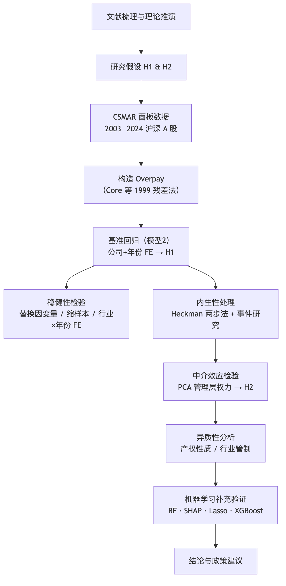
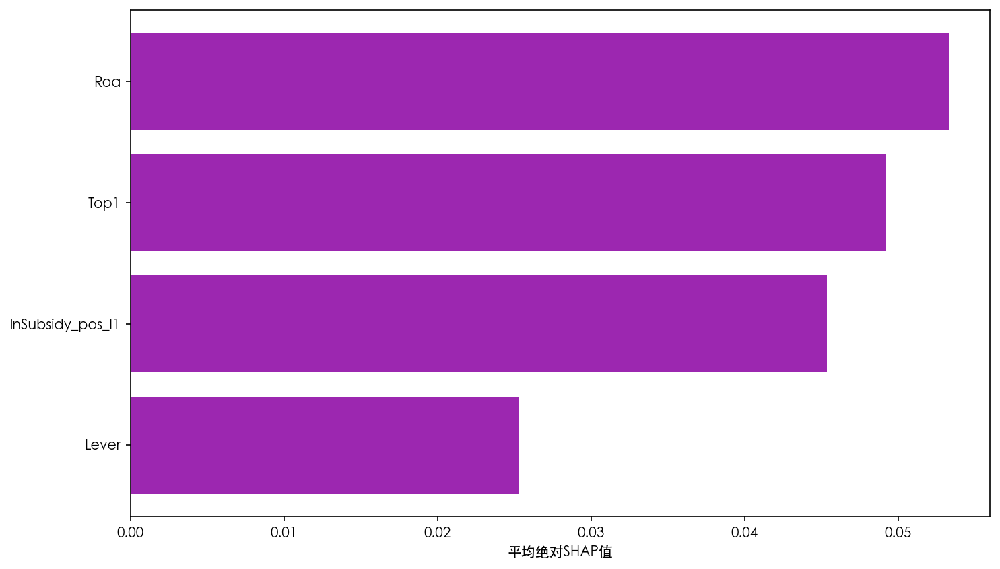

# 基于数据挖掘的已获财政补贴上市公司补贴强度与高管超额薪酬研究

---

**摘　要**

本文以2003—2024年沪深A股非金融上市公司为观察范围，将基准回归收束到上一年已获财政补贴的公司年度，考察补贴强度与高管超额薪酬的关系。结果显示，滞后一期正补助对数系数为正且显著。加入行业×年份固定效应、缩短样本期、仅保留制造业样本，并实施Heckman校正和事件研究式动态检验后，结论方向保持一致。异质性结果表明，这一关联在民营企业和非管制行业更明显。管理层权力可能参与传导，经济幅度较小。机器学习部分只提供预测层面的补充线索。

**关键词**：财政补贴，高管超额薪酬，管理层权力，中介效应，数据挖掘

**RESEARCH ON SUBSIDY INTENSITY AND EXECUTIVE EXCESS COMPENSATION OF ALREADY SUBSIDIZED LISTED COMPANIES BASED ON DATA MINING**

**ABSTRACT**

Using non-financial A-share listed firms from 2003 to 2024 as the overall observation frame, this study centers its baseline regression on firm-year observations that had already received fiscal subsidies in the previous year and examines whether subsidy intensity is positively associated with executive excess compensation. To separate the extensive margin of obtaining subsidies from the intensive margin of subsidy size, the baseline regression uses the logarithm of lagged positive subsidies as the key regressor. Under firm and year fixed effects, the coefficient on subsidy intensity is positive and statistically significant; the result remains directionally stable after adding industry-by-year fixed effects, restricting the sample to 2010-2020, focusing on manufacturing firms, applying the Heckman two-step correction, and conducting an event-study style dynamic check. Heterogeneity tests suggest that this association is more evident in private firms and non-regulated industries. Managerial power serves as a partial mediator, though the economic magnitude of the indirect effect is small. Supplementary machine-learning checks provide additional predictive evidence rather than causal proof. Overall, within already subsidized listed firms, higher subsidy intensity is positively associated with executive excess compensation, while the evidence is still interpreted cautiously.

**Keywords**: fiscal subsidies, executive excess compensation, managerial power, mediation effect, data mining

---

## 第一章 绪论

### 1.1 研究背景与问题提出

党的二十大报告提出，中国经济已由高速增长阶段转向更注重发展质量的新阶段。这一转变对应着政府资金投向、政策工具选择和绩效评估标准的全面调整。财政补贴在这一背景下持续发挥作用，服务于战略性新兴产业培育和技术创新激励，也承担企业纾困、稳就业和稳预期等现实任务。根据 CSMAR 统计，2003至2024年间沪深A股非金融上市公司的政府补助规模持续扩大，获补企业数量和平均补贴强度均呈上升趋势。财政补贴已成为中国资本市场一类常规的制度性变量。

同一时期，上市公司高管薪酬始终是学术讨论和公共舆论的焦点。学术上，它关系激励契约设计、代理成本控制和公司治理效率。公众层面，它牵涉收入分配公平、财政资金使用效率和市场信任基础。一个日益引人关注的问题是：企业获得补贴后，高管薪酬是否会随之抬升？更深一层的担忧在于，原本服务于产业发展和公共利益的政策性资源，是否会在信息不对称和治理约束不足的条件下部分转化为管理层的私人收益。这个问题也涉及财政资源配置效率和企业内部利益分配的合理性。

高管薪酬为何偏离“合理区间”，现有文献主要沿两条路径解释。“最优契约说”强调市场竞争与治理约束，视薪酬为董事会与高管博弈后的均衡结果，最终应反映高管的边际贡献；“管理权力说”则关注现实中的治理偏差，认为所有权与控制权分离的公司中，高管可以通过影响董事会构成、薪酬委员会安排和信息披露节奏来抬高自身报酬。在中国上市公司中，后一种解释更贴近现实——信息不对称程度较高、内部控制质量参差不齐、独立董事独立性有限，这些因素会放大管理层的自利空间。财政补贴作为外部资源进入企业后，增加了可支配资金，也容易抬高高管薪酬议价能力、为寻租行为提供空间。本文便从这里切入。

围绕这一主题，本文集中回答四个相互关联的问题：在已经获得财政补贴的上市公司内部，补贴强度在控制企业基本特征后是否与高管超额薪酬存在显著正向关联？管理层权力是否可能在两者之间形成传导路径，即补贴强度变化会不会通过改变权力结构传导到超额薪酬？这一关联在不同产权性质和行业管制强度下是否呈现差异？机器学习补充验证能否从特征重要性、SHAP 边际贡献、系数保留与方向一致性、部分依赖趋势四个角度，为基准回归提供补充观察？

### 1.2 研究目的与研究意义

**理论意义**体现在以下几个层面。将政府补贴这一政策变量纳入高管超额薪酬的分析框架，将“外部资源输入”与“内部权力结构”纳入同一条分析链。实证设计上主动区分“是否获得补贴”和“获得补贴后的强弱差异”，把主问题收束为已获补贴企业内部的强度效应，有助于避免把两个不同经济问题混成一条回归。测量层面采用 PCA 构造管理层权力综合指标，同时将固定效应、选择偏差校正和机器学习补充验证并行使用，使线性识别与非线性观察能够相互补充。

**现实意义**更贴近政策和市场实践。对财政监管部门而言，现有证据提示：真正更值得关注的，不是“补贴是否必然推高薪酬”，而是已经获得补贴的企业在补贴强度上升后，是否同步出现高管薪酬异常抬升。对资本市场监管者来说，产权和行业异质性表明，民营企业和非管制行业中的补贴—薪酬联动更值得重点核查；机器学习补充验证给出的财政补贴与核心基本面变量的相对重要性排序，可作为筛查线索的辅助参考，但不宜直接替代正式监管判断。对投资者和公众而言，理解补贴与薪酬之间潜在联系及其边界，有助于评估上市公司治理质量和财政资金的实际使用效率。

### 1.3 国内外研究现状

#### 1.3.1 高管超额薪酬的界定与测量方法

高管超额薪酬这一议题的核心困难不在于发现“薪酬高”，而在于区分哪些部分属于正常激励、哪些已偏离合理边界。早期文献常直接使用CEO绝对薪酬规模作代理变量，操作简便但难以将企业规模、业绩补偿和治理失灵带来的额外收益分开。Bebchuk和Fried（2003）[2]将讨论视角从“薪酬高不高”转向“薪酬契约如何形成”，指出所有权分散的上市公司中，管理层可通过影响董事会提名、薪酬委员会构成和条款设计来抬高自身报酬。期权、退休福利和其他隐性收益因此成为识别管理权力的重要窗口。

Core等（1999）[5]将这一讨论推进到可操作的实证层面：利用公司治理、规模、业绩、风险、行业和年份等变量估计“应得”薪酬，将残差视为超额薪酬。这一方法不会将所有高薪归入异常，它先给出基准，再识别偏离基准的部分是否与权力结构有关。后续大量文献沿用了这一残差口径，经验工作也沿着该框架展开，并在样本处理和变量设定上作了贴合中国上市公司情境的调整。

放到中国样本里，这条思路也得到了进一步延展。Bu等（2019）[4]更关注高管与员工之间的薪酬差距，罗昆、曹光宇（2015）[24]则直接使用残差法刻画超额薪酬，二者切入点不同，却都把政府补贴纳入了解释框架，并得到补贴与高管额外收益正向联系的结论。吴妍（2019）[29]、张莉莉（2019）[32]等学位论文则提供了更贴近中国制度环境的变量设定和样本处理经验。这至少表明，在中国资本市场语境下，把超额薪酬构造成一个可比较、可检验的经验变量是可行的。超额薪酬的形成并不只受高管自身权力和能力影响，企业获得的外部资源，尤其是财政补贴，也会进入这一过程，下一节即转入补贴分配逻辑及其公司行为效应的讨论。

#### 1.3.2 财政补贴的分配逻辑与公司行为效应

现有文献提醒，财政补贴不宜被理解为随机落入企业账户的外部资金。唐清泉和罗党论（2007）[27]指出，中国上市公司的补贴分配兼带产业政策导向和政治关联色彩，补贴能否获得本身就嵌入了企业特征与制度关系的筛选。潘红波、夏新平和余明桂（2008）[26]进一步发现政治关联更强的企业更容易获得政策支持。补贴兼具财务资源和治理关系的双重属性：它进入企业后会影响利润表，并改变管理层在企业内部的资源支配位置。

Jiang等（2025）[9]将视角延伸至补贴到账后的资源消化环节，发现政府补贴与管理冗余显著正相关，在内部控制较弱、社会信任水平较低的企业中这种关系更为明显。补贴未必自动转化为效率改进，某些情形下反而成为管理层可占用的松弛空间。李哲、王文翰和王遥（2022）[19]从披露端提供了另一条证据：部分企业会通过强化年报中的政策导向表述来提升补贴获取概率，这提示补贴的形成过程本身就嵌入了信息策略和治理差异。既然补贴的获取和使用都并非中性过程，补贴进入企业后能否外溢到高管薪酬，便取决于内部治理机制的约束强度，这正是下一节的讨论重点。

#### 1.3.3 内部治理机制对补贴—薪酬关联的调节

补贴能否外溢到薪酬端，很大程度上取决于企业内部的治理约束强度。步丹璐和王晓艳（2014）[16]发现政府补助会扩大高管与员工之间的薪酬差距，治理约束较弱的企业表现更为明显。陈冬华、陈信元和万华林（2005）[17]讨论国有企业时指出，显性薪酬受限后管理层会转向在职消费、差旅费等更隐蔽的补偿渠道。综合来看，补贴对薪酬的外溢不一定体现为工资单上的直接增加，也会沿着治理薄弱环节转化为更隐性的收益安排。

卢锐、柳建华和许宁（2011）[21]发现内控质量越高，高管薪酬对业绩变化的敏感度越强，这显示完善的内部约束有助于将薪酬拉回激励逻辑。罗进辉（2018）[23]从媒体监督角度得到类似结论：外部关注越强，薪酬与经营表现的对应关系越清晰，国有企业中此效应尤为突出。这些文献的启发在于：补贴能否推高异常薪酬，取决于补贴规模，也取决于企业内外部监督能否有效约束管理层的自利行为。

王克敏、王华杰、李栋栋等（2018）[28]将视角延伸至年报文本，发现业绩不佳或存在不利信息时企业更倾向于使用复杂表达，年报可读性低的企业高管超额薪酬也更高。信息披露并非单纯的事实呈现，它也容易成为提高解读成本、削弱外部监督的工具。连君莎（2020）[20]、章海浪（2021）[31]、徐坤（2021）[30]分别从内部控制、薪酬公平和管理层语调角度进一步补充了这一判断：补贴、治理与薪酬的联系需要在信息透明度和监督强度的差异中理解。上述文献主要依赖线性计量框架，而补贴与薪酬之间可能存在的非线性关系和交互结构，则需要借助机器学习方法加以补充观察。

#### 1.3.4 机器学习与数据挖掘方法在会计金融研究中的应用

机器学习文献与本文的关联在于，它能处理线性回归不太擅长回答的问题。Li（2008）[11]较早将文本特征与经济后果联系起来，这意味着非结构化信息也可以进入会计研究。Gu、Kelly 和 Xiu（2020）[7]在实证资产定价领域系统比较了多种机器学习方法，发现集成树和神经网络在捕捉非线性模式方面具有显著优势。Perols、Bowen、Zimmermann等（2017）[12]在财务舞弊识别中发现，随机森林、神经网络和Boosting等方法相较传统逻辑回归有更好的预测表现，关键在于模型能自动捕捉更高阶的交互结构。陆瑶、张叶青、黎波和赵浩宇（2020）[22]将梯度提升树用于高管特征与公司业绩关系的考察，发现某些变量的作用不一定沿线性方式平稳展开，在特定区间或特定组合下才明显增强。

后续文献将这一思路扩展到文本分析和异常识别。马长峰、陈志娟和张顺明（2020）[25]在综述中指出，机器学习更适合承担探索性和补充性任务，不宜直接替代因果推断。Rjiba、Saadi、Boubaker等（2021）[13]说明年报可读性会作用于权益资本成本，Bhattacharya和Mićković（2024）[3]、Ketelaar和Mićković（2025）[10]则将上下文语言学习与人工智能方法用于舞弊和异常识别。这些工作的启发在于：当财政补贴与超额薪酬之间可能存在区间效应、交互结构或非线性关系时，机器学习可作为补充观察工具，但不应替代基准回归的主体地位。综合以上四个维度的文献积累，下面对现有研究的总体贡献和仍待填补的空白进行述评。

#### 1.3.5 研究述评与现有文献的局限

综合前述文献，现有文献对几个基础问题已形成较清晰的认识：超额薪酬的界定与测量已有较稳定的处理路径，财政补贴对高管收入的作用在中国情境下积累了不少证据，内部控制、媒体监督和披露复杂性等因素对补贴效应强弱的影响也得到了较多支持。

现有文献也留下了几处空白。不少文献仍以薪酬规模或薪酬差距作被解释变量，企业规模和绩效带来的正常差异容易被混入。管理层权力在补贴与薪酬之间的中介角色虽有讨论，但结合固定效应与滞后设定的系统检验尚不多见。机器学习工作多集中在舞弊识别或文本分类，用于考察补贴与超额薪酬非线性结构的案例仍较少。本文的设计正是围绕这三处不足展开。

### 1.4 研究方法与技术路线

技术路线的设计让每类工具回答不同层面的问题。前半部分完成文献梳理与理论推演，明确两条检验主线：财政补贴与高管超额薪酬是否存在稳定联系，管理层权力是否承担传导角色。

随后进入基准计量部分，利用CSMAR面板数据和Core等（1999）[5]的框架构造超额薪酬变量，并把基准回归聚焦为“上一年已获得补贴企业内部的补贴强度效应”：在公司和年份固定效应下，检验滞后一期正补助对数是否与 Overpay 同步变化。更严格的行业×年份固定效应、选择偏差校正和事件研究式动态检验用于收紧识别边界，中介检验观察权力渠道是否存在，异质性分析判断联系是否随制度情境而分化。

机器学习补充验证置于第四章稳健性检验之后，并与基准回归保持相同的样本边界和核心变量口径。随机森林复核财政补贴与控制变量的相对重要性；SHAP补充解释财政补贴的边际贡献强度；Lasso检验财政补贴变量是否被保留且方向一致；XGBoost则通过特征重要性与财政补贴的部分依赖图，观察更灵活模型中的趋势是否与OLS一致。

**图1-1 技术路线图**

---
## 第二章 理论分析与假设
### 2.1 概念界定

#### 2.1.1 财政补贴

财政补贴主要指政府围绕特定政策目标向企业提供的资金支持，可以表现为技术创新、节能减排等专项补助，也可体现为税收返还、政策性贷款贴息、研发费用加计扣除等形式。按现行会计准则，政府补助分为“与资产相关”和“与收益相关”两类："与资产相关"的补助通过递延收益逐期摊销进入利润，"与收益相关"的补助在满足确认条件后一次性或分期计入当期损益。补贴的到账时间、规模和附带约束因而会直接影响企业的资源配置方式和财务报表表现。此外，我国财政补贴存在使用约束弱、事后监督不足特征，很容易成为管理层权力寻租渠道。

从经济性质看，财政补贴并非企业依靠市场竞争创造的经营收入，而是带有明确政策来源的外部资源输入。对上市公司而言，它会改变利润表表现，进而影响管理层安排资源的空间。在我国制度环境下，补贴使用约束相对有限、事后跟踪并不总是充分，这使其容易成为管理层寻租的渠道。本文据此将财政补贴置于“补贴—治理—薪酬”关系链条的起点。这种外部资源属性不等同于补贴具有准自然实验性质，全文始终将其作为需要谨慎识别的解释变量来处理。

在具体度量上，本文同时保留两类补贴口径。描述性统计和对照分析中使用企业年度政府补助金额经零值保留后的对数形式，即$\ln(1+\text{Subsidy})$，以平滑右偏分布并保留零补助公司年度观测；基准回归则进一步聚焦于已获得补贴的公司年度，使用仅对正补助取自然对数的强度口径。这样的安排有助于把“是否获得补贴”和“获得补贴后的强弱差异”区分开来。从时间演变来看，上市公司获得补贴的方式和规模都发生了明显变化。加入世界贸易组织后，政府补贴逐渐从早期更偏全面覆盖的价格补贴，转向技术创新、节能环保和战略性新兴产业导向更强的选择性支持。2007年《企业会计准则第16号——政府补助》的发布，又提高了补贴数据的可比性与可识别性，为后续大样本研究创造了条件。补贴项目越细、规模越大，申报和使用过程中的信息不对称也往往越突出，主管部门很难长期跟踪每笔补贴的真实去向，而企业高管在项目论证和资源配置中通常掌握更多内部信息。

#### 2.1.2 高管超额薪酬

高管超额薪酬并非泛指“薪酬高”，而是指控制企业规模、盈利能力、资产结构、区域与行业等客观因素后仍高出正常基准的那部分报酬。这一概念的关键在于先回答一个基础问题：治理约束相对有效时，高管通常应获得怎样的回报？基准建立后，实际薪酬相对基准的偏离才能被识别为异常成分。若某家公司高管薪酬持续高于基准，可将该偏离理解为代理成本的一种表现——管理层借助信息优势或组织地位额外取得的收益。

具体处理上沿用Core等（1999）[5]的期望薪酬框架，先利用公司特征变量估计“正常薪酬基准”，再将模型残差作为超额薪酬。这一做法的优势是，企业规模、经营绩效等常规因素已在期望模型中被吸收，残差因而更接近本文真正关心的异常部分。数值上它对应实际薪酬相对拟合基准的偏离，实证操作中直接使用残差序列，不再额外做“实际值减预测值”的二次计算。由于该变量本身就是回归残差，样本均值理论上接近0，因此不再对其二次缩尾以保留原有统计含义。

与直接使用薪酬水平、薪酬差距或薪酬—绩效敏感性等指标相比，残差法的优势在于先给出相对客观的“应得薪酬”标尺，再讨论实际薪酬偏离该标尺的程度。直接使用薪酬总额操作更简洁，但难以区分哪些差异原本就应由规模、行业和经营绩效决定。高管与员工薪酬之比能反映内部公平，但仍难将“应得”与“超得”分开。薪酬—绩效敏感性更侧重激励契约强弱，不直接回答契约是否已被管理层扭曲。综合考虑，本文最终以期望薪酬残差作为超额薪酬的经验代理变量。

#### 2.1.3 管理层权力

管理层权力（Managerial Power）指高管对企业关键决策施加实际影响的能力，尤其体现在薪酬契约、资源配置和战略议程上的控制程度。它并非单一维度变量，更接近需要由多项治理特征共同逼近的潜在构念。相关文献通常从三个方向刻画这一概念：一是由正式职位和董事会结构体现的**结构性权力**，例如两职合一、内部董事比例和董事会规模。二是由高管持股体现的**所有权权力**。三是由任期、声望和组织关系积累形成的**关系性权力**。

在中国上市公司环境下，管理层权力的形成逻辑往往更复杂。国有企业高管的权力基础，常常兼带行政授权和市场地位两层属性；在民营企业中，大股东和实际控制人的意志又会深度塑造高管的实际空间。由此，同样归入“管理层权力”这一概念之下，不同所有制企业里的生成路径并不完全一致。结合数据可得性与实证可操作性，本文以Dual、Boardsize、Insider和Mgshder四个底层指标构造综合指数，在有限数据条件下尽量保留结构性权力和所有权权力两条主要来源。

还要看到，中国公司治理结构中党委、董事会和管理层之间的权力边界并不总是清晰，国有企业尤其如此。党政体系中的关系网络、与上级主管部门的信任程度等真正影响高管地位的因素，在公开年报中几乎无法直接量化。把“管理层权力”放到中国上市公司语境下理解，其复杂性明显高于西方主流文献的标准设定。这里的处理方式保留了可操作性，部分非正式权力渠道仍可能被低估，后文区分国有与民营企业的异质性检验也有这层考虑。

### 2.2 理论基础

#### 2.2.1 管理者权力理论

管理者权力理论（Managerial Power Theory）是理解补贴与薪酬关系的重要起点。Bebchuk和Fried（2003）[2]提出这一视角，核心原因在于“最优契约说”对董事会的理性和中立假定过于乐观。按最优契约逻辑，高管薪酬应反映其边际贡献；管理者权力理论则指出，现实中董事会、薪酬委员会和经理人市场未必能形成有效约束，高管往往深度介入薪酬安排的形成过程，薪酬合同因而容易成为权力结构的产物。Finkelstein（1992）[6]将高管权力划分为结构性权力、所有权权力、专家性权力和声望性权力，为后续经验工作提供了清晰的操作框架。本文以两职合一、董事会规模、内部董事比例和高管持股四个指标刻画管理层权力，延续了多角度分析的思路。

传导路径上，高管左右薪酬安排的方式有多种：对董事会成员关系和表决环境的牵引，薪酬结构设计得更复杂以至外部难以识别，以及对披露节奏和内容的控制。Core等（1999）[5]将治理结构、较高薪酬和较差绩效放入同一分析框架，这一视角后来常被用于讨论薪酬失衡。在中国上市公司情境中，这套理论具有更强的现实针对性。国有企业中党委会、董事会和经理层的边界未必泾渭分明，高管任命和考核带有组织体系色彩；民营企业中“一股独大”、实控人与管理层关系密切、独立董事制衡不足等现象也并不少见。正式治理结构往往难以真正削弱高管影响，某些时候甚至默许其在薪酬安排中的主导地位。

这一理论的关键启发在于：财政补贴带来的不止是额外资金，它还会改变高管在企业内部的相对地位。补贴的申请、沟通、协调和使用离不开管理层深度参与，高管在资源配置中的作用因而更加突出。外部资源扩张与内部权力强化一并发生时，补贴便容易转化为薪酬谈判中的额外筹码。据此，本文不直接用薪酬规模讨论问题，而转向期望薪酬残差，尽量将“补贴改善业绩后合理抬高薪酬”与“补贴扩大权力后带来异常收益”区分开。Bu等（2019）[4]和步丹璐、王晓艳（2014）[16]在治理较弱企业中观察到更强的正向关系，与这一判断一致。

#### 2.2.2 代理理论

代理理论（Agency Theory）提供了一条偏“资源流向”的解释线索。Jensen和Meckling（1976）[8]将股东与管理层的关系概括为委托—代理安排：股东让渡经营权，却无法完整观察管理层的努力、动机和资源使用方式。监督不足时，管理层会将企业资源调向更符合自身利益的位置，道德风险和代理成本由此产生。薪酬场景中，显性表现是高管通过调整绩效基准或薪酬结构获得高于边际贡献的回报；隐蔽形式包括在职消费、差旅安排和其他灰色收益；跨期扭曲则表现为把短期业绩做得更好看、代价留给后续年份。预算软约束较强的企业中这类现象更容易出现。

财政补贴进入企业后，代理问题容易被放大，因为补贴会冲淡“真实努力”和“外部资源”的边界。补贴常常会直接改善账面利润，如果薪酬契约没有把这部分政策性收益从绩效考核中剥离，高管就会在努力并未同步增加的情况下拿到更高报酬。已有文献在财务困境企业中观察到补贴增加与超额薪酬上升一并出现，这与代理理论强调的资源侵占逻辑一致。后文进一步区分不同产权类型。国有企业面对国资监管、审计约束和薪酬管制，私营企业则更多依赖大股东约束和市场纪律，监督结构并不相同，补贴最终会不会外溢到薪酬端，自然也不宜预设为同一种强度。

中国制度环境下，委托—代理链条常常是多层嵌套的。关系展开后通常涉及公众、财政部门或国资监管机构、董事会以及高管团队等多个层级，每一层都掌握着不完整的信息。财政补贴本来是一种政策资源，但一旦进入企业，高管对其具体申报、使用和绩效完成情况往往了解得更多，上层监督者未必能及时、完整地把握真实情况。由此便会出现一个很现实的悖论：补贴越多，政策资源与经营努力越难分开，薪酬契约识别“谁创造了价值”的精度反而会下降。陈冬华、陈信元和万华林（2005）[17]关于名义限薪下隐性收益上升的证据，正好说明显性约束并不能自动消除代理空间。

代理理论里还有一个特别重要的概念，即薪酬—绩效敏感性（Pay-Performance Sensitivity）。理想的契约应当对真实经营绩效敏感，而不应对外部运气收益过度敏感。财政补贴恰恰容易打乱这点，因为它会直接抬高利润表现。若补贴改善账面收益后被机械纳入绩效薪酬基数，高管就会在没有额外努力的情况下同步受益。卢锐、柳建华和许宁（2011）[21]关于内控质量越高、薪酬—绩效敏感性越强的发现，也支持了这种理解。方军雄（2009）[18]进一步发现我国上市公司高管薪酬存在显著粘性，即业绩下降时薪酬调整幅度不如业绩上升时明显，这说明薪酬契约对绿效的约束本身就存在不对称性，财政补贴带来的账面收益改善更容易被纳入薪酬上调范围。本文采用期望薪酬残差（Overpay）而非薪酬水平，目的是先剥离“补贴带来正常绩效改善”这一层，再观察异常收益部分是否仍然存在。

#### 2.2.3 信号传递理论

信号传递理论（Signaling Theory）补充了外部信息环境这一层。Spence（1973）[14]讨论的核心问题是：在信息不对称条件下，掌握更多信息的一方会主动释放可观察信号，以引导外部对其质量的判断。后来这一框架常见于企业财务和资本市场研究，信息披露质量、股利政策和资本结构都可以放到类似逻辑里理解。

就补贴与薪酬的关系而言，它至少能解释三件事。企业会主动向政府发送“我值得被支持”的信号，在文本披露中强化创新、环保和政策契合度表达，以提升补贴获取概率；已有文献提示，这类表述有时与补贴获取关系更紧密，却未必与真实绩效一一对应。补贴本身也向市场释放背书信号，投资者、合作伙伴乃至经理人市场都把它理解为政府对企业质量的认可。信息复杂化本身也是管理层的策略选择，披露越复杂，外部监督越难迅速识别薪酬安排中的异常部分。

再往前推一步，还会看到一个更现实的难题：政府当然希望把补贴投向真正高质量的企业，但在信息不对称环境下，更会组织材料、调整表达和发送信号的管理团队，往往能够以较低成本塑造“高质量企业”的外在形象。若如此，补贴流向就未必完全由真实效率决定，而部分取决于谁更擅长生产和管理这些信号。这一点值得注意，因为信号生产能力往往与信息控制权相伴而生，而信息控制权又会回到薪酬谈判过程。李哲、王文翰和王遥（2022）[19]、王克敏等（2018）[28]分别从补贴获取和薪酬掩护两个端口提供了经验支持，也使这条逻辑链更具可讨论性。

#### 2.2.4 三种理论视角的比较与内在张力

**管理者权力理论、代理理论和信号传递理论的比较**

管理者权力理论、代理理论和信号传递理论是理解补贴与薪酬关系的三个重要理论视角。管理者权力理论回答的是“补贴在什么条件下会被管理层截留”，代理理论回答的是“这种截留依托什么内部安排发生”，信号传递理论则补充了“外部信息环境为什么会放大或压缩这一过程”。

**理论视角的内在张力**

虽然这三个理论视角可以相互补充，但它们也存在一些内在张力。管理者权力理论常以股权相对分散为背景，而中国企业里真正重要的制衡来源很多时候是大股东或实际控制人。代理理论在国有企业里往往会面对多层委托链条，监督责任并不只发生在董事会一层。信号传递理论则默认高质量与低质量主体在发送信号上的成本差异较为稳定，但在披露监管尚不充分、地方政策竞争较强的市场环境中，这一前提未必总能成立。
#### 2.2.5 中国制度情境下的理论延展

如果把中国制度环境纳入进来，上述三套理论就需要再做一层本土化理解。中国上市公司获得的财政补贴并非一般意义上的现金流入，它往往嵌在地方政府竞争、产业政策导向、国资监管层级差异和信息透明度不均衡这些条件里。补贴兼有资源输入和制度安排的双重属性，改变的是利润表数字，也会重塑高管与政府、董事会以及外部投资者之间的相对关系。

在这一情境下，至少有三点值得特别注意。补贴分配通常带有较强的政策导向和选择性，高管在申报、沟通和协调中的作用往往会被放大。补贴到账后的约束和追踪在不同地区和所有制企业之间并不均衡，一些企业面对的外部监督明显更弱。加之地方政府之间存在持续的财政竞争，各地在招商引资过程中都会主动使用补贴工具，补贴分配受中央政策意图和地方财政余裕、招商策略的共同影响。

基准工具变量采用“同城市同年度其他公司平均补助”，制度逻辑就来自这种地方财政政策的共同波动；后文补充的同行业留一法和精炼双工具变量，则进一步借助行业政策倾向和省市层面的留一法波动观察补贴强度识别是否稳定。但如后文第四章所述，这些工具变量在当前基准样本中一阶段整体偏弱，因此仅作为后台诊断而不承担正文主识别功能。

考虑到新的基准回归聚焦于已获补贴样本内部的强度差异，文中更强调两类与新口径直接相关的补充识别策略：一是用 Heckman 两步法处理“谁更容易进入正补助样本”的选择偏差。二是通过事件研究式动态检验和行业×年份固定效应设定，观察补贴强度抬升前是否已存在明显的预趋势，并尽量压缩时变行业冲击。传统留一法工具变量仅作为后台诊断，若一阶段整体偏弱、二阶段方向不稳，则不作为正文识别证据。

基于这一背景，“补贴带来资源扩张”与“补贴扩大管理层可支配空间”往往一并出现，补贴据此不宜简单看作财务变量，而应视为牵动资源配置、权力结构和外部信号的复合性冲击。2015年以来国有企业薪酬制度改革又进一步加深了这种差异。中央出台的限薪令直接限制了央企和地方国企主要负责人的薪酬上限，并要求薪酬与企业绩效、职工收入挂钩。由此，即便国有企业获得较多补贴，其薪酬空间也会受到更强的行政约束；私营企业的薪酬安排则更多受市场机制和大股东意志支配，行政限薪的外部硬约束相对较弱。产权性质和行业监管强度因而成为后文重点分析的异质性维度。

这一制度背景也解释了为何全文一并采用固定效应、中介效应和机器学习补充验证。固定效应和滞后设定更适合区分“企业原本就不同”和“补贴变动之后发生了什么”；中介效应检验侧重观察权力渠道是否存在传导线索；机器学习补充验证则在基准回归样本上复核财政补贴在多变量竞争下是否仍保留信息含量，并观察财政补贴的局部趋势是否与 OLS 保持一致。第二章的理论推演，归根到底要回答两个层面的问题：补贴为何会与超额薪酬上升相伴随，以及为什么这一关系在不同企业中强度并不相同。

### 2.3 研究假设

以上讨论可以收束为一个分层框架：代理理论解释补贴为何会演化为管理层收益，管理者权力理论说明这种转化依赖什么内部结构，信号传递理论则补足外部信息环境怎样改变传导强弱。把三者合起来看，财政补贴就超出了单纯的资源变量含义，它会通过组织地位、声誉背书和披露策略等渠道间接改写薪酬谈判的格局。后文控制变量的安排、中介检验的设计以及异质性维度的选择，基本都来自这一套推演。

基于上述理论分析，提出以下两个核心研究假设：

**假设H1（主效应假设）**：在已获得财政补贴的企业内部，补贴强度与高管超额薪酬预期存在正向联系。在信息不对称和薪酬约束不足的条件下，财政补贴扩大了企业可支配资源规模；如果薪酬治理机制无法对管理层的资源提取行为形成有效约束，这类外部资源便易于与更高的高管超额薪酬相伴随。H1主要建立在代理理论的资源侵占逻辑之上：补贴进入企业账面之后，若激励契约没有把这部分“非经营性收益”从绩效薪酬基数中剔除，高管有条件在未作出相应经营努力的情况下同步受益；同时，资源扩张也会放松董事会在薪酬谈判中的支付约束。基于此，H1预期在已获补贴企业内部，补贴强度与高管超额薪酬之间存在正向联系，并在较严格的控制设定下仍可被观察。

**假设H2（机制路径假设）**：本文检验管理层权力是否可能构成财政补贴与高管超额薪酬之间的中介路径。财政补贴的获取和使用往往强化高管在资源配置中的核心地位，并进一步提升其在薪酬谈判中的议价能力；若控制管理层权力后，补贴对超额薪酬的直接效应收窄，且管理层权力的系数显著为正，才可将其视为存在间接传导的经验线索。H2主要来自管理者权力理论：补贴获取过程中高管的深度介入，往往强化其在组织内部的议程设置权；补贴使用中的自由裁量越大，补贴资源被转化为薪酬议价筹码的空间也越大。管理层权力的测度本身仍带有经验性，相关路径始终需要审慎解释。第四章的中介检验即围绕这一待检验链条展开。

---

## 第三章 研究设计

### 3.1 研究思路与分析框架

整体分析框架可以概括为两条主线。第一条主线关注财政补贴与高管超额薪酬之间是否存在稳定的条件相关关系；第二条主线关注这种关系是否会经由管理层权力部分传导。产权性质、行业管制强度等制度因素则作为情境变量，用于考察上述关系在不同环境下是否呈现差异。

企业获得财政补贴后，最直接的变化是可支配资源增加，账面利润也会随之改善，这会改变薪酬安排所面临的资源约束；而且，补贴从申请到使用通常都需要高管深度介入，这又会提升其在组织内部的议程设置权和资源支配权。

基于这一逻辑，后文的实证部分按四步展开：先用基准回归检验主关联，再用稳健性检验考察关系是否对样本和设定变化敏感；随后开展选择偏差校正、中介效应分析和异质性分析，尽量把识别边界、传导路径与制度情境差异说明清楚；最后再借助机器学习补充验证，在与基准回归一致的变量设定下复核财政补贴的重要性、方向一致性和局部趋势。这样的安排旨在让不同方法分别回答不同问题，而不是简单叠加方法以堆砌结论。

### 3.2 样本选择与数据来源

本文以2003—2024年沪深A股上市公司为总体，所需数据均来自国泰安（CSMAR）数据库，包括政府补助数据、高管薪酬数据、公司财务数据（资产负债表、利润表）、公司治理数据（董事会构成、股权结构）以及企业性质和地区分类信息。样本清理的思路是先保证可比性，再处理极端值和缺失问题。

金融行业被首先剔除，因为其资产负债结构和监管氛围与一般实业企业差异过大，直接并入会让薪酬与补贴的比较基准失真。样本期内被 ST、\*ST、S\*ST、SST、PT 或处于退市整理期的公司也不保留；由于仓库中未能获得更权威的独立 ST 状态维表，实际操作按合并后简称字段中的标签进行识别和剔除，目的是排除财务异常、退市风险和极端经营状态的样本，尽量保证不同公司之间薪酬与补贴比较基准的可比性。

对于政府补助数据，若公司年度未披露补助项目，则该年度补助金额记为0，以避免零补贴观测在构造描述性统计和第一阶段变量时被机械删除；少量负值观测在构造 $\ln(1+\text{Subsidy})$ 时按0处理。正文中的基准回归不再把“未获得补贴”和“已获得补贴但金额不同”的公司年度混在一起，而是仅保留上一年实际获得正补助的公司年度，并以滞后一期正补助对数刻画补贴强度。这样处理后，第二阶段回答的是“已获补贴企业内部，补贴拿得更多是否伴随更高的超额薪酬”，而不是“全部企业平均意义上是否存在补贴效应”。地区变量 Zone 的识别则优先依据公司注册地址，若注册地址信息不足，再辅以办公地址与城市字段识别所属省级区域，并据此按“东部=0、中西部=1”编码，以避免仅依赖不完整城市名单造成的系统错分。核心变量缺失严重的观测值随后被删除，主要连续变量（Overpay除外）则统一在1%和99%分位数处做Winsorize缩尾。原始薪酬数据沿用CSMAR数据库既有缩尾口径，不再重复处理。

经过这些步骤，原始公司—年度观测为70,559条；剔除金融行业后为69,142条；再剔除特殊处理样本后为63,011条；满足关键变量完整要求的样本为52,980条；满足基准薪酬模型完整案例要求的样本为52,805条；纳入管理层权力底层指标后，可用于构造 Power 的样本为50,171条；在基准回归中进一步要求“上一年补助金额大于0”且滞后一期补贴强度可得后，模型2样本为43,417条；机器学习补充验证与基准回归保持同一变量口径，因此其可用样本同样为43,417条；在中介效应检验中要求 Overpay、Power 与滞后一期正补助均完整后，统一样本为41,186条。

时间窗口的设定有明确依据：样本从2003年开始，一是因为加入世贸组织后上市公司信息披露逐步规范，CSMAR 在2003年前后的数据完整性和可比性明显改善。二是，政府补助作为独立披露科目的规范化要求也是在这一阶段逐步清晰的，若把更早期数据混入，口径差异会带来额外误差。样本截至2024年，既尽量利用最新可得数据，也为滞后变量保留了足够年份。剔除金融行业后，样本覆盖制造业、信息技术、批发零售、房地产、交通运输等17个行业门类，整体行业结构与沪深A股分布基本一致。

为了避免不同实证模块的样本口径被混为一谈，这里专门说明样本量的变化。第一步，基准薪酬模型使用52,805条观测构造 Overpay；第二步，基准回归模型2在加入“上一年获得正补助”的样本限制后，样本降至43,417条；第三步，机器学习补充验证直接沿用基准回归样本，只保留 lnSubsidy_pos_l1、Roa、Lever 和 Top1 四个输入变量，因此其样本量保持在43,417条；第四步，机制检验需要管理层权力综合指标 Power（PCA）完整，因此统一样本进一步降至41,186条。这样的处理可以把“基准回归样本”“机器学习样本”和“机制样本”清楚区分开来，避免在答辩时把不同问题对应的样本边界混为一谈。

### 3.3 变量设定与说明

#### 3.3.1 被解释变量：高管超额薪酬（Overpay）

高管超额薪酬以基准薪酬模型的回归残差直接度量。具体以高管前三名薪酬总额的对数 lnSalary 为被解释变量，把企业规模 lnSale、盈利能力 Roa、无形资产占比 IA 和地区虚拟变量 Zone 作为核心解释变量，并控制行业和年份固定效应。对应模型在第三章模型设定部分正式给出。

基准薪酬模型的残差项 $\varepsilon_{it}$ 直接定义为 $\text{Overpay}_{it}$。使用高管前三名薪酬总额而非单个CEO薪酬，主要是为了降低个别年份单一职位数据缺失或异常的影响。此外，中国上市公司重大决策往往由高管团队共同完成，团队层面的薪酬安排更能反映企业的整体激励取向。$\text{Overpay}_{it}>0$ 表示该企业高管获得了高于基准的薪酬，$\text{Overpay}_{it}<0$ 则表示其薪酬低于基准，这一情况在部分受薪酬管制约束的国有企业中并不少见。

#### 3.3.2 核心解释变量：财政补贴强度（lnSubsidy）

为区分“是否获得补贴”和“获得补贴后的强弱差异”，本文同时保留两类补贴度量。第一类是描述性统计和对照分析中使用的全样本口径：

$$\ln\text{Subsidy}_{it} = \ln\!\bigl(1+\max(\text{GovernmentSubsidy}_{it},0)\bigr) \tag{1}$$

第二类是基准回归使用的强度口径，仅在补助金额大于0时取自然对数：

$$\ln\text{Subsidy}^{+}_{it} = \ln(\text{GovernmentSubsidy}_{it}), \qquad \text{GovernmentSubsidy}_{it} > 0 \tag{2}$$

其中，第二阶段基准回归实际使用的是滞后一期变量 $\ln\text{Subsidy}^{+}_{i,t-1}$。这样处理的考虑有两点。其一，$\ln(1+\text{Subsidy})$ 适合保留零补助公司年度，用于描述整体样本与对照口径；其二，若研究问题聚焦于“已经拿到补贴之后，拿得更多是否伴随更高的超额薪酬”，则更自然的做法是把基准回归限制在上一年已获得补贴的公司年度，并直接比较补贴强弱差异。也即，全文主线更关注补贴的强度边际，而不是全体公司平均意义上的混合效应。

#### 3.3.3 控制变量

控制变量分成两个阶段来设定，原因在于两阶段模型各自承担的任务并不一样。第一阶段的目标，是尽量准确地估计“合理薪酬”或“基准薪酬”，因此控制项要尽量覆盖那些决定正常薪酬水平的公司特征，包括**企业规模**（$\ln\text{Sale}$）、**盈利能力**（Roa）、**无形资产占比**（IA）和**地区虚拟变量**（Zone），并进一步控制行业和年份效应，把规模、业绩、资产结构以及地区薪酬基准这些常规差异尽量吸收进基准薪酬模型。

第二阶段的关注点转向财政补贴与“超额薪酬”之间的联系，因此控制项收缩为更直接关系到薪酬契约合理性、监督强度和寻租空间的变量，即**盈利能力**（Roa）、**财务杠杆**（Lever）和**第一大股东持股比例**（Top1），同时统一纳入公司和年份固定效应。这样安排的逻辑比较直接：财务杠杆对应债务约束，大股东持股比例代表外部监督能力，公司固定效应和年份固定效应则分别吸收稳定个体差异与共同宏观冲击。无形资产占比对应企业对知识资本的依赖程度；Zone 依据注册地址优先、办公地址补充的规则识别企业所属东中西部地区，但由于它在公司层面基本稳定，在第二阶段会被公司固定效应吸收，因此不再单独进入方程。所以，两阶段控制变量的差异并不意味着模型设定前后不一致，而是分别服务于“尽量拟合合理薪酬基准”和“在固定效应框架下观察补贴强度与超额薪酬的条件相关”这两个不同经验任务。主要变量定义汇总见表3-1。

**表3-1 主要变量定义**

<table>
  <thead>
    <tr>
      <th>变量名</th>
      <th>符号</th>
      <th>定义</th>
    </tr>
  </thead>
  <tbody>
    <tr>
      <td>高管超额薪酬</td>
      <td>Overpay</td>
      <td>基准薪酬模型回归残差，正值表示薪酬高于基准</td>
    </tr>
    <tr>
      <td>财政补贴强度</td>
      <td>lnSubsidy_pos</td>
      <td>仅对正补助金额取自然对数，基准回归使用其滞后一期</td>
    </tr>
    <tr>
      <td>管理层权力</td>
      <td>Power</td>
      <td>基于 Dual、Boardsize、Insider、Mgshder 四项指标的PCA综合得分</td>
    </tr>
    <tr>
      <td>业绩</td>
      <td>Roa</td>
      <td>净利润/总资产</td>
    </tr>
    <tr>
      <td>财务杠杆</td>
      <td>Lever</td>
      <td>总负债/总资产</td>
    </tr>
    <tr>
      <td>大股东持股</td>
      <td>Top1</td>
      <td>第一大股东持股比例（%）</td>
    </tr>
    <tr>
      <td>地区</td>
      <td>Zone</td>
      <td>依据注册地址/办公地识别，中西部地区=1，东部地区=0</td>
    </tr>
    <tr>
      <td>企业规模</td>
      <td>lnSale</td>
      <td>营业收入自然对数</td>
    </tr>
    <tr>
      <td>无形资产占比</td>
      <td>IA</td>
      <td>无形资产/总资产</td>
    </tr>
  </tbody>
</table>

#### 3.3.4 路径变量：管理层权力（Power）

管理层权力变量 Power 主要作为中介变量使用。正文将其定义为基于 Dual、Boardsize、Insider 和 Mgshder 四项治理指标构造的 PCA 综合得分，用于刻画高管在正式职位、董事会结构与所有权层面的综合影响力。有关 Power 的具体构成过程以及 PCA 诊断结果，统一放在第四章中介效应分析部分展开。
### 3.4 模型设定

模型设定分为两个阶段。第一阶段先估计企业在既有规模、业绩和地区条件下的基准薪酬水平，以便把"正常薪酬"与"异常偏离"区分开来。第二阶段再以超额薪酬为被解释变量，考察补贴强度与异常薪酬之间的条件相关。两阶段所用控制变量不同，核心原因在于两阶段的任务并不一样。第一阶段的目标是尽量准确地估计"合理薪酬"或"基准薪酬"，因此控制项要尽量覆盖那些决定正常薪酬水平的公司特征。第二阶段的关注点转向财政补贴与"超额薪酬"之间的联系，因此控制项收缩为更直接关系到薪酬契约合理性、监督强度和寻租空间的变量。

#### 3.4.1 基准薪酬模型
基准薪酬模型直接沿用Core等（1999）[5]的基本思路：

$$\ln\text{Salary}_{it} = \alpha_0 + \beta_1 \ln\text{Sale}_{it} + \beta_2 \text{Roa}_{it} + \beta_3 \text{IA}_{it} + \beta_4 \text{Zone}_{it} + \sum_{j=1}^{J} \delta_j \text{Industry}_{j} + \sum_{t=1}^{T} \gamma_t \text{Year}_{t} + \varepsilon_{it} \tag{3}$$

其中，$\ln\text{Salary}_{it}$ 表示第 $i$ 家公司第 $t$ 年高管前三名薪酬总额的对数值，$\varepsilon_{it}$ 为随机扰动项。残差序列 $\varepsilon_{it}$ 直接作为超额薪酬的代理变量，即 $\text{Overpay}_{it} \equiv \varepsilon_{it}$，正值表示实际薪酬高于基准水平，负值则相反。

#### 3.4.2 基准回归模型

基准回归阶段以超额薪酬（Overpay）为被解释变量，将滞后一期财政补贴强度（$\ln\text{Subsidy}^{+}_{i,t-1}$）作为核心解释变量，并加入企业层面控制变量、公司固定效应和年份固定效应：
$$\text{Overpay}_{it} = \alpha + \beta_1 \ln\text{Subsidy}^{+}_{i,t-1} + \beta_2 \text{Roa}_{it} + \beta_3 \text{Lever}_{it} + \beta_4 \text{Top1}_{it} + \mu_i + \lambda_t + \varepsilon_{it} \tag{4}$$

这里的 $\mu_i$ 表示公司固定效应，$\lambda_t$ 表示年份固定效应。应当留意，式（4）并不是在全部公司年度上估计，而是只在“上一年补助金额大于0”的公司年度上估计，所以最关注的是 $\beta_1$ 的方向、大小及其统计显著性：如果 $\hat{\beta}_1 > 0$ 且统计显著，就说明在控制公司层面稳定差异和年度共同冲击之后，已获补贴企业内部的补贴强度差异仍与更高的超额薪酬相伴随。核心解释变量使用滞后一期补助，是为了尽量把时间顺序固定为“补贴在前、薪酬在后”，以减轻同期反向因果带来的干扰。与第一阶段相比，这里的控制变量更聚焦于盈利表现、债务约束和外部监督三个会直接影响薪酬契约合理性与寻租空间的维度。此外，式（3）采用行业与年份固定效应以利用跨企业的横截面差异构造薪酬基准，式（4）则采用公司与年份固定效应以利用同一企业内的时间变化来识别补贴强度与超额薪酬的关联；Overpay 残差中仍包含的公司层面稳定异质性会被式（4）中的公司固定效应进一步吸收，两阶段固定效应设定各司其职，不构成口径冲突。

#### 3.4.3 选择偏差校正与识别边界检验

考虑到基准回归聚焦于“已获补贴企业内部的强度差异”，这一设定面临两类更直接的识别挑战。第一类是样本选择：只有进入正补助样本的公司年度才会出现在基准回归里，因此更容易拿到补贴的企业也往往更容易支付较高薪酬。第二类是时变遗漏变量：即使都已进入正补助样本，不同企业的补贴强度变化仍会与行业景气、政府扶持倾向或高管资源协调能力同步波动。

与传统工具变量相比，Heckman 两步法更直接对应本文新的基准样本设计。第一步以 lnSubsidy_pos_l1 是否可观测构造选择方程，检验哪些公司年度更容易进入“已获补贴样本”；第二步将逆米尔斯比率纳入公司和年份固定效应回归，以判断基准回归中的正向系数是否主要由样本选择偏差驱动。

传统留一法工具变量仍作为诊断项统一重跑，包括“同城同年其他企业平均补助”“同行业同年其他企业平均补助”以及“同行业同年排除本省平均补助 + 同省同行业同年排除本市平均补助”等 FE-2SLS 规格。但这部分不再承担正文主识别功能：若一阶段整体偏弱、二阶段方向明显不稳，仅据此判断当前结论对外生识别仍较敏感，而不将其写入正文主表。因此，正文更重视与新基准样本直接对应的选择偏差校正、事件研究式动态检验和更严格固定效应设定。

此外，还补充实施两类辅助诊断。第一类是事件研究式动态检验：以“上一年补助金额首次进入正补助样本上四分位区间”作为高补贴事件，考察事件发生前后超额薪酬的动态变化，并重点检验事件前是否已存在可辨识的预趋势。第二类是更严格的“公司固定效应 + 行业×年份固定效应”基准回归设定，用于检验主结果是否只是来自行业年度景气波动。上述检验都用于刻画识别边界和动态伴随关系，不被解释为严格意义上的因果估计。

#### 3.4.4 基于管理层权力的中介检验

在完成基准回归与选择偏差校正之后，再按照Baron和Kenny（1986）[1]的经典中介分析思路，检验财政补贴是否会经由管理层权力这一渠道影响超额薪酬。由于新的基准回归总效应已经显著，但中介效应仍需结合路径显著性、Bootstrap 区间和测度局限综合判断，后文更强调“路径线索”和审慎解释，而不将其解释为严格的经典中介识别。正文采用 PCA 口径的管理层权力指标 Power。为与正文呈现顺序保持一致，中介检验模型依次编号为模型3至模型5，对应的三步回归如下：

**第一步**（估计总效应 $c$，对应模型3）：

$$\text{Overpay}_{it} = \alpha + c \cdot \ln\text{Subsidy}^{+}_{i,t-1} + \boldsymbol{\beta}'\mathbf{X}_{it} + \mu_i + \lambda_t + \varepsilon_{it} \tag{5}$$

**第二步**（估计路径 $a$，补贴对权力的影响）：
$$\text{Power}_{it} = \alpha + a \cdot \ln\text{Subsidy}^{+}_{i,t-1} + \boldsymbol{\beta}'\mathbf{X}_{it} + \mu_i + \lambda_t + \varepsilon_{it} \tag{6}$$

**第三步**（同时纳入补贴和权力，估计控制 Power 后的补贴系数 $c'$ 与路径 $b$）：

$$\text{Overpay}_{it} = \alpha + c' \cdot \ln\text{Subsidy}^{+}_{i,t-1} + b \cdot \text{Power}_{it} + \boldsymbol{\beta}'\mathbf{X}_{it} + \mu_i + \lambda_t + \varepsilon_{it} \tag{7}$$

其中，模型3对应统一样本上的总效应检验，模型4对应路径 $a$，模型5另外给出路径 $b$ 与控制 Power 后的直接效应 $c'$；$\mathbf{X}_{it}$ 为控制变量向量。间接效应记为 $a \times b$，Sobel 检验统计量为：

$$z_{\text{Sobel}} = \frac{a \times b}{\sqrt{b^2 s_a^2 + a^2 s_b^2}} \tag{8}$$

其中 $s_a$ 和 $s_b$ 分别是路径系数 $a$ 与 $b$ 的标准误。鉴于 Power 仅为经验性综合测度，正文判断更看重路径 $a$、路径 $b$、直接效应 $c'$ 以及 Bootstrap 结果的组合证据，而不单凭单一路径系数作结论性判断。

### 3.5 机器学习方法

#### 3.5.1 样本划分、预处理与验证安排

机器学习部分围绕第四章的基准回归开展补充验证。为保持与基准回归完全一致，本节仅纳入滞后一期正补助对数（lnSubsidy_pos_l1）、业绩（Roa）、财务杠杆（Lever）和第一大股东持股比例（Top1）四个变量，不再纳入管理层权力综合指标，也不额外加入地区变量、企业属性或其他扩展特征。这样安排后，机器学习回答的是四个问题：一是财政补贴强度在树模型中的全局预测贡献是否仍位于前列。二是基于 SHAP 的边际贡献排序是否与随机森林的重要性结论一致。三是在正则化筛选条件下财政补贴变量是否会被压缩为0，且方向是否仍与 OLS 基准回归一致。四是在更灵活的树模型中，财政补贴的局部趋势是否仍表现为总体上升。

样本直接沿用基准回归的43,417个公司年度观测。样本按公司分组，利用 GroupShuffleSplit 以8:2比例划分为建模样本（34,818条）和保留样本（8,599条），确保同一公司的全部年度观测只落在一端，避免同一公司跨期观测同时进入不同样本而夸大验证结果。输入特征共4个，即滞后一期正补助对数（lnSubsidy_pos_l1）、业绩（Roa）、财务杠杆（Lever）和第一大股东持股比例（Top1）。被解释变量仍为第四章基准回归使用的连续型超额薪酬（Overpay），以保证机器学习分析与基准回归问题保持一致。

在技术处理上，所有连续型特征在进入 Lasso 前都通过 StandardScaler 做零均值、单位方差标准化；树模型对特征尺度不敏感，因此不做这一步。Lasso 的惩罚参数选择、随机森林和 XGBoost 的调参与稳定性检验，均按公司分组实施 GroupKFold，以避免同一公司的不同年份样本同时进入训练折和验证折。这里的交叉验证主要用于控制过拟合和稳定模型设定，并不构成论文的主结论依据；真正用于正文判断的，是随机森林的特征重要性、SHAP 的平均绝对边际贡献、Lasso 对财政补贴变量的保留情况及系数方向，以及 XGBoost 的重要性排序和部分依赖趋势。

#### 3.5.2 随机森林方法

随机森林（Random Forest）是一种基于 Bagging 思想的集成学习方法，其核心做法是在自助抽样得到的多个子样本上分别训练决策树，再对各树的预测结果取平均。与线性模型相比，随机森林无需预先设定变量之间的函数形式，能够自动刻画非线性关系和高阶交互，同时还能基于节点不纯度下降给出特征重要性排序。引入随机森林的目的并非把它当作新的主模型，而是观察在更灵活的函数形式下，财政补贴强度变量是否仍保有可辨识的信息含量。若 lnSubsidy_pos_l1 在随机森林的重要性排序中仍处于前列，就说明它并非只在 OLS 回归中才显得“有用”，从而能够为基准回归中的核心解释变量地位提供补充证据。

#### 3.5.3 SHAP值解释方法

基于基尼不纯度下降得到的随机森林特征重要性，更适合回答“哪个变量对整体预测贡献更大”，但无法直接刻画变量对预测结果的边际影响强弱。为补足这一点，本文进一步引入 SHAP（SHapley Additive exPlanations）方法，对随机森林模型在保留样本上的预测结果进行解释。SHAP 的基本思想，是借鉴 Shapley 值分摊思路，将模型预测拆解到各个特征变量的边际贡献；某一变量的平均绝对 SHAP 值越高，说明它对模型预测波动的平均贡献越强。SHAP 在本文中主要用于复核：财政补贴变量的边际贡献排序，是否与随机森林基尼重要性的判断保持一致。

#### 3.5.4 Lasso回归方法

Lasso 回归属于采用 $L_1$ 正则化的线性回归模型，其核心做法是在最小二乘目标函数中加入惩罚项，通过压缩系数并允许部分系数收缩为0来实现特征筛选与模型简化。与普通最小二乘相比，Lasso 更适合回答“在多个候选特征同时竞争时，财政补贴变量是否仍会被保留”这一问题，同时也有助于缓解多重共线性带来的不稳定估计。本文引入 Lasso 的目的，不在于追求最高拟合表现，而在于检验 lnSubsidy_pos_l1 是否会被压缩为0，以及其系数方向是否仍与 OLS 基准回归保持一致。

#### 3.5.5 XGBoost方法

XGBoost（Extreme Gradient Boosting）是一种基于 Boosting 思想的集成树模型，其通过逐步拟合前一轮模型的残差来不断改进对复杂关系的刻画，并在目标函数中同时加入正则化项以抑制过拟合。相较于随机森林，XGBoost 往往更适合刻画复杂非线性结构，这里将其作为观察财政补贴局部趋势的主要树模型。对 XGBoost 的解读不再放在整体拟合优度谁更高，而是落在两个更贴近基准回归的问题上：一是 lnSubsidy_pos_l1 在特征重要性中是否仍排在前列；二是财政补贴的部分依赖图是否呈现总体上升的局部趋势。若这两个条件大体成立，就说明在更灵活的模型中，财政补贴变量依旧保留较强信息含量，而且其整体方向判断与 OLS 基准回归保持一致。

---

## 第四章 实证分析
### 4.1 描述性统计

表4-1报告了主要变量的描述性统计结果。剔除金融行业后，样本为69,142条；进一步按公司简称标签剔除 ST、\*ST、S\*ST、SST、PT 及退市整理期样本后，剩余63,011条；在关键变量完整且政府补助缺失按0处理的口径下，可用于基础统计分析的样本为52,980条；在基准薪酬模型中，因企业规模变量 lnSale 与无形资产占比 IA 缺失，最终可用样本为52,805条；纳入管理层权力指标所需底层变量后，可用于构造 Power 的样本为50,171条；在基准回归模型中进一步要求“上一年补助金额大于0”后，模型2样本为43,417条；在中介效应检验中要求 Overpay、Power 与滞后一期正补助均完整后，统一样本为41,186条。

**表4-1 主要变量描述性统计**

<table>
  <thead>
    <tr>
      <th>变量</th>
      <th>N</th>
      <th>均值</th>
      <th>中位数</th>
      <th>标准差</th>
      <th>最小值</th>
      <th>最大值</th>
    </tr>
  </thead>
  <tbody>
    <tr><td>高管前三名薪酬总额（元）</td><td>52,980</td><td>2.64×10^6</td><td>1.92×10^6</td><td>3.05×10^6</td><td>10,000.00</td><td>1.18×10^8</td></tr>
    <tr><td>政府补助（元）</td><td>52,980</td><td>5.00×10^7</td><td>1.09×10^7</td><td>4.33×10^8</td><td>-6.33×10^7</td><td>8.41×10^10</td></tr>
    <tr><td>财政补贴强度（lnSubsidy=ln(1+Subsidy)）</td><td>52,980</td><td>14.6590</td><td>16.2039</td><td>5.2503</td><td>0.0000</td><td>20.3015</td></tr>
    <tr><td>高管前三名薪酬对数</td><td>52,980</td><td>14.4341</td><td>14.4653</td><td>0.8354</td><td>9.2103</td><td>18.5820</td></tr>
    <tr><td>企业规模（lnSale）</td><td>52,972</td><td>21.4579</td><td>21.3015</td><td>1.4521</td><td>18.3829</td><td>25.6603</td></tr>
    <tr><td>无形资产占比（IA）</td><td>52,813</td><td>0.0444</td><td>0.0310</td><td>0.0507</td><td>0.0000</td><td>0.3227</td></tr>
    <tr><td>超额薪酬（Overpay）</td><td>52,805</td><td>0.0000</td><td>−0.0147</td><td>0.5840</td><td>−3.3962</td><td>3.7591</td></tr>
    <tr><td>管理层权力（Power，PCA）</td><td>50,171</td><td>0.0000</td><td>0.4958</td><td>1.0000</td><td>−5.8006</td><td>5.2973</td></tr>
    <tr><td>业绩（Roa）</td><td>52,980</td><td>0.0351</td><td>0.0363</td><td>0.0615</td><td>−0.2340</td><td>0.1936</td></tr>
    <tr><td>财务杠杆（Lever）</td><td>52,980</td><td>0.4227</td><td>0.4167</td><td>0.2062</td><td>0.0517</td><td>0.8947</td></tr>
    <tr><td>第一大股东持股比例（Top1，%）</td><td>52,980</td><td>34.5275</td><td>32.2700</td><td>15.0152</td><td>8.4800</td><td>74.3000</td></tr>
    <tr><td>地区（Zone，中西部=1）</td><td>52,980</td><td>0.2925</td><td>0.0000</td><td>0.4549</td><td>0</td><td>1</td></tr>
  </tbody>
</table>

注：政府补助和高管薪酬单位为元，Overpay直接使用基准薪酬模型残差，不再开展二次缩尾；其余连续变量在1%/99%分位数处开展Winsorize缩尾处理。未披露政府补助的公司年度记为0，因此财政补贴强度变量 lnSubsidy 的最小值为0。

### 4.2 相关性分析

在开展基准回归之前，先对主要解释变量开展皮尔逊相关性分析和方差膨胀因子（VIF）检验，以排除多重共线性干扰。

**表4-2 主要变量相关系数矩阵**

<table>
  <thead>
    <tr>
      <th></th>
      <th>lnSubsidy</th>
      <th>lnSale</th>
      <th>Roa</th>
      <th>IA</th>
      <th>Lever</th>
      <th>Top1</th>
      <th>Zone</th>
    </tr>
  </thead>
  <tbody>
    <tr><td>lnSubsidy</td><td>1</td><td>—</td><td>—</td><td>—</td><td>—</td><td>—</td><td>—</td></tr>
    <tr><td>lnSale</td><td>0.2164</td><td>1</td><td>—</td><td>—</td><td>—</td><td>—</td><td>—</td></tr>
    <tr><td>Roa</td><td>0.0786</td><td>0.1040</td><td>1</td><td>—</td><td>—</td><td>—</td><td>—</td></tr>
    <tr><td>IA</td><td>0.0265</td><td>0.0084</td><td>−0.0455</td><td>1</td><td>—</td><td>—</td><td>—</td></tr>
    <tr><td>Lever</td><td>−0.0478</td><td>0.4563</td><td>−0.3683</td><td>0.0342</td><td>1</td><td>—</td><td>—</td></tr>
    <tr><td>Top1</td><td>−0.0326</td><td>0.1820</td><td>0.1516</td><td>0.0085</td><td>0.0389</td><td>1</td><td>—</td></tr>
    <tr><td>Zone</td><td>−0.0478</td><td>0.0006</td><td>−0.0315</td><td>0.0877</td><td>0.0889</td><td>0.0129</td><td>1</td></tr>
  </tbody>
</table>

注：样本量为52,805（完整样本，缩尾处理后）。相关系数中绝对值最高的是企业规模变量 lnSale 与财务杠杆变量 Lever 之间的0.4563，其余变量两两相关系数整体不高，未显示出严重共线性问题。

**表4-3 方差膨胀因子（VIF）检验**

<table>
  <thead>
    <tr>
      <th>变量</th>
      <th>VIF</th>
    </tr>
  </thead>
  <tbody>
    <tr><td>lnSubsidy</td><td>1.0903</td></tr>
    <tr><td>lnSale</td><td>1.5588</td></tr>
    <tr><td>Roa</td><td>1.3209</td></tr>
    <tr><td>IA</td><td>1.0112</td></tr>
    <tr><td>Lever</td><td>1.6774</td></tr>
    <tr><td>Top1</td><td>1.0615</td></tr>
    <tr><td>Zone</td><td>1.0192</td></tr>
  </tbody>
</table>

注：所有变量 VIF 均低于经验阈值10，最大值约为1.68，均值约为1.25，多重共线性风险整体较低。进一步看，基于模型1残差实施的 BP 异方差检验显著拒绝同方差原假设（p < 0.001），基于模型2口径实施的 Wooldridge 面板序列相关检验也显著（p < 0.001），这意味着若继续沿用常规标准误，推断结果容易失真。基于这一点，后文的基准回归、选择偏差校正、中介检验、稳健性检验和异质性分析统一采用公司层面的聚类稳健标准误。

从数据形状本身看，还有几处现象值得记下。政府补助均值约为4,997万元，而标准差高达4.33亿元，右偏依旧十分明显；原始补助金额中仍有少量负值，说明样本里确实存在补助冲减或返还。基准解释变量 lnSubsidy 的最小值为0、均值14.66、中位数16.20，反映出在把零补助公司年度纳入后，补贴分布下端被明显拉长。

超额薪酬（Overpay）的均值接近0，标准差为0.5840，说明样本内离散程度不低。第一大股东平均持股比例约34.53%，依旧呈现出我国上市公司股权较为集中的典型特征。修正地区识别规则后，Zone 的均值降至0.2925，也说明此前依据不完整城市名单的做法确实会高估中西部样本占比。至于管理层权力指标作为由四项治理特征提取出的经验性综合口径，用来压缩多个底层特征，但其潜变量结构仍偏弱，因此相关证据始终只作审慎解读。

### 4.3 基准回归分析

#### 4.3.1 基准薪酬模型估计

表4-4报告了方程（3）的估计结果，这是构造超额薪酬变量的基础。

**表4-4 基准薪酬模型估计结果（模型1）**

<table>
  <thead>
    <tr>
      <th>变量</th>
      <th>系数</th>
      <th>说明</th>
    </tr>
  </thead>
  <tbody>
    <tr><td>lnSale</td><td>0.1979***</td><td>企业规模越大，期望薪酬越高</td></tr>
    <tr><td>Roa</td><td>1.9156***</td><td>盈利能力越强，期望薪酬越高</td></tr>
    <tr><td>IA</td><td>−0.3301***</td><td>无形资产占比较高时，期望薪酬相对较低</td></tr>
    <tr><td>Zone</td><td>−0.2268***</td><td>中西部地区样本的期望薪酬相对较低</td></tr>
    <tr><td>行业固定效应</td><td>控制</td><td>17个行业虚拟变量</td></tr>
    <tr><td>年份固定效应</td><td>控制</td><td>21个年份虚拟变量</td></tr>
    <tr><td>N</td><td>52,805</td><td>—</td></tr>
    <tr><td>R²</td><td>0.5117</td><td>—</td></tr>
    <tr><td>调整后R²</td><td>0.5113</td><td>—</td></tr>
    <tr><td>F统计量</td><td>1316.28***</td><td>整体模型在1%的统计意义上显著</td></tr>
  </tbody>
</table>

注：因变量为 $\ln\text{Salary}$（高管前三名薪酬总额的对数）。*** 表示在1%的统计意义上显著。该模型用于估计正常薪酬基准，其残差直接定义为超额薪酬 Overpay。

估计显示，企业规模（$\ln\text{Sale}$）的系数为0.1979，在1%的统计意义上显著为正，与既有薪酬—规模关系的经验发现一致：规模更大的企业管理复杂度更高、外部经理人市场对高管技能的竞争更激烈，因而需要支付更高的市场均衡薪酬。盈利能力（Roa）的系数为1.9156，也在1%的统计意义上显著为正，符合薪酬—绩效敏感性的理论预期；无形资产占比（IA）的系数为−0.3301，表明无形资产比例较高的企业高管期望薪酬相对偏低。

地区虚拟变量（Zone）的系数为−0.2268；在 Zone=1 表示中西部、Zone=0 表示东部的编码下，这意味着中西部企业的期望薪酬显著低于东部企业。该模型的 $R^2$ 为0.5117，调整后 $R^2$ 为0.5113，F统计量为1316.28，并在1%的统计意义上显著；其 $R^2$ 处于同类研究的常见区间，可作为后续提取超额薪酬残差的经验基准。

#### 4.3.2 基准回归结果

在获得超额薪酬（Overpay）变量后，基于式（4）进行 OLS 基准回归。与旧的全样本 $\ln(1+\text{Subsidy})$ 口径不同，新的基准回归只保留“上一年已获得财政补贴”的公司年度，并以滞后一期正补助对数刻画补贴强度。回归结果如表4-5所示。所有估计均控制公司固定效应与年份固定效应，同时采用公司层面聚类稳健标准误，以缓解异方差与序列相关问题。由于基准回归并不要求管理层权力指标完整，因此其样本量高于后续中介检验的统一样本。

**表4-5 基准回归结果（模型2，公司与年份固定效应）**

<table>
  <thead>
    <tr>
      <th>解释变量</th>
      <th>被解释变量</th>
      <th>回归系数</th>
      <th>标准误</th>
      <th>T 值</th>
      <th>P 值</th>
      <th>观测值</th>
      <th>R²</th>
    </tr>
  </thead>
  <tbody>
    <tr><td>lnSubsidy_pos_l1</td><td>Overpay</td><td>0.0094</td><td>0.0033</td><td>2.8007</td><td>0.0051</td><td>43,417</td><td>0.0205</td></tr>
    <tr><td>Roa</td><td>Overpay</td><td>−1.0014</td><td>0.0711</td><td>−14.0855</td><td>0.0000</td><td>43,417</td><td>0.0205</td></tr>
    <tr><td>Lever</td><td>Overpay</td><td>−0.1051</td><td>0.0407</td><td>−2.5836</td><td>0.0098</td><td>43,417</td><td>0.0205</td></tr>
    <tr><td>Top1</td><td>Overpay</td><td>−0.0022</td><td>0.0008</td><td>−2.8225</td><td>0.0048</td><td>43,417</td><td>0.0205</td></tr>
  </tbody>
</table>

注：所有回归均控制公司固定效应与年份固定效应，并采用公司层面聚类稳健标准误。模型整体 F 统计量为62.3646（p < 0.001）。

表4-5显示，滞后一期财政补贴强度（lnSubsidy_pos_l1）的回归系数为0.0094，标准误为0.0033，T值为2.8007，P值为0.0051，在1%的统计意义上显著为正。这表示在只比较“上一年已经拿到补贴”的公司年度时，补贴强度越高，后续超额薪酬也越高，也就是已获补贴企业内部存在显著正向的强度关联。控制变量方面，业绩（Roa）和财务杠杆（Lever）系数均显著为负，表明在固定效应设定下，盈利改善和债务约束增强都与较低的超额薪酬残差相伴随；第一大股东持股比例（Top1）同样显著为负，反映出大股东监督也会压缩高管额外攫取的空间。

由于模型2要求 Overpay、滞后一期正补助和控制变量完整，样本量为43,417条，高于后续机制检验的统一样本。从经济规模看，Overpay 的标准差为0.5840，基准系数0.0094意味着 lnSubsidy_pos_l1 增加1个单位，对应约0.0160个标准差的残差变化，经济幅度并不夸张，但方向保持为正且达到常用显著性标准。

模型整体 F 统计量为62.36，并在1%的统计意义上显著，说明控制变量与固定效应的联合设定是有效的。将固定效应收紧为“公司固定效应 + 行业×年份固定效应”后，lnSubsidy_pos_l1 的系数仍为0.0082（p = 0.013）。这里回答的是“已获补贴企业内部，补贴强度差异是否伴随超额薪酬差异”，不是“全部上市公司平均意义上的补贴效应”。相比旧的全样本 $\ln(1+\text{Subsidy})$ 口径，这一定义把补贴的获得边际和强度边际拆开，更贴近本文的问题设定。据此，H1在新的基准回归口径下得到支持。模型2的 R² 为0.0205，也属于残差型因变量配合双向固定效应时的常见水平。公司固定效应和年份固定效应已经吸收了大部分个体与年度差异，回归主要解释的是组内残差波动，因此 R² 偏低本身不构成问题。

### 4.4 内生性处理

#### 4.4.1 内生性来源与识别局限

在新的基准回归设计下，内生性来源主要集中在三个方面。第一类威胁是样本选择：基准回归只保留上一年已经拿到补贴的公司年度，因此“谁更容易进入样本”本身就容易与公司治理水平、高管资源协调能力和薪酬安排同时相关。第二类威胁是反向因果。某些高超额薪酬企业中的管理层，本来就更擅长政府沟通，也会在补贴和薪酬两端受益，使“高薪带来多补贴”与“多补贴带来高薪”在时间上纠缠在一起。第三类威胁是不可观测的时变因素，例如行业景气、地方扶持强度和企业内部治理变化，它们都会一并影响补贴强度和超额薪酬。

公司固定效应可以处理企业稳定不变的不可观测因素，年份固定效应可以吸收共同宏观冲击，而更严格的行业×年份固定效应能够进一步压缩行业景气共振带来的偏差；滞后一期补贴则先把时间顺序固定为“补贴在前、薪酬在后”。基于这一点，后文将重点从 Heckman 两步法与事件研究式动态检验两个角度观察这一基准回归的识别边界；传统留一法工具变量只作为补充诊断统一重跑，不再作为正文主表证据。

据此，相关估计始终被理解为在多重识别设定下获得的条件相关证据，不将其上升为严格意义上的因果效应估计。

#### 4.4.2 选择偏差校正（Heckman 两步法）

由于基准回归只在已获补贴样本内估计，更直接的内生性问题首先来自样本选择。与传统留一法工具变量相比，Heckman 两步法更贴近当前研究问题：第一步刻画“哪些公司年度更容易进入上一年正补助样本”，第二步将逆米尔斯比率纳入公司固定效应和年份固定效应回归，检验基准回归中的正向系数是否主要由选择偏差驱动。对应估计见表4-6。

**表4-6 Heckman 两步法结果（基准回归口径）**

<table>
  <thead>
    <tr>
      <th>校正方法</th>
      <th>选择方程排除变量</th>
      <th>选择校正统计量</th>
      <th>结果方程补贴系数</th>
      <th>N</th>
    </tr>
  </thead>
  <tbody>
    <tr><td>Heckman 两步法</td><td>IV_lnSubsidy_l1</td><td>IMR p = 0.0056</td><td>0.0093***（t = 2.6543）</td><td>40,679</td></tr>
  </tbody>
</table>

注：选择方程排除变量 IV_lnSubsidy_l1 为滞后一期同城同年其他企业平均补助对数（留一法构造），其经济逻辑在于：同城同年的地方财政政策环境影响企业获补概率，但不直接决定个体企业高管超额薪酬水平。Heckman 选择方程样本量为45,396条，结果方程样本量为40,679条，低于中介统一样本（41,186条），系选择方程排除变量存在额外缺失所致。IMR 表示逆米尔斯比率。结果方程控制 Roa、Lever、Top1 以及公司和年份固定效应，标准误为公司层面聚类稳健标准误。

表4-6显示，逆米尔斯比率显著（p = 0.0056），说明上一年已获补贴样本确有选择偏差。校正后，lnSubsidy_pos_l1 的系数仍为0.0093，并在1%的统计意义上显著，表4-5中的正向估计不宜简单归因于“谁更容易进入正补助样本”这一选择机制。围绕同城、同行业以及精炼双工具变量所做的统一重跑也表明，传统留一法工具变量在当前基准样本中的一阶段整体偏弱、二阶段方向不稳定，因此不纳入正文主表。综合来看，新的基准回归更适合作为经过选择偏差校正后的稳定条件相关证据来解读，不把它写成已经被稳健识别的强因果效应。

#### 4.4.3 事件研究式动态检验

为进一步从动态角度检验补贴强度抬升是否先于超额薪酬变化，本文围绕“上一年补助金额首次进入正补助样本上四分位区间”构造事件研究。该设定与基准回归的滞后一期补贴口径保持一致：以滞后一期补助金额首次达到高补贴阈值的年份作为事件年，并考察事件发生前后超额薪酬的动态变化。当前阈值对应正补助样本的上四分位数，约为3,497.88万元；识别到的处理企业为2,237家，纳入动态检验的样本量为43,417条。

联合检验结果显示，事件发生前两期和前三期的系数并不显著，前趋势联合检验的 p 值为0.669，说明在进入高补贴状态之前，处理组与对照组没有明显差别。事件当期及随后1至3期的系数分别为0.0235（p = 0.034）、0.0268（p = 0.018）、0.0256（p = 0.031）和0.0305（p = 0.007），均为正且达到常见显著性标准。这表明在补贴强度明显抬升之后，超额薪酬存在持续上行的动态响应。结合表4-6中的 Heckman 校正和表4-7中的更严格固定效应结果，可以认为当前基准回归并非完全由样本选择或显著预趋势所驱动。这组证据主要用于收紧识别边界，不直接解释为无条件的强因果估计。上四分位数阈值是事件研究中常见的划分方式，用来识别“补贴强度明显跃升”的时点；前趋势检验的高 p 值也表明，阈值位置做小幅调整后，事前两组没有明显差别这一判断大体稳定。未来研究可进一步检验替代阈值（如中位数或上十分位数）下动态检验结论的敏感性。

### 4.5 稳健性检验

为验证基准回归结论在不同设定下的稳健性，从被解释变量选取、样本期区间、行业覆盖面和固定效应设定四个维度开展扰动检验，相关检验汇总于表4-7。

**表4-7 稳健性检验结果（聚类标准误）**

<table>
  <thead>
    <tr>
      <th>检验内容</th>
      <th>被解释变量</th>
      <th>补贴变量系数</th>
      <th>t 值</th>
      <th>N</th>
      <th>R²</th>
    </tr>
  </thead>
  <tbody>
    <tr><td>(1) 替换因变量</td><td>高管前三名薪酬对数</td><td>0.0331***</td><td>9.2397</td><td>43,533</td><td>0.0469</td></tr>
    <tr><td>(2) 缩小样本期（2010—2020）</td><td>Overpay</td><td>0.0120***</td><td>3.0072</td><td>25,028</td><td>0.0232</td></tr>
    <tr><td>(3) 仅制造业</td><td>Overpay</td><td>0.0099**</td><td>2.2766</td><td>29,143</td><td>0.0200</td></tr>
    <tr><td>(4) 更严格固定效应（行业×年份）</td><td>Overpay</td><td>0.0082**</td><td>2.4831</td><td>43,417</td><td>0.0216</td></tr>
  </tbody>
</table>

注：***、**、* 分别表示在1%、5%、10%的统计意义上显著。第(1)—(3)项与基准回归保持同一正补助样本口径，控制Roa、Lever、Top1以及公司和年份固定效应；第(4)项在同一正补助样本上进一步将年份固定效应收紧为行业×年份固定效应。标准误为公司层面聚类稳健标准误。

#### 4.5.1 替换被解释变量

将被解释变量由超额薪酬（Overpay）替换为高管前三名薪酬总额对数后，补贴系数为0.0331，并在1%的统计意义上显著为正。这意味着在已获补贴企业内部，补贴强度与薪酬总额口径之间也存在显著正向关系；将因变量进一步处理为剔除正常部分后的超额薪酬残差后，系数幅度下降，但方向和显著性仍然保留。

#### 4.5.2 缩小样本期

将样本期限缩至2010—2020年后，补贴系数为0.0120，并在1%的统计意义上显著为正。这说明基准结果并非完全依赖样本早期年份，缩短时间窗口后，补贴强度与超额薪酬之间的正向关联仍然存在。

#### 4.5.3 仅保留制造业样本

仅保留制造业（样本量29,143）后，补贴系数为0.0099，并在5%的统计意义上显著为正。可见在制造业单一行业内部，已获补贴企业之间的补贴强度差异同样能够对应更高的超额薪酬。

#### 4.5.4 更严格固定效应设定

在基准回归样本与变量口径保持不变的前提下，将固定效应进一步收紧为“公司固定效应 + 行业×年份固定效应”后，补贴系数仍为0.0082，并在5%的统计意义上显著为正。这说明基准回归中的正向关系并非单纯由行业年度景气波动带出。综合四项检验，在已获补贴企业内部这一强度效应设定下，补贴系数始终保持正向并达到常用显著性标准。据此，H1在新的基准回归口径下获得了较一致的经验支撑；结合前述 Heckman 校正与事件研究式动态检验，这种一致性更适合理解为识别边界收紧后的稳健条件相关，而不是强因果层面的稳健。

### 4.6 基于机器学习方法的补充验证

本节围绕表4-5的 OLS 基准回归结果展开补充验证。与前文中介检验不同，这里不再纳入管理层权力变量，而是直接沿用基准回归的43,417个公司—年度观测，仅保留 lnSubsidy_pos_l1、Roa、Lever 和 Top1 四个输入变量。样本按公司分组，利用 GroupShuffleSplit 以8:2比例划分为建模样本（34,818条）和保留样本（8,599条），确保同一公司的全部年度观测只落在一端。这样安排后，机器学习部分主要回答四个问题：财政补贴强度在树模型中的全局预测贡献是否仍位于前列、基于 SHAP 的边际贡献排序是否支持同样判断、财政补贴变量在正则化筛选下是否会被压缩为0，以及在更灵活的非线性模型中财政补贴的局部趋势是否仍表现为总体上升。

#### 4.6.1 随机森林特征重要性验证

为进一步验证核心解释变量的解释能力，本文采用随机森林模型对各特征变量的重要性进行排序。随机森林这里采用基于基尼不纯度下降（Gini Impurity Decrease）的特征重要性指标，衡量每个变量在树模型分裂过程中对 Overpay 预测误差下降的平均贡献。某一变量的重要性数值越大，说明它在样本整体预测中提供的信息越多、对模型划分的贡献越高。但应注意，这种“重要性”衡量的是全局预测贡献，而不是 OLS 框架下的边际经济效应或因果影响。

**表4-8 随机森林特征重要性排名**

<table>
  <thead>
    <tr>
      <th>排名</th>
      <th>特征变量</th>
      <th>基尼重要性</th>
    </tr>
  </thead>
  <tbody>
    <tr><td>1</td><td>Roa</td><td>0.344191</td></tr>
    <tr><td>2</td><td>Top1</td><td>0.260311</td></tr>
    <tr><td>3</td><td>lnSubsidy_pos_l1</td><td>0.231912</td></tr>
    <tr><td>4</td><td>Lever</td><td>0.163585</td></tr>
  </tbody>
</table>

排序结果显示，Roa 和 Top1 位列前两位，lnSubsidy_pos_l1 排名第3，Lever 排名第4。这不表示财政补贴没有作用，而是说明树模型在做全局预测时，会更早利用盈利能力和股权集中度这类方差更大、信息量更广的基本面变量完成样本划分。相比之下，财政补贴更接近政策冲击型变量，其经济作用更多体现为条件性、局部性的强度差异，因此在“预测贡献度”排序中位列第三，并不削弱其在 OLS 基准回归中体现出的独立经济含义。随机森林的重要性排名和计量回归中的显著系数，本来就在回答两个不同的问题。

**图4-1 随机森林特征重要性图**

图4-1进一步直观展示了随机森林的重要性排序。结合表4-8可以看到，财政补贴强度并未被边缘化，而是排在四个特征中的前列。可以据此判断：在控制企业盈利能力、杠杆与股权监督等关键特征之后，财政补贴变量仍保有一定预测信息，这与第四章基准回归中其系数显著为正的结论并不矛盾。

#### 4.6.2 SHAP值解释分析

随机森林基于基尼不纯度得到的重要性，只能反映变量对模型整体预测的贡献大小，难以直接刻画变量对预测结果波动的边际影响强弱。为补足这一点，本文进一步引入 SHAP（SHapley Additive exPlanations）方法，对随机森林模型的预测结果进行解释。具体做法是在保留样本中随机抽取2,000条观测，计算各变量的 SHAP 值，并以平均绝对 SHAP 值衡量其对模型预测波动的平均边际贡献；平均绝对 SHAP 值越大，说明该变量对预测结果的边际影响越强。

**表4-9 SHAP值重要性排名**

<table>
  <thead>
    <tr>
      <th>排名</th>
      <th>特征变量</th>
      <th>平均绝对SHAP值</th>
    </tr>
  </thead>
  <tbody>
    <tr><td>1</td><td>Roa</td><td>0.053311</td></tr>
    <tr><td>2</td><td>Top1</td><td>0.049180</td></tr>
    <tr><td>3</td><td>lnSubsidy_pos_l1</td><td>0.045348</td></tr>
    <tr><td>4</td><td>Lever</td><td>0.025254</td></tr>
  </tbody>
</table>

**图4-2 SHAP值重要性图**

表4-9和图4-2显示，基于平均绝对 SHAP 值得到的排序与随机森林基尼重要性排序完全一致：Roa 和 Top1 仍位列前两位，财政补贴位列第3，Lever 位列第4。换一个解释口径，排序仍未变化，说明财政补贴变量的重要性并非某一种指标偶然给出的结果。可以把这一结果理解为：财政补贴强度虽然不是树模型中最强的全局预测变量，但它对 Overpay 的边际贡献仍处于前列，这与其作为基准回归核心解释变量的设定是一致的。

#### 4.6.3 Lasso 系数保留与方向验证

Lasso 回归属于采用 $L_1$ 正则化手段的线性回归模型，其核心原理是在回归目标函数中加入惩罚项，把对模型贡献较低的变量系数压缩为零，以此实现特征筛选与模型简化。相较于普通最小二乘回归，Lasso 还能够部分缓解多重共线性带来的估计不稳定问题，因此适合用于检验财政补贴变量在更严格筛选条件下是否仍会被模型保留下来。

在当前4变量设定下，最优惩罚参数约为 $\lambda^*=0.000265$。估计结果显示，4个候选特征均未被压缩为0，其中 lnSubsidy_pos_l1 的系数为0.0685，方向为正；Roa、Lever 与 Top1 的系数分别为-0.0197、-0.0595和-0.0615。由于Lasso回归前已对特征做零均值单位方差标准化，上述系数反映的是标准化尺度上的相对贡献，不宜与 OLS 原始系数直接比较大小，但可以用于判断变量是否被保留以及方向是否发生反转。这里最关键的信息是：财政补贴变量在更严格的正则化筛选下并未被删除，且方向仍与 OLS 基准回归中的正向系数保持一致。

**图4-3 Lasso系数收缩图**

图4-3展示了随着惩罚参数增大，各特征系数逐步向零收缩的路径。可以看到，lnSubsidy_pos_l1 在最优参数附近仍保持正向系数，并未被压缩掉。也就是说，财政补贴变量没有在更严格的筛选下消失，仍保有稳定信息含量。

#### 4.6.4 XGBoost 特征重要性与部分依赖验证

为进一步验证核心变量在非线性模型中的表现，本文采用 XGBoost 模型开展两项补充检验：其一，考察财政补贴与控制变量在更灵活树模型中的特征重要性排序；其二，通过部分依赖图（Partial Dependence Plot, PDP）刻画财政补贴对超额薪酬的局部关联趋势。

从特征重要性排序结果来看，在 XGBoost 模型中，Roa 位列第1，lnSubsidy_pos_l1 排名第2，Top1 排名第3，Lever 排名第4。这说明即使在允许更复杂非线性关系的树模型中，财政补贴仍是对 Overpay 具有高贡献度的核心特征，其重要性排序与 OLS 基准回归的核心变量设定保持一致。

**图4-4 XGBoost特征重要性与财政补贴部分依赖图**

图4-4右侧的部分依赖图显示的是：在控制其他变量平均作用后，财政补贴变化如何影响模型预测的 Overpay。它反映的是 XGBoost 模型下的条件关联模式，不是计量经济学意义上的边际因果效应。从图形走势看，财政补贴的部分依赖关系呈现明显的非线性和非单调特征：低补贴区间内，曲线长期停留在负值附近并伴随小幅波动；进入较高补贴区间后，曲线由负转正并明显抬升，整体上是先平缓、后上升。这表明财政补贴对超额薪酬的影响并非线性均匀展开，在较高补贴区间会出现更明显的正向预测关联。

综合随机森林、SHAP、Lasso 和 XGBoost 的四项检验，可以把机器学习部分理解为对新基准回归的补充复核。它没有改变第四章已经写明的边界，也就是中介效应经济幅度有限、因果解释仍需谨慎；它提供的主要是四个层面的辅助线索：全局预测贡献、边际贡献排序、变量是否被保留以及非线性局部趋势。

### 4.7 中介效应分析

Baron & Kenny（1986）[1]的经典框架通常先观察总效应（其方法局限可参见 Zhao、Lynch 和 Chen（2010）[15]的讨论），再讨论中介路径。尽管新的总效应已经显著，本节仍将相关证据定位为探索性路径检验，而非严格意义上的因果中介证据，因为管理层权力指标本身仍属于经验性综合测度。

#### 4.7.1 中介变量构成与测度说明

为检验财政补贴是否会经由管理层权力影响高管超额薪酬，将管理层权力指标 Power 作为中介变量纳入经验框架。该变量并非单一原始字段，而是结合中国上市公司治理特征，由两职合一（Dual）、董事会规模（Boardsize）、内部董事比例（Insider）和高管持股比例（Mgshder）四项指标构成的综合口径。四项指标分别对应正式职位权力、董事会结构权力与所有权权力三个方面：两职合一反映高管是否同时掌握董事会与经理层议程；董事会规模和内部董事比例反映董事会对高管的有效监督程度；高管持股比例则代表高管在所有权层面的正式权力基础。

在测度方法上，正文采用主成分分析法（PCA）提取前两个主成分，并按方差贡献率加权形成综合权力指数 Power。PCA 直接以四项治理指标的共同变异信息为基础提取综合得分，在不额外设定潜在结构的前提下压缩多维治理特征；按方差贡献率加权，则是为了让解释力更高的主成分在综合指数中占据更大权重，避免简单平均造成的信息损失。

就统计支撑而言，PCA 口径的整体 KMO 约为0.565，前两个主成分累计方差解释率约为69.08%。PC1（43.0%）主要载荷于 Boardsize（0.615）与 Insider（0.544），反映董事会结构权力维度；PC2（26.1%）主要载荷于 Mgshder（0.584）、Dual（0.554）和 Insider（0.517），反映所有权与职位权力维度。四项指标在样本中呈现出可识别的结构分化。KMO 偏低，说明四项指标的共同变异不算强，潜在结构也不算紧密；不过，PCA 的重点在于降维和信息压缩，只要前几个主成分能够覆盖样本中的主要方差信息，这一综合口径仍可作为经验测度使用。就本文而言，69.08%的累计方差解释率已经覆盖了多数信息，因此仍将其作为管理层权力的经验性综合指标，并在结论解释中保持审慎。

#### 4.7.2 中介效应检验结果

在完成选择偏差校正后，将基于 PCA 构造的管理层权力指标纳入中介效应分析框架。为保证模型3至模型5之间具有可比性，这一部分统一使用同时具备 Overpay、Power 与滞后一期正补助信息的41,186个样本，结果见表4-10。需注意，由于统一样本（41,186条）少于基准回归样本（43,417条），模型3中的总效应系数与表4-5的基准回归系数略有差异，这一变化主要来自样本组成调整，而非模型设定改变。

**表4-10 管理层权力的中介效应检验结果（模型3至模型5，PCA口径）**

<table>
  <thead>
    <tr>
      <th>路径</th>
      <th>系数</th>
      <th>t 值</th>
      <th>p 值</th>
    </tr>
  </thead>
  <tbody>
    <tr><td>模型3 总效应 c：lnSubsidy_pos_l1 → Overpay</td><td>0.0092***</td><td>2.7040</td><td>0.0069</td></tr>
    <tr><td>模型4 路径 a：lnSubsidy_pos_l1 → Power（PCA）</td><td>0.0146***</td><td>2.8165</td><td>0.0049</td></tr>
    <tr><td>模型5 路径 b：Power（PCA） → Overpay</td><td>0.0173**</td><td>2.5441</td><td>0.0110</td></tr>
    <tr><td>模型5 直接效应 c'：lnSubsidy_pos_l1 → Overpay</td><td>0.0089***</td><td>2.6225</td><td>0.0087</td></tr>
  </tbody>
</table>

注：***、**、* 分别表示在1%、5%、10%的统计意义上显著。标准误为公司层面聚类稳健标准误，对应回归均控制 Roa、Lever、Top1 以及公司和年份固定效应。

表4-10显示，PCA 口径下中介链条的三步路径均达到显著水平。统一样本上的总效应（模型3）系数为0.0092，并在1%的统计意义上显著；路径 $a$ 的系数为0.0146，也在1%的统计意义上显著（p = 0.005），说明补贴强度上升与管理层权力抬升相伴随；模型5中，Power 的系数为0.0173，在5%的统计意义上显著（p = 0.011），表明在控制补贴强度后，管理层权力仍与超额薪酬存在正向关联；补贴的直接效应 $c'$ 为0.0089，仍在1%的统计意义上显著（p = 0.009），说明补贴对超额薪酬的影响有一部分经由管理层权力传导，另一部分仍保留在直接路径上。Bootstrap 检验（300次重复抽样）的间接效应95%置信区间为[0.000034, 0.000609]，不包含零，对应 p = 0.007，与三步回归的方向一致。Sobel 检验的 p 值为0.059，仅处于边际显著水平。考虑到 Sobel 对间接效应正态性的假设更强，文中仍以 Bootstrap 结果作为主要参考。

综合来看，PCA 口径下管理层权力在补贴强度与超额薪酬之间发挥了部分中介作用，H2 获得支持。Power 仍然是基于可观测治理特征构造的经验性综合测度，中介效应的经济幅度较小（间接效应约占总效应的3%），相关证据更适合理解为“权力渠道存在，但传导力度有限”，不宜把管理层权力写成补贴推高薪酬的主要机制。

### 4.8 异质性分析

#### 4.8.1 产权性质差异

产权性质依据CSMAR数据库中“企业属性”字段划分，国有企业包括中央国有和地方国有，私营企业为实际控制人性质明确标记为民营的样本。由于基准回归已经限定为上一年已获补贴的公司年度，分组回归的样本边界与表4-5保持一致，只是在各组内分别重复估计同一基准回归模型，对应估计见表4-11。

**表4-11 产权性质分组基准回归结果（模型2）**

<table>
  <thead>
    <tr>
      <th>变量</th>
      <th>国有企业</th>
      <th>私营企业</th>
    </tr>
  </thead>
  <tbody>
    <tr><td>lnSubsidy_pos_l1</td><td>0.0046（1.04）</td><td>0.0135***（2.91）</td></tr>
    <tr><td>Roa</td><td>−0.3679***（−2.71）</td><td>−1.2769***（−15.45）</td></tr>
    <tr><td>Lever</td><td>−0.1945***（−2.74）</td><td>−0.0960*（−1.81）</td></tr>
    <tr><td>Top1</td><td>−0.0012（−1.08）</td><td>−0.0005（−0.44）</td></tr>
    <tr><td>公司固定效应</td><td>控制</td><td>控制</td></tr>
    <tr><td>年份固定效应</td><td>控制</td><td>控制</td></tr>
    <tr><td>N</td><td>16,014</td><td>23,335</td></tr>
    <tr><td>R²</td><td>0.0041</td><td>0.0365</td></tr>
  </tbody>
</table>

注：括号内为 $t$ 值；***、**、* 分别表示在1%、5%、10%的统计意义上显著，标准误为公司层面聚类稳健标准误。产权性质分组的核心信息已经比较清楚：国有企业组的补贴强度系数虽为正，但未达到常见显著性标准；私营企业组的系数为0.0135，并在1%的统计意义上显著为正。这说明在新的基准回归口径下，补贴强度与超额薪酬之间的正向关联主要集中在私营企业，而在国有企业中并未形成稳健证据。结合制度背景看，行政限薪、审计约束和组织考核机制往往削弱补贴强度向高管超额薪酬的传导，因此产权性质差异在这里具有较强的解释力。此外，在国有企业内部进一步区分央企与地方国企后，两组补贴强度系数均未达到统计显著标准，说明产权差异主要停留在国有与私营这一层面，不存在央地国企之间的进一步分化。

#### 4.8.2 行业管制强度差异

根据行业进入壁垒、价格监管和公共事业属性，将采掘业、电力热力燃气及水的生产和供应业、交通运输仓储和邮政业、信息传输软件和信息技术服务业中的电信部分以及金融业关联行业归为管制行业，其余归为非管制行业。按此标准将样本划分为两组，并在各组内分别重复估计新的基准回归模型，对应估计见表4-12。

**表4-12 行业管制强度分组基准回归结果（模型2）**

<table>
  <thead>
    <tr>
      <th>变量</th>
      <th>管制行业</th>
      <th>非管制行业</th>
    </tr>
  </thead>
  <tbody>
    <tr><td>lnSubsidy_pos_l1</td><td>−0.0020（−0.36）</td><td>0.0110***（2.90）</td></tr>
    <tr><td>Roa</td><td>−1.5174***（−11.71）</td><td>−0.9557***（−11.97）</td></tr>
    <tr><td>Lever</td><td>−0.1223*（−1.74）</td><td>−0.0791*（−1.75）</td></tr>
    <tr><td>Top1</td><td>−0.0052***（−3.05）</td><td>−0.0019**（−2.37）</td></tr>
    <tr><td>公司固定效应</td><td>控制</td><td>控制</td></tr>
    <tr><td>年份固定效应</td><td>控制</td><td>控制</td></tr>
    <tr><td>N</td><td>7,266</td><td>36,151</td></tr>
    <tr><td>R²</td><td>0.0644</td><td>0.0184</td></tr>
  </tbody>
</table>

注：括号内为 $t$ 值；***、**、* 分别表示在1%、5%、10%的统计意义上显著，标准误为公司层面聚类稳健标准误。行业管制分组下，非管制行业组的补贴强度系数为0.0110，并在1%的统计意义上显著为正；管制行业组系数为负但不显著。这说明新的基准回归结果主要出现在非管制行业，而强监管行业中的补贴用途约束、薪酬审核或绩效考核要求，往往会削弱补贴强度向高管超额薪酬的传导。

---

## 第五章 结论
### 5.1 研究结论

本文以2003—2024年沪深A股上市公司（剔除金融行业及特殊处理样本）为样本，在管理者权力理论和代理理论框架下，考察财政补贴、高管超额薪酬与管理层权力之间的关系。与旧的全样本平均效应思路不同，本文将核心问题收束为“已获得财政补贴的上市公司内部，补贴强度是否伴随更高的高管超额薪酬”。全文大体形成五点认识。整体上，财政补贴与高管超额薪酬之间存在较一致的条件相关，现有证据仍不足以支持无条件的强因果结论。

（1）**在“上一年已获得补贴”的公司年度中，滞后一期补贴强度与高管超额薪酬之间存在显著正向关联。** 基准回归中，lnSubsidy_pos_l1 的系数为0.0094（p = 0.005）。也就是说，在已获补贴企业内部，补贴拿得更多，后续超额薪酬也更高。与旧的全样本 $\ln(1+\text{Subsidy})$ 口径相比，这一基准回归把“是否获得补贴”和“获得补贴后的强弱差异”拆开处理，更贴近本文真正要回答的问题。从经济幅度看，该系数对应约0.016个标准差的残差变化，统计上稳健，经济规模有限。这与财政补贴作为条件性政策冲击的性质是一致的：补贴并非企业的主要收入来源，其对高管薪酬的边际效应通常小于企业盈利和规模等核心驱动力。

（2）**基准回归在多种稳健性设定下保持正向显著，异质性结果也较为清晰。** 将因变量替换为高管前三名薪酬对数后，补贴强度系数为0.0331（p < 0.001）；样本期缩短至2010—2020年后，系数为0.0120（p = 0.003）；仅保留制造业样本后，系数为0.0099（p = 0.023）；引入行业×年份固定效应后，系数仍为0.0082（p = 0.013）。产权与行业分组表明，正向关联主要集中在私营企业（0.0135，p = 0.004）和非管制行业（0.0110，p = 0.004），国有企业、管制行业以及央地国企内部都未形成稳健显著结果。这一格局与制度背景大体一致：国有企业受行政限薪和组织考核约束更强，管制行业也面临更多外部约束；私营企业和非管制行业的薪酬形成更依赖市场机制和内部谈判，补贴带来的资源扩张更容易转化为高管议价空间。

（3）**选择偏差校正和事件研究式动态检验均未改变基准回归方向，因果解释仍需保持谨慎。** 基准回归口径下，Heckman 两步法中的逆米尔斯比率显著（p = 0.0056），校正后的补贴系数仍为0.0093（p = 0.008），说明主结果不宜简单归因于样本选择。进一步看，事件研究中的前趋势联合检验 p 值为0.669，事件当期及随后1至3期的系数分别为0.0235（p = 0.034）、0.0268（p = 0.018）、0.0256（p = 0.031）和0.0305（p = 0.007），表明高补贴事件发生前未观察到显著预趋势，事件之后超额薪酬则出现持续上行。表4-5的正向结果在识别边界收紧后仍然存在，正文仍把它解释为较稳健的条件相关，而非无条件强因果效应。

（4）**PCA 口径下，管理层权力在补贴强度与超额薪酬之间发挥了部分中介作用，H2 获得支持，经济幅度较小。** 路径 $a$（补贴强度 $\rightarrow$ 管理层权力）为正且显著（0.0146，p = 0.005），路径 $b$（管理层权力 $\rightarrow$ 超额薪酬）同样显著为正（0.0173，p = 0.011），直接效应 $c'$ 仍在1%水平显著（0.0089，p = 0.009）。Bootstrap 间接效应95%置信区间为[0.000034, 0.000609]，不包含零（p = 0.007），说明经由管理层权力的间接传导路径在统计上成立。间接效应仅占总效应的约3%，因此相关证据更适合理解为“权力渠道存在，传导力度有限”。

（5）**机器学习补充验证在与基准回归一致的43,417条样本上，为基准回归提供了辅助线索。** 随机森林中，lnSubsidy_pos_l1 在4个输入特征中排名第3；基于随机森林计算的平均绝对SHAP值中，lnSubsidy_pos_l1 同样排名第3；Lasso 估计显示 lnSubsidy_pos_l1 未被压缩为0，且系数为正；XGBoost 的特征重要性中 lnSubsidy_pos_l1 排名第2，财政补贴的部分依赖曲线整体呈上升趋势。这表明在严格匹配基准回归变量口径的前提下，财政补贴强度在预测层面的正向信息并未消失。机器学习检验本质上仍属于辅助验证，而非正式识别，不能替代计量回归中的显著性与因果识别结论。

### 5.2 政策建议

基于上述全文结论，从财政补贴监管以及薪酬治理与信息披露两个维度提出政策建议。由于给出的是关于条件相关及其敏感性的证据，而非已被稳健识别的因果效应，下列建议更适合作为治理启示，而非直接的政策因果处方。

（1）**完善财政补贴项目的事后跟踪与信息对表机制。** 本文识别到的主要不是“全样本平均补贴效应”，而是已获补贴企业内部的强度效应。据此，监管重点不宜预设“补贴必然推高高管薪酬”，而更应关注补贴金额上升后，资金用途、项目产出和薪酬变动之间是否出现异常背离。对获得大额补贴的企业，可要求其在补贴使用报告中同步披露补贴计入利润的金额、项目执行进度、绩效完成情况以及高管薪酬变动，并将这些信息纳入后续补贴续期和规模调整的参考条件。

（2）**强化受补贴上市公司的薪酬治理披露与风险导向核查。** 监管机构可进一步要求上市公司清晰披露高管薪酬决定机制、绩效达标标准、薪酬委员会独立性评估结果，以及补贴是否纳入绩效考核基数。对补贴规模较大、财政补贴变量在机器学习补充验证中持续表现出较高重要性的企业，可把数据检验信息作为内部核查线索的补充参考，但不宜把机器学习图形或排序证据直接当作处罚和政策调整依据。监管重点应放在提高透明度、降低识别异常薪酬的成本，而不是把探索性模型结果误用为可靠证据。

（3）**针对产权性质和行业特征实施差异化监管。** 异质性分析表明，补贴强度与超额薪酬的正向关联主要集中在私营企业和非管制行业，国有企业和管制行业则不显著。据此，监管部门在设计补贴后续监督机制时，可对私营企业和非管制行业适当加强薪酬信息披露要求和补贴使用核查力度；对国有企业，则可继续完善现有限薪框架下的补贴绩效对表机制，确保行政约束与市场激励协调互补。

### 5.3 研究局限与展望

本文已就财政补贴与高管超额薪酬之间的关系做了较为系统的检验，但受数据条件和识别策略限制，以下三个方向仍有待深化。

本文借助公司固定效应、行业×年份固定效应、事件研究式动态检验以及针对正补助样本的 Heckman 两步法，对内生性与选择偏差问题进行了较为系统的处理。尽管如此，这些方法更多是在当前样本边界内收紧识别，而非提供完全外生的政策冲击；而围绕当前基准样本统一重跑的传统留一法工具变量也未能提供稳定的一阶段支撑。未来研究仍有必要结合更具外生性的政策冲击，采用双重差分（DID）、断点回归（RDD）或其他准自然实验设计，以进一步提升因果识别的严谨性。此外，事件研究中高补贴事件的阈值目前固定为上四分位数，未来可检验替代阈值下动态检验结论的敏感性。

核心变量的测度精度也值得改进。本文将主问题聚焦于已获补贴企业内部的补贴强度差异，并主要依据可观测的治理特征刻画管理层权力，这有助于建立统一的实证框架，但对补贴类型差异、补贴进入样本之前的选择机制以及隐性权力来源的反映仍不够充分。未来研究可细分研发补贴、纾困补贴、税收返还等不同类型的政策支持，并结合高管履历、政治关联和年报文本等信息，构建更细致的变量测度体系。

样本外验证与多源数据融合同样值得推进。机器学习部分虽然已经采用建模样本与保留样本划分，并结合按公司分组的交叉验证，但总体上仍局限于当前样本框架，年报、社会责任报告和媒体报道等文本信息的利用也相对有限，相关发现更多体现为对传统回归结论的补充验证。由于机器学习部分严格限制在与基准回归一致的样本和四变量设定之内，第四章中的这组检验更适合被理解为对“已获补贴企业内部的补贴强度效应”这一主线判断的辅助证据，而不宜机械外推至全部基础样本或更宽的特征空间。未来研究可借助滚动窗口、跨市场样本和多源文本信息融合等方式，检验模型在不同阶段和不同情境下的稳健性，以便更全面地揭示财政补贴影响高管薪酬的作用机制。

---

## 参考文献

[1]BARON R M, KENNY D A. The moderator-mediator variable distinction in social psychological research: Conceptual, strategic, and statistical considerations[J]. Journal of Personality and Social Psychology, 1986, 51(6): 1173–1182.

[2]BEBCHUK L A, FRIED J M. Executive compensation as an agency problem[J]. Journal of Economic Perspectives, 2003, 17(3): 71–92.

[3]BHATTACHARYA I, MIĆKOVIĆ A. Accounting fraud detection using contextual language learning[J]. International Journal of Accounting Information Systems, 2024, 53: 100682.

[4]BU D, SHALCHIAN H, HUANG R, et al. Government subsidy, corporate pay-gap and firm's financial performance: Evidence from China[J]. Accounting and Finance Research, 2019, 8(3): 86.

[5]CORE J E, HOLTHAUSEN R W, LARCKER D F. Corporate governance, CEO compensation, and firm performance[J]. Journal of Financial Economics, 1999, 51(3): 371–406.

[6]FINKELSTEIN S. Power in top management teams: Dimensions, measurement, and validation[J]. Academy of Management Journal, 1992, 35(3): 505–538.

[7]GU S, KELLY B, XIU D. Empirical asset pricing via machine learning[J]. The Review of Financial Studies, 2020, 33(5): 2223–2273.

[8]JENSEN M C, MECKLING W H. Theory of the firm: Managerial behavior, agency costs and ownership structure[J]. Journal of Financial Economics, 1976, 3(4): 305–360.

[9]JIANG H, SU K, HABIB A. Government subsidies and managerial slack: Evidence from China[J]. Journal of Contemporary Accounting & Economics, 2025, 21(2): 100473.

[10]KETELAAR F, MIĆKOVIĆ A. Artificial Intelligence in fraud detection: textual analysis of 10-K filings[J]. Maandblad voor Accountancy en Bedrijfseconomie, 2025, 99(2): 61–71.

[11]LI F. Annual report readability, current earnings, and earnings persistence[J]. Journal of Accounting and Economics, 2008, 45(2–3): 221–247.

[12]PEROLS J, BOWEN R M, ZIMMERMANN C, et al. Finding needles in a haystack: Using data analytics to improve fraud prediction[J]. The Accounting Review, 2017, 92(2): 221–245.

[13]RJIBA H, SAADI S, BOUBAKER S, et al. Annual report readability and the cost of equity capital[J]. Journal of Corporate Finance, 2021, 67: 101902.

[14]SPENCE M. Job market signaling[J]. The Quarterly Journal of Economics, 1973, 87(3): 355–374.

[15]ZHAO Y, LYNCH J G, CHEN Q. Reconsidering Baron and Kenny: Myths and truths about mediation analysis[J]. Journal of Consumer Research, 2010, 37(2): 197–206.

[16]步丹璐，王晓艳. 政府补助、软约束与薪酬差距[J]. 南开管理评论，2014，17(2): 23–33.

[17]陈冬华，陈信元，万华林. 国有企业中的薪酬管制与在职消费[J]. 经济研究，2005，40(2): 92–101.

[18]方军雄. 我国上市公司高管薪酬存在粘性吗？[J]. 经济研究，2009，44(3): 110–124.

[19]李哲，王文翰，王遥. 企业环境责任表现与政府补贴获取——基于文本分析的经验证据[J]. 财经研究，2022，48(2): 78–92.

[20]连君莎. 政府补贴、内部控制质量与企业投资效率[D]. 武汉：武汉理工大学，2020.

[21]卢锐，柳建华，许宁. 内部控制、产权与高管薪酬业绩敏感性[J]. 会计研究，2011(10): 42–48.

[22]陆瑶，张叶青，黎波，等. 高管个人特征与公司业绩——基于机器学习的经验证据[J]. 管理科学学报，2020，23(2): 120–140.

[23]罗进辉. 媒体报道与高管薪酬契约管用性[J]. 金融研究，2018(3): 190–206.

[24]罗昆，曹光宇. 财务困境、超额薪酬与薪酬业绩敏感性——基于政府补贴的调节效应[J]. 华中农业大学学报（社会科学版），2015(6): 109–117.

[25]马长峰，陈志娟，张顺明. 基于文本大数据分析的会计和金融研究综述[J]. 管理科学学报，2020，23(9): 19–30.

[26]潘红波，夏新平，余明桂. 政府干预、政治关联与地方国有企业并购[J]. 经济研究，2008(4): 41–52.

[27]唐清泉，罗党论. 政府补贴动机及其效果的实证研究——来自中国上市公司的经验证据[J]. 金融研究，2007(6): 149–163.

[28]王克敏，王华杰，李栋栋，等. 年报文本信息复杂性与管理者自利——来自中国上市公司的证据[J]. 管理世界，2018，34(12): 120–132.

[29]吴妍. 政府补助与高管超额薪酬的实证研究[D]. 武汉：中南财经政法大学，2019.

[30]徐坤. 管理层语调与企业未来业绩的关系[D]. 北京：北京交通大学，2021.

[31]章海浪. 内部控制缺陷、薪酬公平性与高管腐败[D]. 杭州：浙江工商大学，2021.

[32]张莉莉. 政府补助对国企上市公司高管超额薪酬的影响研究[D]. 湘潭：湖南科技大学，2019.

## 致谢

在本论文写作过程中，感谢指导老师在选题、研究设计、实证分析和论文修改等方面给予的耐心指导，帮助我不断梳理论文逻辑、完善研究边界，也使我对实证研究的规范性有了更深入的理解。

同时，感谢信息科学与技术学院各位老师在本科阶段的培养，感谢同学和家人在资料查找、论文排版和写作调整过程中给予的支持与鼓励。由于本人学术能力和研究经验有限，论文难免存在不足，恳请各位老师批评指正。
