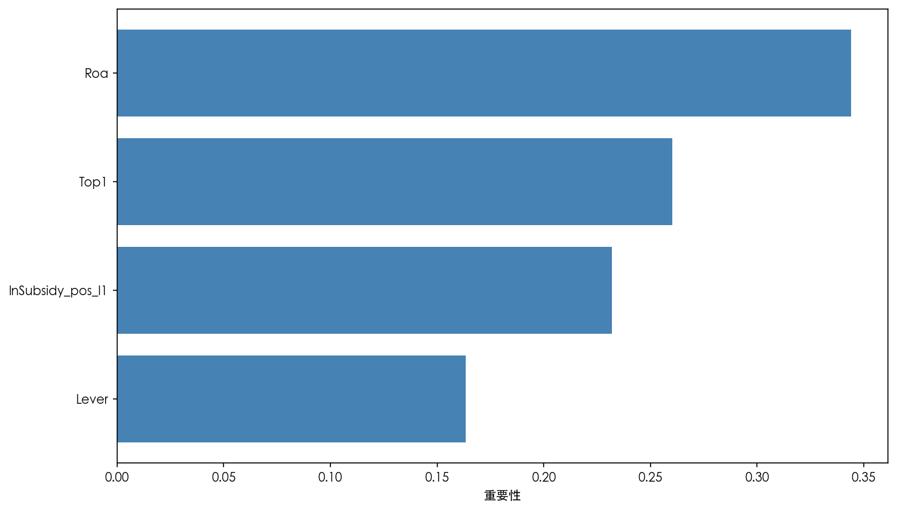
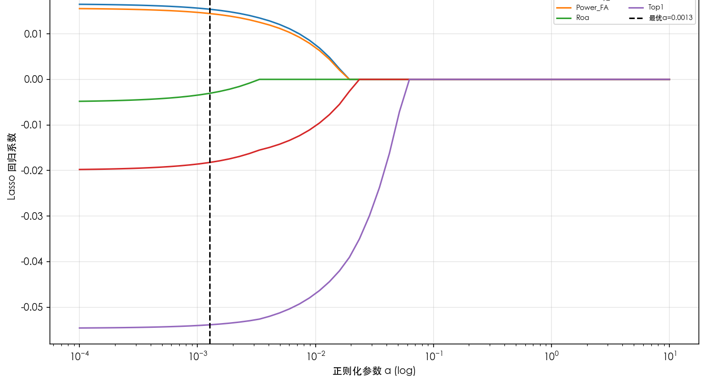
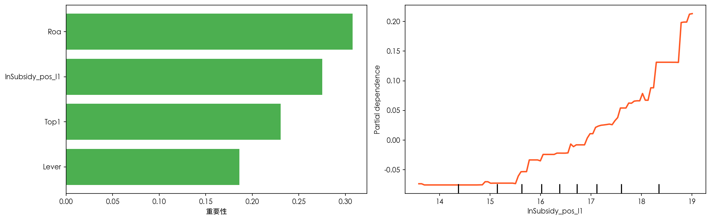

# 基于数据挖掘的上市公司财政补贴与高管超额薪酬研究

---

**摘　要**

本文以2003—2024年沪深A股非金融上市公司为样本，考察财政补贴与高管超额薪酬的关系。全样本固定效应下滞后一期财政补贴系数为正但不显著，多种工具变量、安慰剂和事件研究的识别估计对设定较为敏感，仅正补助口径与 Heckman 校正给出了正向证据。以管理层权力为中介变量的路径检验同样未获稳健支持。在与机制检验一致的统一样本上，借助 Lasso、随机森林和 XGBoost 对 OLS 主回归做了补充检验：Lasso 保留了财政补贴与管理层权力变量，且系数方向与OLS相关路径一致；随机森林和 XGBoost 显示财政补贴仍具有一定特征重要性，XGBoost 的部分依赖曲线总体向上。综合来看，财政补贴与高管超额薪酬存在一定关联，但现有证据尚不足以支持无条件的强因果结论。

**关键词**：财政补贴，高管超额薪酬，管理层权力，中介效应，数据挖掘

**RESEARCH ON FISCAL SUBSIDIES AND EXECUTIVE EXCESS COMPENSATION OF LISTED COMPANIES BASED ON DATA MINING**

**ABSTRACT**

Using non-financial A-share listed firms from 2003 to 2024, this study examines the relationship between fiscal subsidies and executive excess compensation. Under full-sample fixed effects, the coefficient on lagged fiscal subsidies is positive but insignificant; instrumental-variable, placebo, and event-study designs yield sensitive results across specifications, while the positive-subsidy specification and Heckman correction provide supportive positive evidence. The mediating role of managerial power is not robustly supported. Supplementary machine-learning checks (Lasso, Random Forest, and XGBoost) on a unified sample show that Lasso retains both fiscal subsidies and managerial power with signs consistent with the corresponding OLS paths; Random Forest and XGBoost indicate that fiscal subsidies retain feature importance, and the XGBoost partial-dependence curve trends upward. Overall, fiscal subsidies are associated with executive excess compensation to some extent, yet the current evidence falls short of supporting an unconditional strong causal conclusion.

**Keywords**: fiscal subsidies, executive excess compensation, managerial power, mediation effect, data mining

---

## 第一章 绪论

### 1.1 研究背景与问题提出

党的二十大报告提出，中国经济已由高速增长阶段转向更注重发展质量的新阶段。这一转变对应着政府资金投向、政策工具选择和绩效评估标准的全面调整。财政补贴在这一背景下持续发挥作用，服务于战略性新兴产业培育和技术创新激励，同时承担企业纾困、稳就业和稳预期等现实任务。根据 CSMAR 统计，2003至2024年间沪深A股非金融上市公司的政府补助规模持续扩大，获补企业数量和平均补贴强度均呈上升趋势。财政补贴已成为中国资本市场一类常规的制度性变量。

同一时期，上市公司高管薪酬始终是学术讨论和公共舆论的焦点。学术上，它关系激励契约设计、代理成本控制和公司治理效率；公众层面，它牵涉收入分配公平、财政资金使用效率和市场信任基础。一个日益引人关注的问题是：企业获得补贴后，高管薪酬是否会随之抬升？更深一层的担忧在于，原本服务于产业发展和公共利益的政策性资源，是否会在信息不对称和治理约束不足的条件下部分转化为管理层的私人收益。这个问题同时涉及财政资源配置效率和企业内部利益分配的合理性。

高管薪酬为何偏离“合理水平”，现有研究主要沿两条路径解释。“最优契约说”强调市场竞争与治理约束，视薪酬为董事会与高管博弈后的均衡结果，最终应反映高管的边际贡献；“管理权力说”则关注现实中的治理偏差，认为所有权与控制权分离的公司中，高管可以通过影响董事会构成、薪酬委员会安排和信息披露节奏来抬高自身报酬。在中国上市公司中，后一种解释更贴近现实——信息不对称程度较高、内部控制质量参差不齐、独立董事独立性有限，这些因素会放大管理层的自利空间。财政补贴作为外部资源进入企业后，增加了可支配资金，也容易抬高高管薪酬议价能力、为寻租行为提供空间。本文也由此切入。

围绕这一主题，本文集中回答四个相互关联的问题：财政补贴在控制企业基本特征后是否与高管超额薪酬存在显著稳健的正相关？管理层权力是否在两者之间承担中介角色，即补贴变化会不会通过改变权力结构传导到超额薪酬？这一关联在不同产权性质和行业管制强度下是否呈现差异？机器学习稳健性检验能否从变量重要性、系数保留与方向一致性、部分依赖趋势三个角度，为基准回归提供额外验证？

### 1.2 研究目的与研究意义

**理论意义**体现在三个方面。将政府补贴这一政策变量纳入高管超额薪酬的分析框架，将“外部资源输入”与“内部权力结构”纳入同一条分析链；测量层面采用 FA 构造管理层权力综合指标，并以双主成分 PCA 口径作对照，避免将某一种测度方式视为唯一正确的选择；固定效应、工具变量和中介检验等传统计量手段与 Lasso、随机森林、XGBoost 等数据挖掘工具并行使用，使线性识别与非线性观察能够相互补充。

**现实意义**更贴近政策和市场实践。对财政监管部门而言，研究证据提示补贴与高管薪酬之间不存在简单稳定的线性链条，二者的联系受变量口径、治理约束和制度环境共同塑造，这为补贴用途约束、事后审计和信息披露设计提供了参考。对资本市场监管者来说，机器学习稳健性检验给出的财政补贴与管理层权力相对重要性排序可作为筛查重点情境的辅助线索，但不宜直接替代正式监管判断。对投资者和公众而言，理解补贴与薪酬之间潜在联系及其不稳定性，有助于评估上市公司治理质量和财政资金的实际使用效率。

### 1.3 国内外研究现状

#### 1.3.1 高管超额薪酬的界定与测量方法

高管超额薪酬研究的核心困难不在于发现“薪酬高”，而在于区分哪些部分属于正常激励、哪些已偏离合理边界。早期文献常直接使用CEO绝对薪酬水平作代理变量，操作简便但难以将企业规模、业绩补偿和治理失灵带来的额外收益分开。Bebchuk和Fried（2003）[2]将研究视角从“薪酬高不高”转向“薪酬契约如何形成”，指出所有权分散的上市公司中，管理层可通过影响董事会提名、薪酬委员会构成和条款设计来抬高自身报酬。期权、退休福利和其他隐性收益因此成为观察管理权力的重要窗口。

Core等（1999）[5]将这一讨论推进到可操作的实证层面：利用公司治理、规模、业绩、风险、行业和年份等变量估计“应得”薪酬，将残差视为超额薪酬。这一方法不会将所有高薪归入异常，它先给出基准，再识别偏离基准的部分是否与权力结构有关。后续大量文献沿用了这一残差口径，研究也在该框架上展开，并在样本处理和变量设定上作了贴合中国上市公司情境的调整。

放到中国样本里，这条思路也得到了进一步延展。Bu等（2019）[4]更关注高管与员工之间的薪酬差距，罗昆、曹光宇（2015）[21]则直接使用残差法刻画超额薪酬，二者切入点不同，但都把政府补贴纳入了解释框架，并得出补贴与高管额外收益存在正向联系的判断。吴妍（2019）[26]、张莉莉（2019）[29]等学位论文则提供了更贴近中国制度环境的变量设定和样本处理经验。它们至少说明，在中国资本市场语境下，把超额薪酬构造成一个可比较、可检验的经验变量，是行得通的。

#### 1.3.2 财政补贴的分配逻辑与公司行为效应

现有文献提醒，财政补贴不宜被理解为随机落入企业账户的外部资金。唐清泉和罗党论（2007）[24]指出，中国上市公司的补贴分配同时带有产业政策导向和政治关联色彩，补贴能否获得本身就嵌入了企业特征与制度关系的筛选。潘红波、夏新平和余明桂（2008）[23]进一步发现政治关联更强的企业更容易获得政策支持。补贴因而兼具财务资源和治理关系的双重属性：它进入企业后会影响利润表，并改变管理层在企业内部的资源支配位置。

Jiang等（2025）[8]将视角延伸至补贴到账后的资源消化环节，发现政府补贴与管理冗余显著正相关，在内部控制较弱、社会信任水平较低的企业中这种关系更为明显。补贴未必自动转化为效率改进，某些情形下反而成为管理层可占用的松弛空间。李哲、王文翰和王遥（2022）[16]从披露端提供了另一条证据：部分企业会通过强化年报中的政策导向表述来提升补贴获取概率，这提示补贴的形成过程本身就嵌入了信息策略和治理差异。

#### 1.3.3 内部治理机制对补贴—薪酬关联的调节

补贴能否外溢到薪酬端，很大程度上取决于企业内部的治理约束强度。步丹璐和王晓艳（2014）[14]发现政府补助会扩大高管与员工之间的薪酬差距，治理约束较弱的企业表现更为明显。陈冬华、陈信元和万华林（2005）[15]讨论国有企业时指出，显性薪酬受限后管理层会转向在职消费、差旅费等更隐蔽的补偿渠道。综合来看，补贴对薪酬的外溢不一定体现为工资单上的直接增加，也会沿着治理薄弱环节转化为更隐性的收益安排。

卢锐、柳建华和许宁（2011）[18]发现内控质量越高，高管薪酬对业绩变化的敏感度越强，说明完善的内部约束有助于将薪酬拉回激励逻辑。罗进辉（2018）[20]从媒体监督角度得到类似结论：外部关注越强，薪酬与经营表现的对应关系越清晰，国有企业中此效应尤为突出。这些文献的启发在于：补贴能否推高异常薪酬，取决于补贴规模，也取决于企业内外部监督能否有效约束管理层的自利行为。

王克敏、王华杰、李栋栋等（2018）[25]将视角延伸至年报文本，发现业绩不佳或存在不利信息时企业更倾向于使用复杂表达，年报可读性低的企业高管超额薪酬也更高。信息披露因此并非单纯的事实呈现，它同样容易成为提高解读成本、削弱外部监督的工具。连君莎（2020）[17]、章海浪（2021）[28]、徐坤（2021）[27]分别从内部控制、薪酬公平和管理层语调角度进一步补充了这一判断：补贴、治理与薪酬的联系需要在信息透明度和监督强度的差异中理解。

#### 1.3.4 机器学习与数据挖掘方法在会计金融研究中的应用

机器学习文献与研究的关联在于它能处理线性回归不太擅长回答的问题。Li（2008）[10]较早将文本特征与经济后果联系起来，说明非结构化信息可以进入会计研究。Perols、Bowen、Zimmermann等（2017）[11]在财务舞弊识别中发现，随机森林、神经网络和Boosting等方法相较传统逻辑回归有更好的预测表现，关键在于模型能自动捕捉更高阶的交互结构。陆瑶、张叶青、黎波和赵浩宇（2020）[19]将梯度提升树用于高管特征与公司业绩关系分析，发现某些变量的作用不一定沿线性方式平稳展开，在特定区间或特定组合下才明显增强。

后续文献将这一思路扩展到文本分析和异常识别。马长峰、陈志娟和张顺明（2020）[22]在综述中指出，机器学习更适合承担探索性和补充性任务，不宜直接替代因果推断。Rjiba、Saadi、Boubaker等（2021）[12]说明年报可读性会作用于权益资本成本，Bhattacharya和Mićković（2024）[3]、Ketelaar和Mićković（2025）[9]则将上下文语言学习与人工智能方法用于舞弊和异常识别。这些工作的启发在于：当财政补贴与超额薪酬之间可能存在区间效应、交互结构或非线性关系时，机器学习可作为补充观察工具，但不应替代基准回归的主体地位。

#### 1.3.5 研究述评与现有文献的局限

综合前述文献，现有研究已在几个基础问题上形成了较清晰的认识：超额薪酬的界定与测量已有较稳定的处理路径，财政补贴对高管收入的作用在中国情境下积累了不少证据，内部控制、媒体监督和披露复杂性等因素对补贴效应强弱的影响也得到了较多支持。

现有研究也留下了几处空白。不少文献仍以薪酬水平或薪酬差距作结果变量，企业规模和绩效带来的正常差异容易被混入。管理层权力在补贴与薪酬之间的中介角色虽有讨论，但结合固定效应与滞后设定的系统检验尚不多见。机器学习工作多集中在舞弊识别或文本分类，用于考察补贴与超额薪酬非线性结构的案例仍较少。本文的设计围绕这三处不足展开。

### 1.4 研究方法与技术路线

技术路线的设计让每类工具回答不同层面的问题。前半部分完成文献梳理与理论推演，明确两条检验主线：财政补贴与高管超额薪酬是否存在稳定联系，管理层权力是否承担传导角色。

随后进入基准计量部分，利用CSMAR面板数据和Core等（1999）[5]的框架构造超额薪酬变量，在公司和年份固定效应下检验滞后一期财政补贴的主效应，并观察该联系在稳健性检验中能否维持。工具变量用于收紧识别边界，中介检验观察权力渠道是否存在，异质性分析判断联系是否随制度情境而分化。

机器学习稳健性检验置于第四章末尾，与模型3至模型5保持相同的样本边界和变量口径：随机森林复核财政补贴与管理层权力的相对重要性，Lasso检验两者是否被保留且方向一致，XGBoost通过特征重要性与财政补贴的部分依赖图观察更灵活模型中的趋势是否与OLS一致。

---
## 第二章 理论分析与假设
### 2.1 概念界定

#### 2.1.1 财政补贴

财政补贴主要指政府围绕特定政策目标向企业提供的资金支持，可以表现为技术创新、节能减排等专项补助，也可体现为税收返还、政策性贷款贴息、研发费用加计扣除等形式。按现行会计准则，政府补助分为“与资产相关”和“与收益相关”两类：前者通过递延收益逐期摊销进入利润，后者在满足确认条件后一次性或分期计入当期损益。补贴的到账时间、规模和附带约束因而会直接影响企业的资源配置方式和财务报表表现。

从经济性质看，财政补贴并非企业依靠市场竞争创造的经营收入，而是带有明确政策来源的外部资源输入。对上市公司而言，它会改变利润表表现，进而影响管理层安排资源的空间。在我国制度环境下，补贴使用约束相对有限、事后跟踪并不总是充分，这使其容易成为管理层寻租的渠道。本文据此将财政补贴置于“补贴—治理—薪酬”关系链条的起点。但这种外部资源属性并不意味着补贴天然具有准自然实验意义，全文始终将其作为需要谨慎识别的解释变量来处理。

在具体度量上，本文采用企业年度政府补助金额经零值保留后的对数形式，即$\ln(1+\text{Subsidy})$，以平滑右偏分布并保留零补助公司年度观测。从时间演变来看，上市公司获得补贴的方式和规模都发生了明显变化。加入世界贸易组织后，政府补贴逐渐从早期更偏全面覆盖的价格补贴，转向技术创新、节能环保和战略性新兴产业导向更强的选择性支持。2007年《企业会计准则第16号——政府补助》的发布，又提高了补贴数据的可比性与可识别性，为后续大样本研究创造了条件。补贴项目越细、规模越大，申报和使用过程中的信息不对称也往往越突出，主管部门很难长期跟踪每笔补贴的真实去向，而企业高管在项目论证和资源配置中通常掌握更多内部信息。

#### 2.1.2 高管超额薪酬

高管超额薪酬并非泛指“薪酬高”，而是指控制企业规模、盈利能力、资产结构、区域与行业等客观因素后仍高出正常基准的那部分报酬。这一概念的关键在于先回答一个基础问题：治理约束相对有效时，高管通常应获得怎样的回报？基准建立后，实际薪酬相对基准的偏离才能被识别为异常成分。若某家公司高管薪酬持续高于基准，可将该偏离理解为代理成本的一种表现——管理层借助信息优势或组织地位额外取得的收益。

具体处理上沿用Core等（1999）[5]的期望薪酬框架，先利用公司特征变量估计“正常薪酬基准”，再将模型残差作为超额薪酬。这一做法的优势是，企业规模、经营绩效等常规因素已在期望模型中被吸收，残差因而更接近研究真正关心的异常部分。数值上它反映实际薪酬相对拟合基准的偏离，实证操作中直接使用残差序列，不再额外做“实际值减预测值”的二次计算。由于该变量本身就是回归残差，样本均值理论上接近0，因此不再对其二次缩尾以保留原有统计含义。

与直接使用薪酬水平、薪酬差距或薪酬—绩效敏感性等指标相比，残差法的优势在于先给出相对客观的“应得薪酬”标尺，再讨论实际薪酬偏离该标尺的程度。直接使用薪酬总额操作更简洁，但难以区分哪些差异原本就应由规模、行业和经营绩效决定；高管与员工薪酬之比能反映内部公平，但仍难将“应得”与“超得”分开；薪酬—绩效敏感性更侧重激励契约强弱，不直接回答契约是否已被管理层扭曲。综合考虑，研究最终以期望薪酬残差作为超额薪酬的经验代理变量。

#### 2.1.3 管理层权力

管理层权力（Managerial Power）指高管对企业关键决策施加实际影响的能力，尤其体现在薪酬契约、资源配置和战略议程上的控制程度。它并非单一维度变量，更接近需要由多项治理特征共同逼近的潜在构念。相关文献通常从三个方向刻画这一概念：一是由正式职位和董事会结构体现的**结构性权力**，例如两职合一、内部董事比例和董事会规模；二是由高管持股体现的**所有权权力**；三是由任期、声望和组织关系积累形成的**关系性权力**。

在中国上市公司环境下，管理层权力的形成逻辑往往更复杂。国有企业高管的权力基础，常常同时带有行政授权和市场地位两层属性；在民营企业中，大股东和实际控制人的意志又会深度塑造高管的实际空间。因此，同样归入“管理层权力”这一概念之下，不同所有制企业里的生成路径并不完全一致。结合数据可得性与实证可操作性，本文以Dual、Boardsize、Insider和Mgshder四个底层指标构造综合指数，在有限数据条件下尽量保留结构性权力和所有权权力两条主要来源。

需要说明的是，中国公司治理结构中党委、董事会和管理层之间的权力边界并不总是清晰，国有企业尤其如此。党政体系中的关系网络、与上级主管部门的信任程度等真正影响高管地位的因素，在公开年报中几乎无法直接量化。将“管理层权力”放到中国上市公司语境下理解，复杂性明显高于西方主流文献的标准设定。研究的处理方式保留了可操作性，但部分非正式权力渠道容易被低估，后文区分国有与民营企业的异质性分析部分也是出于这一考虑。

### 2.2 理论基础

#### 2.2.1 管理者权力理论

管理者权力理论（Managerial Power Theory）是理解补贴与薪酬关系的重要起点。Bebchuk和Fried（2003）[2]提出这一视角，核心原因在于“最优契约说”对董事会的理性和中立假定过于乐观。按最优契约逻辑，高管薪酬应反映其边际贡献；管理者权力理论则指出，现实中董事会、薪酬委员会和经理人市场未必能形成有效约束，高管往往深度介入薪酬安排的形成过程，薪酬合同因而容易成为权力结构的产物。Finkelstein（1992）[6]将高管权力划分为结构性权力、所有权权力、专家性权力和声望性权力，为后续经验工作提供了清晰的操作框架。本文以两职合一、董事会规模、内部董事比例和高管持股四个指标刻画管理层权力，延续了多角度分析的思路。

传导路径上，高管左右薪酬安排的方式有多种：对董事会成员关系和表决环境的牵引，薪酬结构设计得更复杂以至外部难以识别，以及对披露节奏和内容的控制。Core等（1999）[5]将治理结构、较高薪酬和较差绩效放入同一分析框架，这一视角后来常被用于讨论薪酬失衡。在中国上市公司情境中，这套理论具有更强的现实针对性。国有企业中党委会、董事会和经理层的边界未必泾渭分明，高管任命和考核带有组织体系色彩；民营企业中“一股独大”、实控人与管理层关系密切、独立董事制衡不足等现象也并不少见。正式治理结构往往难以真正削弱高管影响，某些时候甚至默许其在薪酬安排中的主导地位。

这一理论的关键启发在于：财政补贴带来的不止是额外资金，它还会改变高管在企业内部的相对地位。补贴的申请、沟通、协调和使用离不开管理层深度参与，高管在资源配置中的作用因此更加突出。外部资源扩张与内部权力强化同时发生时，补贴就可能转化为薪酬谈判中的额外筹码。研究因此不直接用薪酬水平讨论问题，而转向期望薪酬残差，尽量将“补贴改善业绩后合理抬高薪酬”与“补贴扩大权力后带来异常收益”区分开。Bu等（2019）[4]和步丹璐、王晓艳（2014）[14]在治理较弱企业中观察到更强的正向关系，与这一判断一致。

#### 2.2.2 代理理论

代理理论（Agency Theory）提供了一条偏“资源流向”的解释线索。Jensen和Meckling（1976）[7]将股东与管理层的关系概括为委托—代理安排：股东让渡经营权，却无法完整观察管理层的努力、动机和资源使用方式。监督不足时，管理层会将企业资源调向更符合自身利益的位置，道德风险和代理成本由此产生。薪酬场景中，显性表现是高管通过调整绩效基准或薪酬结构获得高于边际贡献的回报；隐蔽形式包括在职消费、差旅安排和其他灰色收益；跨期扭曲则表现为把短期业绩做得更好看、代价留给后续年份。预算软约束较强的企业中这类现象更容易出现。

财政补贴进入企业后，代理问题容易被放大，因为补贴会冲淡“真实努力”和“外部资源”的边界。补贴常常会直接改善账面利润，如果薪酬契约没有把这部分政策性收益从绩效考核中剥离，高管就会在努力并未同步增加的情况下拿到更高报酬。已有研究在财务困境企业中观察到补贴增加与超额薪酬上升同时出现，这与代理理论强调的资源侵占逻辑一致。后文进一步区分不同产权类型。国有企业面对国资监管、审计约束和薪酬管制，私营企业则更多依赖大股东约束和市场纪律，监督结构并不相同，补贴最终会不会外溢到薪酬端，自然也不宜预设为同一种强度。

中国制度环境下，委托—代理链条常常是多层嵌套的。关系展开后通常涉及公众、财政部门或国资监管机构、董事会以及高管团队等多个层级，每一层都掌握着不完整的信息。财政补贴本来是一种政策资源，但一旦进入企业，高管对其具体申报、使用和绩效完成情况往往了解得更多，上层监督者未必能及时、完整地把握真实情况。由此便会出现一个很现实的悖论：补贴越多，政策资源与经营努力越难分开，薪酬契约识别“谁创造了价值”的精度反而会下降。陈冬华、陈信元和万华林（2005）[15]关于名义限薪下隐性收益上升的证据，正好说明显性约束并不能自动消除代理空间。

代理理论里还有一个特别重要的概念，即薪酬—绩效敏感性（Pay-Performance Sensitivity）。理想的契约应当对真实经营绩效敏感，而不应对外部运气收益过度敏感。财政补贴恰恰容易打乱这点，因为它会直接抬高利润表现。若补贴改善账面收益后被机械纳入绩效薪酬基数，高管就会在没有额外努力的情况下同步受益。卢锐、柳建华和许宁（2011）[18]关于内控质量越高、薪酬—绩效敏感性越强的发现，也支持了这种理解。本文采用期望薪酬残差（Overpay）而非薪酬水平，目的是先剥离“补贴带来正常绩效改善”这一层，再观察异常收益部分是否仍然存在。

#### 2.2.3 信号传递理论

信号传递理论（Signaling Theory）补充了外部信息环境这一层。Spence（1973）[13]讨论的核心问题是：在信息不对称条件下，掌握更多信息的一方会主动释放可观察信号，以引导外部对其质量的判断。后来这一框架常见于企业财务和资本市场研究，信息披露质量、股利政策和资本结构都可以放到类似逻辑里理解。

就补贴与薪酬的关系而言，它至少能解释三件事。企业会主动向政府发送“我值得被支持”的信号，在文本披露中强化创新、环保和政策契合度表达，以提升补贴获取概率；已有文献提示，这类表述有时与补贴获取关系更紧密，却未必与真实绩效一一对应。补贴本身也向市场释放背书信号，投资者、合作伙伴乃至经理人市场都把它理解为政府对企业质量的认可。信息复杂化本身也是管理层的策略选择，披露越复杂，外部监督越难迅速识别薪酬安排中的异常部分。

因此，信号传递理论并不局限于单独解释补贴或薪酬，它将补贴申请、外部背书和信息复杂化几个环节串联起来。若某位高管被外界视为更擅长获取政策资源，其在经理人市场上的替代成本往往也会被抬高，这会反过来增强其在薪酬谈判中的筹码。这样一条“补贴—声誉—议价能力”的链条，与管理者权力理论强调的组织内部权力强化，其实是可以互相接上的。因此，H2 在理论层面可以同时从内部治理视角和外部信号机制中获得解释依据。

再往前推一步，还会看到一个更现实的难题：政府当然希望把补贴投向真正高质量的企业，但在信息不对称环境下，更会组织材料、调整表达和发送信号的管理团队，往往能够以较低成本塑造“高质量企业”的外在形象。若如此，补贴流向就未必完全由真实效率决定，而部分取决于谁更擅长生产和管理这些信号。这一点值得注意，因为信号生产能力往往与信息控制权相伴而生，而信息控制权又会回到薪酬谈判过程。李哲、王文翰和王遥（2022）[16]、王克敏等（2018）[25]分别从补贴获取和薪酬掩护两个端口提供了经验支持，也使这条逻辑链更具可讨论性。

#### 2.2.4 三种理论视角的比较与内在张力

把管理者权力理论、代理理论和信号传递理论放在一起，重点并不在让三套理论去重复解释同一个后果，关键是看它们各自负责哪一层。若简化来看，代理理论回答的是“补贴在什么条件下会被管理层截留”，管理者权力理论回答的是“这种截留依托什么内部安排发生”，信号传递理论则补充了“外部信息环境为什么会放大或压缩这一过程”。三种理论不是相互竞争的替代解释，它们分别对应条件、传导路径和情境。

当然，这三套理论都不是专门为中国上市公司制度环境量身设计的，把它们直接照搬过来也并不稳妥。管理者权力理论常以股权相对分散为背景，而中国企业里真正重要的制衡来源很多时候是大股东或实际控制人；代理理论在国有企业里往往会面对多层委托链条，监督责任并不只发生在董事会一层；信号传递理论则默认高质量与低质量主体在发送信号上的成本差异较为稳定，但在披露监管尚不充分、地方政策竞争较强的市场环境中，这一前提未必总能成立。

因此，这些理论更多作为分析参照，而不是把任何一条经验结果直接解释为对某个理论本身的证实或证伪。它们共同提供的是一个更适合展开实证分析的视角组合：从资源如何进入企业，到权力如何重新分布，再到外部信息环境如何改变这一过程的可见性和强弱，都能找到对应的分析视角。

#### 2.2.5 中国制度情境下的理论延展

如果把中国制度环境纳入进来，上述三套理论就需要再做一层本土化理解。中国上市公司获得的财政补贴并非一般意义上的现金流入，它往往同时嵌在地方政府竞争、产业政策导向、国资监管层级差异和信息透明度不均衡这些条件里。补贴同时兼有资源输入和制度安排的双重属性，改变的是利润表数字，同时也重塑高管与政府、董事会以及外部投资者之间的相对关系。

在这一情境下，至少有三点值得特别注意。补贴分配通常带有较强的政策导向和选择性，高管在申报、沟通和协调中的作用往往会被放大。补贴到账后的约束和追踪在不同地区和所有制企业之间并不均衡，一些企业面对的外部监督明显更弱。加之地方政府之间存在持续的财政竞争，各地在招商引资过程中都会主动使用补贴工具，补贴分配受中央政策意图和地方财政余裕、招商策略的共同影响。

基准工具变量采用“同城市同年度其他公司平均补助”，制度逻辑就来自这种地方财政政策的共同波动；后文补充的精炼双工具变量，则进一步借助行业政策倾向和省市层面的留一法波动削弱共同冲击。

考虑到安慰剂检验还暴露出时变行业趋势的混淆风险，研究进一步采用两类补充识别策略：一是使用“滞后三期同省同年其他企业平均补助”作为深度滞后工具变量，以更大的时间距离削弱反向因果；二是参照 Lewbel（2012）的做法利用控制变量与一阶段残差乘积构造异方差内生工具变量，不依赖任何外部信息；此外还把企业早期补贴暴露度与全国（排除本省）行业补贴增量交互，构造 shift-share Bartik 工具变量，以利用行业外部冲击在不同既有暴露度企业之间的异质传导提取外生成分。

基于这一背景，“补贴带来资源扩张”与“补贴扩大管理层可支配空间”往往同时出现，补贴因此不宜简单看作财务变量，而应视为同时牵动资源配置、权力结构和外部信号的复合性冲击。2015年以来国有企业薪酬制度改革又进一步加深了这种差异。中央出台的限薪令直接限制了央企和地方国企主要负责人的薪酬上限，并要求薪酬水平与企业绩效、职工收入挂钩。由此，即便国有企业获得较多补贴，其薪酬空间也会受到更强的行政约束；私营企业的薪酬安排则更多受市场机制和大股东意志支配，行政限薪的外部硬约束相对较弱。产权性质和行业监管强度因而成为后文重点分析的异质性维度。

这一制度背景也解释了为何研究设计同时包含固定效应、中介效应和机器学习稳健性检验。固定效应和滞后设定更适合区分“企业原本就不同”和“补贴变动之后发生了什么”；中介效应检验侧重观察权力渠道是否存在传导线索；机器学习稳健性检验则在统一样本上复核财政补贴与管理层权力在多变量竞争下是否仍保留信息含量，并观察财政补贴的局部趋势是否与 OLS 保持一致。第二章的理论推演，归根到底要回答两个层面的问题：补贴为何可能与超额薪酬上升相伴随，以及为什么这一关系在不同企业中强度并不相同。

### 2.3 研究假设

以上讨论可以收束为一个分层框架：代理理论解释补贴为何会演化为管理层收益，管理者权力理论说明这种转化依赖什么内部结构，信号传递理论则补足外部信息环境怎样改变传导强弱。把三者合起来看，财政补贴就超出了单纯的资源变量含义，它会通过组织地位、声誉背书和披露策略等渠道间接改写薪酬谈判的格局。后文控制变量的安排、中介检验的设计以及异质性维度的选择，基本都来自这一套推演。

基于上述理论分析，提出以下两个核心研究假设：

**假设H1（主效应假设）**：财政补贴与高管超额薪酬呈显著正相关关系。在信息不对称和薪酬约束不足的条件下，财政补贴扩大了企业可支配资源规模；如果薪酬治理机制无法对管理层的资源提取行为形成有效约束，这类外部资源就会与更高的高管超额薪酬相伴随。H1主要建立在代理理论的资源侵占逻辑之上：补贴进入企业账面之后，若激励契约没有把这部分“非经营性收益”从绩效薪酬基数中剔除，高管就会在未作出相应经营努力的情况下同步受益；同时，资源扩张也会放松董事会在薪酬谈判中的支付约束。基于此，H1预期财政补贴与高管超额薪酬之间存在正向联系，并在较严格的控制设定下仍能观察到这一关系。

**假设H2（中介效应假设）**：管理层权力在财政补贴与高管超额薪酬的关联过程中发挥中介作用。财政补贴的获取和使用会强化高管在资源配置中的核心地位，并进一步提升其在薪酬谈判中的议价能力；若控制管理层权力后，补贴对超额薪酬的直接效应收窄，且管理层权力的系数显著为正，则可将其视为存在间接传导的经验线索。H2主要来自管理者权力理论：补贴获取过程中高管的深度介入，会强化其在组织内部的议程设置权；补贴使用中的自由裁量越大，补贴资源被转化为薪酬议价筹码的空间也越大。需要说明的是，管理层权力的测度方式会直接左右路径检验的稳定性，正文优先报告 FA 综合口径结果，并以双主成分 PCA 口径作敏感性对照，对相关路径始终保持审慎解释。第四章的中介检验即围绕这一链条展开。

---

## 第三章 研究设计

### 3.1 研究思路与分析框架

整体分析框架可以概括为两条主线。第一条主线关注财政补贴与高管超额薪酬之间是否存在稳定的条件相关关系；第二条主线关注这种关系是否会经由管理层权力部分传导。产权性质、行业管制强度等制度因素则作为情境变量，用于考察上述关系在不同环境下是否呈现差异。

企业获得财政补贴后，最直接的变化是可支配资源增加，账面利润也会随之改善，这会改变薪酬安排所面临的资源约束；同时，补贴从申请到使用通常都需要高管深度介入，这又会提升其在组织内部的议程设置权和资源支配权。

基于这一逻辑，后文的实证部分按四步展开：先用基准回归确认主关联，再用稳健性检验考察关系是否稳定；随后开展工具变量检验、中介效应分析和异质性分析，尽量把识别边界、传导路径与制度情境差异说明清楚；最后再借助机器学习稳健性检验，在与机制模型一致的变量设定下复核财政补贴与管理层权力的重要性、方向一致性和财政补贴的局部趋势。这样的安排旨在让不同方法分别回答不同问题，而不是简单叠加方法以堆砌结论。

### 3.2 样本选择与数据来源

本文以2003—2024年沪深A股上市公司为总体，所需数据均来自国泰安（CSMAR）数据库，包括政府补助数据、高管薪酬数据、公司财务数据（资产负债表、利润表）、公司治理数据（董事会构成、股权结构）以及企业性质和地区分类信息。样本清理的思路是先保证可比性，再处理极端值和缺失问题。

金融行业被首先剔除，因为其资产负债结构和监管氛围与一般实业企业差异过大，直接并入会让薪酬与补贴的比较基准失真。研究期间被 ST、\*ST、S\*ST、SST、PT 或处于退市整理期的公司也不保留；由于仓库中未能获得更权威的独立 ST 状态维表，实际操作按合并后简称字段中的标签进行识别和剔除，目的是排除财务异常、退市风险和极端经营状态的样本，尽量保证不同公司之间薪酬与补贴比较基准的可比性。

对于政府补助数据，若公司年度未披露补助项目，则该年度补助金额记为0，以避免零补贴观测在对数处理时被机械删除；少量负值观测在构造基准对数变量时按0处理。地区变量 Zone 的识别则优先依据公司注册地址，若注册地址信息不足，再辅以办公地址与城市字段识别所属省级区域，并据此按“东部=0、中西部=1”编码，以避免仅依赖不完整城市名单造成的系统错分。核心变量缺失严重的观测值随后被删除，主要连续变量（Overpay除外）则统一在1%和99%分位数处做Winsorize缩尾。原始薪酬数据沿用CSMAR数据库既有缩尾口径，不再重复处理。

经过这些步骤，原始公司—年度观测为70,559条；剔除金融行业后为69,142条；再剔除特殊处理样本后为63,011条；满足关键变量完整要求的样本为52,980条；满足期望薪酬模型完整案例要求的样本为52,805条；纳入管理层权力底层指标后，可用于构造 Power 的样本为50,171条；在基准回归中加入滞后一期补助变量后，模型2样本为49,755条；在中介效应检验中要求 Overpay、Power 与滞后补助均完整后，统一样本为47,055条；机器学习稳健性检验与模型3至模型5保持同一变量口径，因此其可用样本同样为47,055条。

时间窗口的设定有明确依据：样本从2003年开始，一是因为加入世贸组织后上市公司信息披露逐步规范，CSMAR 在2003年前后的数据完整性和可比性明显改善；二是，政府补助作为独立披露科目的规范化要求也是在这一阶段逐步清晰的，若把更早期数据混入，口径差异会带来额外误差。样本截至2024年，既尽量利用最新可得数据，也为滞后变量保留了足够年份。剔除金融行业后，样本覆盖制造业、信息技术、批发零售、房地产、交通运输等17个行业门类，整体行业结构与沪深A股分布基本一致。

为了避免不同实证模块的样本口径被混为一谈，这里专门说明样本量的变化。第一步，期望薪酬模型使用52,805条观测构造 Overpay；第二步，基准回归模型2在加入滞后一期财政补贴后，样本降至49,755条；第三步，机制检验需要管理层权力综合指标 Power（FA）完整，因此统一样本进一步降至47,055条。第四步，第四章最后一节的机器学习稳健性检验并未额外加入 Power 的底层分项、地区变量、企业属性或其他扩展特征，而是仅使用与模型3至模型5一致的五个变量，即 lnSubsidy_l1、Power_FA、Roa、Lever 和 Top1，因此机器学习样本不再在47,055条基础上继续缩窄，而是与机制统一样本完全一致。这样的处理可以把“主回归样本”和“机制及机器学习样本”清楚区分开来，避免在答辩时把不同问题对应的样本边界混为一谈。

### 3.3 变量设定与说明

#### 3.3.1 被解释变量：高管超额薪酬（Overpay）

高管超额薪酬以期望薪酬模型的回归残差直接度量。具体以高管前三名薪酬总额的对数 lnSalary 为被解释变量，把企业规模 lnSale、盈利能力 Roa、无形资产占比 IA 和地区虚拟变量 Zone 作为核心解释变量，并控制行业和年份固定效应。对应模型在第三章模型设定部分正式给出。

期望薪酬模型的残差项 $\varepsilon_{it}$ 直接定义为 $\text{Overpay}_{it}$。使用高管前三名薪酬总额而非单个CEO薪酬，一方面是为了降低个别年份单一职位数据缺失或异常的影响；另一方面也因为中国上市公司重大决策往往由高管团队共同完成，团队层面的薪酬安排更能反映企业的整体激励取向。$\text{Overpay}_{it}>0$ 表示该企业高管获得了高于基准的薪酬，$\text{Overpay}_{it}<0$ 则表示其薪酬低于基准，这一情况在部分受薪酬管制约束的国有企业中并不少见。

#### 3.3.2 核心解释变量：财政补贴强度（lnSubsidy）

核心解释变量为企业年度政府补助金额的对数值：

$$\ln\text{Subsidy}_{it} = \ln\!\bigl(1+\max(\text{GovernmentSubsidy}_{it},0)\bigr) \tag{1}$$

这里沿用$\ln(1+\text{Subsidy})$作为基准口径，主要有两点考虑。政府补助金额分布右偏明显，企业间规模差异较大，对数化有助于压缩极端值带来的波动。同时，若直接对补助金额取自然对数，则零补助公司年度会被剔除，不利于在全体样本上讨论补贴强弱差异，据此，未披露补助的公司年度记为0，并在基准回归中使用$\ln(1+\text{Subsidy})$。稳健性检验部分另行使用“仅对正补助取对数”的替代口径，以检验结论对补贴定义方式是否敏感。

#### 3.3.3 控制变量

控制变量分成两个阶段来设定，原因在于两阶段模型各自承担的任务并不一样。第一阶段的目标，是尽量准确地估计“合理薪酬”或“期望薪酬”，因此控制项要尽量覆盖那些决定正常薪酬基准的公司特征，包括**企业规模**（$\ln\text{Sale}$）、**盈利能力**（Roa）、**无形资产占比**（IA）和**地区虚拟变量**（Zone），并进一步控制行业和年份效应，把规模、业绩、资产结构以及地区薪酬基准这些常规差异尽量吸收进期望薪酬模型。

第二阶段的关注点转向财政补贴与“超额薪酬”之间的联系，因此控制项收缩为更直接关系到薪酬契约合理性、监督强度和寻租空间的变量，即**盈利能力**（Roa）、**财务杠杆**（Lever）和**第一大股东持股比例**（Top1），同时统一纳入公司和年份固定效应。这样安排的逻辑比较直接：财务杠杆对应债务约束，大股东持股比例代表外部监督能力，公司固定效应和年份固定效应则分别吸收稳定个体差异与共同宏观冲击。无形资产占比对应企业对知识资本的依赖程度；Zone 依据注册地址优先、办公地址补充的规则识别企业所属东中西部地区，但由于它在公司层面基本稳定，在第二阶段会被公司固定效应吸收，因此不再单独进入方程。主要变量定义汇总见表3-1。

**表3-1 主要变量定义**

<table>
  <thead>
    <tr>
      <th>变量名</th>
      <th>符号</th>
      <th>定义</th>
    </tr>
  </thead>
  <tbody>
    <tr>
      <td>高管超额薪酬</td>
      <td>Overpay</td>
      <td>期望薪酬模型回归残差，正值表示薪酬高于基准</td>
    </tr>
    <tr>
      <td>财政补贴强度</td>
      <td>lnSubsidy</td>
      <td>ln(1+政府补助)，未披露补助记为0</td>
    </tr>
    <tr>
      <td>管理层权力</td>
      <td>Power</td>
      <td>基于 Dual、Boardsize、Insider、Mgshder 四项指标的FA综合得分</td>
    </tr>
    <tr>
      <td>业绩</td>
      <td>Roa</td>
      <td>净利润/总资产</td>
    </tr>
    <tr>
      <td>财务杠杆</td>
      <td>Lever</td>
      <td>总负债/总资产</td>
    </tr>
    <tr>
      <td>大股东持股</td>
      <td>Top1</td>
      <td>第一大股东持股比例（%）</td>
    </tr>
    <tr>
      <td>地区</td>
      <td>Zone</td>
      <td>依据注册地址/办公地识别，中西部地区=1，东部地区=0</td>
    </tr>
    <tr>
      <td>企业规模</td>
      <td>lnSale</td>
      <td>营业收入自然对数</td>
    </tr>
    <tr>
      <td>无形资产占比</td>
      <td>IA</td>
      <td>无形资产/总资产</td>
    </tr>
  </tbody>
</table>

#### 3.3.4 路径变量：管理层权力（Power）

管理层权力变量 Power 主要作为中介变量使用。正文主线将其定义为基于 Dual、Boardsize、Insider 和 Mgshder 四项治理指标构造的 FA 综合得分，用于刻画高管在正式职位、董事会结构与所有权层面的综合影响力。有关 Power 的具体构成过程以及 FA/PCA 的诊断结果，统一放在第四章中介效应分析部分展开。

### 3.4 模型设定

#### 3.4.1 第一阶段：期望薪酬模型
期望薪酬模型直接沿用Core等（1999）[5]的基本思路：

$$\ln\text{Salary}_{it} = \alpha_0 + \beta_1 \ln\text{Sale}_{it} + \beta_2 \text{Roa}_{it} + \beta_3 \text{IA}_{it} + \beta_4 \text{Zone}_{it} + \sum_{j=1}^{J} \delta_j \text{Industry}_{j} + \sum_{t=1}^{T} \gamma_t \text{Year}_{t} + \varepsilon_{it} \tag{2}$$

其中，$\ln\text{Salary}_{it}$ 表示第 $i$ 家公司第 $t$ 年高管前三名薪酬总额的对数值，$\varepsilon_{it}$ 为随机扰动项。残差序列 $\varepsilon_{it}$ 直接作为超额薪酬的代理变量，即 $\text{Overpay}_{it} \equiv \varepsilon_{it}$，正值表示实际薪酬高于基准水平，负值则相反。

#### 3.4.2 第二阶段：基准回归模型

基准回归阶段以超额薪酬（Overpay）为被解释变量，将滞后一期财政补贴强度（$\ln\text{Subsidy}_{i,t-1}$）作为核心解释变量，并加入企业层面控制变量、公司固定效应和年份固定效应：
$$\text{Overpay}_{it} = \alpha + \beta_1 \ln\text{Subsidy}_{i,t-1} + \beta_2 \text{Roa}_{it} + \beta_3 \text{Lever}_{it} + \beta_4 \text{Top1}_{it} + \mu_i + \lambda_t + \varepsilon_{it} \tag{3}$$

这里的 $\mu_i$ 表示公司固定效应，$\lambda_t$ 表示年份固定效应。最关注的是 $\beta_1$ 的方向、大小及其统计显著性：如果 $\hat{\beta}_1 > 0$ 且统计显著，就说明在控制公司层面稳定差异和年度共同冲击之后，补贴增加仍与更高的超额薪酬相伴随。核心解释变量使用滞后一期补助，是为了尽量把时间顺序固定为“补贴在前、薪酬在后”，以减轻同期反向因果带来的干扰。

#### 3.4.3 工具变量模型

考虑到财政补贴容易受到选择性配置和反向因果的干扰，研究在公司固定效应框架下使用两阶段最小二乘法（2SLS）开展工具变量检验。第一层识别仍沿用“公司固定效应 + 年份固定效应”的常规 FE-2SLS 设定。

基准工具变量设定为“同城市同年度其他公司平均补助”的滞后一期值，即 $IV_{\ln\text{Subsidy}_{i,t-1}}$，其制度逻辑是同城企业会共同受到地方财政政策波动影响。为减弱本地共同冲击和本省共同政策环境直接进入误差项的风险，后文又补充构造了两个更强的精炼工具变量：一是“同行业同年排除本省后的其他企业平均补助”滞后一期，二是“同省同行业同年排除本市后的其他企业平均补助”滞后一期。二者分别利用行业政策倾向与本地化财政配置的留一法波动，为后文的过度识别检验提供额外约束。

与基准回归模型一致，常规工具变量模型仍控制 Roa、Lever 和 Top1，并同时纳入公司固定效应与年份固定效应。以单工具设定表示时，第一阶段回归写为：

$$\ln\text{Subsidy}_{i,t-1} = \alpha + \pi_1 IV_{\ln\text{Subsidy}_{i,t-1}} + \pi_2 \text{Roa}_{it} + \pi_3 \text{Lever}_{it} + \pi_4 \text{Top1}_{it} + \mu_i + \lambda_t + \nu_{it} \tag{4}$$

其中，$IV_{\ln\text{Subsidy}_{i,t-1}}$ 用来预测企业个体滞后一期财政补贴中的外生成分；若工具变量有效，则 $\pi_1$ 应显著不为0。第二阶段则使用第一阶段得到的拟合值 $\widehat{\ln\text{Subsidy}}_{i,t-1}$ 解释超额薪酬：

$$\text{Overpay}_{it} = \alpha + \beta_1 \widehat{\ln\text{Subsidy}}_{i,t-1} + \beta_2 \text{Roa}_{it} + \beta_3 \text{Lever}_{it} + \beta_4 \text{Top1}_{it} + \mu_i + \lambda_t + \varepsilon_{it} \tag{5}$$

若第二阶段中的 $\beta_1$ 在统计上显著，则可将财政补贴的影响理解为在该组工具变量识别下更接近因果的条件相关结果；反之，则说明即便利用地方财政政策与行业政策的共同波动提取外生成分，补贴对超额薪酬的影响仍不稳健。

为进一步强化内生性处理，在三套常规工具变量之外，补充引入两类识别逻辑不同的方案。一是采用“滞后三期同省同年其他企业平均补助”作为深度滞后工具变量，以更大的时间距离削弱反向因果；二是参照 Lewbel（2012）的做法，利用控制变量去中心化值与一阶段 OLS 残差的乘积构造工具变量矩阵，仅在存在条件异方差的情形下有效，不依赖任何外部信息来源。

此外，以企业早期补贴暴露度与“全国（排除本省）行业补贴均值年度增量”交互构造 shift-share Bartik 工具变量，采用“公司固定效应 + 年份固定效应”框架估计，观察预定暴露度差异能否为补贴提供额外外生成分。另需说明的是，Heckman 两步法并不用于替代基准回归，而是专门用于只保留正补助样本的替代口径回归：第一步以正补助口径变量 lnSubsidy_pos_l1 是否可观测构造选择方程，第二步再将逆米尔斯比率纳入公司和年份固定效应回归，以检验“仅正补助样本”结果是否主要由样本选择偏差驱动。

考虑到现有材料不足以支撑严格的准自然实验识别，还补充实施两类不依赖外部政策库的辅助诊断：一是使用未来一期和未来两期补贴替代当前解释变量的安慰剂检验，并比较“公司固定效应 + 年份固定效应”与“公司固定效应 + 行业×年份固定效应”两种设定，以观察前瞻性相关是否随着行业年度共同冲击的吸收而减弱；二是围绕首次大额补贴暴露年份构造事件时间虚拟变量，检验大额补贴发生前后的动态模式是否伴随显著预趋势。两类检验都只用于刻画识别局限和动态关联，不被解释为独立的因果估计。

#### 3.4.4 基于管理层权力的中介检验

在完成基准回归与工具变量检验之后，再按照Baron和Kenny（1986）[1]的经典中介分析思路，检验财政补贴是否会经由管理层权力这一渠道影响超额薪酬，并辅以 Sobel 检验和公司层面 Cluster Bootstrap 作为补充统计检验。由于主效应本身并不稳固，后文对这部分证据更强调“路径线索”，而不将其解释为严格的经典中介识别。正文主线采用 FA 口径的管理层权力指标 Power，同时以双主成分 PCA 口径作测度敏感性对照。为与正文呈现顺序保持一致，中介检验模型依次编号为模型3至模型5，对应的三步回归如下：

**第一步**（估计总效应 $c$，对应模型3）：

$$\text{Overpay}_{it} = \alpha + c \cdot \ln\text{Subsidy}_{i,t-1} + \boldsymbol{\beta}'\mathbf{X}_{it} + \mu_i + \lambda_t + \varepsilon_{it} \tag{6}$$

**第二步**（估计路径 $a$，补贴对权力的影响）：
$$\text{Power}_{it} = \alpha + a \cdot \ln\text{Subsidy}_{i,t-1} + \boldsymbol{\beta}'\mathbf{X}_{it} + \mu_i + \lambda_t + \varepsilon_{it} \tag{7}$$

**第三步**（同时纳入补贴和权力，估计控制 Power 后的补贴系数 $c'$ 与路径 $b$）：

$$\text{Overpay}_{it} = \alpha + c' \cdot \ln\text{Subsidy}_{i,t-1} + b \cdot \text{Power}_{it} + \boldsymbol{\beta}'\mathbf{X}_{it} + \mu_i + \lambda_t + \varepsilon_{it} \tag{8}$$

其中，模型3对应统一样本上的总效应检验，模型4对应路径 $a$，模型5另外给出路径 $b$ 与控制 Power 后的直接效应 $c'$；$\mathbf{X}_{it}$ 为控制变量向量。间接效应记为 $a \times b$，Sobel 检验统计量为：

$$z_{\text{Sobel}} = \frac{a \times b}{\sqrt{b^2 s_a^2 + a^2 s_b^2}} \tag{9}$$

其中 $s_a$ 和 $s_b$ 分别是路径系数 $a$ 与 $b$ 的标准误。鉴于主效应本身并不稳固，且 Power 仅为经验性综合测度，主要依据间接效应的 Bootstrap 95% 置信区间是否跨越0来判断是否存在统计上的间接传导线索，并将路径 $a$、路径 $b$ 的方向与显著性作为辅助证据；若 Bootstrap 区间跨越0，则不将 H2 视为得到支持。

### 3.5 机器学习方法

#### 3.5.1 样本划分、预处理与验证安排

机器学习围绕第四章基准回归与中介检验中共同涉及的核心变量展开三项辅助检验。为保持与模型3至模型5的可比性，本节仅纳入滞后一期财政补贴（lnSubsidy_l1）、管理层权力综合指标（Power_FA）、业绩（Roa）、财务杠杆（Lever）和第一大股东持股比例（Top1）五个变量，不再额外加入 Power_FA 的底层分项或其他扩展特征，以避免同一治理信息被重复编码。

财政补贴和管理层权力在与其他核心变量共同进入模型后是否仍保有可辨识的信息含量，这主要由随机森林和 XGBoost 的特征重要性回答；在正则化筛选条件下 lnSubsidy_l1 和 Power_FA 是否会被压缩为0、系数方向是否仍与 OLS 判断一致，这主要由 Lasso 回归回答；在更灵活的树模型中财政补贴变量的部分依赖趋势是否整体向上、与 OLS 主回归的正向方向判断是否一致，这主要由 XGBoost 的部分依赖图回答。

样本使用47,055个公司年度观测，与第四章中介检验的统一样本完全一致。样本按公司分组，利用 GroupShuffleSplit 以8:2比例划分为建模样本（37,647条）和保留样本（9,408条），确保同一公司的全部年度观测只落在一端，避免同一公司跨期观测同时进入不同样本而夸大验证结果。输入特征共5个，即滞后一期财政补贴（lnSubsidy_l1）、管理层权力综合指标（Power_FA）、业绩（Roa）、财务杠杆（Lever）和第一大股东持股比例（Top1）。这样的设定既保证机器学习检验与 OLS 主回归和中介检验使用同一批公司—年度观测，同时避免把 Power_FA 与其底层指标同时纳入模型所带来的重复编码问题。被解释变量仍为第四章基准回归使用的连续型超额薪酬（Overpay），以保证机器学习分析与主回归问题保持一致。

在技术处理上，所有连续型特征在进入 Lasso 前都通过 StandardScaler 做零均值、单位方差标准化；树模型对特征尺度不敏感，因此不做这一步。Lasso 的惩罚参数选择、随机森林和 XGBoost 的调参与稳定性检验，均按公司分组实施 GroupKFold，以避免同一公司的不同年份样本同时进入训练折和验证折。这里的交叉验证主要用于控制过拟合和稳定模型设定，并不构成论文的主结论依据；真正用于正文判断的，是三类模型对 lnSubsidy_l1 的重要性排序、保留情况、系数方向和部分依赖趋势。

#### 3.5.2 随机森林方法

随机森林（Random Forest）是一种基于 Bagging 思想的集成学习方法，其核心做法是在自助抽样得到的多个子样本上分别训练决策树，再对各树的预测结果取平均。与线性模型相比，随机森林无需预先设定变量之间的函数形式，能够自动刻画非线性关系和高阶交互，同时还能基于节点不纯度下降给出特征重要性排序。引入随机森林的目的并非把它当作新的主模型，目的在于观察在更灵活的函数形式下，lnSubsidy_l1 和 Power_FA 是否仍保有可辨识的信息含量。若财政补贴和管理层权力变量在随机森林中仍有较高重要性，就说明它们并非只在 OLS 回归中才显得“有用”，从而能够为主回归与机制路径中的核心变量地位提供稳健性层面的补充证据。

#### 3.5.3 Lasso回归方法

Lasso 回归在最小二乘目标函数中加入 $L_1$ 惩罚项，通过压缩系数并允许部分系数收缩为0来实现变量筛选与稀疏化估计。与普通线性回归相比，Lasso 更适合回答“在多个候选特征同时竞争时，核心变量是否仍会被模型保留下来”这一问题。Lasso 在此用作变量筛选与方向一致性层面的补充工具：如果 lnSubsidy_l1 和 Power_FA 在正则化筛选后都未被压缩为0，且系数方向仍与 OLS 判断一致，就说明财政补贴和管理层权力的方向判断并未完全依附于某一种特定的线性设定。Lasso 的任务并非追求最高拟合表现，关注的是检验核心变量是否被保留、方向是否稳定。

#### 3.5.4 XGBoost方法

XGBoost（Extreme Gradient Boosting）是一种基于 Boosting 思想的集成树模型，其通过逐步拟合前一轮模型的残差来不断改进对复杂关系的刻画，并在目标函数中同时加入正则化项以抑制过拟合。相较于随机森林，XGBoost 往往更适合刻画复杂非线性结构，这里将其作为观察财政补贴局部趋势的主要树模型。对 XGBoost 的解读不再放在整体拟合优度谁更高，而是落在三个更贴近主回归和中介路径的问题上：一是 lnSubsidy_l1 在特征重要性中是否仍排在前列；二是 Power_FA 是否仍保有可辨识的重要性；三是财政补贴的部分依赖图是否整体向上。若这三个条件大体成立，就说明在更灵活的模型中，财政补贴与管理层权力变量依旧保留信息含量，而且财政补贴的整体方向判断与 OLS 主回归保持一致。

---

## 第四章 实证分析
### 4.1 描述性统计

表4-1报告了主要变量的描述性统计结果。剔除金融行业后，样本为69,142条；进一步按公司简称标签剔除 ST、\*ST、S\*ST、SST、PT 及退市整理期样本后，剩余63,011条；在关键变量完整且政府补助缺失按0处理的口径下，可用于基础统计分析的样本为52,980条；在期望薪酬模型中，因企业规模变量 lnSale 与无形资产占比 IA 缺失，最终可用样本为52,805条；纳入管理层权力指标所需底层变量后，可用于构造 Power 的样本为50,171条；在基准回归模型中构造滞后一期补助后，模型2样本为49,755条；在中介效应检验中要求 Overpay、Power 与滞后补助均完整后，统一样本为47,055条。

**表4-1 主要变量描述性统计**

<table>
  <thead>
    <tr>
      <th>变量</th>
      <th>N</th>
      <th>均值</th>
      <th>中位数</th>
      <th>标准差</th>
      <th>最小值</th>
      <th>最大值</th>
    </tr>
  </thead>
  <tbody>
    <tr><td>高管前三名薪酬总额（元）</td><td>52,980</td><td>2.64×10^6</td><td>1.92×10^6</td><td>3.05×10^6</td><td>10,000.00</td><td>1.18×10^8</td></tr>
    <tr><td>政府补助（元）</td><td>52,980</td><td>5.00×10^7</td><td>1.09×10^7</td><td>4.33×10^8</td><td>-6.33×10^7</td><td>8.41×10^10</td></tr>
    <tr><td>财政补贴强度（lnSubsidy=ln(1+Subsidy)）</td><td>52,980</td><td>14.6590</td><td>16.2039</td><td>5.2503</td><td>0.0000</td><td>20.3015</td></tr>
    <tr><td>高管前三名薪酬对数</td><td>52,980</td><td>14.4341</td><td>14.4653</td><td>0.8354</td><td>9.2103</td><td>18.5820</td></tr>
    <tr><td>企业规模（lnSale）</td><td>52,972</td><td>21.4579</td><td>21.3015</td><td>1.4521</td><td>18.3829</td><td>25.6603</td></tr>
    <tr><td>无形资产占比（IA）</td><td>52,813</td><td>0.0444</td><td>0.0310</td><td>0.0507</td><td>0.0000</td><td>0.3227</td></tr>
    <tr><td>超额薪酬（Overpay）</td><td>52,805</td><td>0.0000</td><td>−0.0147</td><td>0.5840</td><td>−3.3962</td><td>3.7591</td></tr>
    <tr><td>管理层权力（Power，FA）</td><td>50,171</td><td>0.0000</td><td>0.0386</td><td>1.0000</td><td>−6.3992</td><td>4.8548</td></tr>
    <tr><td>业绩（Roa）</td><td>52,980</td><td>0.0351</td><td>0.0363</td><td>0.0615</td><td>−0.2340</td><td>0.1936</td></tr>
    <tr><td>财务杠杆（Lever）</td><td>52,980</td><td>0.4227</td><td>0.4167</td><td>0.2062</td><td>0.0517</td><td>0.8947</td></tr>
    <tr><td>第一大股东持股比例（Top1，%）</td><td>52,980</td><td>34.5275</td><td>32.2700</td><td>15.0152</td><td>8.4800</td><td>74.3000</td></tr>
    <tr><td>地区（Zone，中西部=1）</td><td>52,980</td><td>0.2925</td><td>0.0000</td><td>0.4549</td><td>0</td><td>1</td></tr>
  </tbody>
</table>

注：政府补助和高管薪酬单位为元，Overpay直接使用期望薪酬模型残差，不再开展二次缩尾；其余连续变量在1%/99%分位数处开展Winsorize缩尾处理。未披露政府补助的公司年度记为0，因此财政补贴强度变量 lnSubsidy 的最小值为0。

### 4.2 相关性分析

在开展基准回归之前，先对主要解释变量开展皮尔逊相关性分析和方差膨胀因子（VIF）检验，以排除多重共线性干扰。

**表4-2 主要变量相关系数矩阵**

<table>
  <thead>
    <tr>
      <th></th>
      <th>lnSubsidy</th>
      <th>lnSale</th>
      <th>Roa</th>
      <th>IA</th>
      <th>Lever</th>
      <th>Top1</th>
      <th>Zone</th>
    </tr>
  </thead>
  <tbody>
    <tr><td>lnSubsidy</td><td>1</td><td>—</td><td>—</td><td>—</td><td>—</td><td>—</td><td>—</td></tr>
    <tr><td>lnSale</td><td>0.2164</td><td>1</td><td>—</td><td>—</td><td>—</td><td>—</td><td>—</td></tr>
    <tr><td>Roa</td><td>0.0786</td><td>0.1040</td><td>1</td><td>—</td><td>—</td><td>—</td><td>—</td></tr>
    <tr><td>IA</td><td>0.0265</td><td>0.0084</td><td>−0.0455</td><td>1</td><td>—</td><td>—</td><td>—</td></tr>
    <tr><td>Lever</td><td>−0.0478</td><td>0.4563</td><td>−0.3683</td><td>0.0342</td><td>1</td><td>—</td><td>—</td></tr>
    <tr><td>Top1</td><td>−0.0326</td><td>0.1820</td><td>0.1516</td><td>0.0085</td><td>0.0389</td><td>1</td><td>—</td></tr>
    <tr><td>Zone</td><td>−0.0478</td><td>0.0006</td><td>−0.0315</td><td>0.0877</td><td>0.0889</td><td>0.0129</td><td>1</td></tr>
  </tbody>
</table>

注：样本量为52,805（完整样本，缩尾处理后）。相关系数中绝对值最高的是企业规模变量 lnSale 与财务杠杆变量 Lever 之间的0.4563，其余变量两两相关系数整体不高，未显示出严重共线性问题。

**表4-3 方差膨胀因子（VIF）检验**

<table>
  <thead>
    <tr>
      <th>变量</th>
      <th>VIF</th>
    </tr>
  </thead>
  <tbody>
    <tr><td>lnSubsidy</td><td>1.0903</td></tr>
    <tr><td>lnSale</td><td>1.5588</td></tr>
    <tr><td>Roa</td><td>1.3209</td></tr>
    <tr><td>IA</td><td>1.0112</td></tr>
    <tr><td>Lever</td><td>1.6774</td></tr>
    <tr><td>Top1</td><td>1.0615</td></tr>
    <tr><td>Zone</td><td>1.0192</td></tr>
  </tbody>
</table>

注：所有变量 VIF 均低于经验阈值10，最大值约为1.68，均值约为1.25，多重共线性风险整体较低。进一步看，基于模型1残差实施的 BP 异方差检验显著拒绝同方差原假设（p < 0.001），基于模型2口径实施的 Wooldridge 面板序列相关检验也显著（p < 0.001），这意味着若继续沿用常规标准误，推断结果容易失真。基于这一点，后文的基准回归、工具变量检验、中介检验、稳健性检验和异质性分析统一采用公司层面的聚类稳健标准误。

从数据形状本身看，还有几处现象值得记下。政府补助均值约为4,997万元，而标准差高达4.33亿元，右偏依旧十分明显；原始补助金额中仍有少量负值，说明样本里确实存在补助冲减或返还。基准解释变量 lnSubsidy 的最小值为0、均值14.66、中位数16.20，反映出在把零补助公司年度纳入后，补贴分布下端被明显拉长。

超额薪酬（Overpay）的均值接近0，标准差为0.5840，说明样本内离散程度不低。第一大股东平均持股比例约34.53%，依旧呈现出我国上市公司股权较为集中的典型特征。修正地区识别规则后，Zone 的均值降至0.2925，也说明此前依据不完整城市名单的做法确实会高估中西部样本占比。至于管理层权力指标作为由四项治理特征提取出的经验性综合口径，用来压缩多个底层特征，但其潜变量结构仍偏弱，因此相关证据始终只作审慎解读。

### 4.3 基准回归分析

#### 4.3.1 期望薪酬模型估计

表4-4报告了方程（2）的估计结果，这是构造超额薪酬变量的基础。

**表4-4 第一阶段期望薪酬模型估计结果（模型1）**

<table>
  <thead>
    <tr>
      <th>变量</th>
      <th>系数</th>
      <th>说明</th>
    </tr>
  </thead>
  <tbody>
    <tr><td>lnSale</td><td>0.1979***</td><td>企业规模越大，期望薪酬越高</td></tr>
    <tr><td>Roa</td><td>1.9156***</td><td>盈利能力越强，期望薪酬越高</td></tr>
    <tr><td>IA</td><td>−0.3301***</td><td>无形资产占比较高时，期望薪酬相对较低</td></tr>
    <tr><td>Zone</td><td>−0.2268***</td><td>中西部地区样本的期望薪酬相对较低</td></tr>
    <tr><td>行业固定效应</td><td>控制</td><td>17个行业虚拟变量</td></tr>
    <tr><td>年份固定效应</td><td>控制</td><td>21个年份虚拟变量</td></tr>
    <tr><td>N</td><td>52,805</td><td>—</td></tr>
    <tr><td>R²</td><td>0.5117</td><td>—</td></tr>
    <tr><td>调整后R²</td><td>0.5113</td><td>—</td></tr>
    <tr><td>F统计量</td><td>1316.28***</td><td>整体模型在1%水平上显著</td></tr>
  </tbody>
</table>

注：因变量为 $\ln\text{Salary}$（高管前三名薪酬总额的对数）。*** 表示在1%水平上显著。该模型用于估计正常薪酬水平，其残差直接定义为超额薪酬 Overpay。

估计显示，企业规模（$\ln\text{Sale}$）的系数为0.1979，在1%水平上显著为正，与既有薪酬—规模关系的经验发现一致：规模更大的企业管理复杂度更高、外部经理人市场对高管技能的竞争更激烈，因而需要支付更高的市场均衡薪酬。盈利能力（Roa）的系数为1.9156，同样在1%水平上显著为正，符合薪酬—绩效敏感性的理论预期；无形资产占比（IA）的系数为−0.3301，说明无形资产比例较高的企业高管期望薪酬相对偏低。

地区虚拟变量（Zone）的系数为−0.2268；在 Zone=1 表示中西部、Zone=0 表示东部的编码下，这意味着中西部企业的期望薪酬显著低于东部企业。该模型的 $R^2$ 为0.5117，调整后 $R^2$ 为0.5113，F统计量为1316.28，并在1%水平上显著；其 $R^2$ 处于同类研究的常见区间，可作为后续提取超额薪酬残差的经验基准。

#### 4.3.2 基准回归结果

在获得超额薪酬（Overpay）变量后，基于式（3）估计模型2。表4-5报告了公司固定效应、年份固定效应和公司层面聚类稳健标准误口径下的基准回归结果。由于基准回归并不要求管理层权力指标完整，因此其样本量高于后续中介检验的统一样本。

**表4-5 基准回归结果（模型2，公司与年份固定效应）**

<table>
  <thead>
    <tr>
      <th>变量</th>
      <th>模型2 因变量：Overpay</th>
    </tr>
  </thead>
  <tbody>
    <tr><td>lnSubsidy_l1</td><td>0.0005（0.54）</td></tr>
    <tr><td>Roa</td><td>−0.8576***（−12.12）</td></tr>
    <tr><td>Lever</td><td>−0.1114***（−2.77）</td></tr>
    <tr><td>Top1</td><td>−0.0027***（−3.63）</td></tr>
    <tr><td>公司固定效应</td><td>控制</td></tr>
    <tr><td>年份固定效应</td><td>控制</td></tr>
    <tr><td>N</td><td>49,755</td></tr>
    <tr><td>R²</td><td>0.0149</td></tr>
    <tr><td>F统计量</td><td>44.01***</td></tr>
  </tbody>
</table>

注：括号内为 $t$ 值；***、**、* 分别表示在1%、5%、10%水平上显著。标准误为公司层面聚类稳健标准误。

表4-5显示，滞后一期财政补贴（lnSubsidy_l1）的系数为0.0005，符号为正，但未达到常用显著性水平（$p=0.591$）。这意味着在剔除特殊处理样本并使用 $\ln(1+\text{Subsidy})$ 口径之后，财政补贴与超额薪酬之间的全样本平均直接关系并不稳固。控制变量维度，业绩（Roa）和财务杠杆（Lever）系数均显著为负，说明在固定效应设定下，盈利改善和债务约束增强都与较低的超额薪酬残差相伴随；第一大股东持股比例（Top1）同样显著为负，反映出大股东监督也能压缩高管额外攫取的空间。

由于模型2只要求 Overpay、滞后补助和控制变量完整，样本量达到49,755条，比中介检验的统一样本更大，因此这里仍是全文的基准回归口径。从经济规模看，Overpay 的标准差为0.5840，基准系数0.0005意味着 lnSubsidy_l1 增加1个单位仅对应约0.0009个标准差的残差变化，经济幅度很小。

模型整体 F 统计量为44.01，并在1%水平上显著，说明控制变量与固定效应设定整体有效，但这并不意味着财政补贴变量本身已经形成稳定显著的平均效应。此外，模型2的 $R^2$ 仅为0.0149，这是因为被解释变量 Overpay 本身已是第一阶段残差，规模、行业和绩效等主要解释力已在期望薪酬模型中被吸收，剩余变异的可解释空间较小，因此低 $R^2$ 属于预期内的正常表现。就基准回归而言，H1 在全样本口径下未得到直接支持。

### 4.4 内生性处理

#### 4.4.1 内生性来源与识别局限

研究面临的核心识别难点，是财政补贴与高管超额薪酬之间同时存在选择性、反向因果和遗漏变量问题。第一类威胁是补贴获取的选择性。规模更大、政治关联更强、盈利能力更好的企业往往更容易拿到补贴，而这类企业本来就往往支付更高的高管薪酬。如果直接比较不同企业，会把“高薪企业更易获补贴”的横截面差异误当成补贴的动态效应。因此引入公司固定效应，把企业层面那些相对稳定的差异先吸收掉，再转向公司内部跨期变化的维度识别补贴与超额薪酬的关系。

第二类威胁是反向因果。某些高超额薪酬企业中的管理层，本来就更擅长政府沟通，因此会在补贴和薪酬两端同时受益，使“高薪带来多补贴”与“多补贴带来高薪”在同期数据中缠在一起。使用滞后一期补贴作为核心解释变量，至少先把时间顺序固定为“补贴在前、薪酬在后”。

第三类威胁是不可观测的遗漏变量。例如企业管理文化、高管能力的时变特征或行业景气变化，都会同时影响补贴获取和超额薪酬水平。公司固定效应可以处理企业稳定不变的不可观测因素，年份固定效应可以吸收各企业共同面对的宏观冲击，但那些随时间变化且又带有企业差异的因素仍然难以彻底排除。尤其是未来补贴安慰剂在基准设定下仍然显著，这提示时变行业趋势也会在误差项中残留；因此，后文又额外引入深度滞后（三期）省均值工具变量和 Lewbel（2012）异方差内生工具变量，并补充构造 shift-share Bartik 工具变量，专门观察在利用更外生的识别变异后，补贴效应的方向和显著性会发生什么变化。

因此，相关结果始终被理解为在多重识别设定下获得的条件相关证据，不将其上升为严格意义上的因果效应估计。

#### 4.4.2 工具变量检验

内生性问题首先对应基准回归模型（模型2），因此先在中介检验之前对其开展识别补充检验。考虑到单一“同城同年”工具变量虽然具有相关性，但同时承载地方共同冲击，先在公司固定效应与年份固定效应框架下比较三套常规识别策略：一是保留原有“同城同年其他企业平均补助”的滞后一期值；二是替换为“同行业同年其他企业平均补助”的滞后一期值；三是进一步使用“同行业同年排除本省平均补助”与“同省同行业同年排除本市平均补助”的精炼双工具变量。

同时进一步引入两类识别逻辑不同的补充工具变量：一是“滞后三期同省同年其他企业平均补助”这一深度滞后省均值工具变量，利用更深的时间距离削弱近端反向因果；二是基于 Lewbel（2012）异方差识别原理，以控制变量与一阶段残差的乘积构造内生工具变量，不依赖任何外部信息。

此外，还采用“公司固定效应 + 年份固定效应”设定下的 shift-share Bartik 工具变量作为补充对照，并对只保留正补助观测的 lnSubsidy_pos_l1 口径采用 Heckman 两步法检验选择偏差。结果见表4-6。

**表4-6 工具变量、增强识别与 Heckman 两阶段结果**

<table>
  <thead>
    <tr>
      <th>识别方案</th>
      <th>工具/排除变量</th>
      <th>一阶段统计量</th>
      <th>二阶段补贴系数</th>
      <th>N</th>
    </tr>
  </thead>
  <tbody>
    <tr><td>基准工具变量</td><td>滞后一期同城同年其他企业平均补助</td><td>Partial F = 22.77</td><td>−0.0337（t = −1.5560）</td><td>46,634</td></tr>
    <tr><td>简单替代工具变量</td><td>滞后一期同行业同年其他企业平均补助</td><td>Partial F = 105.46</td><td>−0.0109（t = −1.3223）</td><td>49,741</td></tr>
    <tr><td>精炼双工具变量</td><td>滞后一期同行业同年排除本省平均补助 + 同省同行业同年排除本市平均补助</td><td>Partial F = 78.67；OverID p = 0.034</td><td>−0.0226**（t = −2.1163）</td><td>38,624</td></tr>
    <tr><td>深度滞后省均值工具变量</td><td>滞后三期同省同年其他企业平均补助</td><td>Partial F = 17.67</td><td>0.0546**（t = 1.9926）</td><td>38,018</td></tr>
    <tr><td>Lewbel 异方差内生工具变量</td><td>控制变量与一阶段残差乘积（PCA降维至3个主成分）</td><td>Partial F = 117.27；OverID p = 0.002</td><td>0.0040（t = 1.1301）</td><td>49,755</td></tr>
    <tr><td>shift-share单工具</td><td>企业早期补贴暴露度 × 全国（排除本省）行业补贴增量</td><td>Partial F = 4.15</td><td>0.1445†（t = 1.7318）</td><td>48,897</td></tr>
    <tr><td>shift-share双工具</td><td>省—行业正补助暴露度 × 全国（排除本省）行业补贴增量 + 企业早期补贴暴露度 × 全国（排除本省）行业补贴增量</td><td>Partial F = 5.22；OverID p = 0.272</td><td>0.0927（t = 1.5663）</td><td>46,537</td></tr>
    <tr><td>Heckman 两步法</td><td>选择方程排除变量：IV_lnSubsidy_l1</td><td>IMR p = 0.0056</td><td>0.0093***（t = 2.6543）</td><td>40,679</td></tr>
  </tbody>
</table>

注：前五行为公司固定效应 + 年份固定效应的 FE-2SLS 比较，标准误均为公司层面聚类稳健标准误；精炼双工具和 Lewbel 工具变量同时报告 Sargan 过度识别检验 $p$ 值。第六、第七行为 shift-share Bartik 识别补充，采用公司固定效应 + 年份固定效应设定，双工具同时报告过度识别检验 $p$ 值。最后一行为仅正补助口径 lnSubsidy_pos_l1 的 Heckman 两步校正结果，其中 IMR 表示逆米尔斯比率。Lewbel 工具变量利用控制变量去中心化值与辅助回归残差的乘积生成3个原始工具并经 PCA 降维，仅在存在条件异方差时有效。†表示在10%至15%之间边界显著（$p = 0.083$）；所有模型均控制 Roa、Lever、Top1 以及公司和年份固定效应。

表4-6呈现出一组较完整的识别图景。

**近端滞后工具变量的方向分歧**。基准“同城同年”工具变量（Partial $F = 22.77$）与简单“同行业同年”工具变量（Partial $F = 105.46$）第一阶段统计量均达到强工具标准，但两者的第二阶段系数均为负值且未显著，而精炼双工具变量（Partial $F = 78.67$）的第二阶段系数转为显著负值（$\beta = -0.0226$，$p = 0.034$）。

上述三套近端工具变量（滞后一期）一致给出负向估计，提示其中仍掺杂了“公司质量越好越易获补贴、同时规范化薪酬管理也更强”的同期截面特征，即并非真正意义上的外生冲击，而是部分捕获了公司质量与薪酬规范化之间的负向相关。精炼双工具变量系数的双侧检验 $p$ 值约为0.034，恰与过度识别检验 $p$ 值相近（同为0.034左右），但两者来自不同检验：前者检验系数是否为0，后者检验排除限制是否成立。过度识别检验处在边界显著区间，表明排除限制存在一定争议。

**深度滞后、Lewbel 与 shift-share 的补充结果**。采用滞后三期省均值工具变量后，因时间距离足够远，反向因果的传导链条被进一步弱化，第一阶段 Partial $F = 17.67$，第二阶段系数为显著正值（$\beta = 0.0546$，$p = 0.046$）。

基于 Lewbel（2012）异方差识别原理构造的内生工具变量（Partial $F = 117.27$）同样给出正向估计（$\beta = 0.0040$），尽管未达到显著水平；其过度识别检验 $p$ 值为0.002，显示三个 PCA 主成分工具之间仍有相关性迹象，需结合第一阶段强度谨慎解读。shift-share Bartik 工具变量在公司固定效应与年份固定效应设定下，单工具和双工具方案的第二阶段系数分别为 $\beta = 0.1445$（$p = 0.083$）和 $\beta = 0.0927$（$p = 0.117$），第一阶段 Partial $F$ 分别只有4.15和5.22，显示识别强度偏弱，因此2SLS估计可能存在向 OLS 方向的偏移；但系数方向同样为正。

Heckman 两步法则回答了另一个不同的问题：仅保留正补助样本的正向结果会不会只是样本选择造成的假象。校正后可以看到，选择方程排除变量显著，逆米尔斯比率在第二阶段显著（$p = 0.0056$），说明确实存在选择偏差；但校正后正补助口径变量 lnSubsidy_pos_l1 的系数仍为0.0093并在1%水平上显著。这表明“仅正补助口径下的正向结果”并非样本选择造成的假象。**综合来看，近端滞后工具变量给出负向估计（其中精炼双工具的过度识别检验仍存争议），而深度滞后省均值、Lewbel、shift-share 与 Heckman 校正则出现了几组正向估计，但这些证据的统计支撑并不一致。不同识别设定下的方向并不完全一致，因此更稳妥的结论是：补贴效应对工具变量设计和样本口径较为敏感，现有证据尚不足以把因果方向写成无条件的强结论。**

#### 4.4.3 安慰剂检验与事件研究补充

为了进一步从第一性原理检查“补贴是否真的在时间上先于超额薪酬变化”，又补充实施了两类不依赖外部政策数据库的识别诊断。第一类是未来补贴安慰剂检验：若未来补贴也能显著解释当前 Overpay，就说明现有设定下仍存在前瞻性选择或时变遗漏因素。第二类是围绕首次大额补贴暴露年份的事件研究：具体做法是以“上一年补贴金额进入正补贴样本前75%分位以上”定义首次大额补贴暴露，并将该暴露年份记为事件年0，事件窗口设为[-3, 3]，省略事件前年份-1作为基准期。

安慰剂检验表明，在“公司固定效应 + 年份固定效应”的基准设定下，未来一期补贴和未来两期补贴的系数分别为0.0018（$p = 0.048$）和0.0024（$p = 0.012$），均达到常用显著性水平。这意味着即使把解释变量替换成未来补贴，模型仍然能够“预测”当前超额薪酬，因而现有固定效应、滞后项与替代工具变量并未彻底切断补贴与高管薪酬之间的前瞻性相关。进一步把固定效应改为“公司固定效应 + 行业×年份固定效应”后，未来一期补贴的系数降为0.0017，$p$ 值升至0.057，未来两期补贴的系数则仍为0.0021（$p = 0.019$）。这说明时变行业冲击确实解释了前瞻性相关的一部分，但并没有把它完全消除。可见，现有材料更适合支持“关联经过多种识别后仍较敏感”的判断，而不足以把因果链条写得非常坚决。

事件研究部分则提供了另一层动态信息。以首次大额补贴暴露为事件后，事件前年份-3和-2的系数分别为0.0024和0.0101，均不显著；预趋势联合检验的 $p$ 值为0.599，未发现显著的预趋势。与之相对，事件年0到事件年3的系数依次为0.0230、0.0278、0.0275和0.0303，并分别在5%、1%、5%和1%水平上显著为正，事后系数联合检验的 $p$ 值为0.060。这说明从描述性动态模式看，大额补贴暴露之后，超额薪酬有逐步抬升的倾向；但由于未来两期安慰剂仍显著、未来一期在更严格固定效应下也仅是被压弱而非完全消失，且“首次大额补贴”本身不是外生政策冲击，因此这组事件研究证据更适合被理解为动态伴随证据，而非准自然实验意义上的因果估计。

### 4.5 稳健性检验

为验证基准回归结论在不同设定下的稳健性，从被解释变量选取、样本期区间、行业覆盖面和解释变量定义四个维度开展扰动检验，结果汇总于表4-7。

**表4-7 稳健性检验结果（聚类标准误）**

<table>
  <thead>
    <tr>
      <th>检验内容</th>
      <th>被解释变量</th>
      <th>补贴变量系数</th>
      <th>t 值</th>
      <th>N</th>
      <th>R²</th>
    </tr>
  </thead>
  <tbody>
    <tr><td>(1) 替换因变量</td><td>高管前三名薪酬对数</td><td>0.0035***</td><td>3.7531</td><td>49,920</td><td>0.0430</td></tr>
    <tr><td>(2) 缩小样本期（2010—2020）</td><td>Overpay</td><td>0.0010</td><td>0.9361</td><td>26,437</td><td>0.0222</td></tr>
    <tr><td>(3) 仅制造业</td><td>Overpay</td><td>−0.0002</td><td>−0.2086</td><td>32,488</td><td>0.0130</td></tr>
    <tr><td>(4) 替换解释变量ln(补助，仅正值)</td><td>Overpay</td><td>0.0094***</td><td>2.8007</td><td>43,417</td><td>0.0205</td></tr>
  </tbody>
</table>

注：***、**、* 分别表示在1%、5%、10%水平上显著，所有模型均控制Roa、Lever、Top1以及公司和年份固定效应。标准误为公司层面聚类稳健标准误。

#### 4.5.1 替换被解释变量

将被解释变量由超额薪酬（Overpay）替换为高管前三名薪酬总额对数后，补贴系数为0.0035，并在1%水平上显著为正。这说明财政补贴与薪酬总水平之间仍有更容易被观察到的正向关系，但当因变量改为剔除正常部分后的超额薪酬残差时，这种关系会明显减弱。

#### 4.5.2 缩小样本期

将样本期限缩至2010—2020年后，补贴系数为0.0010，未达到常用显著性水平，这说明在较短样本窗口下，补贴与超额薪酬的关系并未表现出更稳固的统计支撑。

#### 4.5.3 仅保留制造业样本

仅保留制造业（样本量32,488）后，补贴系数接近于0且不显著。这说明在制造业单一行业内部，财政补贴与超额薪酬的平均直接关系并未形成稳定证据。

#### 4.5.4 替换解释变量度量方式

将核心解释变量替换为“仅对正补助取自然对数”的滞后项后，系数为0.0094，并在1%水平上显著为正。这说明当研究对象收窄为正补助样本中的补助强弱差异时，补贴—超额薪酬的正向关系会更明显。这里需要区分两种口径对应的经济含义：全样本口径同时混合了“是否获得补助”和“获得补助后的强弱差异”，而仅正补助口径只比较已获补助企业内部的补贴强弱，因此两者并不在回答同一个经济问题，系数和显著性出现差异并不意外。综合四项检验可以看到，财政补贴系数在不同设定下的表现并不一致：在薪酬总水平口径和正补助对数口径下，系数为正且显著；但在缩小样本期和仅制造业样本下，统计显著性消失。因此，H1并未表现出强稳健性，更稳妥的结论是：补贴与薪酬之间的关系对变量定义和样本设定较为敏感。

### 4.6 中介效应分析

需要说明的是，Baron & Kenny（1986）[1]经典框架通常更强调先观察总效应，再进一步讨论中介路径。鉴于基准总效应并不显著，本节仍报告完整的路径估计，但将相关证据定位为探索性路径检验，而非严格意义上的因果中介证据。

#### 4.6.1 中介变量构成与测度说明

为检验财政补贴是否会经由管理层权力影响高管超额薪酬，将管理层权力指标 Power 作为中介变量纳入经验框架。该变量并非单一原始字段，而是结合中国上市公司治理特征，由两职合一（Dual）、董事会规模（Boardsize）、内部董事比例（Insider）和高管持股比例（Mgshder）四项指标构成的综合口径。四项指标分别对应正式职位权力、董事会结构权力与所有权权力三个方面：两职合一反映高管是否同时掌握董事会与经理层议程；董事会规模和内部董事比例反映董事会对高管的有效监督程度；高管持股比例则代表高管在所有权层面的正式权力基础。

在测度方法上，正文主线采用因子分析法（FA）提取前两个公共因子，并在 varimax 旋转后按方差贡献率加权形成综合权力指数 Power；同时，以相同四个底层指标提取前两个主成分并按方差贡献率加权形成 Power_PCA，仅作为测度敏感性的对照口径。

就统计支撑而言，FA 口径的整体 KMO 约为0.577，前两个公共因子累计方差解释率约为39.13%；从初始相关矩阵看，前两个潜在维度的特征值分别约为1.72和1.03，均大于1。经 varimax 旋转后，FA1 主要载荷于 Boardsize 与 Insider，FA2 主要载荷于 Mgshder 与 Dual，说明四项指标在样本中确实呈现出一定程度的结构分化，并具有可以识别的经济含义。

从具体共同度看，Boardsize 为0.5121、Insider 为0.4832、Mgshder 为0.3955，而 Dual 仅为0.1743，说明该综合指标在董事会结构和内部人维度上的解释力相对更高，但不同底层指标的公共变异提取并不均衡。基于此，FA 口径仅作为经验性综合测度使用，并在后文同时报告 PCA 对照结果，以避免把单一测度方式表述为统计上更优的唯一方案。

#### 4.6.2 中介效应检验结果

在完成工具变量检验后，将基于 FA 构造的管理层权力指标纳入中介效应分析框架。为保证模型3至模型5之间具有可比性，这一部分统一使用同时具备 Overpay、Power 和滞后补助信息的47,055个样本，结果见表4-8。需注意，由于统一样本（47,055条）少于基准回归样本（49,755条），模型3中补贴的总效应系数为0.0007，略高于基准回归中的0.0005，这一差异源于样本组成变化而非模型设定变更。

**表4-8 管理层权力的中介效应检验结果（模型3至模型5，FA口径）**

<table>
  <thead>
    <tr>
      <th>路径</th>
      <th>系数</th>
      <th>标准误（cluster）</th>
      <th>Bootstrap 95%CI</th>
    </tr>
  </thead>
  <tbody>
    <tr><td>模型3 总效应 c：lnSubsidy_l1 → Overpay</td><td>0.0007</td><td>0.0009</td><td>—</td></tr>
    <tr><td>模型4 路径 a：lnSubsidy_l1 → Power（FA）</td><td>0.0017</td><td>0.0013</td><td>—</td></tr>
    <tr><td>模型5 路径 b：Power（FA） → Overpay</td><td>0.0117*</td><td>0.0063</td><td>—</td></tr>
    <tr><td>模型5 直接效应 c'：lnSubsidy_l1 → Overpay</td><td>0.0007</td><td>0.0009</td><td>—</td></tr>
    <tr><td>间接效应 a×b</td><td>0.000020</td><td>—</td><td>[-0.000009, 0.000070]</td></tr>
    <tr><td>Sobel p 值</td><td>0.2994</td><td>—</td><td>—</td></tr>
  </tbody>
</table>

注：***、**、* 分别表示在1%、5%、10%水平上显著。Bootstrap 为公司层面 cluster bootstrap。

表4-8最关键的信息，是总效应与间接路径仍未形成稳健一致支撑。统一样本上的总效应（模型3）系数为0.0007，未达到常用显著性水平；其次，路径 $a$ 虽为正，但并未达到常用显著性水平（$p=0.212$）；同时，在模型5中，Power 的系数为0.0117，仅在10%水平上边际显著，而补贴的直接效应 $c'$ 仍未显著。同一时期，间接效应的 Bootstrap 95%置信区间为[-0.000009, 0.000070]，跨越0，Sobel 检验 $p=0.2994$，并未形成统计支撑。

这说明在当前样本和经旋转双因子 FA 口径下，管理层权力尚不足以为财政补贴与高管超额薪酬之间的关系提供稳健的中介效应支持。更稳妥的理解是：即便改用经旋转双因子 FA 合成的管理层权力口径，“补贴先影响权力、再影响超额薪酬”的完整链条仍未得到 Bootstrap 证据的稳健支持，因此 H2 仍未获支持，只能保留为机制讨论。

作为测度敏感性的补充，又以相同四项底层指标提取前两个主成分构造 Power_PCA。该口径下前两个主成分累计方差贡献率为68.72%，但路径 $a$ 仍未显著（$p=0.164$），间接效应的 Bootstrap 95%置信区间为[-0.000014, 0.000106]，同样跨越0，说明即便改用双主成分 PCA，对 H2 的判断也没有改变。

### 4.7 异质性分析

#### 4.7.1 产权性质差异

产权性质依据CSMAR数据库中“企业属性”字段划分，国有企业包括中央国有和地方国有，私营企业为实际控制人性质明确标记为民营的样本。两组合计45,332条，少于基准回归样本49,755条，差额部分主要为外资控股、集体所有或产权性质缺失的观测。在两组内分别重复估计基准回归模型，结果见表4-9。

**表4-9 产权性质分组基准回归结果（模型2）**

<table>
  <thead>
    <tr>
      <th>变量</th>
      <th>国有企业</th>
      <th>私营企业</th>
    </tr>
  </thead>
  <tbody>
    <tr><td>lnSubsidy_l1</td><td>0.0000（0.02）</td><td>−0.0002（−0.11）</td></tr>
    <tr><td>Roa</td><td>−0.1703（−1.31）</td><td>−1.2358***（−14.92）</td></tr>
    <tr><td>Lever</td><td>−0.1757***（−2.70）</td><td>−0.0821（−1.50）</td></tr>
    <tr><td>Top1</td><td>−0.0022*（−1.95）</td><td>−0.0008（−0.71）</td></tr>
    <tr><td>公司固定效应</td><td>控制</td><td>控制</td></tr>
    <tr><td>年份固定效应</td><td>控制</td><td>控制</td></tr>
    <tr><td>N</td><td>20,233</td><td>25,099</td></tr>
    <tr><td>R²</td><td>0.0040</td><td>0.0317</td></tr>
  </tbody>
</table>

注：括号内为 $t$ 值；***、**、* 分别表示在1%、5%、10%水平上显著，标准误为公司层面聚类稳健标准误。产权性质分组的核心信息比较直接：国有企业组和私营企业组的补贴系数都未达到统计显著水平，因此在这两个分组中都没有观察到稳定的基准回归关系。若只比较点估计，私营企业组的系数绝对值略高于国有企业组，但两组系数都非常接近于0且经济含义有限。两类企业的薪酬约束机制虽有差异，但在当前基准口径下，这种差异尚未表现为稳健的补贴—超额薪酬分组差别。由于组内系数均未达显著水平，以上仅作制度背景下的方向性讨论，不构成稳健异质性结论。

#### 4.7.2 行业管制强度差异

根据行业进入壁垒、价格监管和公共事业属性，将采掘业、电力热力燃气及水的生产和供应业、交通运输仓储和邮政业、信息传输软件和信息技术服务业中的电信部分以及金融业关联行业归为管制行业，其余归为非管制行业。按此标准将样本划分为两组，并在各组内分别重复估计基准回归模型，结果见表4-10。

**表4-10 行业管制强度分组基准回归结果（模型2）**

<table>
  <thead>
    <tr>
      <th>变量</th>
      <th>管制行业</th>
      <th>非管制行业</th>
    </tr>
  </thead>
  <tbody>
    <tr><td>lnSubsidy_l1</td><td>−0.0006（−0.36）</td><td>0.0008（0.79）</td></tr>
    <tr><td>Roa</td><td>−1.4176***（−11.10）</td><td>−0.8173***（−10.45）</td></tr>
    <tr><td>Lever</td><td>−0.1312**（−2.06）</td><td>−0.0712（−1.58）</td></tr>
    <tr><td>Top1</td><td>−0.0044***（−3.15）</td><td>−0.0024***（−3.10）</td></tr>
    <tr><td>公司固定效应</td><td>控制</td><td>控制</td></tr>
    <tr><td>年份固定效应</td><td>控制</td><td>控制</td></tr>
    <tr><td>N</td><td>8,339</td><td>41,416</td></tr>
    <tr><td>R²</td><td>0.0525</td><td>0.0132</td></tr>
  </tbody>
</table>

注：括号内为 $t$ 值；***、**、* 分别表示在1%、5%、10%水平上显著，标准误为公司层面聚类稳健标准误。行业管制分组下，两组系数都未达到统计显著水平，因此没有哪一组可以被写成稳定显著的补贴效应。若只比较点估计，非管制行业组系数为正且略高，管制行业组为负，这与强监管行业补贴用途约束更强的制度背景大体一致。由于组内系数均未达显著水平，以上仅作制度背景下的方向性讨论，不构成稳健异质性结论。

#### 4.7.3 央企与地方国企差异

在可识别央地属性的国有样本内进一步细分后，分别在央企组和地方国企组中重复估计基准回归模型，结果见表4-11。

**表4-11 央企与地方国企分组基准回归结果（模型2）**

<table>
  <thead>
    <tr>
      <th>变量</th>
      <th>央企</th>
      <th>地方国企</th>
    </tr>
  </thead>
  <tbody>
    <tr><td>lnSubsidy_l1</td><td>−0.0006（−0.33）</td><td>−0.0012（−0.88）</td></tr>
    <tr><td>Roa</td><td>−0.1620（−0.63）</td><td>−0.1534（−0.92）</td></tr>
    <tr><td>Lever</td><td>0.0020（0.01）</td><td>−0.1519**（−2.00）</td></tr>
    <tr><td>Top1</td><td>−0.0013（−0.71）</td><td>−0.0034**（−2.19）</td></tr>
    <tr><td>公司固定效应</td><td>控制</td><td>控制</td></tr>
    <tr><td>年份固定效应</td><td>控制</td><td>控制</td></tr>
    <tr><td>N</td><td>4,647</td><td>10,494</td></tr>
    <tr><td>R²</td><td>0.0011</td><td>0.0061</td></tr>
  </tbody>
</table>

注：括号内为 $t$ 值；***、**、* 分别表示在1%、5%、10%水平上显著。标准误为公司层面聚类稳健标准误。央地可识别比例为74.83%。在国有企业内部区分央企和地方国企后，两组的补贴系数都未达到统计显著水平，因此同样不能说哪一组存在稳定显著的补贴效应。若只比较点估计，地方国企组的负向系数绝对值略大，这与地方国企面临更直接的财政和审计约束这一制度背景并不冲突。由于组内系数均未达显著水平，以上仅作制度背景下的方向性讨论，不构成稳健异质性结论。

### 4.8 基于机器学习模型的稳健性检验

本节围绕表4-5的 OLS 主回归结果和表4-8的机制路径结果展开稳健性检验。为保证可比性，本节不额外加入 Power 的底层分项或其他扩展特征，与模型3至模型5保持同样的样本边界和变量口径，仅在47,055个公司—年度统一样本上纳入 lnSubsidy_l1、Power_FA、Roa、Lever 和 Top1 五个变量。这样安排后，机器学习部分回答的是三个问题：在更灵活的非线性模型中财政补贴是否仍位于重要变量前列、管理层权力是否仍保留可辨识信息含量；在正则化筛选下财政补贴和管理层权力是否会被压缩为0、方向是否与 OLS 判断一致；在 XGBoost 这类更灵活的树模型中财政补贴的部分依赖趋势是否整体向上。样本按公司分组划分为建模样本37,647条和保留样本9,408条，确保同一公司的全部年度观测只落在一端。

**表4-12 机器学习稳健性检验与 OLS/中介回归的对应关系**

<table>
  <thead>
    <tr>
      <th>模型</th>
      <th>验证角度</th>
      <th>主要结果</th>
      <th>与 OLS 的对应关系</th>
    </tr>
  </thead>
  <tbody>
    <tr><td>随机森林</td><td>特征重要性</td><td>lnSubsidy_l1 排名第3，Power_FA 排名第5</td><td>说明财政补贴信号稳定，管理层权力未被边缘化</td></tr>
    <tr><td>Lasso</td><td>变量保留与方向</td><td>lnSubsidy_l1 与 Power_FA 均未被压缩为0，且系数均为正</td><td>说明财政补贴与管理层权力方向判断与 OLS 结果一致</td></tr>
    <tr><td>XGBoost</td><td>重要性与部分依赖趋势</td><td>lnSubsidy_l1 排名第2，Power_FA 排名第5，lnSubsidy_l1 的部分依赖整体上升</td><td>说明在更灵活模型中财政补贴趋势判断仍保持一致，管理层权力仍保留信息含量</td></tr>
  </tbody>
</table>

注：本节机器学习结果仅用于复核财政补贴与管理层权力的相对重要性、保留情况和方向一致性，不替代第四章计量回归中的显著性判断与识别边界。

#### 4.8.1 随机森林特征重要性验证

随机森林部分的核心任务，是观察财政补贴与管理层权力在非线性模型中的重要性排序。排序显示，在5个输入变量中，Roa 和 Top1 位列前两位，lnSubsidy_l1 排名第3，Lever 排名第4，Power_FA 排名第5。这说明财政补贴在随机森林中仍位于前列，而管理层权力虽然没有进入最前几位，但也并未被完全边缘化。也就是说，随机森林并没有否定财政补贴和管理层权力在 OLS 框架中的信息含量，它只是表明在五个核心变量共同竞争时，业绩和股权监督变量的分割能力更强。

**图4-1 随机森林特征重要性图**

图4-1进一步直观展示了随机森林的重要性排序。需要注意的是，随机森林的重要性不等同于计量回归中的系数显著性，它回答的是“哪个变量对模型划分更重要”。本节的结论是：财政补贴在随机森林中仍处于重要变量前列，管理层权力也保留了可辨识的重要性，这与第四章把两者视作核心解释与中介变量的做法基本一致。

#### 4.8.2 Lasso 系数保留与方向验证

Lasso 部分关注的是：当财政补贴、管理层权力与其他核心控制变量共同进入正则化回归后，lnSubsidy_l1 和 Power_FA 是否会被压缩为0，以及其方向是否仍与 OLS 判断一致。估计表明，最优惩罚参数约为 $\lambda^*=0.0013$，5个候选特征全部被保留下来，其中 lnSubsidy_l1 的系数为0.0154，Power_FA 的系数为0.0145，二者方向均为正。由于Lasso回归前已对特征做零均值单位方差标准化，以上系数反映的是标准化尺度上的相对贡献，不宜与OLS原始系数直接比较大小，仅用于判断方向与保留性。这意味着财政补贴和管理层权力变量都未在特征竞争中消失，其方向判断也没有发生反转。

**图4-2 Lasso系数收缩图**

图4-2展示了随着惩罚参数增大，各特征系数逐步向零收缩的路径。关键的是 lnSubsidy_l1 和 Power_FA 在最优参数附近都保持正向系数。由于 OLS 主回归中的财政补贴系数方向为正，中介检验中路径 $b$ 的 Power 系数也为正，因此 Lasso 的结果可以被理解为一种方向一致性验证：在更严格的变量筛选条件下，财政补贴和管理层权力都未被压缩掉，方向仍与计量回归判断一致。

#### 4.8.3 XGBoost 特征重要性与部分依赖验证

XGBoost 部分承担两项任务。第一，继续观察财政补贴与管理层权力在更灵活树模型中的重要性排序；第二，利用部分依赖图判断财政补贴与超额薪酬之间的局部趋势是否整体向上。排序与图形共同显示，在 XGBoost 的特征重要性排序中，Roa 位列第1，lnSubsidy_l1 排名第2，Top1 排名第3，Lever 排名第4，Power_FA 排名第5；同时，财政补贴的部分依赖曲线整体由负值区间上移至正值区间，呈现总体上升趋势。这表明，当模型允许更复杂的非线性关系时，财政补贴仍然是靠前的重要特征，管理层权力也保留了稳定的信息含量，而且财政补贴的局部趋势判断与 OLS 主回归中的正向系数方向保持一致。

**图4-3 XGBoost特征重要性与财政补贴部分依赖图**

图4-3右侧的部分依赖图揭示的是“在控制其他变量平均作用后，财政补贴变化如何影响模型预测的 Overpay”，它并不是计量经济学意义上的边际因果效应。可理解为：XGBoost 在更灵活的函数形式下，仍给出了财政补贴与超额薪酬总体正向关联的趋势图像。综合随机森林、Lasso 和 XGBoost 的三项检验，可以得出一个谨慎但清晰的判断：机器学习稳健性检验并没有改变第四章主回归未显著、中介链条未稳健成立的事实，但它从变量重要性、系数保留与方向、部分依赖趋势三个角度，对财政补贴和管理层权力这两个核心变量的判断提供了额外证据。

---

## 第五章 结论
### 5.1 研究结论

本文以2003—2024年沪深A股上市公司（剔除金融行业及特殊处理样本）为样本，在管理者权力理论和代理理论框架下，考察财政补贴、高管超额薪酬与管理层权力之间的关系。主要结论可概括为以下五点。整体上，财政补贴与高管超额薪酬之间存在一定关联，但全样本平均直接效应不稳固，且对变量口径、样本设定和识别设计较为敏感，现有证据不足以支持无条件的强因果结论。

（1）**在以 $\ln(1+\text{Subsidy})$ 为基准口径的公司和年份固定效应设定下，滞后一期财政补贴与高管超额薪酬之间未形成稳定显著的全样本直接关系。** 基准回归中，滞后一期财政补贴变量 lnSubsidy_l1 的系数为0.0005（$p=0.591$）。稳健性检验同时表明，该关系对变量口径和样本范围较为敏感。需要区分的是，全样本口径混合了“是否获得补助”和“获得补助后的强弱差异”，而仅正补助口径只比较已获补助企业内部差异，两者对应的不是同一个经济问题。由此，更稳妥的表述是：财政补贴与高管薪酬之间存在一定关联，但全样本平均直接效应并不稳固。

（2）**在识别策略层面，不同工具变量设定下的补贴系数方向并不完全一致，现有证据更适合被理解为“出现了几组正向估计，但统计支撑仍不一致”。** 近端滞后（L1）的“同城同年”“同行业同年”和精炼双工具变量均给出负向估计，但精炼双工具的过度识别检验 $p$ 值约为0.034，排除限制存在争议，且近端工具仍混入公司质量与薪酬规范化之间的截面因素。与之相对，滞后三期省均值工具变量（Partial $F = 17.67$）给出显著正向估计（$\beta=0.0546$，$p=0.046$）；Lewbel（2012）异方差内生工具变量给出正向但不显著估计（$\beta=0.0040$）；采用公司固定效应与年份固定效应设定的 shift-share Bartik 两组方案系数也均为正（$\beta=0.1445$，$\beta=0.0927$），但第一阶段 Partial $F$ 分别为4.15和5.22，显示识别强度偏弱。总体而言，识别估计会随着工具变量设计、第一阶段强度和排除限制设定发生明显变化，因此不宜将补贴效应写成已经被稳健识别的单一因果结论。

（3）**对仅正补助口径实施 Heckman 两步校正后，逆米尔斯比率显著，说明正补助样本确实存在选择偏差，但校正后的补贴系数仍为正且显著；同时，围绕首次大额补贴暴露年份的事件研究未见显著预趋势，但事后系数整体转正。** 这意味着表4-7中正补助口径的正向结果并非完全由样本选择驱动，而首次大额补贴之后的超额薪酬抬升更像是一种动态伴随现象。另一方面，未来一期和未来两期补贴安慰剂在基准设定下分别为0.0018（$p=0.048$）和0.0024（$p=0.012$）；改用行业×年份固定效应后，未来一期被压弱至0.0017（$p=0.057$），未来两期仍为0.0021（$p=0.019$）。这说明时变行业冲击只能解释前瞻性相关的一部分，因此仍不宜将事件研究结果直接解释为准自然实验意义上的因果效应。

（4）**Power 只是基于可观测治理特征构造的经验性综合测度，统计支撑有限；在这一口径下，管理层权力的中介效应仍未获稳健支持。** FA 口径的整体 KMO 约为0.577，前两个公共因子累计解释率约为39.13%，且 Dual 的共同度明显偏低，因此不把 Power 解释为统计上更优的唯一测度，而仅将其作为经验性综合指标使用。路径 $a$ 虽为正，但未达到常用显著性水平（$p=0.212$），路径 $b$ 仅在10%水平上边际显著，间接效应的 Bootstrap 置信区间为[-0.000009, 0.000070]，仍跨越0；进一步改用双主成分 PCA 口径后，间接效应区间同样跨越0。这意味着，改用 FA 和 PCA 两种综合测度口径，并未改变对 H2 的基本判断，即“补贴先影响权力、再影响超额薪酬”的完整链条仍未得到稳健支持。

（5）**机器学习稳健性检验在与中介检验一致的47,055条统一样本上，从变量重要性、系数保留与方向一致性、部分依赖趋势三个角度，对 OLS 主回归和管理层权力路径提供了辅助证据，但并不改变全样本主回归未显著的边界。** 随机森林排序显示，lnSubsidy_l1 在5个输入特征中排名第3，Power_FA 排名第5；Lasso 估计表明 lnSubsidy_l1 与 Power_FA 均未被压缩为0，且系数均为正；XGBoost 的特征重要性中 lnSubsidy_l1 排名第2，Power_FA 排名第5，财政补贴的部分依赖曲线整体呈上升趋势。这说明在严格匹配 OLS 与中介回归的变量设定下，财政补贴的正向方向判断较为稳定，管理层权力变量也并未在机器学习框架中消失。但由于机器学习检验本质上仍属于辅助检验，而非正式识别，因此它更适合作为对主回归方向判断、中介变量保留情况和相对重要性的稳健性检验，不能替代计量回归中的显著性与因果识别结论。

### 5.2 政策建议

基于上述研究结论，从财政补贴监管以及薪酬治理与信息披露两个维度提出政策建议。由于给出的是关于条件相关及其敏感性的证据，而非已被稳健识别的因果效应，下列建议更适合作为治理启示，而非直接的政策因果处方。

（1）**完善财政补贴项目的事后跟踪与信息对表机制。** 研究未在全样本平均意义上识别出稳健的直接补贴效应，因此监管重点不宜预设“补贴必然推高高管薪酬”，而更应关注补贴金额、资金用途、项目产出和薪酬变动之间是否出现异常背离。对获得大额补贴的企业，可要求其在补贴使用报告中同步披露补贴计入利润的金额、项目执行进度、绩效完成情况以及高管薪酬变动，并将这些信息纳入后续补贴续期和规模调整的参考条件。

（2）**强化受补贴上市公司的薪酬治理披露与风险导向核查。** 监管机构可进一步要求上市公司清晰披露高管薪酬决定机制、绩效达标标准、薪酬委员会独立性评估结果，以及补贴是否纳入绩效考核基数。对补贴规模较大、财政补贴变量在机器学习稳健性检验中持续表现出较高重要性的企业，可把数据检验信息作为内部核查线索的补充参考，但不宜把机器学习图形或排序证据直接当作处罚和政策调整依据。监管重点应放在提高透明度、降低识别异常薪酬的成本，而不是把探索性模型结果误用为可靠证据。

### 5.3 研究局限与展望

本文已就财政补贴与高管超额薪酬之间的关系做了较为系统的检验，但受数据条件和识别策略限制，以下三个方向仍有待深化。

本文借助公司固定效应、滞后一期补助、近端替代工具变量、深度滞后省均值工具变量、Lewbel（2012）异方差内生工具变量、shift-share Bartik、未来补贴安慰剂检验、首次大额补贴事件研究以及针对正补助样本的 Heckman 两步法，对内生性与选择偏差问题进行了较为系统的处理。尽管如此，不同识别设定下的补贴系数方向仍不完全一致，部分工具变量的第一阶段强度也相对有限（如深度滞后省均值工具变量的 Partial $F = 17.67$、shift-share 的 $F$ 约为4—5），Lewbel 工具变量的过度识别检验同样显示出一定相关性迹象；未来补贴安慰剂在更严格固定效应设定下只是被部分压弱而未完全消失，表明前瞻性选择和时变遗漏因素尚未被彻底切断。未来研究仍有必要结合更具外生性的政策冲击，采用双重差分（DID）、断点回归（RDD）或其他准自然实验设计，以进一步提升因果识别的严谨性。

核心变量的测度精度也值得改进。本文将财政补贴作为整体纳入考察，并主要依据可观测的治理特征刻画管理层权力，这有助于建立统一的实证框架，但对不同补贴类型以及隐性权力来源的差异化反映仍不够充分。未来研究可细分研发补贴、纾困补贴、税收返还等不同类型的政策支持，并结合高管履历、政治关联和年报文本等信息，构建更细致的变量测度体系。

样本外验证与多源数据融合同样值得推进。机器学习分析虽然已经采用建模样本与保留样本划分，并结合按公司分组的交叉验证，但总体上仍局限于当前样本框架，年报、社会责任报告和媒体报道等文本信息的利用也相对有限，相关发现更多体现为对传统回归结论的稳健性检验。由于机器学习部分严格限制在与中介检验一致的统一样本和五变量设定之内，因此第四章最后一节的检验更适合被理解为对“财政补贴—管理层权力—超额薪酬”这条研究主线的辅助稳健性证据，而不宜机械外推至全部基础样本或更宽的特征空间。未来研究可借助滚动窗口、跨市场样本和多源文本信息融合等方式，检验模型在不同阶段和不同情境下的稳健性，以便更全面地揭示财政补贴影响高管薪酬的作用机制。

---

## 参考文献

[1]BARON R M, KENNY D A. The moderator-mediator variable distinction in social psychological research: Conceptual, strategic, and statistical considerations[J]. Journal of Personality and Social Psychology, 1986, 51(6): 1173–1182.

[2]BEBCHUK L A, FRIED J M. Executive compensation as an agency problem[J]. Journal of Economic Perspectives, 2003, 17(3): 71–92.

[3]BHATTACHARYA I, MIĆKOVIĆ A. Accounting fraud detection using contextual language learning[J]. International Journal of Accounting Information Systems, 2024, 53: 100682.

[4]BU D, SHALCHIAN H, HUANG R, et al. Government subsidy, corporate pay-gap and firm's financial performance: Evidence from China[J]. Accounting and Finance Research, 2019, 8(3): 86.

[5]CORE J E, HOLTHAUSEN R W, LARCKER D F. Corporate governance, CEO compensation, and firm performance[J]. Journal of Financial Economics, 1999, 51(3): 371–406.

[6]FINKELSTEIN S. Power in top management teams: Dimensions, measurement, and validation[J]. Academy of Management Journal, 1992, 35(3): 505–538.

[7]JENSEN M C, MECKLING W H. Theory of the firm: Managerial behavior, agency costs and ownership structure[J]. Journal of Financial Economics, 1976, 3(4): 305–360.

[8]JIANG H, SU K, HABIB A. Government subsidies and managerial slack: Evidence from China[J]. Journal of Contemporary Accounting & Economics, 2025, 21(2): 100473.

[9]KETELAAR F, MIĆKOVIĆ A. Artificial Intelligence in fraud detection: textual analysis of 10-K filings[J]. Maandblad voor Accountancy en Bedrijfseconomie, 2025, 99(2): 61–71.

[10]LI F. Annual report readability, current earnings, and earnings persistence[J]. Journal of Accounting and Economics, 2008, 45(2–3): 221–247.

[11]PEROLS J, BOWEN R M, ZIMMERMANN C, et al. Finding needles in a haystack: Using data analytics to improve fraud prediction[J]. The Accounting Review, 2017, 92(2): 221–245.

[12]RJIBA H, SAADI S, BOUBAKER S, et al. Annual report readability and the cost of equity capital[J]. Journal of Corporate Finance, 2021, 67: 101902.

[13]SPENCE M. Job market signaling[J]. The Quarterly Journal of Economics, 1973, 87(3): 355–374.

[14]步丹璐，王晓艳. 政府补助、软约束与薪酬差距[J]. 南开管理评论，2014，17(2): 23–33.

[15]陈冬华，陈信元，万华林. 国有企业中的薪酬管制与在职消费[J]. 经济研究，2005，40(2): 92–101.

[16]李哲，王文翰，王遥. 企业环境责任表现与政府补贴获取——基于文本分析的经验证据[J]. 财经研究，2022，48(2): 78–92.

[17]连君莎. 政府补贴、内部控制质量与企业投资效率[D]. 武汉：武汉理工大学，2020.

[18]卢锐，柳建华，许宁. 内部控制、产权与高管薪酬业绩敏感性[J]. 会计研究，2011(10): 42–48.

[19]陆瑶，张叶青，黎波，等. 高管个人特征与公司业绩——基于机器学习的经验证据[J]. 管理科学学报，2020，23(2): 120–140.

[20]罗进辉. 媒体报道与高管薪酬契约管用性[J]. 金融研究，2018(3): 190–206.

[21]罗昆，曹光宇. 财务困境、超额薪酬与薪酬业绩敏感性——基于政府补贴的调节效应[J]. 华中农业大学学报（社会科学版），2015(6): 109–117.

[22]马长峰，陈志娟，张顺明. 基于文本大数据分析的会计和金融研究综述[J]. 管理科学学报，2020，23(9): 19–30.

[23]潘红波，夏新平，余明桂. 政府干预、政治关联与地方国有企业并购[J]. 经济研究，2008(4): 41–52.

[24]唐清泉，罗党论. 政府补贴动机及其效果的实证研究——来自中国上市公司的经验证据[J]. 金融研究，2007(6): 149–163.

[25]王克敏，王华杰，李栋栋，等. 年报文本信息复杂性与管理者自利——来自中国上市公司的证据[J]. 管理世界，2018，34(12): 120–132.

[26]吴妍. 政府补助与高管超额薪酬的实证研究[D]. 武汉：中南财经政法大学，2019.

[27]徐坤. 管理层语调与企业未来业绩的关系[D]. 北京：北京交通大学，2021.

[28]章海浪. 内部控制缺陷、薪酬公平性与高管腐败[D]. 杭州：浙江工商大学，2021.

[29]张莉莉. 政府补助对国企上市公司高管超额薪酬的影响研究[D]. 湘潭：湖南科技大学，2019.

## 致谢

在本论文写作过程中，感谢指导老师在选题、研究设计、实证分析和论文修改等方面给予的耐心指导，帮助我不断梳理论文逻辑、完善研究边界，也使我对实证研究的规范性有了更深入的理解。

同时，感谢信息科学与技术学院各位老师在本科阶段的培养，感谢同学和家人在资料查找、论文排版和写作调整过程中给予的支持与鼓励。由于本人学术能力和研究经验有限，论文难免存在不足，恳请各位老师批评指正。
