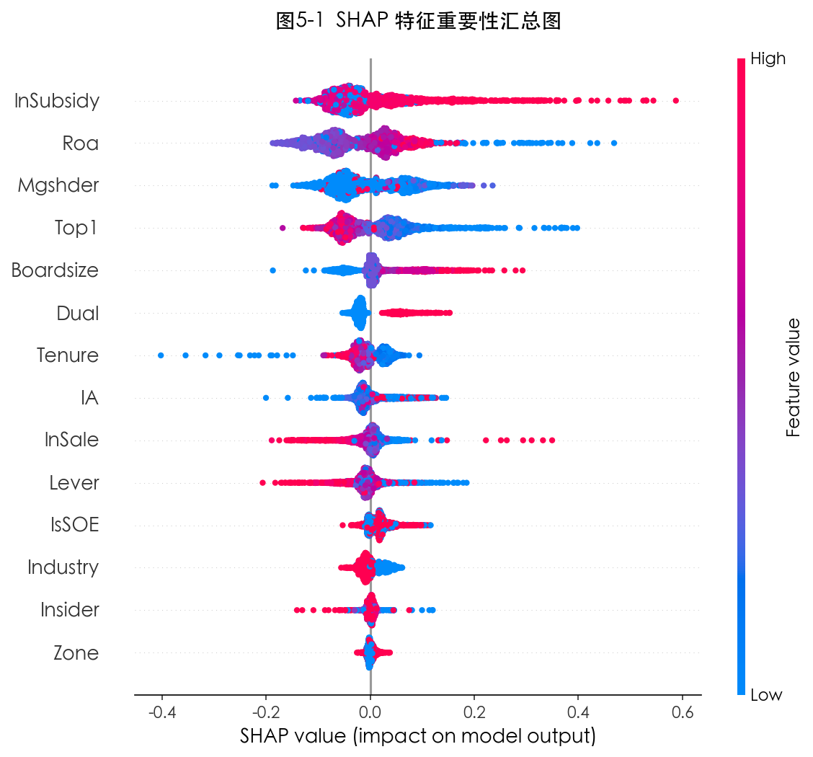
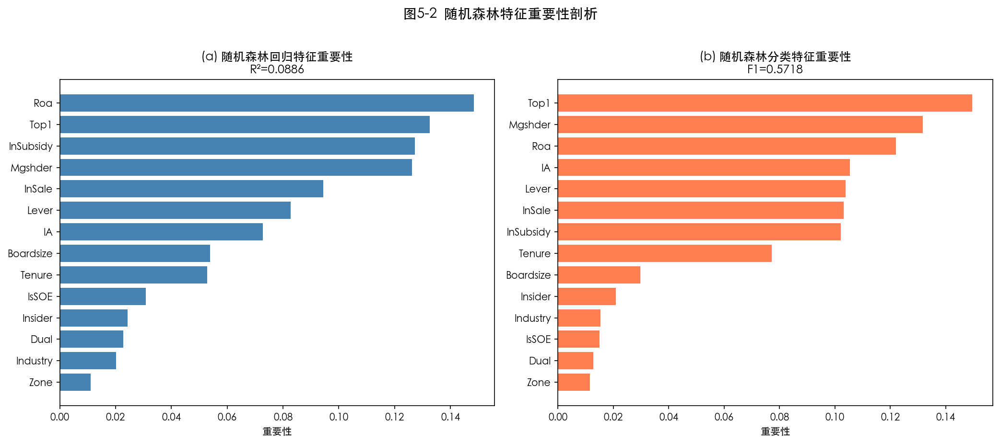
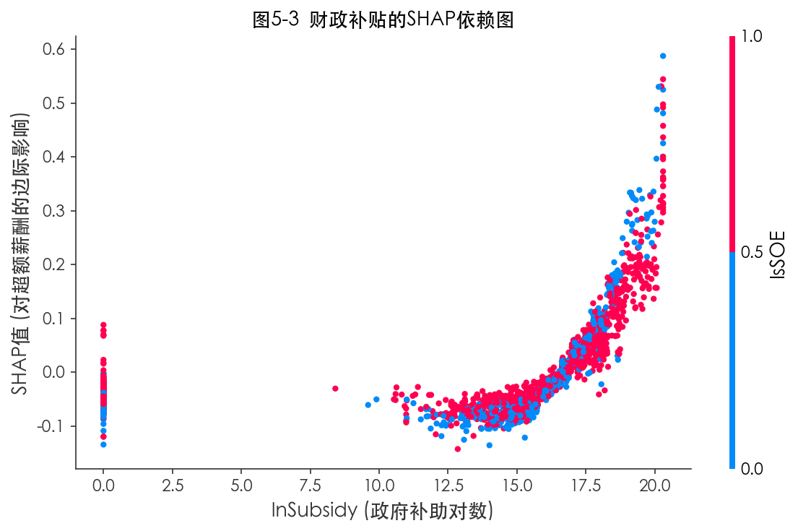
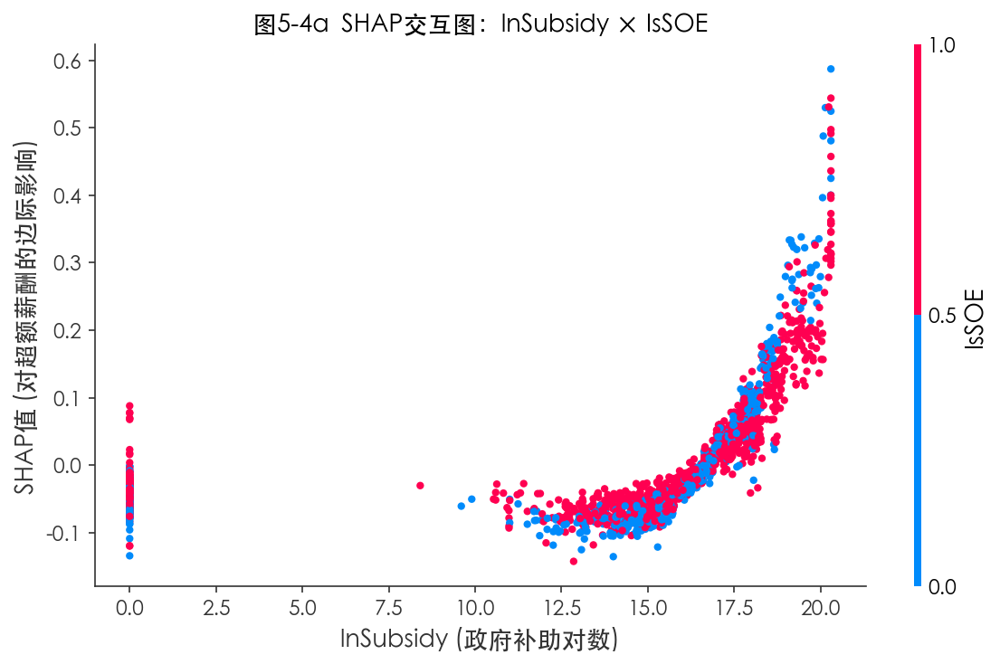
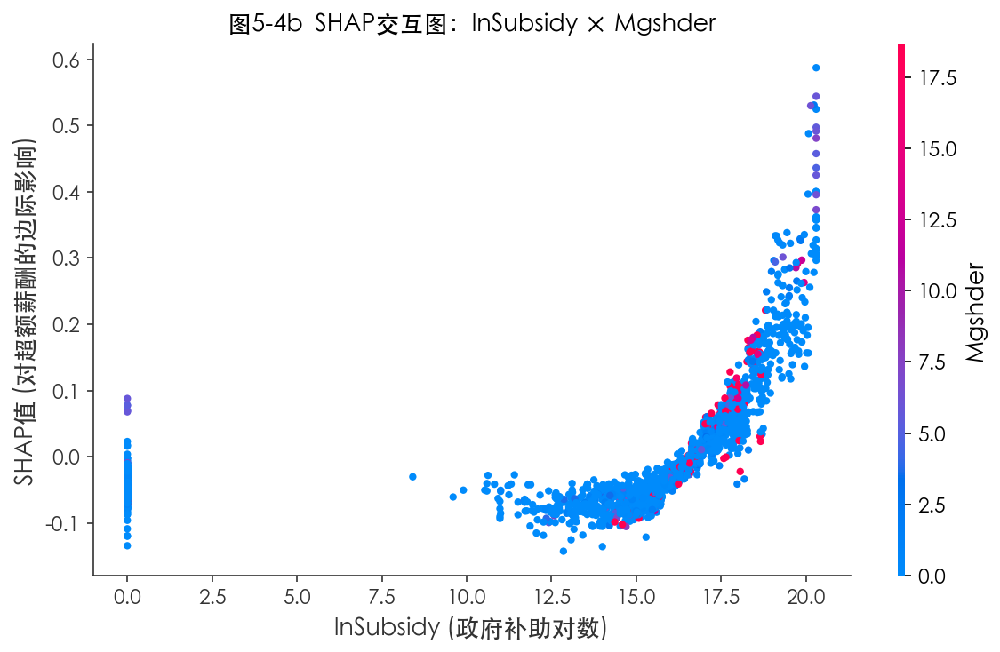
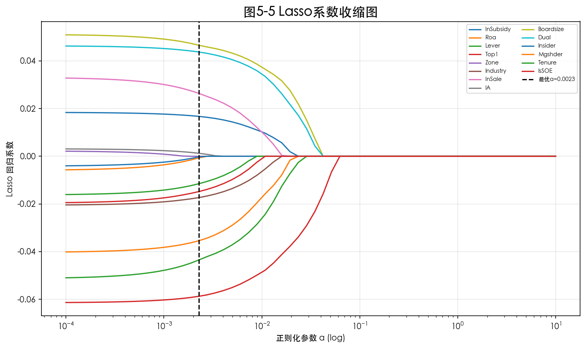
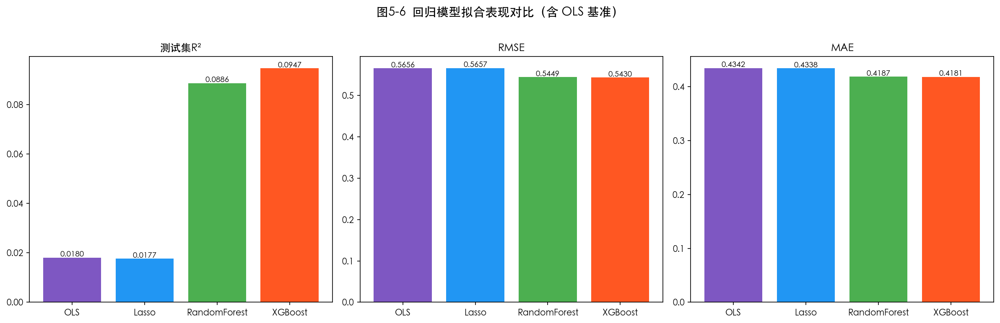

# 基于数据挖掘的上市公司财政补贴与高管超额薪酬研究

---

**摘　要**

近些年，财政补贴规模持续扩大，上市公司高管薪酬争议也明显升温。两者之间是否存在联系，既牵涉公司治理与代理成本，也关系财政资金能否真正用于预期目标。基于这一问题，本文以2003—2024年沪深A股非金融上市公司为样本，在管理者权力理论与代理理论框架下，考察财政补贴强度与高管超额薪酬之间的条件相关关系，并观察这一关系在不同制度情境中的表现。参照Core等（1999）的期望薪酬模型，本文将模型1的回归残差直接定义为高管超额薪酬（Overpay），对未披露政府补助的公司年度按0处理，据此构造核心解释变量$\ln(1+\text{Subsidy})$，并依次采用固定效应回归、工具变量、中介效应、异质性分析以及机器学习补充检验等方法开展分析。

结果显示，在公司和年份固定效应下，滞后一期财政补贴对高管超额薪酬的系数虽为正，但未达到常用显著性水平（$\beta = 0.0005$，$p = 0.591$），说明全样本平均直接关系并不稳固。进一步看，精炼双工具变量给出显著负值（$\beta = -0.0226$，$p = 0.034$），而深度滞后省均值工具变量给出显著正值（Partial F = 17.67，$\beta = 0.0546$，$p = 0.046$）；Lewbel、shift-share 与 Heckman 校正则提供了若干方向为正的补充结果，但统计支撑并不一致。由此可见，现有识别证据尚未形成一致支持。

未来补贴安慰剂仍显著，事件研究更适合作为描述性伴随证据；管理层权力中介效应未获稳健支持；机器学习结果表明，财政补贴变量在多变量竞争下仍保留一定信息含量，非线性模型虽优于线性基准，但增量解释力有限。由此，机器学习部分主要用于补充说明变量信息含量、局部结构和模型比较，不替代第四章的计量结论。总体而言，本文发现财政补贴与高管超额薪酬之间存在一定关联，但全样本平均直接效应不稳固，且对变量口径、样本设定和识别设计较为敏感，现有证据不足以支持无条件的强因果结论。

**关键词**：财政补贴；高管超额薪酬；管理层权力；中介效应；数据挖掘

---

## 第一章 绪论

### 1.1 研究背景与问题提出

党的二十大报告提出，中国经济已由高速增长阶段转向高质量发展阶段。放在财政政策语境中，这并不只是表述上的变化，而是意味着政府资金投向、政策工具使用方式以及绩效评估标准都在调整。财政补贴正是在这一背景下持续发挥作用：它既服务于战略性新兴产业培育、技术创新激励和企业纾困，也承担稳就业、稳预期等现实任务。根据CSMAR样本统计，2003年至2024年间，沪深A股上市公司（剔除金融行业）的政府补助总体规模持续扩大，获得补贴的企业数量和平均补贴强度都呈上升趋势。财政补贴早已不是个别企业偶然获得的政策资源，而是中国资本市场里绕不开的一类制度性变量。

同一时期，上市公司高管薪酬始终是公共舆论和学术讨论都难以回避的话题。对学界来说，它关系激励契约设计、代理成本控制和公司治理效率；对公众来说，它又直接牵连收入分配公平、财政资金使用效率以及市场信任基础。近年来，一个越来越常见的追问是：企业补贴规模上去了，高管薪酬会不会也跟着水涨船高？再往前一步说，那些原本应服务于产业发展和公共利益的政策性资源，会不会在信息不对称和治理约束不足的条件下，部分转化为管理层的私人收益？这已不只是舆论层面的争议，更是一个关乎财政资源配置效率与企业内部利益分配合理性的命题。

关于高管薪酬为何会偏离“合理水平”，现有研究大致有两条解释路径。“最优契约说”强调市场竞争与治理约束，认为薪酬是董事会与高管博弈后的均衡结果，最终应当反映高管的边际贡献；“管理权力说”则更关注现实中的治理偏差，认为在所有权与控制权分离的公司里，高管会借助对董事会构成、薪酬委员会安排以及信息披露节奏的影响，为自己争取超出正常水平的报酬。放到中国上市公司环境里，后一种解释往往更贴近现实。原因并不复杂：信息不对称较强、内部控制质量不均、独立董事独立性有限，这些因素都会放大管理层的自利空间。财政补贴作为外部资源进入企业后，增加了企业可支配资金，还有抬高高管薪酬议价能力的效果，甚至为寻租行为提供额外空间。本文的研究正是从这里切入。

围绕这一主题，本文集中回答四个相互关联的命题：财政补贴在控制企业基本特征后是否与高管超额薪酬存在显著稳健的正相关？管理层权力是否在两者之间承担中介角色，即补贴变化会不会通过改变权力结构传导到超额薪酬？这一关联在不同产权性质、行业管制强度和区域制度环境下是否呈现差异？机器学习补充分析能否从变量筛选、非线性与交互结构识别以及模型比较三个角度，为基准回归提供额外结构线索？

### 1.2 研究目的与研究意义

**理论意义**大体可以从三个方面来把握。本文把政府补贴这一政策变量纳入高管超额薪酬的讨论框架，把“外部资源输入”与“内部权力结构”放在同一条分析链上，不再只从企业内部激励或治理失灵出发看问题。测量层面，本文用 FA 构造管理层权力综合指标，并以双主成分 PCA 口径对照，尽量避免把某一种测度写成唯一正确的选择。技术路线上，固定效应、工具变量和中介检验等传统计量手段与 Lasso、随机森林、XGBoost 等数据挖掘工具并行使用，让线性识别与非线性观察形成互补。

**现实意义**则更贴近政策和市场实践。对财政监管部门而言，本文的证据提示，补贴与高管薪酬之间并不存在一条简单、稳定的线性链条，二者之间的联系会受到变量口径、治理约束和制度环境的共同塑造，这为补贴用途约束、事后审计和信息披露设计提供了参考。对资本市场监管者来说，机器学习补充部分识别出的高补贴区间和治理特征组合，可以作为筛查重点情境的辅助线索，但不宜直接替代正式监管判断。对投资者和公众而言，理解财政补贴与高管薪酬之间的潜在联系及其不稳定性，也有助于更完整地评估上市公司的治理质量以及财政资金的实际使用效率。

### 1.3 国内外研究现状

#### 1.3.1 高管超额薪酬的界定与测量方法

围绕高管超额薪酬的讨论，真正难的并不是看到“薪酬高”，而是区分其中哪些部分属于正常激励，哪些已经偏离了合理边界。早期文献常直接使用CEO绝对薪酬水平作为代理变量，这样做便于操作，却不容易把企业规模、业绩补偿和治理失灵带来的额外收益拆开。Bebchuk和Fried（2003）[1]的重要性，恰恰在于他们把视线从“薪酬高不高”转向了“薪酬契约是怎样形成的”。在其论述中，所有权分散的上市公司里，管理层可以通过影响董事会提名、薪酬委员会构成和条款设计，把本来应受监督的薪酬安排转化为自身议价能力的体现。由此，期权、退休福利和其他隐性收益也不再只是支付形式，而成了观察管理权力的窗口。

Core等（1999）[3]则把这一讨论推进到更便于实证操作的层面。其做法的核心是：利用公司治理、规模、业绩、风险、行业和年份等变量先估计一般条件下“应得”的薪酬，再把残差视为超额薪酬。这样一来，并不是把所有高薪都归入异常，而是先给出一个基准，再去看偏离基准的部分是否与权力结构有关。后来很多文献都沿用了这一残差口径，本文也是在这个框架上展开，只是在样本处理和变量设定上做了更贴合中国上市公司情境的调整。

放到中国样本里，这条思路也得到了进一步延展。Bu等（2019）[4]更关注高管与员工之间的薪酬差距，罗昆、曹光宇（2015）[14]则直接使用残差法刻画超额薪酬，二者切入点不同，但都把政府补贴纳入了解释框架，并得出补贴与高管额外收益存在正向联系的判断。吴妍（2019）[25]、张莉莉（2019）[26]等学位论文则提供了更贴近中国制度环境的变量设定和样本处理经验。它们至少说明，在中国资本市场语境下，把超额薪酬构造成一个可比较、可检验的经验变量，是行得通的。

#### 1.3.2 财政补贴的分配逻辑与公司行为效应

关于财政补贴本身，现有文献首先提醒我们，不宜把它理解成随机落入企业账户的一笔外部资金。唐清泉和罗党论（2007）[17]指出，中国上市公司的补贴分配同时带有产业政策导向和政治关联色彩，这意味着补贴能否获得，本身就已经嵌入了企业特征与制度关系的筛选过程。潘红波、夏新平和余明桂（2008）[18]进一步发现，政治关联更强的企业更容易拿到政策支持。在这种背景下，补贴既是财务资源，也是治理关系的一部分；它进入企业之后，改变的并不只是利润表，还包括管理层在企业内部的资源支配位置。

Jiang等（2025）[6]把视角继续往企业内部推进。他们关心的不是补贴有没有到账，而是到账以后资源怎样被消化，结果发现政府补贴与管理冗余显著正相关，而且这种关系在内部控制较弱、社会信任水平较低的企业里更明显。也就是说，补贴未必自动转化为效率改进，某些时候反而会变成管理层可以占用的松弛空间。李哲、王文翰和王遥（2022）[15]则从披露端给出另一条证据：部分企业会通过强化年报中的政策导向表述来提升补贴获取概率。这一点对本文尤其重要，因为它提示补贴的形成过程本身就带有信息策略和治理差异，而不只是单纯的政策执行结果。

#### 1.3.3 内部治理机制对补贴—薪酬关联的调节

补贴会不会外溢到薪酬端，很大程度上取决于企业内部有没有足够强的治理约束，这一点在已有文献中反复出现。步丹璐和王晓艳（2014）[16]发现，政府补助会扩大高管与员工之间的薪酬差距，而且在治理约束更弱的企业中表现得更明显。陈冬华、陈信元和万华林（2005）[19]讨论国有企业时也指出，显性薪酬一旦受到限制，管理层往往会转向在职消费、差旅费等更隐蔽的补偿渠道。把这两类证据放在一起看，补贴对薪酬的外溢并不一定表现为工资单上的直接增加，它也会沿着治理薄弱环节转化为更隐性的收益安排。

与此相对，卢锐、柳建华和许宁（2011）[20]发现，内控质量越高，高管薪酬对业绩变化越敏感，这意味着更完善的内部约束能够把薪酬重新拉回激励逻辑。罗进辉（2018）[21]从媒体监督角度得到的结论也相近：外部关注越强，薪酬与经营表现之间的对应关系越清晰，国有企业中这一作用尤其明显。对本文来说，这些文献最重要的启发在于，它们给出了一个判断标准：补贴能否推高异常薪酬，不只取决于补贴规模，还要看企业内外部监督能否切断管理层的自利空间。

王克敏、王华杰、李栋栋等（2018）[22]把视线进一步推到年报文本。他们发现，在业绩不佳或存在不利信息时，企业更倾向于使用复杂表达；而年报可读性越低的企业，高管超额薪酬也往往更高。这说明信息披露并不只是被动呈现事实，它还会成为提高解读成本、削弱外部监督的工具。连君莎（2020）[27]、章海浪（2021）[28]、徐坤（2021）[29]关于内部控制、薪酬公平和管理层语调的讨论，切入点各不相同，但归到一起都在补充同一件事：补贴、治理与薪酬之间的联系，需要放在信息透明度和监督强度的差异中理解。

#### 1.3.4 机器学习与数据挖掘方法在会计金融研究中的应用

机器学习文献与本文的关联，不在于它代表一种更“新”的技术标签，而在于它能处理线性回归不太擅长回答的问题。Li（2008）[2]较早把文本特征与经济后果联系起来，说明非结构化信息完全可以进入会计研究。Perols、Bowen、Zimmermann等（2017）[5]在财务舞弊识别中发现，随机森林、神经网络和Boosting等方法相较传统逻辑回归有更好的预测表现，关键不只是算法名称变了，而是模型能够自动捕捉更高阶的交互结构。陆瑶、张叶青、黎波和赵浩宇（2020）[23]将梯度提升树用于高管特征与公司业绩关系分析，也得到类似判断：某些变量的作用不是沿着线性方式平稳展开，而是在特定区间或特定组合下才明显增强。

后续文献又把这种思路扩展到文本分析和异常识别。马长峰、陈志娟和张顺明（2020）[24]在综述中指出，机器学习更适合承担探索性和补充性任务，而不宜直接替代因果推断。Rjiba、Saadi、Boubaker等（2021）[7]说明年报可读性会作用于权益资本成本，Bhattacharya和Mićković（2024）[8]、Ketelaar和Mićković（2025）[9]则将上下文语言学习与人工智能方法用于舞弊和异常识别。对本文而言，这些工作带来的启发很直接：当我们怀疑财政补贴与超额薪酬之间存在区间效应、交互结构或非线性关系时，机器学习可以作为补充观察工具，而不应替代基准回归的主体地位。

#### 1.3.5 研究述评与现有文献的局限

把前述文献合在一起看，现有讨论已经把几个基础问题铺得比较清楚：超额薪酬的界定与测量已有较稳定的处理路径，财政补贴是否会作用于高管收入在中国情境下也积累了不少证据，内部控制、媒体监督和披露复杂性等因素会改变补贴效应强弱，这一点同样得到了较多支持。

现有研究也留下了几处明显空白。不少文献仍以薪酬水平或薪酬差距作为结果变量，企业规模和绩效带来的正常差异容易被混入其中。管理层权力在补贴与薪酬之间的中介角色，虽有讨论，但结合固定效应与滞后设定进行系统检验的工作并不算多。机器学习相关工作多集中在舞弊识别或文本分类，真正用于分析补贴与超额薪酬非线性结构的案例仍相对少见。本文的设计，基本就是围绕这三处不足展开。

### 1.4 研究方法与技术路线

本文的技术路线并不是把多种手段简单堆在一起，而是让每一类工具分别回答不同层面的问题。前半部分先完成文献梳理与理论推演，把全文真正要检验的两条主线说清楚：一条是财政补贴与高管超额薪酬之间是否存在较稳定的联系，另一条是管理层权力是否在其中承担传导角色。随后进入基准计量部分，利用 CSMAR 面板数据和 Core 等（1999）[3]的框架构造超额薪酬变量，在公司和年份固定效应下检验滞后一期财政补贴的主效应，并观察这一联系在稳健性检验中能否维持。接着，再通过工具变量收紧识别边界，通过机制检验观察权力渠道是否存在，并借助异质性分析判断这种联系会不会随着制度情境变化而分化。机器学习部分放在最后，承担的是补充观察任务：Lasso 用来复核财政补贴在特征竞争下是否仍保留信息含量，随机森林和 XGBoost 用来识别更灵活模型中的非线性结构，并结合 SHAP 结果观察补贴变量在不同区间和情境下的局部表现。

---
## 第二章 理论分析与假设
### 2.1 概念界定

#### 2.1.1 财政补贴

在本文中，财政补贴主要指政府围绕特定政策目标向企业提供的资金支持。它可以表现为技术创新、节能减排等专项补助，也可体现为税收返还、政策性贷款贴息、研发费用加计扣除等形式。按照现行会计准则，政府补助通常区分为“与资产相关”和“与收益相关”两类：前者通过递延收益逐期摊销进入利润，后者则在满足确认条件后一次性或分期计入当期损益。也正因为如此，补贴的到账时间、规模和附带约束，会直接影响企业的资源配置方式和财务报表表现。

从经济性质看，财政补贴不是企业依靠市场竞争自行创造的经营收入，而是一种带有明确政策来源的外部资源输入。对上市公司来说，它既会改变利润表上的表现，也会影响管理层安排资源使用节奏的空间。在我国制度环境下，补贴的使用约束相对有限、事后跟踪并不总是充分，这使其不仅是财务变量，也容易成为管理层寻租的渠道。本文正是据此把财政补贴放在“补贴—治理—薪酬”关系链条的起点位置。但这种外部资源属性并不意味着补贴天然具有准自然实验意义，本文始终将其作为需要谨慎识别的解释变量来处理。

在具体度量上，本文采用企业年度政府补助金额经零值保留后的对数形式，即$\ln(1+\text{Subsidy})$，以平滑右偏分布并保留零补助公司年度观测。从时间演变来看，上市公司获得补贴的方式和规模都发生了明显变化。加入世界贸易组织后，政府补贴逐渐从早期更偏全面覆盖的价格补贴，转向技术创新、节能环保和战略性新兴产业导向更强的选择性支持。2007年《企业会计准则第16号——政府补助》的发布，又提高了补贴数据的可比性与可识别性，为后续大样本研究创造了条件。补贴项目越细、规模越大，申报和使用过程中的信息不对称也往往越突出，主管部门很难长期跟踪每笔补贴的真实去向，而企业高管在项目论证和资源配置中通常掌握更多内部信息。

#### 2.1.2 高管超额薪酬

本文所说的高管超额薪酬，并不是泛指“薪酬高”，而是指在控制企业规模、盈利能力、资产结构、区域与行业等客观因素之后，仍然高出正常基准的那部分报酬。这个概念真正关键的地方，不在于简单比较谁拿得更多，而在于先回答一个更基础的问题：在治理约束相对有效的情况下，高管通常应当获得怎样的回报？只有在这个基准先被建立起来之后，实际薪酬相对基准的偏离，才更容易被识别为异常成分。若某家公司高管薪酬持续高于这一基准，就可以把这部分偏离理解为代理成本的一种表现，即管理层借助信息优势或组织地位额外取得的收益。

在具体处理上，本文沿用 Core 等（1999）[3]的期望薪酬框架，先利用公司特征变量估计“正常薪酬基准”，再将模型残差直接作为超额薪酬。这样做的好处在于，企业规模、经营绩效等对薪酬的常规作用已经在期望薪酬模型中被吸收掉，残差因而更接近本文真正关心的异常部分。数值上，它反映的是实际薪酬相对拟合基准的偏离；在实证操作中，本文直接使用残差序列，不再额外做“实际值减预测值”的二次计算。由于该变量本身就是回归残差，其样本均值理论上接近0，因此本文也不再对其进行二次缩尾，以尽量保留原有统计含义。

与直接使用薪酬水平、薪酬差距或薪酬—绩效敏感性等指标相比，残差法的优势在于，它先给出一个相对客观的“应得薪酬”标尺，再讨论实际薪酬偏离这一标尺的程度。直接使用薪酬总额虽然操作更简洁，却难以区分哪些差异原本就应由规模、行业和经营绩效决定；使用高管与员工薪酬之比能够反映内部公平，却仍不容易把“应得”与“超得”切开；考察薪酬—绩效敏感性则更强调激励契约强弱，也不直接回答契约本身是否已被管理层扭曲。因此，本文最终把期望薪酬残差作为超额薪酬的经验代理变量。

#### 2.1.3 管理层权力

管理层权力（Managerial Power）在本文中指高管对企业关键决策施加实际影响的能力，尤其体现在薪酬契约、资源配置和战略议程上的控制程度。它并不是一个单一维度的变量，更接近需要由多项治理特征共同逼近的潜在构念。相关文献通常从三个方向刻画这一概念：一是由正式职位和董事会结构体现的**结构性权力**，例如两职合一、内部董事比例和董事会规模；二是由高管持股体现的**所有权权力**；三是由任期、声望和组织关系积累形成的**关系性权力**。

在中国上市公司环境下，管理层权力的形成逻辑往往更复杂。国有企业高管的权力基础，常常同时带有行政授权和市场地位两层属性；在民营企业中，大股东和实际控制人的意志又会深度塑造高管的实际空间。因此，同样归入“管理层权力”这一概念之下，不同所有制企业里的生成路径并不完全一致。结合数据可得性与实证可操作性，本文最终以 Dual、Boardsize、Insider 和 Mgshder 四个底层指标构造综合指数，希望在有限数据条件下尽量保留结构性权力和所有权权力两条主要来源。

还需要说明的是，在中国公司治理结构中，党委、董事会和管理层之间的权力边界并不总是清晰，国有企业尤其如此。许多真正影响高管地位的因素，比如党政体系中的关系网络、与上级主管部门的信任程度，在公开年报中几乎无法直接量化。也正因此，把“管理层权力”放到中国上市公司语境里理解，其复杂性明显高于西方主流文献中的标准设定。本文的处理方式保留了可操作性，但也意味着部分非正式权力渠道容易被低估，后文之所以进一步区分国有与民营企业，部分也是出于这一考虑。

### 2.2 理论基础

#### 2.2.1 管理者权力理论

管理者权力理论（Managerial Power Theory）是本文理解补贴与薪酬关系的重要起点。Bebchuk和Fried（2003）[1]之所以提出这一视角，正是因为“最优契约说”往往把董事会想得过于理性和中立。按最优契约逻辑，高管薪酬大致应当反映其边际贡献；而管理者权力理论提醒我们，现实中的董事会、薪酬委员会和经理人市场并不一定足以形成有效约束，高管往往深度介入薪酬安排的形成过程。薪酬合同不只是激励工具，也可以是权力结构的结果。Finkelstein（1992）[13]对高管权力作出的结构性权力、所有权权力、专家性权力和声望性权力划分，为后续经验工作提供了较清楚的操作框架。本文最终以两职合一、董事会规模、内部董事比例和高管持股四个指标刻画管理层权力，思路也延续了这种多方面分析。

如果进一步看传导路径，高管左右薪酬安排的方式并不只有一种。它既可体现为对董事会成员关系和表决环境的牵引，也可表现为薪酬结构设计得更复杂、外部更难识别，还可表现在对披露节奏和披露内容的控制上。Core等（1999）[3]将治理结构、较高薪酬和较差绩效放进同一分析框架，因此，这一视角后来常被用来讨论薪酬失衡。放到中国上市公司情境中，这套理论反而更有现实针对性。国有企业里，党委会、董事会和经理层之间的边界并不总是泾渭分明，高管任命和考核又带有组织体系色彩；民营企业中，“一股独大”、实控人与管理层关系密切、独立董事制衡不足等情况也并不少见。正式治理结构未必真的削弱高管影响，某些时候甚至会默许其在薪酬安排中的主导地位。

对本文而言，这一理论最关键的启发是：财政补贴并不只是额外资金，它还会改变高管在企业内部的相对地位。补贴的申请、沟通、协调和使用通常都离不开管理层深度参与，这会让高管在资源配置中的作用变得更加突出。当外部资源扩张与内部权力强化同时发生时，补贴就会转化为薪酬谈判中的额外筹码。也因此，本文不直接用薪酬水平讨论问题，而是转向期望薪酬残差，希望尽量把“补贴改善业绩后合理抬高薪酬”与“补贴扩大权力后带来异常收益”区分开来。Bu等（2019）[4]以及步丹璐、王晓艳（2014）[16]在治理较弱企业中观察到更强的正向关系，也与这一判断相互呼应。

#### 2.2.2 代理理论

代理理论（Agency Theory）为本文提供了另一条更偏“资源流向”的解释线索。Jensen和Meckling（1976）[10]把股东与管理层之间的关系概括为典型的委托—代理安排：股东让渡经营权，但并不能完整观察管理层的努力、动机和资源使用方式。只要监督不足，管理层就会把企业资源调到更符合自身利益的位置，由此产生道德风险和代理成本。落实到薪酬场景中，问题并不只是工资单上的数字偏高。显性的表现是高管通过调整绩效基准或薪酬结构，获得高于边际贡献的回报；更隐蔽的形式则包括在职消费、差旅安排和其他灰色收益；再往后一步，还会出现跨期扭曲，即把短期业绩做得更好看，把代价留给后续年份。这类现象在预算软约束较强的企业里往往更容易出现。

财政补贴进入企业以后，代理问题之所以会被放大，一个关键原因在于它容易冲淡“真实努力”和“外部资源”的边界。补贴常常会直接改善账面利润，如果薪酬契约没有把这部分政策性收益从绩效考核中剥离，高管就会在努力并未同步增加的情况下拿到更高报酬。已有研究在财务困境企业中观察到补贴增加与超额薪酬上升同时出现，这与代理理论强调的资源侵占逻辑是契合的。也正因为此，本文后文会进一步区分不同产权类型。国有企业面对国资监管、审计约束和薪酬管制，私营企业则更多依赖大股东约束和市场纪律，监督结构并不相同，补贴最终会不会外溢到薪酬端，自然也不宜预设为同一种强度。

放到中国制度环境下，委托—代理链条还常常是多层嵌套的。若把关系展开，通常会涉及公众、财政部门或国资监管机构、董事会以及高管团队等多个层级，每一层都掌握着不完整的信息。财政补贴本来是一种政策资源，但一旦进入企业，高管对其具体申报、使用和绩效完成情况往往了解得更多，上层监督者未必能及时、完整地把握真实情况。由此便会出现一个很现实的悖论：补贴越多，政策资源与经营努力越难分开，薪酬契约识别“谁创造了价值”的精度反而会下降。陈冬华、陈信元和万华林（2005）[19]关于名义限薪下隐性收益上升的证据，正好说明显性约束并不能自动消除代理空间。

代理理论里还有一个特别重要的概念，即薪酬—绩效敏感性（Pay-Performance Sensitivity）。理想的契约应当对真实经营绩效敏感，而不应对外部运气收益过度敏感。财政补贴恰恰容易打乱这点，因为它会直接抬高利润表现。若补贴改善账面收益后被机械纳入绩效薪酬基数，高管就会在没有额外努力的情况下同步受益。卢锐、柳建华和许宁（2011）[20]关于内控质量越高、薪酬—绩效敏感性越强的发现，也支持了这种理解。本文之所以采用期望薪酬残差（Overpay）而不是直接使用薪酬水平，本质上就是希望尽量先把“补贴带来正常绩效改善”这一层剥离出去，再观察异常收益部分是否仍然存在。

#### 2.2.3 信号传递理论

信号传递理论（Signaling Theory）为本文补上了外部信息环境这一层。Spence（1973）[11]讨论的核心问题是：在信息不对称条件下，掌握更多信息的一方会主动释放可观察信号，以引导外部对其质量的判断。后来这一框架常见于企业财务和资本市场研究，信息披露质量、股利政策和资本结构都可以放到类似逻辑里理解。落到本文的问题上，它至少能解释三件事。企业会主动向政府发送“我值得被支持”的信号，在文本披露中强化创新、环保和政策契合度表达，以提升补贴获取概率；研究表明，这类表述有时与补贴获取关系更紧密，却未必与真实绩效一一对应。补贴本身也向市场释放背书信号，投资者、合作伙伴乃至经理人市场都把它理解为政府对企业质量的认可。信息复杂化本身也是管理层的策略选择，披露越复杂，外部监督越难迅速识别薪酬安排中的异常部分。

因此，信号传递理论并不是单独解释补贴或薪酬，而是帮助本文把补贴申请、外部背书和信息复杂化这几个环节串起来。若某位高管被外界视为更擅长获取政策资源，其在经理人市场上的替代成本往往也会被抬高，这会反过来增强其在薪酬谈判中的筹码。这样一条“补贴—声誉—议价能力”的链条，与管理者权力理论强调的组织内部权力强化，其实是可以互相接上的。因此，H2 并不只是内部治理视角下的推论，同时也得到了外部信号层面的支撑。

再往前推一步，还会看到一个更现实的难题：政府当然希望把补贴投向真正高质量的企业，但在信息不对称环境下，更会组织材料、调整表达和发送信号的管理团队，往往能够以较低成本塑造“高质量企业”的外在形象。若如此，补贴流向就未必完全由真实效率决定，而在一定程度上取决于谁更擅长生产和管理这些信号。对本文来说，这一点尤其重要，因为信号生产能力往往与信息控制权相伴而生，而信息控制权又会回到薪酬谈判过程。李哲、王文翰和王遥（2022）[15]、王克敏等（2018）[22]分别从补贴获取和薪酬掩护两个端口提供了经验支持，也使这条逻辑链更具可讨论性。

#### 2.2.4 三种理论视角的比较与内在张力

把管理者权力理论、代理理论和信号传递理论放在一起，重点并不是让三套理论去重复解释同一个后果，而是看它们各自负责哪一层。若简化来看，代理理论回答的是“补贴在什么条件下会被管理层截留”，管理者权力理论回答的是“这种截留依托什么内部安排发生”，信号传递理论则补充了“外部信息环境为什么会放大或压缩这一过程”。因此，在本文里，这三种理论并不是相互竞争的替代解释，而是分别对应条件、传导路径和情境。

当然，这三套理论都不是专门为中国上市公司制度环境量身设计的，把它们直接照搬过来也并不稳妥。管理者权力理论常以股权相对分散为背景，而中国企业里真正重要的制衡来源很多时候是大股东或实际控制人；代理理论在国有企业里往往会面对多层委托链条，监督责任并不只发生在董事会一层；信号传递理论则默认高质量与低质量主体在发送信号上的成本差异较为稳定，但在披露监管尚不充分、地方政策竞争较强的市场环境中，这一前提未必总能成立。

因此，本文把这些理论更多作为分析参照，而不是把任何一条经验结果直接解释为对某个理论本身的证实或证伪。它们共同提供的是一个更适合展开实证分析的视角组合：既看到资源如何进入企业，也看到权力如何重新分布，还看到外部信息环境如何改变这一过程的可见性和强弱。

#### 2.2.5 中国制度情境下的理论延展

如果把中国制度环境纳入进来，上述三套理论就需要再做一层本土化理解。中国上市公司获得的财政补贴并不只是一般意义上的现金流入，它往往同时嵌在地方政府竞争、产业政策导向、国资监管层级差异和信息透明度不均衡这些条件里。也正因为如此，补贴既是资源输入，也是制度安排的一部分；它改变的不只是利润表数字，还会连带改变高管与政府、董事会以及外部投资者之间的相对关系。

在这一情境下，至少有三点值得特别注意。补贴分配通常带有较强的政策导向和选择性，高管在申报、沟通和协调中的作用往往会被放大。补贴到账后的约束和追踪在不同地区和所有制企业之间并不均衡，一些企业面对的外部监督明显更弱。加之地方政府之间存在持续的财政竞争，各地在招商引资过程中都会主动使用补贴工具，补贴分配既反映中央政策意图，也受到地方财政余裕和招商策略的影响。本文基准工具变量之所以采用“同城市同年度其他公司平均补助”，制度逻辑就来自这种地方财政政策的共同波动；后文补充的精炼双工具变量，则进一步借助行业政策倾向和省市层面的留一法波动削弱共同冲击。考虑到安慰剂检验还暴露出时变行业趋势的混淆风险，本文进一步采用两类补充识别策略：一是使用“滞后三期同省同年其他企业平均补助”作为深度滞后工具变量，以更大的时间距离削弱反向因果；二是参照 Lewbel（2012）的做法利用控制变量与一阶段残差乘积构造异方差内生工具变量，不依赖任何外部信息；此外还把企业早期补贴暴露度与全国（排除本省）行业补贴增量交互，构造 shift-share Bartik 工具变量，以利用行业外部冲击在不同既有暴露度企业之间的异质传导提取外生成分。

基于这一背景，“补贴带来资源扩张”与“补贴扩大管理层可支配空间”往往同时出现，因此本文不把补贴简单看作财务变量，而是把它视作同时牵动资源配置、权力结构和外部信号的复合性冲击。2015年以来国有企业薪酬制度改革又进一步加深了这种差异。中央出台的限薪令直接限制了央企和地方国企主要负责人的薪酬上限，并要求薪酬水平与企业绩效、职工收入挂钩。由此，即便国有企业获得较多补贴，其薪酬空间也会受到更强的行政约束；私营企业的薪酬安排则更多受市场机制和大股东意志支配，行政限薪的外部硬约束相对较弱。后文之所以将产权性质和行业监管强度作为重点异质性维度，理论动因也来自这里。

顺着这一层制度背景往下看，就能理解本文为什么把固定效应、中介效应和机器学习补充分析放进同一套研究设计里。固定效应和滞后设定更适合区分“企业原本就不同”和“补贴变动之后发生了什么”；中介效应检验侧重观察权力渠道是否存在传导线索；机器学习补充分析一方面复核财政补贴在多变量竞争下是否仍保留信息含量，另一方面观察高补贴区间、特定产权情境或特定治理结构下是否出现局部放大。第二章的理论推演，归根到底要解释的并不只是补贴为什么会推高超额薪酬，更是为什么这一关系未必会在所有企业中以同样的强度出现。

### 2.3 研究假设

以上讨论大致可以收束为一个分层框架：代理理论解释补贴为何会演化为管理层收益，管理者权力理论说明这种转化依赖什么内部结构，信号传递理论则补足外部信息环境怎样改变传导强弱。把三者合起来看，财政补贴就不只是资源变量，它还会通过组织地位、声誉背书和披露策略等渠道间接改写薪酬谈判的格局。后文控制变量的安排、中介检验的设计以及异质性维度的选择，基本都来自这一套推演。

基于上述理论分析，本文正式提出以下两个核心研究假设：

**假设H1（主效应假设）**：财政补贴与高管超额薪酬呈显著正相关关系。在信息不对称和薪酬约束不足的条件下，财政补贴扩大了企业可支配资源规模；如果薪酬治理机制无法对管理层的资源提取行为形成有效约束，这类外部资源就会与更高的高管超额薪酬相伴随。H1主要建立在代理理论的资源侵占逻辑之上：补贴进入企业账面之后，若激励契约没有把这部分“非经营性收益”从绩效薪酬基数中剔除，高管就会在未作出相应经营努力的情况下同步受益；同时，资源扩张也会放松董事会在薪酬谈判中的支付约束。基于此，H1预期财政补贴与高管超额薪酬之间存在正向联系，并在较严格的控制设定下仍能观察到这一关系。

**假设H2（中介效应假设）**：管理层权力在财政补贴与高管超额薪酬的关联过程中发挥中介作用。财政补贴的获取和使用会强化高管在资源配置中的核心地位，并进一步提升其在薪酬谈判中的议价能力；若控制管理层权力后，补贴对超额薪酬的直接效应收窄，且管理层权力的系数显著为正，则可将其视为存在间接传导的经验线索。H2主要来自管理者权力理论：补贴获取过程中高管的深度介入，会强化其在组织内部的议程设置权；补贴使用中的自由裁量越大，补贴资源被转化为薪酬议价筹码的空间也越大。需要说明的是，管理层权力的测度方式会直接左右机制检验的稳定性，正文优先报告 FA 综合口径结果，并以双主成分 PCA 口径作敏感性对照，对相关路径始终保持审慎解释。第四章的机制检验即围绕这一链条展开。

---

## 第三章 研究设计

### 3.1 研究思路与分析框架

本文的整体分析框架可以概括为两条主线。第一条主线关注财政补贴与高管超额薪酬之间是否存在稳定的条件相关关系；第二条主线关注这种关系是否会经由管理层权力部分传导。产权性质、行业管制强度等制度因素则作为情境变量，用于考察上述关系在不同环境下是否呈现差异。企业获得财政补贴后，最直接的变化是可支配资源增加，账面利润也会随之改善，这会改变薪酬安排所面临的资源约束；同时，补贴从申请到使用通常都需要高管深度介入，这又会提升其在组织内部的议程设置权和资源支配权。基于这一逻辑，后文的实证部分按四步展开：先用基准回归确认主关联，再用稳健性检验考察关系是否稳定；随后开展工具变量检验、中介效应分析和异质性分析，尽量把识别边界、传导路径与制度情境差异说明清楚；最后再借助机器学习补充复核财政补贴的信息含量，并观察线性模型未充分展开的非线性与交互结构。这样的安排旨在让不同方法分别回答不同问题，而不是简单叠加方法以堆砌结论。

### 3.2 样本选择与数据来源

本文以2003—2024年沪深A股上市公司为研究总体，所需数据均来自国泰安（CSMAR）数据库，包括政府补助数据、高管薪酬数据、公司财务数据（资产负债表、利润表）、公司治理数据（董事会构成、股权结构）以及企业性质和地区分类信息。样本清理的思路是先保证可比性，再处理极端值和缺失问题。金融行业被首先剔除，因为其资产负债结构和监管氛围与一般实业企业差异过大，直接并入会让薪酬与补贴的比较基准失真。研究期间被 ST、\*ST、S\*ST、SST、PT 或处于退市整理期的公司也不保留；由于仓库中未能获得更权威的独立 ST 状态维表，本文按合并后简称字段中的标签进行识别和剔除，目的是排除财务异常、退市风险和极端经营状态的样本，尽量保证不同公司之间薪酬与补贴比较基准的可比性。对于政府补助数据，若公司年度未披露补助项目，则该年度补助金额记为0，以避免零补贴观测在对数处理时被机械删除；少量负值观测在构造基准对数变量时按0处理。地区变量 Zone 的识别则优先依据公司注册地址，若注册地址信息不足，再辅以办公地址与城市字段识别所属省级区域，并据此按“东部=0、中西部=1”编码，以避免仅依赖不完整城市名单造成的系统错分。核心变量缺失严重的观测值随后被删除，主要连续变量（Overpay除外）则统一在1%和99%分位数处做Winsorize缩尾。原始薪酬数据沿用CSMAR数据库既有缩尾口径，不再重复处理。经过这些步骤，原始公司—年度观测为70,559条；剔除金融行业后为69,142条；再剔除特殊处理样本后为63,011条；满足关键变量完整要求的样本为52,980条；满足期望薪酬模型完整案例要求的样本为52,805条；纳入管理层权力底层指标后，可用于构造 Power 的样本为50,171条；在基准回归中加入滞后一期补助变量后，模型2样本为49,755条；在中介效应检验中要求 Overpay、Power 与滞后补助均完整后，统一样本为47,055条；机器学习部分在进一步要求国有企业标记变量 IsSOE 等特征完整后，可用样本为45,286条。附录表A-1进一步比较了最终保留样本与因治理特征、企业属性或国有企业标记变量缺失而未进入机器学习部分的样本，以说明样本收缩并未把样本结构完全改写。时间窗口的设定有明确依据：样本从2003年开始，一是因为加入世贸组织后上市公司信息披露逐步规范，CSMAR 在2003年前后的数据完整性和可比性明显改善；二是，政府补助作为独立披露科目的规范化要求也是在这一阶段逐步清晰的，若把更早期数据混入，口径差异会带来额外误差。样本截至2024年，既尽量利用最新可得数据，也为滞后变量保留了足够年份。剔除金融行业后，样本覆盖制造业、信息技术、批发零售、房地产、交通运输等17个行业门类，整体行业结构与沪深A股分布基本一致。

### 3.3 变量设定与说明

#### 3.3.1 被解释变量：高管超额薪酬（Overpay）

高管超额薪酬以期望薪酬模型的回归残差直接度量。本文以高管前三名薪酬总额的对数 lnSalary 为被解释变量，把企业规模 lnSale、盈利能力 Roa、无形资产占比 IA 和地区虚拟变量 Zone 作为核心解释变量，并控制行业和年份固定效应。对应的期望薪酬模型为：

$$
\ln\text{Salary}_{it} = \alpha_0 + \beta_1 \ln\text{Sale}_{it} + \beta_2 \text{Roa}_{it} + \beta_3 \text{IA}_{it} + \beta_4 \text{Zone}_{it} + \sum_{j=1}^{J} \delta_j \text{Industry}_{j} + \sum_{t=1}^{T} \gamma_t \text{Year}_{t} + \varepsilon_{it}
$$

期望薪酬模型的残差项 $\varepsilon_{it}$ 直接定义为 $\text{Overpay}_{it}$。之所以使用高管前三名薪酬总额而不是单个CEO薪酬，一方面是为了降低个别年份单一职位数据缺失或异常的影响；另一方面也因为中国上市公司重大决策往往由高管团队共同完成，团队层面的薪酬安排更能反映企业的整体激励取向。$\text{Overpay}_{it}>0$ 表示该企业高管获得了高于基准的薪酬，$\text{Overpay}_{it}<0$ 则表示其薪酬低于基准，这一情况在部分受薪酬管制约束的国有企业中并不少见。

#### 3.3.2 核心解释变量：财政补贴强度（lnSubsidy）

核心解释变量为企业年度政府补助金额的对数值：

$$\ln\text{Subsidy}_{it} = \ln\!\bigl(1+\max(\text{GovernmentSubsidy}_{it},0)\bigr)$$

这里沿用$\ln(1+\text{Subsidy})$作为基准口径，主要有两点考虑。政府补助金额分布右偏明显，企业间规模差异较大，对数化有助于压缩极端值带来的波动。同时，若直接对补助金额取自然对数，则零补助公司年度会被剔除，不利于在全体样本上讨论补贴强弱差异，以此为出发点，本文将未披露补助的公司年度记为0，并在基准回归中使用$\ln(1+\text{Subsidy})$。稳健性检验部分另行使用“仅对正补助取对数”的替代口径，以检验结论对补贴定义方式是否敏感。

#### 3.3.3 控制变量

控制变量分成两个阶段来设定，原因在于两阶段模型各自承担的任务并不一样。第一阶段的目标，是尽量准确地估计“合理薪酬”或“期望薪酬”，因此控制项要尽量覆盖那些决定正常薪酬基准的公司特征，包括**企业规模**（$\ln\text{Sale}$）、**盈利能力**（Roa）、**无形资产占比**（IA）和**地区虚拟变量**（Zone），并进一步控制行业和年份效应，把规模、业绩、资产结构以及地区薪酬基准这些常规差异尽量吸收进期望薪酬模型。

第二阶段的关注点转向财政补贴与“超额薪酬”之间的联系，因此控制项收缩为更直接关系到薪酬契约合理性、监督强度和寻租空间的变量，即**盈利能力**（Roa）、**财务杠杆**（Lever）和**第一大股东持股比例**（Top1），同时统一纳入公司和年份固定效应。这样安排的逻辑比较直接：财务杠杆对应债务约束，大股东持股比例代表外部监督能力，公司固定效应和年份固定效应则分别吸收稳定个体差异与共同宏观冲击。无形资产占比对应企业对知识资本的依赖程度；Zone 依据注册地址优先、办公地址补充的规则识别企业所属东中西部地区，但由于它在公司层面基本稳定，在第二阶段会被公司固定效应吸收，因此不再单独进入方程。主要变量定义汇总见表3-1。

**表3-1 主要变量定义**

<table>
  <thead>
    <tr>
      <th>变量名</th>
      <th>符号</th>
      <th>定义</th>
    </tr>
  </thead>
  <tbody>
    <tr>
      <td>高管超额薪酬</td>
      <td>Overpay</td>
      <td>期望薪酬模型回归残差，正值表示薪酬高于基准</td>
    </tr>
    <tr>
      <td>财政补贴强度</td>
      <td>lnSubsidy</td>
      <td>ln(1+政府补助)，未披露补助记为0</td>
    </tr>
    <tr>
      <td>管理层权力</td>
      <td>Power</td>
      <td>基于 Dual、Boardsize、Insider、Mgshder 四项指标的FA综合得分</td>
    </tr>
    <tr>
      <td>业绩</td>
      <td>Roa</td>
      <td>净利润/总资产</td>
    </tr>
    <tr>
      <td>财务杠杆</td>
      <td>Lever</td>
      <td>总负债/总资产</td>
    </tr>
    <tr>
      <td>大股东持股</td>
      <td>Top1</td>
      <td>第一大股东持股比例（%）</td>
    </tr>
    <tr>
      <td>地区</td>
      <td>Zone</td>
      <td>依据注册地址/办公地识别，中西部地区=1，东部地区=0</td>
    </tr>
    <tr>
      <td>企业规模</td>
      <td>lnSale</td>
      <td>营业收入自然对数</td>
    </tr>
    <tr>
      <td>无形资产占比</td>
      <td>IA</td>
      <td>无形资产/总资产</td>
    </tr>
  </tbody>
</table>

#### 3.3.4 路径变量：管理层权力（Power）

管理层权力变量 Power 在本文中主要作为中介变量使用。正文主线将其定义为基于 Dual、Boardsize、Insider 和 Mgshder 四项治理指标构造的 FA 综合得分，用于刻画高管在正式职位、董事会结构与所有权层面的综合影响力。有关 Power 的具体构成过程以及 FA/PCA 的诊断结果，统一放在第四章中介效应分析部分展开。

### 3.4 模型设定

#### 3.4.1 第一阶段：期望薪酬模型
期望薪酬模型直接沿用Core等（1999）[3]的基本思路：

$$\ln\text{Salary}_{it} = \alpha_0 + \beta_1 \ln\text{Sale}_{it} + \beta_2 \text{Roa}_{it} + \beta_3 \text{IA}_{it} + \beta_4 \text{Zone}_{it} + \sum_{j=1}^{J} \delta_j \text{Industry}_{j} + \sum_{t=1}^{T} \gamma_t \text{Year}_{t} + \varepsilon_{it} \tag{1}$$

其中，$\ln\text{Salary}_{it}$ 表示第 $i$ 家公司第 $t$ 年高管前三名薪酬总额的对数值，$\varepsilon_{it}$ 为随机扰动项。残差序列 $\varepsilon_{it}$ 直接作为超额薪酬的代理变量，即 $\text{Overpay}_{it} \equiv \varepsilon_{it}$，正值表示实际薪酬高于基准水平，负值则相反。

#### 3.4.2 第二阶段：基准回归模型

基准回归阶段以超额薪酬（Overpay）为被解释变量，将滞后一期财政补贴强度（$\ln\text{Subsidy}_{i,t-1}$）作为核心解释变量，并加入企业层面控制变量、公司固定效应和年份固定效应：
$$\text{Overpay}_{it} = \alpha + \beta_1 \ln\text{Subsidy}_{i,t-1} + \beta_2 \text{Roa}_{it} + \beta_3 \text{Lever}_{it} + \beta_4 \text{Top1}_{it} + \mu_i + \lambda_t + \varepsilon_{it} \tag{2}$$

这里的 $\mu_i$ 表示公司固定效应，$\lambda_t$ 表示年份固定效应。本文最关注的是 $\beta_1$ 的方向、大小及其统计显著性：如果 $\hat{\beta}_1 > 0$ 且统计显著，就说明在控制公司层面稳定差异和年度共同冲击之后，补贴增加仍与更高的超额薪酬相伴随。核心解释变量使用滞后一期补助，是为了尽量把时间顺序固定为“补贴在前、薪酬在后”，以减轻同期反向因果带来的干扰。

#### 3.4.3 工具变量模型

考虑到财政补贴容易受到选择性配置和反向因果的干扰，本文在公司固定效应框架下使用两阶段最小二乘法（2SLS）开展工具变量检验。第一层识别仍沿用“公司固定效应 + 年份固定效应”的常规 FE-2SLS 设定。基准工具变量设定为“同城市同年度其他公司平均补助”的滞后一期值，即 $IV_{\ln\text{Subsidy}_{i,t-1}}$，其制度逻辑是同城企业会共同受到地方财政政策波动影响；同时，为减弱本地共同冲击和本省共同政策环境直接进入误差项的风险，后文又补充构造了两个更强的精炼工具变量：一是“同行业同年排除本省后的其他企业平均补助”滞后一期，二是“同省同行业同年排除本市后的其他企业平均补助”滞后一期。二者分别利用行业政策倾向与本地化财政配置的留一法波动，为后文的过度识别检验提供额外约束。与基准回归模型一致，常规工具变量模型仍控制 Roa、Lever 和 Top1，并同时纳入公司固定效应与年份固定效应。以单工具设定表示时，第一阶段回归写为：

$$\ln\text{Subsidy}_{i,t-1} = \alpha + \pi_1 IV_{\ln\text{Subsidy}_{i,t-1}} + \pi_2 \text{Roa}_{it} + \pi_3 \text{Lever}_{it} + \pi_4 \text{Top1}_{it} + \mu_i + \lambda_t + \nu_{it} \tag{3}$$

其中，$IV_{\ln\text{Subsidy}_{i,t-1}}$ 用来预测企业个体滞后一期财政补贴中的外生成分；若工具变量有效，则 $\pi_1$ 应显著不为0。第二阶段则使用第一阶段得到的拟合值 $\widehat{\ln\text{Subsidy}}_{i,t-1}$ 解释超额薪酬：

$$\text{Overpay}_{it} = \alpha + \beta_1 \widehat{\ln\text{Subsidy}}_{i,t-1} + \beta_2 \text{Roa}_{it} + \beta_3 \text{Lever}_{it} + \beta_4 \text{Top1}_{it} + \mu_i + \lambda_t + \varepsilon_{it} \tag{4}$$

若第二阶段中的 $\beta_1$ 在统计上显著，则可将财政补贴的影响理解为在该组工具变量识别下更接近因果的条件相关结果；反之，则说明即便利用地方财政政策与行业政策的共同波动提取外生成分，补贴对超额薪酬的影响仍不稳健。

为进一步强化内生性处理，本文在三套常规工具变量之外，补充引入两类识别逻辑不同的方案。其一，采用“滞后三期同省同年其他企业平均补助”作为深度滞后工具变量，以更大的时间距离削弱反向因果；其二，参照 Lewbel（2012）的做法，利用控制变量去中心化值与一阶段 OLS 残差的乘积构造工具变量矩阵，仅在存在条件异方差的情形下有效，不依赖任何外部信息来源。

此外，本文还以企业早期补贴暴露度与“全国（排除本省）行业补贴均值年度增量”交互构造 shift-share Bartik 工具变量，采用“公司固定效应 + 年份固定效应”框架估计，观察预定暴露度差异能否为补贴提供额外外生成分。另需说明的是，Heckman 两步法并不用于替代基准回归，而是专门用于只保留正补助样本的替代口径回归：第一步以正补助口径变量 lnSubsidy_pos_l1 是否可观测构造选择方程，第二步再将逆米尔斯比率纳入公司和年份固定效应回归，以检验“仅正补助样本”结果是否主要由样本选择偏差驱动。

考虑到现有材料不足以支撑严格的准自然实验识别，本文还补充实施两类不依赖外部政策库的辅助诊断：一是使用未来一期和未来两期补贴替代当前解释变量的安慰剂检验，并比较“公司固定效应 + 年份固定效应”与“公司固定效应 + 行业×年份固定效应”两种设定，以观察前瞻性相关是否随着行业年度共同冲击的吸收而减弱；二是围绕首次大额补贴暴露年份构造事件时间虚拟变量，检验大额补贴发生前后的动态模式是否伴随显著预趋势。两类检验都只用于刻画识别局限和动态关联，不被解释为独立的因果估计。

#### 3.4.4 基于管理层权力的机制检验

在完成基准回归与工具变量检验之后，本文再按照Baron和Kenny（1986）[12]的经典中介分析思路，检验财政补贴是否会经由管理层权力这一渠道影响超额薪酬，并辅以 Sobel 检验和公司层面 Cluster Bootstrap 作为补充统计检验。由于主效应本身并不稳固，后文对这部分结果更强调“路径线索”，而不将其解释为严格的经典中介识别。正文主线采用 FA 口径的管理层权力指标 Power，同时以双主成分 PCA 口径作测度敏感性对照。为与正文呈现顺序保持一致，机制检验模型依次编号为模型3至模型5，对应的三步回归如下：

**第一步**（估计总效应 $c$，对应方程2）：

$$\text{Overpay}_{it} = \alpha + c \cdot \ln\text{Subsidy}_{i,t-1} + \boldsymbol{\beta}'\mathbf{X}_{it} + \mu_i + \lambda_t + \varepsilon_{it} \tag{5}$$

**第二步**（估计路径 $a$，补贴对权力的影响）：
$$\text{Power}_{it} = \alpha + a \cdot \ln\text{Subsidy}_{i,t-1} + \boldsymbol{\beta}'\mathbf{X}_{it} + \mu_i + \lambda_t + \varepsilon_{it} \tag{6}$$

**第三步**（同时纳入补贴和权力，估计控制 Power 后的补贴系数 $c'$ 与路径 $b$）：

$$\text{Overpay}_{it} = \alpha + c' \cdot \ln\text{Subsidy}_{i,t-1} + b \cdot \text{Power}_{it} + \boldsymbol{\beta}'\mathbf{X}_{it} + \mu_i + \lambda_t + \varepsilon_{it} \tag{7}$$

其中，模型3对应统一样本上的总效应检验，模型4对应路径 $a$，模型5另外给出路径 $b$ 与控制 Power 后的直接效应 $c'$；$\mathbf{X}_{it}$ 为控制变量向量。间接效应记为 $a \times b$，Sobel 检验统计量为：

$$z_{\text{Sobel}} = \frac{a \times b}{\sqrt{b^2 s_a^2 + a^2 s_b^2}}$$

其中 $s_a$ 和 $s_b$ 分别是路径系数 $a$ 与 $b$ 的标准误。鉴于本文主效应本身并不稳固，且 Power 仅为经验性综合测度，本文主要依据间接效应的 Bootstrap 95% 置信区间是否跨越0来判断是否存在统计上的间接传导线索，并将路径 $a$、路径 $b$ 的方向与显著性作为辅助证据；若 Bootstrap 区间跨越0，则不将 H2 视为得到支持。

### 3.5 机器学习方法

#### 3.5.1 数据划分、预处理与评价指标

机器学习拓展部分不承担因果识别，而是围绕三个补充问题展开。第一，财政补贴在与其他财务、治理和企业属性变量共同进入模型时，是否仍保留独立的信息含量；这一问题主要由 Lasso 和特征重要性排序回答。第二，线性平均斜率之外是否存在值得留意的非线性区间差异和局部交互结构；这一问题主要由随机森林、XGBoost 及其 SHAP 解释回答。第三，更灵活的模型在样本外拟合上是否优于线性基准；这一问题由回归和分类模型的统一对比回答。由此，机器学习部分的功能是补充识别“变量信息含量”“结构形态”和“预测表现”三类问题，而不是检验第四章中的因果命题。

样本使用45,286个公司年度观测，差异主要来自国有企业标记变量 IsSOE 等输入特征的缺失。样本按公司分组，利用 GroupShuffleSplit 以8:2比例划分为训练集（36,392条）和测试集（8,894条），确保同一公司的全部年度观测只落在一端，避免公司内序列相关把模型性能抬高。输入特征共14个，涵盖财政补贴（lnSubsidy）、财务特征（Roa、Lever）、治理结构（Top1、Boardsize、Dual、Insider、Mgshder）、高管个人特征（Tenure）以及企业属性（Zone、Industry、lnSale、IA、IsSOE）。为便于比较不同模型对样本结构的刻画能力，本文还将 $\text{Overpay} > 0$ 构造成二元标签；正类22,350个、负类22,936个，比例约为49.35%，不存在明显失衡，因此未额外引入 SMOTE 等过采样步骤。

在输出端，回归设定直接预测连续型超额薪酬（Overpay），这是本章的主任务；二元标签只承担辅助区分任务，用于比较模型能否识别“正超额薪酬”和“非正超额薪酬”的样本差异。所有连续型特征在进入正则化线性模型前都通过 StandardScaler 做零均值、单位方差标准化；树模型对特征尺度不敏感，因此不做这一步。模型表现同时报告固定测试集结果和按公司分组实施 GroupKFold 的交叉验证结果，其中前者用于模型间横向比较，后者用于补充观察稳定性。回归任务的核心判断指标是测试集 $R^2$，RMSE 和 MAE 用于补充观察误差规模，5折CV $R^2$ 用于查看稳定性；分类任务的核心判断指标是 ROC-AUC，Accuracy、Precision、Recall 与 F1 仅作辅助参照。需要补充说明的是，分类模型在训练阶段的参数搜索以 F1 为准，以兼顾正类识别质量；最终模型比较和表5-2的解读仍以 ROC-AUC 为主。Lasso 的惩罚参数选择也已经改为按公司分组的 GroupKFold 网格搜索，以保证训练集划分、调参与性能评估口径一致。

#### 3.5.2 随机森林方法

随机森林（Random Forest）是一种基于 Bagging 思想的集成学习方法，其核心做法是在自助抽样得到的多个子样本上分别训练决策树，再对各树的预测结果取平均或投票。与线性模型相比，随机森林无需预先设定变量之间的函数形式，能够自动刻画非线性关系和高阶交互，同时还能基于节点不纯度下降给出特征重要性排序。本文引入随机森林，并不是为了验证第四章固定效应模型的函数形式是否“正确”，而是把它作为一个非线性基准模型：一方面观察财政补贴及治理变量在更灵活的树模型里是否仍位于重要位置，另一方面为后文比较“线性模型”和“非线性模型”的拟合差异提供参照。

#### 3.5.3 SHAP值解释方法

SHAP（SHapley Additive exPlanations）方法建立在合作博弈中的 Shapley 值思想之上，其基本目标是把模型对单个样本的预测结果分解为各输入特征的局部贡献值之和。它本身不是独立模型，而是一套解释工具。对于树模型而言，SHAP 不仅能给出总体的重要性排序，还能通过依赖图和交互图展示变量作用在不同区间、不同样本条件下如何变化。本文使用 SHAP 的目的，不是把其当作因果识别工具，而是把随机森林和 XGBoost 这类“黑箱”模型的结果重新拆解为可读的结构线索，以辅助判断财政补贴是否存在非线性作用，以及其局部贡献是否会随产权性质或权力相关特征而改变。考虑到 SHAP 计算开销较高，图形展示基于测试集子样本，解读重点放在整体形态和方向，不作精确统计推断。

#### 3.5.4 Lasso回归方法

Lasso 回归在最小二乘目标函数中加入 $L_1$ 惩罚项，通过压缩系数并允许部分系数收缩为0来实现变量筛选与稀疏化估计。与普通线性回归相比，Lasso 更适合回答“在多个候选特征同时竞争时，哪些变量仍会被模型保留下来”这一问题。本文将 Lasso 用作变量筛选层面的稳健性补充工具：如果财政补贴变量在正则化筛选后仍被保留，就说明其信息含量并未完全被其他财务或治理变量替代。需要强调的是，Lasso 在本文中的任务不是验证第四章回归形式，也不是追求最强预测表现；阅读其结果时，最关键的判断标准是 lnSubsidy 是否被压缩为零，而不是它的拟合优劣是否超过树模型。

#### 3.5.5 XGBoost方法

XGBoost（Extreme Gradient Boosting）是一种基于 Boosting 思想的集成树模型，其通过逐步拟合前一轮模型的残差来不断提升预测精度，并在目标函数中同时加入正则化项以抑制过拟合。相较于随机森林，XGBoost 往往对复杂非线性关系和交互结构具有更强的刻画能力，也更适合与 SHAP 结合开展局部解释。本文将 XGBoost 作为机器学习拓展分析中的核心树模型，一方面用于比较其与线性基准、Lasso 及随机森林在拟合表现上的差异，判断更灵活的非线性模型是否真的带来增量解释力；另一方面借助 SHAP 结果识别财政补贴在高补贴区间和特定治理情境下呈现出的局部结构变化。因此，XGBoost 在本文中的定位是“主要的非线性比较模型”和“SHAP 解释的载体”，而不是第四章因果回归的替代品。

---

## 第四章 实证分析
### 4.1 描述性统计

表4-1报告了主要变量的描述性统计结果。剔除金融行业后，样本为69,142条；进一步按公司简称标签剔除 ST、\*ST、S\*ST、SST、PT 及退市整理期样本后，剩余63,011条；在关键变量完整且政府补助缺失按0处理的口径下，可用于基础统计分析的样本为52,980条；在期望薪酬模型中，因企业规模变量 lnSale 与无形资产占比 IA 缺失，最终可用样本为52,805条；纳入管理层权力指标所需底层变量后，可用于构造 Power 的样本为50,171条；在基准回归模型中构造滞后一期补助后，模型2样本为49,755条；在中介效应检验中要求 Overpay、Power 与滞后补助均完整后，统一样本为47,055条。

**表4-1 主要变量描述性统计**

<table>
  <thead>
    <tr>
      <th>变量</th>
      <th>N</th>
      <th>均值</th>
      <th>中位数</th>
      <th>标准差</th>
      <th>最小值</th>
      <th>最大值</th>
    </tr>
  </thead>
  <tbody>
    <tr><td>高管前三名薪酬总额（元）</td><td>52,980</td><td>2.64×10^6</td><td>1.92×10^6</td><td>3.05×10^6</td><td>10,000.00</td><td>1.18×10^8</td></tr>
    <tr><td>政府补助（元）</td><td>52,980</td><td>5.00×10^7</td><td>1.09×10^7</td><td>4.33×10^8</td><td>-6.33×10^7</td><td>8.41×10^10</td></tr>
    <tr><td>财政补贴强度（lnSubsidy=ln(1+Subsidy)）</td><td>52,980</td><td>14.6590</td><td>16.2039</td><td>5.2503</td><td>0.0000</td><td>20.3015</td></tr>
    <tr><td>高管前三名薪酬对数</td><td>52,980</td><td>14.4341</td><td>14.4653</td><td>0.8354</td><td>9.2103</td><td>18.5820</td></tr>
    <tr><td>企业规模（lnSale）</td><td>52,972</td><td>21.4579</td><td>21.3015</td><td>1.4521</td><td>18.3829</td><td>25.6603</td></tr>
    <tr><td>无形资产占比（IA）</td><td>52,813</td><td>0.0444</td><td>0.0310</td><td>0.0507</td><td>0.0000</td><td>0.3227</td></tr>
    <tr><td>超额薪酬（Overpay）</td><td>52,805</td><td>0.0000</td><td>−0.0147</td><td>0.5840</td><td>−3.3962</td><td>3.7591</td></tr>
    <tr><td>管理层权力（Power，FA）</td><td>50,171</td><td>0.0000</td><td>0.0386</td><td>1.0000</td><td>−6.3992</td><td>4.8548</td></tr>
    <tr><td>业绩（Roa）</td><td>52,980</td><td>0.0351</td><td>0.0363</td><td>0.0615</td><td>−0.2340</td><td>0.1936</td></tr>
    <tr><td>财务杠杆（Lever）</td><td>52,980</td><td>0.4227</td><td>0.4167</td><td>0.2062</td><td>0.0517</td><td>0.8947</td></tr>
    <tr><td>第一大股东持股比例（Top1，%）</td><td>52,980</td><td>34.5275</td><td>32.2700</td><td>15.0152</td><td>8.4800</td><td>74.3000</td></tr>
    <tr><td>地区（Zone，中西部=1）</td><td>52,980</td><td>0.2925</td><td>0.0000</td><td>0.4549</td><td>0</td><td>1</td></tr>
  </tbody>
</table>

注：政府补助和高管薪酬单位为元，Overpay直接使用期望薪酬模型残差，不再开展二次缩尾；其余连续变量在1%/99%分位数处开展Winsorize缩尾处理。未披露政府补助的公司年度记为0，因此财政补贴强度变量 lnSubsidy 的最小值为0。

### 4.2 相关性分析

在开展基准回归之前，本文对主要解释变量开展了皮尔逊相关性分析和方差膨胀因子（VIF）检验，以排除多重共线性干扰。

**表4-2 主要变量相关系数矩阵**

<table>
  <thead>
    <tr>
      <th></th>
      <th>lnSubsidy</th>
      <th>lnSale</th>
      <th>Roa</th>
      <th>IA</th>
      <th>Lever</th>
      <th>Top1</th>
      <th>Zone</th>
    </tr>
  </thead>
  <tbody>
    <tr><td>lnSubsidy</td><td>1</td><td>—</td><td>—</td><td>—</td><td>—</td><td>—</td><td>—</td></tr>
    <tr><td>lnSale</td><td>0.2164</td><td>1</td><td>—</td><td>—</td><td>—</td><td>—</td><td>—</td></tr>
    <tr><td>Roa</td><td>0.0786</td><td>0.1040</td><td>1</td><td>—</td><td>—</td><td>—</td><td>—</td></tr>
    <tr><td>IA</td><td>0.0265</td><td>0.0084</td><td>−0.0455</td><td>1</td><td>—</td><td>—</td><td>—</td></tr>
    <tr><td>Lever</td><td>−0.0478</td><td>0.4563</td><td>−0.3683</td><td>0.0342</td><td>1</td><td>—</td><td>—</td></tr>
    <tr><td>Top1</td><td>−0.0326</td><td>0.1820</td><td>0.1516</td><td>0.0085</td><td>0.0389</td><td>1</td><td>—</td></tr>
    <tr><td>Zone</td><td>−0.0478</td><td>0.0006</td><td>−0.0315</td><td>0.0877</td><td>0.0889</td><td>0.0129</td><td>1</td></tr>
  </tbody>
</table>

注：样本量为52,805（完整样本，缩尾处理后）。相关系数中绝对值最高的是企业规模变量 lnSale 与财务杠杆变量 Lever 之间的0.4563，其余变量两两相关系数整体不高，未显示出严重共线性问题。

**表4-3 方差膨胀因子（VIF）检验**

<table>
  <thead>
    <tr>
      <th>变量</th>
      <th>VIF</th>
    </tr>
  </thead>
  <tbody>
    <tr><td>lnSubsidy</td><td>1.0903</td></tr>
    <tr><td>lnSale</td><td>1.5588</td></tr>
    <tr><td>Roa</td><td>1.3209</td></tr>
    <tr><td>IA</td><td>1.0112</td></tr>
    <tr><td>Lever</td><td>1.6774</td></tr>
    <tr><td>Top1</td><td>1.0615</td></tr>
    <tr><td>Zone</td><td>1.0192</td></tr>
  </tbody>
</table>

注：所有变量 VIF 均低于经验阈值10，最大值约为1.68，均值约为1.25，多重共线性风险整体较低。进一步看，基于模型1残差实施的 BP 异方差检验显著拒绝同方差原假设（p < 0.001），基于模型2口径实施的 Wooldridge 面板序列相关检验也显著（p < 0.001），这意味着若继续沿用常规标准误，推断结果容易失真。基于这一点，后文的基准回归、工具变量检验、机制检验、稳健性检验和异质性分析统一采用公司层面的聚类稳健标准误。

从数据形状本身看，还有几处现象值得记下。政府补助均值约为4,997万元，而标准差高达4.33亿元，右偏依旧十分明显；原始补助金额中仍有少量负值，说明样本里确实存在补助冲减或返还。基准解释变量 lnSubsidy 的最小值为0、均值14.66、中位数16.20，反映出在把零补助公司年度纳入后，补贴分布下端被明显拉长。超额薪酬（Overpay）的均值接近0，标准差为0.5840，说明样本内离散程度不低。第一大股东平均持股比例约34.53%，依旧呈现出我国上市公司股权较为集中的典型特征。修正地区识别规则后，Zone 的均值降至0.2925，也说明此前依据不完整城市名单的做法确实会高估中西部样本占比。至于管理层权力指标，本文把它作为由四项治理特征提取出的经验性综合口径，用来压缩多个底层特征，但其潜变量结构仍偏弱，因此相关证据始终只作审慎解读。

### 4.3 基准回归分析

#### 4.3.1 期望薪酬模型估计

表4-4报告了方程（1）的估计结果，这是构造超额薪酬变量的基础。

**表4-4 第一阶段期望薪酬模型估计结果（模型1）**

<table>
  <thead>
    <tr>
      <th>变量</th>
      <th>系数</th>
      <th>说明</th>
    </tr>
  </thead>
  <tbody>
    <tr><td>lnSale</td><td>0.1979***</td><td>企业规模越大，期望薪酬越高</td></tr>
    <tr><td>Roa</td><td>1.9156***</td><td>盈利能力越强，期望薪酬越高</td></tr>
    <tr><td>IA</td><td>−0.3301***</td><td>无形资产占比较高时，期望薪酬相对较低</td></tr>
    <tr><td>Zone</td><td>−0.2268***</td><td>中西部地区样本的期望薪酬相对较低</td></tr>
    <tr><td>行业固定效应</td><td>控制</td><td>17个行业虚拟变量</td></tr>
    <tr><td>年份固定效应</td><td>控制</td><td>21个年份虚拟变量</td></tr>
    <tr><td>N</td><td>52,805</td><td>—</td></tr>
    <tr><td>R²</td><td>0.5117</td><td>—</td></tr>
    <tr><td>调整后R²</td><td>0.5113</td><td>—</td></tr>
    <tr><td>F统计量</td><td>1316.28***</td><td>整体模型在1%水平上显著</td></tr>
  </tbody>
</table>

注：因变量为 $\ln\text{Salary}$（高管前三名薪酬总额的对数）。*** 表示在1%水平上显著。该模型用于估计正常薪酬水平，其残差直接定义为超额薪酬 Overpay。估计结果显示，企业规模（$\ln\text{Sale}$）的系数为0.1979，在1%水平上显著为正，与既有薪酬—规模关系的经验发现一致：规模更大的企业管理复杂度更高、外部经理人市场对高管技能的竞争更激烈，因而需要支付更高的市场均衡薪酬。盈利能力（Roa）的系数为1.9156，同样在1%水平上显著为正，符合薪酬—绩效敏感性的理论预期；无形资产占比（IA）的系数为−0.3301，说明无形资产比例较高的企业高管期望薪酬相对偏低。地区虚拟变量（Zone）的系数为−0.2268；在 Zone=1 表示中西部、Zone=0 表示东部的编码下，这意味着中西部企业的期望薪酬显著低于东部企业。该模型的 $R^2$ 为0.5117，调整后 $R^2$ 为0.5113，F统计量为1316.28，并在1%水平上显著；其 $R^2$ 处于同类研究的常见区间，可作为后续提取超额薪酬残差的经验基准。

#### 4.3.2 基准回归结果

在获得超额薪酬（Overpay）变量后，基于式（2）估计模型2。表4-5报告了公司固定效应、年份固定效应和公司层面聚类稳健标准误口径下的基准回归结果。由于基准回归并不要求管理层权力指标完整，因此其样本量高于后续机制检验的统一样本。

**表4-5 基准回归结果（模型2，公司与年份固定效应）**

<table>
  <thead>
    <tr>
      <th>变量</th>
      <th>模型2 因变量：Overpay</th>
    </tr>
  </thead>
  <tbody>
    <tr><td>lnSubsidy_l1</td><td>0.0005（0.54）</td></tr>
    <tr><td>Roa</td><td>−0.8576***（−12.12）</td></tr>
    <tr><td>Lever</td><td>−0.1114***（−2.77）</td></tr>
    <tr><td>Top1</td><td>−0.0027***（−3.63）</td></tr>
    <tr><td>公司固定效应</td><td>控制</td></tr>
    <tr><td>年份固定效应</td><td>控制</td></tr>
    <tr><td>N</td><td>49,755</td></tr>
    <tr><td>R²</td><td>0.0149</td></tr>
    <tr><td>F统计量</td><td>44.01***</td></tr>
  </tbody>
</table>

注：括号内为 $t$ 值；***、**、* 分别表示在1%、5%、10%水平上显著。标准误为公司层面聚类稳健标准误。表4-5显示，滞后一期财政补贴（lnSubsidy_l1）的系数为0.0005，符号为正，但未达到常用显著性水平（$p=0.591$）。这意味着在剔除特殊处理样本并使用 $\ln(1+\text{Subsidy})$ 口径之后，财政补贴与超额薪酬之间的全样本平均直接关系并不稳固。控制变量维度，业绩（Roa）和财务杠杆（Lever）系数均显著为负，说明在固定效应设定下，盈利改善和债务约束增强都与较低的超额薪酬残差相伴随；第一大股东持股比例（Top1）同样显著为负，反映出大股东监督也能压缩高管额外攫取的空间。由于模型2只要求 Overpay、滞后补助和控制变量完整，样本量达到49,755条，比机制检验的统一样本更大，因此这里仍是全文的基准回归口径。模型整体 F 统计量为44.01，并在1%水平上显著，说明控制变量与固定效应设定整体有效，但这并不意味着财政补贴变量本身已经形成稳定显著的平均效应。因此，就基准回归而言，H1 在全样本口径下未得到直接支持。

### 4.4 内生性处理

#### 4.4.1 内生性来源与识别局限

本文面临的核心识别难点，是财政补贴与高管超额薪酬之间同时存在选择性、反向因果和遗漏变量问题。第一类威胁是补贴获取的选择性。规模更大、政治关联更强、盈利能力更好的企业往往更容易拿到补贴，而这类企业本来就往往支付更高的高管薪酬。如果直接比较不同企业，会把“高薪企业更易获补贴”的横截面差异误当成补贴的动态效应。本文因此引入公司固定效应，把企业层面那些相对稳定的差异先吸收掉，再转向公司内部跨期变化的维度识别补贴与超额薪酬的关系。第二类威胁是反向因果。某些高超额薪酬企业中的管理层，本来就更擅长政府沟通，因此会在补贴和薪酬两端同时受益，使“高薪带来多补贴”与“多补贴带来高薪”在同期数据中缠在一起。本文使用滞后一期补贴作为核心解释变量，至少先把时间顺序固定为“补贴在前、薪酬在后”。第三类威胁是不可观测的遗漏变量。例如企业管理文化、高管能力的时变特征或行业景气变化，都会同时影响补贴获取和超额薪酬水平。公司固定效应可以处理企业稳定不变的不可观测因素，年份固定效应可以吸收各企业共同面对的宏观冲击，但那些随时间变化且又带有企业差异的因素仍然难以彻底排除。尤其是未来补贴安慰剂在基准设定下仍然显著，这提示时变行业趋势也会在误差项中残留；因此，后文又额外引入深度滞后（三期）省均值工具变量和 Lewbel（2012）异方差内生工具变量，并补充构造 shift-share Bartik 工具变量，专门观察在利用更外生的识别变异后，补贴效应的方向和显著性会发生什么变化。因此，本文始终将相关结果理解为在多重识别设定下获得的条件相关证据，不将其上升为严格意义上的因果效应估计。

#### 4.4.2 工具变量检验

内生性问题首先对应基准回归模型（模型2），因此本文先在机制检验之前对其开展识别补充检验。考虑到单一“同城同年”工具变量虽然具有相关性，但同时承载地方共同冲击，本文先在公司固定效应与年份固定效应框架下比较三套常规识别策略：一是保留原有“同城同年其他企业平均补助”的滞后一期值；二是替换为“同行业同年其他企业平均补助”的滞后一期值；三是进一步使用“同行业同年排除本省平均补助”与“同省同行业同年排除本市平均补助”的精炼双工具变量。在此基础上，本文进一步引入两类识别逻辑不同的补充工具变量：一是“滞后三期同省同年其他企业平均补助”这一深度滞后省均值工具变量，利用更深的时间距离削弱近端反向因果；二是基于 Lewbel（2012）异方差识别原理，以控制变量与一阶段残差的乘积构造内生工具变量，不依赖任何外部信息。此外，本文还采用“公司固定效应 + 年份固定效应”设定下的 shift-share Bartik 工具变量作为补充对照，并对只保留正补助观测的 lnSubsidy_pos_l1 口径采用 Heckman 两步法检验选择偏差。结果见表4-6。

**表4-6 工具变量、增强识别与 Heckman 两阶段结果**

<table>
  <thead>
    <tr>
      <th>识别方案</th>
      <th>工具/排除变量</th>
      <th>一阶段统计量</th>
      <th>二阶段补贴系数</th>
      <th>N</th>
    </tr>
  </thead>
  <tbody>
    <tr><td>基准工具变量</td><td>滞后一期同城同年其他企业平均补助</td><td>Partial F = 22.77</td><td>−0.0337（t = −1.5560）</td><td>46,634</td></tr>
    <tr><td>简单替代工具变量</td><td>滞后一期同行业同年其他企业平均补助</td><td>Partial F = 105.46</td><td>−0.0109（t = −1.3223）</td><td>49,741</td></tr>
    <tr><td>精炼双工具变量</td><td>滞后一期同行业同年排除本省平均补助 + 同省同行业同年排除本市平均补助</td><td>Partial F = 78.67；OverID p = 0.034</td><td>−0.0226**（t = −2.1163）</td><td>38,624</td></tr>
    <tr><td>深度滞后省均值工具变量</td><td>滞后三期同省同年其他企业平均补助</td><td>Partial F = 17.67</td><td>0.0546**（t = 1.9926）</td><td>38,018</td></tr>
    <tr><td>Lewbel 异方差内生工具变量</td><td>控制变量与一阶段残差乘积（PCA降维至3个主成分）</td><td>Partial F = 117.27；OverID p = 0.002</td><td>0.0040（t = 1.1301）</td><td>49,755</td></tr>
    <tr><td>shift-share单工具</td><td>企业早期补贴暴露度 × 全国（排除本省）行业补贴增量</td><td>Partial F = 4.15</td><td>0.1445†（t = 1.7318）</td><td>48,897</td></tr>
    <tr><td>shift-share双工具</td><td>省—行业正补助暴露度 × 全国（排除本省）行业补贴增量 + 企业早期补贴暴露度 × 全国（排除本省）行业补贴增量</td><td>Partial F = 5.22；OverID p = 0.272</td><td>0.0927（t = 1.5663）</td><td>46,537</td></tr>
    <tr><td>Heckman 两步法</td><td>选择方程排除变量：IV_lnSubsidy_l1</td><td>IMR p = 0.0056</td><td>0.0093***（t = 2.6543）</td><td>40,679</td></tr>
  </tbody>
</table>

注：前五行为公司固定效应 + 年份固定效应的 FE-2SLS 比较，标准误均为公司层面聚类稳健标准误；精炼双工具和 Lewbel 工具变量同时报告 Sargan 过度识别检验 $p$ 值。第六、第七行为 shift-share Bartik 识别补充，采用公司固定效应 + 年份固定效应设定，双工具同时报告过度识别检验 $p$ 值。最后一行为仅正补助口径 lnSubsidy_pos_l1 的 Heckman 两步校正结果，其中 IMR 表示逆米尔斯比率。Lewbel 工具变量利用控制变量去中心化值与辅助回归残差的乘积生成3个原始工具并经 PCA 降维，仅在存在条件异方差时有效。†表示在10%至15%之间边界显著（$p = 0.083$）；所有模型均控制 Roa、Lever、Top1 以及公司和年份固定效应。

表4-6呈现出一组较完整的识别图景。

**近端滞后工具变量的方向分歧**。基准“同城同年”工具变量（Partial $F = 22.77$）与简单“同行业同年”工具变量（Partial $F = 105.46$）第一阶段统计量均达到强工具标准，但两者的第二阶段系数均为负值且未显著，而精炼双工具变量（Partial $F = 78.67$）的第二阶段系数转为显著负值（$\beta = -0.0226$，$p = 0.034$）。上述三套近端工具变量（滞后一期）一致给出负向估计，提示其中仍掺杂了“公司质量越好越易获补贴、同时规范化薪酬管理也更强”的同期截面特征，即并非真正意义上的外生冲击，而是部分捕获了公司质量与薪酬规范化之间的负向相关。精炼双工具的过度识别检验 $p$ 值约为0.034，处在边界显著区间，也表明排除限制存在一定争议。

**深度滞后、Lewbel 与 shift-share 的补充结果**。采用滞后三期省均值工具变量后，因时间距离足够远，反向因果的传导链条被进一步弱化，第一阶段 Partial $F = 17.67$，第二阶段系数为显著正值（$\beta = 0.0546$，$p = 0.046$）。基于 Lewbel（2012）异方差识别原理构造的内生工具变量（Partial $F = 117.27$）同样给出正向估计（$\beta = 0.0040$），尽管未达到显著水平；其过度识别检验 $p$ 值为0.002，显示三个 PCA 主成分工具之间仍有相关性迹象，需结合第一阶段强度谨慎解读。shift-share Bartik 工具变量在公司固定效应与年份固定效应设定下，单工具和双工具方案的第二阶段系数分别为 $\beta = 0.145$（$p = 0.083$）和 $\beta = 0.093$（$p = 0.117$），第一阶段分别只有4.15和5.22，强度偏弱，但系数方向同样为正。

Heckman 两步法则回答了另一个不同的问题：仅保留正补助样本的正向结果会不会只是样本选择造成的假象。结果显示，选择方程排除变量显著，逆米尔斯比率在第二阶段显著（$p = 0.0056$），说明确实存在选择偏差；但校正后正补助口径变量 lnSubsidy_pos_l1 的系数仍为0.0093并在1%水平上显著。这表明“仅正补助口径下的正向结果”并不只是样本选择造成的假象。**综合来看，近端滞后工具变量给出负向估计（其中精炼双工具的过度识别检验仍存争议），而深度滞后省均值、Lewbel、shift-share 与 Heckman 校正则出现了几组正向估计，但这些结果的统计支撑并不一致。不同识别设定下的方向并不完全一致，因此更稳妥的结论是：补贴效应对工具变量设计和样本口径较为敏感，现有证据尚不足以把因果方向写成无条件的强结论。**

#### 4.4.3 安慰剂检验与事件研究补充

为了进一步从第一性原理检查“补贴是否真的在时间上先于超额薪酬变化”，本文又补充实施了两类不依赖外部政策数据库的识别诊断。第一类是未来补贴安慰剂检验：若未来补贴也能显著解释当前 Overpay，就说明现有设定下仍存在前瞻性选择或时变遗漏因素。第二类是围绕首次大额补贴暴露年份的事件研究：具体做法是以“上一年补贴金额进入正补贴样本前75%分位以上”定义首次大额补贴暴露，并将该暴露年份记为事件年0，事件窗口设为[-3, 3]，省略事件前年份-1作为基准期。

安慰剂检验结果显示，在“公司固定效应 + 年份固定效应”的基准设定下，未来一期补贴和未来两期补贴的系数分别为0.0018（$p = 0.048$）和0.0024（$p = 0.012$），均达到常用显著性水平。这意味着即使把解释变量替换成未来补贴，模型仍然能够“预测”当前超额薪酬，因而现有固定效应、滞后项与替代工具变量并未彻底切断补贴与高管薪酬之间的前瞻性相关。进一步把固定效应改为“公司固定效应 + 行业×年份固定效应”后，未来一期补贴的系数降为0.0017，$p$ 值升至0.057，未来两期补贴的系数则仍为0.0021（$p = 0.019$）。这说明时变行业冲击确实解释了前瞻性相关的一部分，但并没有把它完全消除。可见，现有材料更适合支持“关联经过多种识别后仍较敏感”的判断，而不足以把因果链条写得非常坚决。

事件研究结果则提供了另一层动态信息。以首次大额补贴暴露为事件后，事件前年份-3和-2的系数分别为0.0024和0.0101，均不显著；预趋势联合检验的 $p$ 值为0.599，未发现显著的预趋势。与之相对，事件年0到事件年3的系数依次为0.0230、0.0278、0.0275和0.0303，并分别在5%、1%、5%和1%水平上显著为正，事后系数联合检验的 $p$ 值为0.060。这说明从描述性动态模式看，大额补贴暴露之后，超额薪酬有逐步抬升的倾向；但由于未来两期安慰剂仍显著、未来一期在更严格固定效应下也仅是被压弱而非完全消失，且“首次大额补贴”本身不是外生政策冲击，因此这组事件研究结果更适合被理解为动态伴随证据，而非准自然实验意义上的因果估计。

### 4.5 稳健性检验

为验证基准回归结论在不同设定下的稳健性，本文从被解释变量选取、样本期区间、行业覆盖面和解释变量定义四个维度开展扰动检验，结果汇总于表4-7。

**表4-7 稳健性检验结果（聚类标准误）**

<table>
  <thead>
    <tr>
      <th>检验内容</th>
      <th>被解释变量</th>
      <th>补贴变量系数</th>
      <th>t 值</th>
      <th>N</th>
      <th>R²</th>
    </tr>
  </thead>
  <tbody>
    <tr><td>(1) 替换因变量</td><td>高管前三名薪酬对数</td><td>0.0035***</td><td>3.7531</td><td>49,920</td><td>0.0430</td></tr>
    <tr><td>(2) 缩小样本期（2010—2020）</td><td>Overpay</td><td>0.0010</td><td>0.9361</td><td>26,437</td><td>0.0222</td></tr>
    <tr><td>(3) 仅制造业</td><td>Overpay</td><td>−0.0002</td><td>−0.2086</td><td>32,488</td><td>0.0130</td></tr>
    <tr><td>(4) 替换解释变量ln(补助，仅正值)</td><td>Overpay</td><td>0.0094***</td><td>2.8007</td><td>43,417</td><td>0.0205</td></tr>
  </tbody>
</table>

注：***、**、* 分别表示在1%、5%、10%水平上显著，所有模型均控制Roa、Lever、Top1以及公司和年份固定效应。标准误为公司层面聚类稳健标准误。

#### 4.5.1 替换被解释变量

将被解释变量由超额薪酬（Overpay）替换为高管前三名薪酬总额对数后，补贴系数为0.0035，并在1%水平上显著为正。这说明财政补贴与薪酬总水平之间仍有更容易被观察到的正向关系，但当因变量改为剔除正常部分后的超额薪酬残差时，这种关系会明显减弱。

#### 4.5.2 缩小样本期

将样本期限缩至2010—2020年后，补贴系数为0.0010，未达到常用显著性水平，这说明在较短样本窗口下，补贴与超额薪酬的关系并未表现出更稳固的统计支撑。

#### 4.5.3 仅保留制造业样本

仅保留制造业（样本量32,488）后，补贴系数接近于0且不显著。这说明在制造业单一行业内部，财政补贴与超额薪酬的平均直接关系并未形成稳定证据。

#### 4.5.4 替换解释变量度量方式

将核心解释变量替换为“仅对正补助取自然对数”的滞后项后，系数为0.0094，并在1%水平上显著为正。这说明当研究对象收窄为正补助样本中的补助强弱差异时，补贴—超额薪酬的正向关系会更明显。这里需要区分两种口径对应的经济含义：全样本口径同时混合了“是否获得补助”和“获得补助后的强弱差异”，而仅正补助口径只比较已获补助企业内部的补贴强弱，因此两者并不在回答同一个经济问题，系数和显著性出现差异并不意外。综合四项检验可以看到，财政补贴系数在不同设定下的表现并不一致：在薪酬总水平口径和正补助对数口径下，系数为正且显著；但在缩小样本期和仅制造业样本下，统计显著性消失。因此，H1并未表现出强稳健性，更稳妥的结论是：补贴与薪酬之间的关系对变量定义和样本设定较为敏感。

### 4.6 中介效应分析

#### 4.6.1 中介变量构成与测度说明

为检验财政补贴是否会经由管理层权力影响高管超额薪酬，本文将管理层权力指标 Power 作为中介变量纳入经验框架。该变量并非单一原始字段，而是结合中国上市公司治理特征，由两职合一（Dual）、董事会规模（Boardsize）、内部董事比例（Insider）和高管持股比例（Mgshder）四项指标构成的综合口径。四项指标分别对应正式职位权力、董事会结构权力与所有权权力三个方面：两职合一反映高管是否同时掌握董事会与经理层议程；董事会规模和内部董事比例反映董事会对高管的有效监督程度；高管持股比例则代表高管在所有权层面的正式权力基础。

在测度方法上，正文主线采用因子分析法（FA）提取前两个公共因子，并在 varimax 旋转后按方差贡献率加权形成综合权力指数 Power；同时，以相同四个底层指标提取前两个主成分并按方差贡献率加权形成 Power_PCA，仅作为测度敏感性的对照口径。就统计支撑而言，FA 口径的整体 KMO 约为0.577，前两个公共因子累计方差解释率约为39.13%；从初始相关矩阵看，前两个潜在维度的特征值分别约为1.72和1.03，均大于1。经 varimax 旋转后，FA1 主要载荷于 Boardsize 与 Insider，FA2 主要载荷于 Mgshder 与 Dual，说明四项指标在样本中确实呈现出一定程度的结构分化，并具有可以识别的经济含义。从具体共同度看，Boardsize 为0.5121、Insider 为0.4832、Mgshder 为0.3955，而 Dual 仅为0.1743，说明该综合指标在董事会结构和内部人维度上的解释力相对更高，但不同底层指标的公共变异提取并不均衡。基于此，本文将 FA 口径仅作为经验性综合测度使用，并在后文同时报告 PCA 对照结果，以避免把单一测度方式表述为统计上更优的唯一方案。

#### 4.6.2 中介效应检验结果

在完成工具变量检验后，本文将基于 FA 构造的管理层权力指标纳入中介效应分析框架。为保证模型3至模型5之间具有可比性，这一部分统一使用同时具备 Overpay、Power 和滞后补助信息的47,055个样本，结果见表4-8。

**表4-8 管理层权力的中介效应检验结果（模型3至模型5，FA口径）**

<table>
  <thead>
    <tr>
      <th>路径</th>
      <th>系数</th>
      <th>标准误（cluster）</th>
      <th>Bootstrap 95%CI</th>
    </tr>
  </thead>
  <tbody>
    <tr><td>模型3 总效应 c：lnSubsidy_l1 → Overpay</td><td>0.0007</td><td>0.0009</td><td>—</td></tr>
    <tr><td>模型4 路径 a：lnSubsidy_l1 → Power（FA）</td><td>0.0017</td><td>0.0013</td><td>—</td></tr>
    <tr><td>模型5 路径 b：Power（FA） → Overpay</td><td>0.0117*</td><td>0.0063</td><td>—</td></tr>
    <tr><td>模型5 直接效应 c'：lnSubsidy_l1 → Overpay</td><td>0.0007</td><td>0.0009</td><td>—</td></tr>
    <tr><td>间接效应 a×b</td><td>0.000020</td><td>—</td><td>[-0.000009, 0.000070]</td></tr>
    <tr><td>Sobel p 值</td><td>0.2994</td><td>—</td><td>—</td></tr>
  </tbody>
</table>

注：***、**、* 分别表示在1%、5%、10%水平上显著。Bootstrap 为公司层面 cluster bootstrap。
表4-8最关键的信息，是总效应与间接路径仍未形成稳健一致支撑。统一样本上的总效应（模型3）系数为0.0007，未达到常用显著性水平；其次，路径 $a$ 虽为正，但并未达到常用显著性水平（$p=0.212$）；同时，在模型5中，Power 的系数为0.0117，仅在10%水平上边际显著，而补贴的直接效应 $c'$ 仍未显著。同一时期，间接效应的 Bootstrap 95%置信区间为[-0.000009, 0.000070]，跨越0，Sobel 检验 $p=0.2994$，并未形成统计支撑。这说明在当前样本和经旋转双因子 FA 口径下，管理层权力尚不足以为财政补贴与高管超额薪酬之间的关系提供稳健的中介效应支持。更稳妥的理解是：即便改用经旋转双因子 FA 合成的管理层权力口径，“补贴先影响权力、再影响超额薪酬”的完整链条仍未得到 Bootstrap 证据的稳健支持，因此 H2 在本文中仍未获支持，只能保留为机制讨论。作为测度敏感性的补充，本文又以相同四项底层指标提取前两个主成分构造 Power_PCA。该口径下前两个主成分累计方差贡献率为68.72%，但路径 $a$ 仍未显著（$p=0.164$），间接效应的 Bootstrap 95%置信区间为[-0.000014, 0.000106]，同样跨越0，说明即便改用双主成分 PCA，对 H2 的判断也没有改变。

### 4.7 异质性分析

#### 4.7.1 产权性质差异

按照产权性质划分样本后，本文分别在国有企业样本与产权明确的私营企业样本中重复估计基准回归模型，结果见表4-9。

**表4-9 产权性质分组基准回归结果（模型2）**
<table>
  <thead>
    <tr>
      <th>变量</th>
      <th>国有企业</th>
      <th>私营企业</th>
    </tr>
  </thead>
  <tbody>
    <tr><td>lnSubsidy_l1</td><td>0.0000（0.02）</td><td>−0.0002（−0.11）</td></tr>
    <tr><td>Roa</td><td>−0.1703（−1.31）</td><td>−1.2358***（−14.92）</td></tr>
    <tr><td>Lever</td><td>−0.1757***（−2.70）</td><td>−0.0821（−1.50）</td></tr>
    <tr><td>Top1</td><td>−0.0022*（−1.95）</td><td>−0.0008（−0.71）</td></tr>
    <tr><td>公司固定效应</td><td>控制</td><td>控制</td></tr>
    <tr><td>年份固定效应</td><td>控制</td><td>控制</td></tr>
    <tr><td>N</td><td>20,233</td><td>25,099</td></tr>
    <tr><td>R²</td><td>0.0040</td><td>0.0317</td></tr>
  </tbody>
</table>

注：括号内为 $t$ 值；***、**、* 分别表示在1%、5%、10%水平上显著，标准误为公司层面聚类稳健标准误。产权性质分组的核心信息比较直接：国有企业组和私营企业组的补贴系数都未达到统计显著水平，因此在这两个分组中都没有观察到稳定的基准回归关系。若只比较点估计，私营企业组的系数绝对值略高于国有企业组，但两组都非常接近于0，经济含义有限。两类企业的薪酬约束机制虽有差异，但在当前基准口径下，这种差异尚未表现为稳健的补贴—超额薪酬分组差别。由于组内系数均未达显著水平，以上仅作制度背景下的方向性讨论，不构成稳健异质性结论。

#### 4.7.2 行业管制强度差异

按行业监管强度将样本划分为管制行业与非管制行业两组，并在各组内分别重复估计基准回归模型，结果见表4-10。

**表4-10 行业管制强度分组基准回归结果（模型2）**

<table>
  <thead>
    <tr>
      <th>变量</th>
      <th>管制行业</th>
      <th>非管制行业</th>
    </tr>
  </thead>
  <tbody>
    <tr><td>lnSubsidy_l1</td><td>−0.0006（−0.36）</td><td>0.0008（0.79）</td></tr>
    <tr><td>Roa</td><td>−1.4176***（−11.10）</td><td>−0.8173***（−10.45）</td></tr>
    <tr><td>Lever</td><td>−0.1312**（−2.06）</td><td>−0.0712（−1.58）</td></tr>
    <tr><td>Top1</td><td>−0.0044***（−3.15）</td><td>−0.0024***（−3.10）</td></tr>
    <tr><td>公司固定效应</td><td>控制</td><td>控制</td></tr>
    <tr><td>年份固定效应</td><td>控制</td><td>控制</td></tr>
    <tr><td>N</td><td>8,339</td><td>41,416</td></tr>
    <tr><td>R²</td><td>0.0525</td><td>0.0132</td></tr>
  </tbody>
</table>

注：括号内为 $t$ 值；***、**、* 分别表示在1%、5%、10%水平上显著，标准误为公司层面聚类稳健标准误。行业管制分组下，两组系数都未达到统计显著水平，因此没有哪一组可以被写成稳定显著的补贴效应。若只比较点估计，非管制行业组系数为正且略高，管制行业组为负，这与强监管行业补贴用途约束更强的制度背景大体一致。由于组内系数均未达显著水平，以上仅作制度背景下的方向性讨论，不构成稳健异质性结论。

#### 4.7.3 央企与地方国企差异

在可识别央地属性的国有样本内进一步细分后，本文分别在央企组和地方国企组中重复估计基准回归模型，结果见表4-11。

**表4-11 央企与地方国企分组基准回归结果（模型2）**

<table>
  <thead>
    <tr>
      <th>变量</th>
      <th>央企</th>
      <th>地方国企</th>
    </tr>
  </thead>
  <tbody>
    <tr><td>lnSubsidy_l1</td><td>−0.0006（−0.33）</td><td>−0.0012（−0.88）</td></tr>
    <tr><td>Roa</td><td>−0.1620（−0.63）</td><td>−0.1534（−0.92）</td></tr>
    <tr><td>Lever</td><td>0.0020（0.01）</td><td>−0.1519**（−2.00）</td></tr>
    <tr><td>Top1</td><td>−0.0013（−0.71）</td><td>−0.0034**（−2.19）</td></tr>
    <tr><td>公司固定效应</td><td>控制</td><td>控制</td></tr>
    <tr><td>年份固定效应</td><td>控制</td><td>控制</td></tr>
    <tr><td>N</td><td>4,647</td><td>10,494</td></tr>
    <tr><td>R²</td><td>0.0011</td><td>0.0061</td></tr>
  </tbody>
</table>

注：括号内为 $t$ 值；***、**、* 分别表示在1%、5%、10%水平上显著。标准误为公司层面聚类稳健标准误。央地可识别比例为74.83%。在国有企业内部区分央企和地方国企后，两组的补贴系数都未达到统计显著水平，因此同样不能说哪一组存在稳定显著的补贴效应。若只比较点估计，地方国企组的负向系数绝对值略大，这与地方国企面临更直接的财政和审计约束这一制度背景并不冲突。由于组内系数均未达显著水平，以上仅作制度背景下的方向性讨论，不构成稳健异质性结论。

## 第五章 基于机器学习方法的拓展性分析

前文第四章主要依靠固定效应回归、工具变量和中介效应模型，讨论财政补贴与高管超额薪酬之间在平均意义上的条件相关关系。由于基准回归结果、中介效应分析和异质性分析都没有提供足够强的线性统计支撑，本文进一步引入机器学习方法，将其作为拓展性分析工具，用于补充回答三个问题：财政补贴在多变量竞争下是否仍保留信息含量，线性平均斜率之外是否存在值得留意的非线性和局部交互结构，更灵活模型的拟合表现是否优于线性基准。需要再次强调的是，本章所有结果都服务于补充理解，不替代第四章的计量回归结论，也不被解释为正式的因果识别结果。

### 5.1 研究任务、样本划分与模型设定

本章的阅读逻辑可以概括为三步。第一步，借助 Lasso、随机森林重要性排序和 XGBoost SHAP 汇总，判断财政补贴变量在和其他特征共同进入模型时是否仍保留信息含量。第二步，借助 SHAP 依赖图和交互图，观察高补贴区间、产权性质和权力相关特征下是否出现局部结构差异。第三步，通过统一的模型对比检验更灵活的非线性模型是否真的优于线性基准，从而判断前述结构线索是否有足够的拟合基础。这样处理的目的，是让机器学习部分分别承担“变量筛选”“结构解释”和“预测比较”三项任务，而不是笼统地把多种模型堆叠在一起。

机器学习部分使用45,286个样本，差异主要来自国有企业标记变量 IsSOE 等输入变量的缺失。以公司为单位，沿用分组随机抽样（GroupShuffleSplit）将样本按8:2比例划分为训练集（36,392条）和测试集（8,894条），确保同一公司的全部年度观测仅进入其中一端，避免公司内序列相关导致的性能高估。输入变量共14个，涵盖财政补贴（lnSubsidy）、财务特征（Roa、Lever）、治理结构（Top1、Boardsize、Dual、Insider、Mgshder）、高管个人特征（Tenure）和企业属性（Zone、Industry、lnSale、IA、IsSOE）。此外，为辅助比较不同模型对样本结构的区分能力，本文另将 $\text{Overpay} > 0$ 构造成二元标签；正类22,350个、负类22,936个，比例约为49.35%，没有明显失衡，因此未额外引入 SMOTE 等过采样步骤。

需要特别说明的是，回归任务直接预测连续型超额薪酬（Overpay），这是本章的主任务；二元标签仅承担辅助区分任务，不服务于 H1 或 H2 的重新检验。Lasso 的惩罚参数选择同样按公司分组实施 GroupKFold 网格搜索，而模型表现同时报告固定测试集结果和按公司分组实施 GroupKFold 的交叉验证结果，其中前者用于模型间横向比较，后者用于补充观察稳定性。所有连续型特征在进入正则化线性模型前均借助 StandardScaler 开展零均值单位方差标准化处理，树模型由于对特征尺度不敏感，不开展标准化。回归模型的核心判断指标是测试集 $R^2$，RMSE 与 MAE 用于补充观察误差规模，5折CV $R^2$ 用于衡量稳定性；分类模型的核心判断指标是 ROC-AUC，Accuracy、Precision、Recall 与 F1 只作辅助参照。训练阶段的分类参数搜索以 F1 为准，最终表5-2和本章比较结论仍以 ROC-AUC 为主。

### 5.2 变量信息含量分析

本节对应本章的第一个问题，即财政补贴在与其他变量共同竞争时是否仍保留信息含量。这里关注的不是因果方向，也不是哪一种算法“最正确”，而是财政补贴在不同模型中的相对位置是否持续靠前。若财政补贴变量 lnSubsidy 在 Lasso、随机森林和 XGBoost 中都没有被明显边缘化，就说明该变量并非只在线性回归中才显得重要。

**图5-1 SHAP特征重要性汇总图**

图5-1报告了 XGBoost 回归模型的 SHAP 特征重要性汇总。这里的重点是看“在本文表现最好的树模型中，哪些变量对预测结果贡献最大”。就排序而言，财政补贴变量 lnSubsidy、Roa 和 Mgshder 位于最重要的几类特征之中，其中 lnSubsidy 的平均绝对 SHAP 值最高，说明财政补贴在更灵活的模型设定下并没有被边缘化。更关键的一层是，lnSubsidy 一行中的 SHAP 值分布并不对称：高取值样本更常落在正向 SHAP 区域，低取值样本则更接近零或处于负值区。这一图形模式只能说明模型更倾向于在高补贴区间给出更高的正向局部贡献，提示补贴效应具有非线性特征，而不能直接把它解释为稳定的经济阈值或对 H1 的额外确认。

**图5-2 随机森林特征重要性剖析**

图5-2报告了随机森林在回归设定和二元标签设定下基于节点不纯度下降的特征重要性排序。这里的作用更像“交叉复核”：如果换一类树模型后，财政补贴仍排在前列，那么就更能说明其信息含量并不依赖单一算法设定。在回归设定中，Roa、Top1、Mgshder 和 lnSubsidy 均位于前列；在二元标签设定中，Top1、Mgshder、Roa 与 lnSubsidy 也保持较高权重。需要说明的是，基于节点不纯度下降的随机森林重要性对连续变量或取值较丰富的特征往往更敏感，因此这里更适合作为与 SHAP 排序相互印证的辅助证据，而不宜单独充当结论依据。结合图5-1和图5-2可以看到，财政补贴、盈利能力以及治理约束变量在不同树模型中都反复出现在核心位置，这一结果与 Lasso “未将 lnSubsidy 收缩为零”的结论方向一致，说明财政补贴并不是只在线性模型中才具备解释价值。但这些排序结果本质上仍属于数据驱动的变量贡献比较，不能直接上升为正式的机制关系。

### 5.3 SHAP值分析

本节对应本章的第二个问题，即线性平均斜率之外是否存在局部结构差异。在线性固定效应模型中，财政补贴的平均斜率仅为0.0005且未显著，但这并不意味着所有样本区间都没有差异。SHAP 的作用正在于把树模型内部的“局部贡献”拆出来，观察补贴效应是否随补贴规模、产权性质和权力相关特征而变化。为控制计算开销，下列 SHAP 图形基于测试集子样本绘制，因此阅读重点在于结构形态和变化方向，而不在于把单个点位解释为精确阈值。

**图5-3 财政补贴的SHAP依赖图**

图5-3进一步展示了潜在的非线性结构。该发现并不能替代基准回归，但补充说明了为什么全样本线性平均斜率未必足以概括补贴效应。低补贴区间内，SHAP 贡献多数贴近0或位于负值区；随着 lnSubsidy 提高，点云整体开始上移，高补贴区间的正向贡献和离散度都更明显。SHAP 依赖图揭示的是模型内部如何刻画变量作用，而不是现实中的政策阈值或因果拐点。更稳妥的表述是：财政补贴在高补贴区间往往伴随更强的正向局部贡献，这为潜在非线性结构提供了提示。这里读图的重点不是“是否显著”，而是“局部贡献是否随取值区间改变”。

前文中介效应检验并未支持 H2，因此这里的图形结果只能作为结构线索，而不是对中介机制的补强证据。图5-3的颜色分层已初步显示，产权性质与补贴变量的局部贡献存在差异：在部分高补贴区间，非国有企业（IsSOE=0）样本的 SHAP 贡献高于国有企业样本。树模型可以从另一个角度补充观察：如果补贴效应会随产权性质或权力相关特征发生变化，那么 SHAP 交互图往往能够识别出这类局部结构，但这仍不等同于正式统计意义上的交互显著性检验。换句话说，本节回答的是“结构长什么样”，而不是“机制是否已经被正式识别”。

**图5-4a SHAP交互图：lnSubsidy × IsSOE**

图5-4a借助 SHAP 交互依赖图进一步分离了补贴与产权性质的局部关系。在控制其他特征的边际贡献后，非国有企业样本在部分高补贴区间的交互 SHAP 值相对更高，说明产权性质的影响更多体现在样本层面的局部结构中，而不一定表现为分组回归里的稳定平均斜率差异。这里的结果可以理解为“产权性质会改变模型对补贴变量的局部响应方式”，更适合写成“提示存在产权情境差异”，而不宜上升为正式的交互结论。

**图5-4b SHAP交互图：lnSubsidy × Mgshder**

图5-4b展示了补贴与高管持股比例（Mgshder）之间的局部交互关系。在部分高补贴区间，Mgshder 较高的样本 SHAP 贡献更强，说明管理层持股比例较高的企业在获得较大补贴后，往往表现出更强的局部正向贡献。这一图形模式与管理者权力理论的方向性预期并不冲突，但由于缺少正式统计检验，也未与表4-8形成完整一致的机制证据，因此更适合作为结构识别层面的补充线索，而不是对 H2 的重新支持。综合本节结果，树模型和 SHAP 剖析为基准回归补充了两点信息：一是补贴效应在不同补贴区间呈现出不均匀性；二是产权性质与权力相关特征会影响补贴作用的局部强度。这些结果回答的是“局部结构是否存在”，而不是“机制是否成立”。

### 5.4 Lasso回归

Lasso 回归对应的是本章第一个问题中的“变量筛选”任务，而不是“哪种模型拟合最好”。本次结果已将惩罚参数 $\lambda$ 的选择和性能评估统一改为按公司分组实施 GroupKFold，以避免同一公司的不同年份样本在调参阶段同时进入训练折和验证折。当前样本下，最优惩罚参数为 $\lambda^*=0.0023$；在该参数下，Lasso 在14个候选特征中保留了13个（含财政补贴变量 lnSubsidy），仅将 Zone 压缩至零。这一结果说明，在更严格的分组调参条件下，财政补贴变量仍保留了一定的信息含量，而不是完全依附于其他变量。读这一节时，最关键的判断标准是“lnSubsidy 是否被保留”，而不是 Lasso 的预测表现是否超过树模型。

**图5-5 Lasso系数收缩图**

图5-5展示了随着惩罚参数 $\lambda$ 增大，各特征系数逐步向零收缩的变化轨迹。在最优 $\lambda$ 附近，lnSubsidy 仍保留正向系数，说明补贴变量在正则化筛选中的稳定性并不弱于多数治理和个人特征变量。对本文而言，这一结果的意义主要在于从变量筛选角度再次确认财政补贴并非冗余变量，但它并不能替代计量回归中的统计显著性判断，也不能单独证明补贴效应已经成立。

### 5.5 XGBoost

在树模型中，XGBoost 被作为主要的非线性模型工具。与随机森林主要依靠 Bagging 平均多棵树不同，XGBoost 借助 Boosting 思路逐步拟合残差，能够更有效地刻画变量之间的复杂非线性和交互结构。从本文结果看，XGBoost 既提供了 SHAP 解释的基础，也在回归设定和二元标签设定下给出了相对更优的测试集表现，因此适合作为本章拓展分析中的核心树模型。换句话说，若本章需要在多种机器学习方法中选一个“主要读图对象”，XGBoost 最合适，因为它同时兼顾了较好的拟合表现和较强的解释便利性。

XGBoost 的优势更多体现在“对结构线索更敏感”，而不是“提供了更强因果识别”。SHAP 重要性排序、依赖图和交互图，揭示的都只是模型内部的局部贡献和条件分解方式。因此，XGBoost 在本文中的定位仍然是解释性补充工具，用于帮助理解补贴效应为何会表现出区间差异和局部结构，而不能替代第四章的基准回归与内生性处理结果。对它的好坏判断，回归任务主要看测试集 $R^2$ 是否优于其他模型，分类任务主要看 ROC-AUC 是否更高。

### 5.6 不同模型的对比分析

表5-1和表5-2分别报告了回归设定和二元标签设定下各模型的拟合表现。需要说明的是，本节的目的不是主张“机器学习优于计量回归”，而是给前述变量筛选和 SHAP 结构剖析提供一个统一的性能参照。如果树模型与线性基准几乎没有差异，那么前文关于非线性和局部交互的讨论就会更缺乏基础；如果树模型确有改进，则至少说明线性框架之外还存在值得留意的结构信息。但即便树模型略优，也不意味着相应机制已经在统计上得到确认。

**表5-1 回归模型拟合表现对比**

<table>
  <thead>
    <tr>
      <th>模型</th>
      <th>测试集 R²</th>
      <th>RMSE</th>
      <th>MAE</th>
      <th>5折CV R²</th>
    </tr>
  </thead>
  <tbody>
    <tr><td>OLS</td><td>0.0180</td><td>0.5656</td><td>0.4342</td><td>0.0246 ± 0.0045</td></tr>
    <tr><td>Lasso</td><td>0.0177</td><td>0.5657</td><td>0.4338</td><td>0.0248 ± 0.0045</td></tr>
    <tr><td>随机森林</td><td>0.0886</td><td>0.5449</td><td>0.4187</td><td>0.0811 ± 0.0053</td></tr>
    <tr><td>XGBoost</td><td>0.0947</td><td>0.5430</td><td>0.4181</td><td>0.0937 ± 0.0086</td></tr>
  </tbody>
</table>

注：$R^2$ 为测试集决定系数，是回归任务的核心判断指标；RMSE 为均方根误差，MAE 为平均绝对误差，用于补充观察误差规模；表中 5折CV $R^2$ 统一表示以公司为分组单位实施 GroupKFold 后得到的 $R^2$ 均值±标准差。Lasso 的惩罚参数选择同样按公司分组实施 GroupKFold 网格搜索。

**表5-2 分类模型辅助区分表现对比**

<table>
  <thead>
    <tr>
      <th>模型</th>
      <th>Accuracy</th>
      <th>Precision</th>
      <th>Recall</th>
      <th>F1</th>
      <th>ROC-AUC</th>
      <th>5折CV ROC-AUC</th>
    </tr>
  </thead>
  <tbody>
    <tr><td>Logit</td><td>0.5364</td><td>0.5537</td><td>0.5478</td><td>0.5507</td><td>0.5518</td><td>0.5705</td></tr>
    <tr><td>随机森林分类器</td><td>0.5760</td><td>0.6004</td><td>0.5458</td><td>0.5718</td><td>0.6125</td><td>0.6204</td></tr>
    <tr><td>XGBoost分类器</td><td>0.5857</td><td>0.6083</td><td>0.5649</td><td>0.5858</td><td>0.6250</td><td>0.6309</td></tr>
    <tr><td>决策树</td><td>0.5302</td><td>0.5448</td><td>0.5738</td><td>0.5589</td><td>0.5543</td><td>0.5671</td></tr>
  </tbody>
</table>

注：ROC-AUC 越接近1，说明模型区分“有超额薪酬”和“无超额薪酬”两类样本的能力越强，是分类任务的核心判断指标；5折CV ROC-AUC 为以公司为分组单位实施 GroupKFold 后得到的平均 ROC-AUC。分类模型在训练阶段的参数搜索以 F1 为准，表中结果则统一以 ROC-AUC 作为主要比较依据。分类结果仅用于辅助比较不同模型设定下对结构信息的区分表现，不承担正式识别任务。从拟合表现看，模型间对比可以归纳为三点。第一，OLS 与 Lasso 的测试集 $R^2$ 几乎一致，说明在本文14个输入变量范围内，单纯依靠线性正则化并未带来明显增量拟合。第二，随机森林与 XGBoost 的测试集 $R^2$ 明显高于 OLS 和 Lasso，说明线性框架之外确实还存在可被树模型捕捉的非线性结构。第三，XGBoost 在回归设定中的测试集 $R^2$ 为0.0947，在分类设定中的测试集 ROC-AUC 为0.6250，均高于其他候选模型，因此它最适合作为本章的主要非线性解释模型。但这些指标的绝对水平仍然不高，说明机器学习在本文中提供的是“有限但有方向的增量信息”，而不是对基准回归的替代。

**图5-6 回归模型拟合表现对比（含OLS基准）**

图5-6直观展示了四个回归模型在测试集上的拟合差异。回到本文整体框架，本章的价值在于从数据驱动角度补充了基准回归未完全展开的三个维度：（1）财政补贴在更灵活的模型里仍保留一定信息含量；（2）补贴效应在高补贴区间呈现出非线性放大迹象；（3）产权性质和权力相关特征会改变补贴作用的局部强度。XGBoost 和随机森林在 $R^2$、RMSE 和 MAE 三项指标上均优于 OLS 和 Lasso，但增量幅度并不大，其中 OLS 与 Lasso 几乎没有差距，说明在本文的14个输入变量范围内，主要增益来自模型对非线性结构的刻画，而不是单纯的变量筛选。因此，机器学习在本文中只能提供探索性补充视角：Lasso 负责说明“财政补贴不是冗余变量”，随机森林负责提供非线性基准和重要性交叉复核，XGBoost 与 SHAP 负责呈现局部结构，模型对比则说明这些补充分析确实建立在一定的拟合改进之上，但这种改进仍不足以改变前文以计量回归为主的结论框架。

---

## 第六章 结论
### 6.1 研究结论

本文以2003—2024年沪深A股上市公司（剔除金融行业及特殊处理样本）为样本，在管理者权力理论和代理理论框架下，考察财政补贴、高管超额薪酬与管理层权力之间的关系。本文的主要研究结论可概括为以下五点。整体上，本文发现财政补贴与高管超额薪酬之间存在一定关联，但全样本平均直接效应不稳固，且对变量口径、样本设定和识别设计较为敏感，现有证据不足以支持无条件的强因果结论。

1. **在以 $\ln(1+\text{Subsidy})$ 为基准口径的公司和年份固定效应设定下，滞后一期财政补贴与高管超额薪酬之间未形成稳定显著的全样本直接关系。** 基准回归中，滞后一期财政补贴变量 lnSubsidy_l1 的系数为0.0005（$p=0.591$）；把固定效应设定改为“公司固定效应 + 行业×年份固定效应”后，系数仍约为0.0004（$p=0.592$），说明吸收行业年度共同冲击后结论并未改变。稳健性检验同时表明，该关系对变量口径和样本范围较为敏感。需要区分的是，全样本口径混合了“是否获得补助”和“获得补助后的强弱差异”，而仅正补助口径只比较已获补助企业内部差异，两者对应的不是同一个经济问题。由此，更稳妥的表述是：财政补贴与高管薪酬之间存在一定关联，但全样本平均直接效应并不稳固。

2. **在识别策略层面，不同工具变量设定下的补贴系数方向并不完全一致，现有证据更适合被理解为“出现了几组正向估计，但统计支撑仍不一致”。** 近端滞后（L1）的“同城同年”“同行业同年”和精炼双工具变量均给出负向估计，但精炼双工具的过度识别检验 $p$ 值约为0.034，排除限制存在争议，且近端工具仍混入公司质量与薪酬规范化之间的截面因素。与之相对，滞后三期省均值工具变量（Partial $F = 17.67$）给出显著正向估计（$\beta=0.0546$，$p=0.046$）；Lewbel（2012）异方差内生工具变量给出正向但不显著估计（$\beta=0.0040$）；采用公司固定效应与年份固定效应设定的 shift-share Bartik 两组方案系数也均为正（$\beta=0.145$，$\beta=0.093$），但第一阶段仍偏弱。总体而言，识别结果会随着工具变量设计、第一阶段强度和排除限制设定发生明显变化，因此本文不将补贴效应写成已经被稳健识别的单一因果结论。

3. **对仅正补助口径实施 Heckman 两步校正后，逆米尔斯比率显著，说明正补助样本确实存在选择偏差，但校正后的补贴系数仍为正且显著；同时，围绕首次大额补贴暴露年份的事件研究未见显著预趋势，但事后系数整体转正。** 这意味着表4-7中正补助口径的正向结果并非完全由样本选择驱动，而首次大额补贴之后的超额薪酬抬升更像是一种动态伴随现象。另一方面，未来一期和未来两期补贴安慰剂在基准设定下分别为0.0018（$p=0.048$）和0.0024（$p=0.012$）；改用行业×年份固定效应后，未来一期被压弱至0.0017（$p=0.057$），未来两期仍为0.0021（$p=0.019$）。这说明时变行业冲击只能解释前瞻性相关的一部分，因此本文仍不将事件研究结果直接解释为准自然实验意义上的因果效应。

4. **Power 只是基于可观测治理特征构造的经验性综合测度，统计支撑有限；在这一口径下，管理层权力的中介效应仍未获稳健支持。** FA 口径的整体 KMO 约为0.577，前两个公共因子累计解释率约为39.13%，且 Dual 的共同度明显偏低，因此本文不把 Power 解释为统计上更优的唯一测度，而仅将其作为经验性综合指标使用。路径 $a$ 虽为正，但未达到常用显著性水平（$p=0.212$），路径 $b$ 仅在10%水平上边际显著，间接效应的 Bootstrap 置信区间为[-0.000009, 0.000070]，仍跨越0；进一步改用双主成分 PCA 口径后，间接效应区间同样跨越0。这意味着，改用 FA 和 PCA 两种综合测度口径，并未改变本文对 H2 的基本判断，即“补贴先影响权力、再影响超额薪酬”的完整链条仍未得到稳健支持。

5. **异质性与机器学习补充检验都提示制度情境和非线性结构值得关注，但这些结果主要提供结构补充，不改变第四章的基准判断。** 异质性分析中，三类分组都没有出现显著的补贴系数，现有差异更多体现为制度环境影响补贴资源内部转化方式的方向差别；机器学习部分则分别回答了三个补充问题：Lasso 说明 lnSubsidy 并非冗余变量，随机森林和 XGBoost 的重要性排序说明财政补贴在灵活模型中仍保留信息含量，SHAP 依赖图和交互图则提示高补贴区间及特定产权、治理情境下存在局部结构差异。但 XGBoost 回归的测试集 $R^2$ 仅为0.0947，分类模型的 ROC-AUC 约为0.625，说明这些结果主要补充了变量信息含量、局部结构和模型比较的证据，不能盖过前文计量回归的基准结论。综合来看，观察性面板数据的固有局限并未因多种工具变量设定、Heckman 校正、安慰剂检验和事件研究而被完全消除，政策含义的讨论仍应建立在边界清楚的解释基础上。

### 6.2 政策建议

基于上述研究结论，本文从财政补贴监管以及薪酬治理与信息披露两个维度提出政策建议。由于本文给出的是关于条件相关及其敏感性的证据，而非已被稳健识别的因果效应，下列建议更适合作为治理启示，而非直接的政策因果处方。

1. **完善财政补贴项目的事后跟踪与信息对表机制。** 本文未在全样本平均意义上识别出稳健的直接补贴效应，因此监管重点不宜预设“补贴必然推高高管薪酬”，而更应关注补贴金额、资金用途、项目产出和薪酬变动之间是否出现异常背离。对获得大额补贴的企业，可要求其在补贴使用报告中同步披露补贴计入利润的金额、项目执行进度、绩效完成情况以及高管薪酬变动，并将这些信息纳入后续补贴续期和规模调整的参考条件。

2. **强化受补贴上市公司的薪酬治理披露与风险导向核查。** 监管机构可进一步要求上市公司清晰披露高管薪酬决定机制、绩效达标标准、薪酬委员会独立性评估结果，以及补贴是否纳入绩效考核基数。对高补贴、治理约束较弱、非国有且高管持股较高等样本，可把数据分析结果作为内部核查线索的补充参考，但不宜把机器学习图形或排序结果直接当作处罚和政策调整依据。监管重点应放在提高透明度、降低识别异常薪酬的成本，而不是把探索性模型结果误用为可靠证据。

### 6.3 研究局限与展望

本文已就财政补贴与高管超额薪酬之间的关系做了较为系统的检验，但受数据条件和识别策略限制，以下三个方向仍有待深化。

本文借助公司固定效应、滞后一期补助、近端替代工具变量、深度滞后省均值工具变量、Lewbel（2012）异方差内生工具变量、shift-share Bartik、未来补贴安慰剂检验、首次大额补贴事件研究以及针对正补助样本的 Heckman 两步法，对内生性与选择偏差问题进行了较为系统的处理。尽管如此，不同识别设定下的补贴系数方向仍不完全一致，部分工具变量的第一阶段强度也相对有限（如深度滞后省均值工具变量的 Partial $F = 17.67$、shift-share 的 $F$ 约为4—5），Lewbel 工具变量的过度识别检验同样显示出一定相关性迹象；未来补贴安慰剂在更严格固定效应设定下只是被部分压弱而未完全消失，表明前瞻性选择和时变遗漏因素尚未被彻底切断。未来研究仍有必要结合更具外生性的政策冲击，采用双重差分（DID）、断点回归（RDD）或其他准自然实验设计，以进一步提升因果识别的严谨性。

核心变量的测度精度也值得改进。本文将财政补贴作为整体进行分析，并主要依据可观测的治理特征刻画管理层权力，这有助于建立统一的实证框架，但对不同补贴类型以及隐性权力来源的差异化反映仍不够充分。未来研究可细分研发补贴、纾困补贴、税收返还等不同类型的政策支持，并结合高管履历、政治关联和年报文本等信息，构建更细致的变量测度体系。

样本外验证与多源数据融合同样值得推进。本文的机器学习分析虽然已经采用训练集、测试集划分和按公司分组的交叉验证，但总体上仍局限于当前样本框架，年报、社会责任报告和媒体报道等文本信息的利用也相对有限，相关结果更多体现为对传统回归结论的补充说明。附录表A-1显示，最终保留样本与删除样本在 Overpay、Roa、Lever、lnSubsidy 和 lnSale 上的均值差在统计上可区分，因此样本收缩并非完全随机。由此，第五章结果更适合被理解为在特征更完整样本上的补充证据，而不宜机械外推至全部基础样本。与此同时，两组中位数和主要变量量级并未出现极端断裂，样本收缩更接近结构性缺失带来的样本筛减，而不是由单一异常群体主导。未来研究可借助滚动窗口、跨市场样本和多源文本信息融合等方式，检验模型在不同阶段和不同情境下的稳健性，以便更全面地揭示财政补贴影响高管薪酬的作用机制。

---

## 附录

### 附录表A-1 保留样本与删除样本的关键变量比较

<table>
  <thead>
    <tr>
      <th>变量</th>
      <th>保留样本均值</th>
      <th>保留样本中位数</th>
      <th>删除样本均值</th>
      <th>删除样本中位数</th>
      <th>均值差（保留−删除）</th>
      <th>Welch检验 p 值</th>
    </tr>
  </thead>
  <tbody>
    <tr><td>高管超额薪酬（Overpay）</td><td>0.0050</td><td>−0.0078</td><td>−0.0300</td><td>−0.0562</td><td>0.0350</td><td>&lt;0.001</td></tr>
    <tr><td>财政补贴强度（lnSubsidy）</td><td>14.5651</td><td>16.1819</td><td>15.2116</td><td>16.3448</td><td>−0.6465</td><td>&lt;0.001</td></tr>
    <tr><td>盈利能力（Roa）</td><td>0.0377</td><td>0.0382</td><td>0.0202</td><td>0.0251</td><td>0.0174</td><td>&lt;0.001</td></tr>
    <tr><td>财务杠杆（Lever）</td><td>0.4200</td><td>0.4132</td><td>0.4384</td><td>0.4356</td><td>−0.0183</td><td>&lt;0.001</td></tr>
    <tr><td>第一大股东持股比例（Top1，%）</td><td>34.4819</td><td>32.2000</td><td>34.7963</td><td>32.7700</td><td>−0.3144</td><td>0.100</td></tr>
    <tr><td>企业规模（lnSale）</td><td>21.4203</td><td>21.2725</td><td>21.6794</td><td>21.4939</td><td>−0.2591</td><td>&lt;0.001</td></tr>
  </tbody>
</table>

注：保留样本指机器学习部分最终使用的45,286个公司年度观测；删除样本指在52,980个关键变量完整样本中，因治理特征、企业属性或国有企业标记变量缺失而未进入机器学习部分的7,694个观测。删除样本中的 Overpay 与 lnSale 原始字段分别有175个和8个缺失，因此对应均值和中位数基于各自可得观测计算。最后一列为保留样本与删除样本均值差的 Welch 双样本检验 p 值。表中显示，Overpay、lnSubsidy、Roa、Lever 和 lnSale 的均值差在统计上可区分，Top1 的均值差未达到常用显著性水平。这意味着机器学习样本并非对基础样本的完全随机抽取，因此第五章结果更适合作为特征更完整样本上的补充证据；与此同时，两组中位数和主要变量量级并未出现极端断裂，样本收缩更接近结构性缺失带来的样本筛减，而不是由单一异常群体主导。

## 参考文献

[1] BEBCHUK L A, FRIED J M. Executive compensation as an agency problem[J]. Journal of Economic Perspectives, 2003, 17(3): 71–92.

[2] LI F. Annual report readability, current earnings, and earnings persistence[J]. Journal of Accounting and Economics, 2008, 45(2–3): 221–247.

[3] CORE J E, HOLTHAUSEN R W, LARCKER D F. Corporate governance, CEO compensation, and firm performance[J]. Journal of Financial Economics, 1999, 51(3): 371–406.

[4] BU D, SHALCHIAN H, HUANG R, et al. Government subsidy, corporate pay-gap and firm's financial performance: Evidence from China[J]. Accounting and Finance Research, 2019, 8(3): 86.

[5] PEROLS J, BOWEN R M, ZIMMERMANN C, et al. Finding needles in a haystack: Using data analytics to improve fraud prediction[J]. The Accounting Review, 2017, 92(2): 221–245.

[6] JIANG H, SU K, HABIB A. Government subsidies and managerial slack: Evidence from China[J]. Journal of Contemporary Accounting & Economics, 2025, 21(2): 100473.

[7] RJIBA H, SAADI S, BOUBAKER S, et al. Annual report readability and the cost of equity capital[J]. Journal of Corporate Finance, 2021, 67: 101902.

[8] BHATTACHARYA I, MIĆKOVIĆ A. Accounting fraud detection using contextual language learning[J]. International Journal of Accounting Information Systems, 2024, 53: 100682.

[9] KETELAAR F, MIĆKOVIĆ A. Artificial Intelligence in fraud detection: textual analysis of 10-K filings[J]. Maandblad voor Accountancy en Bedrijfseconomie, 2025, 99(2): 61–71.

[10] JENSEN M C, MECKLING W H. Theory of the firm: Managerial behavior, agency costs and ownership structure[J]. Journal of Financial Economics, 1976, 3(4): 305–360.
[11] SPENCE M. Job market signaling[J]. The Quarterly Journal of Economics, 1973, 87(3): 355–374.

[12] BARON R M, KENNY D A. The moderator-mediator variable distinction in social psychological research: Conceptual, strategic, and statistical considerations[J]. Journal of Personality and Social Psychology, 1986, 51(6): 1173–1182.
[13] FINKELSTEIN S. Power in top management teams: Dimensions, measurement, and validation[J]. Academy of Management Journal, 1992, 35(3): 505–538.

[14] 罗昆, 曹光宇. 财务困境、超额薪酬与薪酬业绩敏感性——基于政府补贴的调节效应[J]. 华中农业大学学报（社会科学版）, 2015(6): 109–117.

[15] 李哲, 王文翰, 王遥. 企业环境责任表现与政府补贴获取——基于文本分析的经验证据[J]. 财经研究, 2022, 48(2): 78–92.
[16] 步丹璐, 王晓艳. 政府补助、软约束与薪酬差距[J]. 南开管理评论, 2014, 17(2): 23–33.

[17] 唐清泉, 罗党论. 政府补贴动机及其效果的实证研究——来自中国上市公司的经验证据[J]. 金融研究, 2007(6): 149–163.

[18] 潘红波, 夏新平, 余明桂. 政府干预、政治关联与地方国有企业并购[J]. 经济研究, 2008(4): 41–52.
[19] 陈冬华, 陈信元, 万华林. 国有企业中的薪酬管制与在职消费[J]. 经济研究, 2005, 40(2): 92–101.

[20] 卢锐, 柳建华, 许宁. 内部控制、产权与高管薪酬业绩敏感性[J]. 会计研究, 2011(10): 42–48.

[21] 罗进辉. 媒体报道与高管薪酬契约管用性[J]. 金融研究, 2018(3): 190–206.

[22] 王克敏, 王华杰, 李栋栋, 等. 年报文本信息复杂性与管理者自利——来自中国上市公司的证据[J]. 管理世界, 2018, 34(12): 120–132.

[23] 陆瑶, 张叶青, 黎波, 等. 高管个人特征与公司业绩——基于机器学习的经验证据[J]. 管理科学学报, 2020, 23(2): 120–140.

[24] 马长峰, 陈志娟, 张顺明. 基于文本大数据分析的会计和金融研究综述[J]. 管理科学学报, 2020, 23(9): 19–30.
[25] 吴妍. 政府补助与高管超额薪酬的实证研究[D]. 武汉: 中南财经政法大学, 2019.

[26] 张莉莉. 政府补助对国企上市公司高管超额薪酬的影响研究[D]. 湘潭: 湖南科技大学, 2019.

[27] 连君莎. 政府补贴、内部控制质量与企业投资效率[D]. 武汉: 武汉理工大学, 2020.

[28] 章海浪. 内部控制缺陷、薪酬公平性与高管腐败[D]. 杭州: 浙江工商大学, 2021.

[29] 徐坤. 管理层语调与企业未来业绩的关系[D]. 北京: 北京交通大学, 2021.
