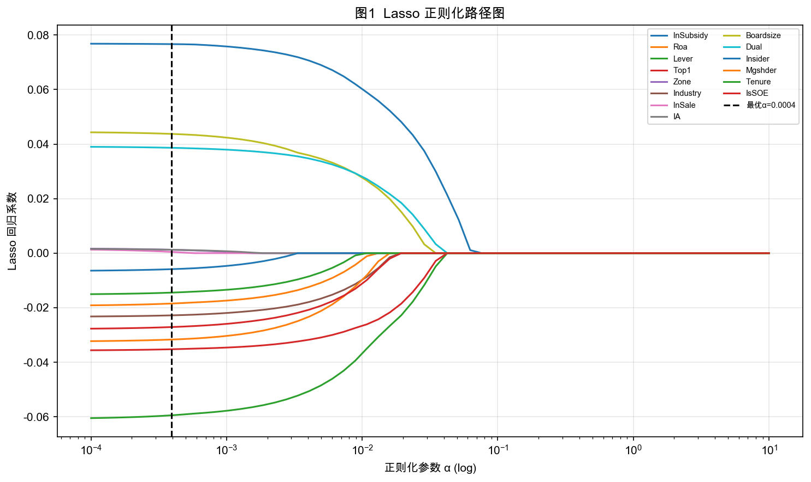
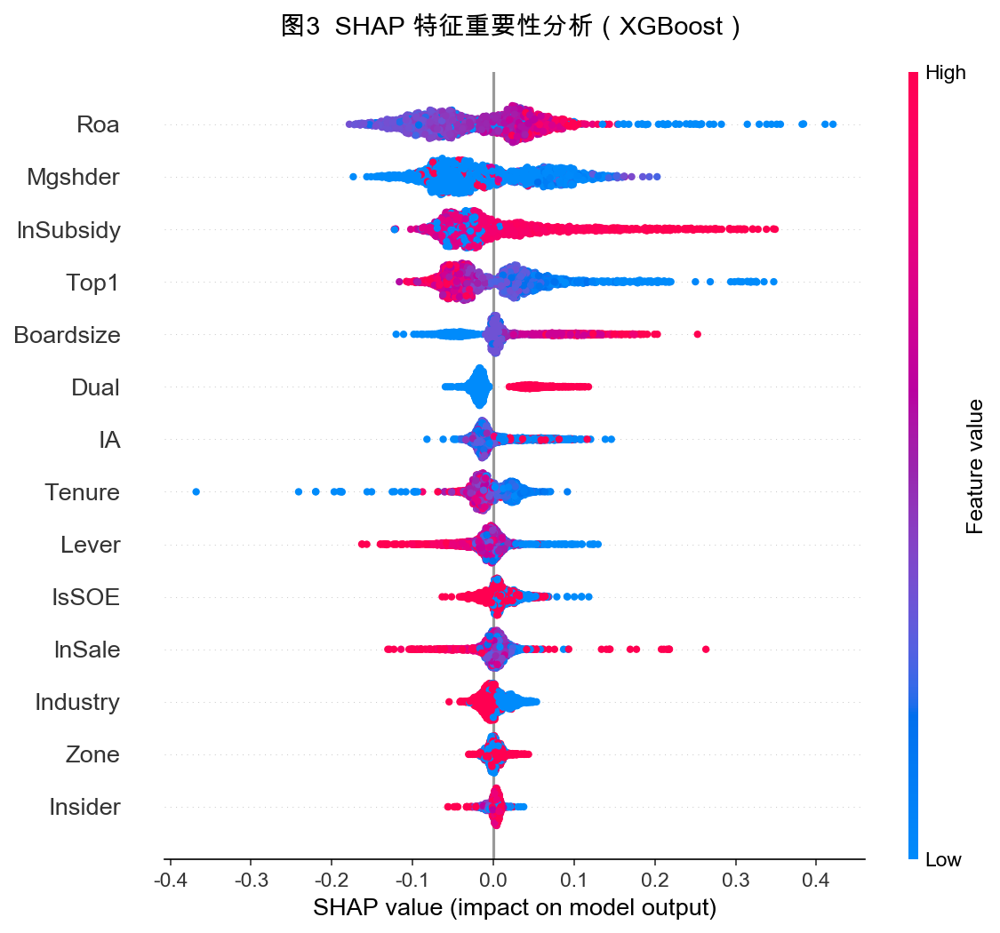
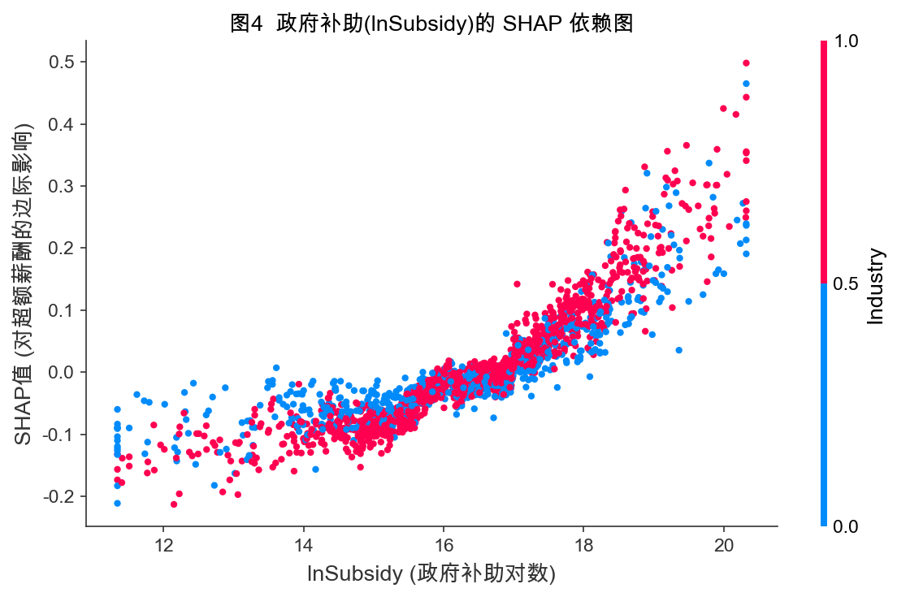
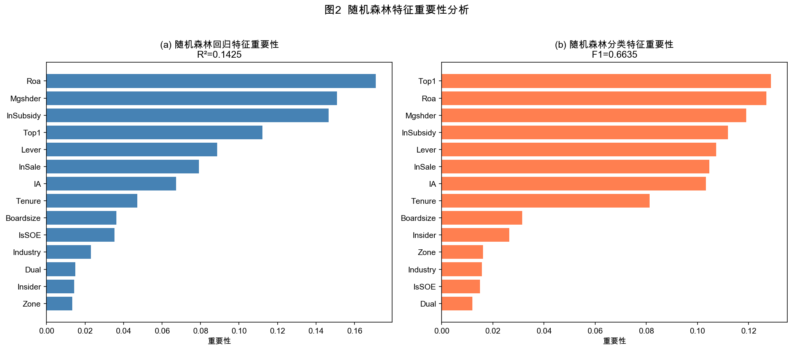
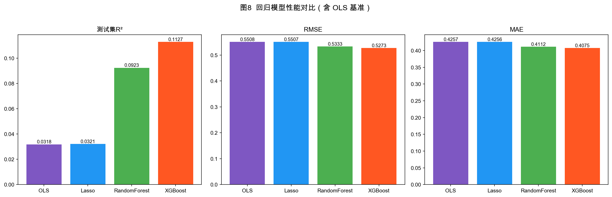

# 基于数据挖掘的上市公司财政补贴与高管超额薪酬研究

---

**摘　要**

我国经济正处于向高质量发展阶段持续转型的过程中，政府对上市公司的财政补贴规模不断扩大，高管薪酬问题引发的社会争议也日趋突出。本文以2003—2024年沪深A股上市公司（剔除金融行业）为研究样本，在管理者权力理论与代理理论框架下，考察财政补贴强度与高管超额薪酬之间的条件相关关系及其在不同制度情境下的表现。研究借鉴Core等（1999）的期望薪酬模型，将模型1的回归残差直接记为高管超额薪酬（Overpay），随后依次采用固定效应回归、工具变量检验、中介效应分析、异质性分析以及机器学习预测模型展开实证研究。结果显示，在公司和年份固定效应下，滞后一期财政补贴与高管超额薪酬之间存在显著正相关关系（$\beta = 0.0088$，$p < 0.01$）；四项稳健性检验结果均保持显著正向。基于FA口径的中介效应检验表明，管理层权力的间接效应占总效应的5.27%，Bootstrap 95%置信区间不包含0，但工具变量第二阶段估计未达到显著水平，因果层面的解释仍需谨慎。异质性分析显示，上述正相关主要集中在私营企业和非管制行业样本中，而央企与地方国企组内并未观察到稳定的直接补贴效应差异。随机森林与XGBoost的预测性补充分析表明，财政补贴在自动特征筛选和SHAP重要性排序中始终位居核心位置，并与产权性质、权力相关特征共同呈现出非线性和交互结构。本文为理解财政补贴与高管薪酬治理之间的经验关联提供了补充证据，也为相关监管讨论提供了参考。

**关键词**：财政补贴；高管超额薪酬；管理层权力；中介效应；数据挖掘

---

## 第一章 绪论

### 1.1 研究背景与问题提出

党的二十大报告明确指出，中国经济已从高速增长阶段转向高质量发展阶段。这个判断深刻重塑了政府与市场之间的关系格局，也使财政政策的工具属性和治理含义愈发凸显。在产业政策层面，财政补贴长期以来是政府推动战略性新兴产业培育、激励企业技术创新、纾困市场主体以及稳就业保民生的重要调控手段。根据CSMAR数据库样本统计，2003年至2024年间，沪深A股上市公司（剔除金融行业）的政府补助总体规模持续扩张，受补贴企业数量和单家企业平均补贴强度均呈现明显上升趋势。如此量级的公共资金向企业部门转移，已成为中国资本市场中不可忽视的制度性变量。

与财政补贴规模扩张同步演进的，是社会各界对上市公司高管薪酬问题的持续关注与广泛争议。高管薪酬的合理性在学术层面涉及激励契约设计、代理成本控制与公司治理效率等核心命题，在社会层面则与收入分配公平性、政策资源使用效率和社会信任基础紧密相连。近年来，媒体和公众频繁质疑：上市公司在大规模获得政府补贴的同时，高管薪酬水平是否也随之同步上升？企业所获得的本应服务于产业发展和公众利益的公共资源，是否在信息不对称和治理约束薄弱的条件下被部分转化为高管的个人收益？这些问题有学术意涵，更直接关系到财政资金的使用效率和企业内部的公平分配。

解释高管薪酬超出"合理"水平的原因，学界存在两种对立的理论视角。"最优契约说"认为，高管薪酬是在充分竞争的经理人市场和有效治理结构下，董事会与高管之间理性博弈的均衡结果，薪酬高低本质上反映了高管所创造的边际价值。"管理权力说"则主张，在所有权与控制权高度分离的现代公司中，高管凭借对董事会构成和薪酬委员会决策的影响力，系统性地从薪酬契约中提取超额收益，超出正常激励水平的部分是代理问题的直接产物。中国上市公司的实际情况使后者似乎具有更强的解释力：信息不对称程度较高、内部控制质量参差不齐、独立董事制度独立性不足等制度性缺陷，均给管理层的自利行为创造了操作空间。当财政补贴作为重要的外部资源注入企业时，它既扩大了企业可支配资源，也为高管提供了更大的薪酬议价筹码和更多的寻租机会。这正是本文的研究出发点。

本研究尝试回答以下四个相互关联的核心问题：第一，在控制企业规模、盈利能力、财务杠杆等基本特征后，财政补贴是否与高管超额薪酬存在显著且稳健的正相关关系？第二，管理层权力是否在财政补贴与高管超额薪酬之间发挥统计意义上的中介传导作用，即补贴变动是否会通过权力变化部分影响超额薪酬？第三，上述正相关关系在不同产权性质、不同行业管制强度和不同区域制度环境下是否存在差异，哪些制度因素可能约束或放大这一关联？第四，基于机器学习的补充分析能否从预测角度揭示线性回归之外的非线性模式和交互特征？

### 1.2 研究目的与研究意义

**理论意义**方面，本研究的贡献体现在三个层次。在分析框架上，本文将政府补贴这一政策变量系统纳入高管超额薪酬的决定因素分析，突破了现有文献多以公司内部治理变量为核心解释变量的局限，从"外部资源约束"与"内部权力结构"的交互视角丰富了管理者权力理论在中国情境下的经验讨论。在变量测量上，本文采用因子分析法构造管理层权力综合指数，并围绕统一指标展开后续机制检验，构成了此类复合指标研究的方法论参考。在研究方法上，本文将传统计量经济学推断（固定效应、工具变量、中介效应检验）与现代数据挖掘技术（Lasso、随机森林、XGBoost）相结合，使线性关联分析与非线性特征刻画形成互补，构成了同类研究方法融合的范式参照。

**现实意义**方面，本研究的应用价值覆盖多个层面。就财政监管部门来说，研究结果提示财政补贴在企业内部分配层面可能与高管薪酬安排存在关联，尤其在私营企业和监管薄弱情境中表现更明显，这为设计补贴政策时附加资金用途约束、引入事后审计机制给出了经验参考。就资本市场监管机构来说，本文基于机器学习构建的"高补贴—高超额薪酬"风险识别框架，可为开发探索性的薪酬治理风险评估工具给出补充证据。投资者和公众若能理解财政补贴对高管薪酬的潜在关联，也有助于更全面地评估上市公司的治理质量和补贴政策的实际效率。

### 1.3 国内外研究现状

#### 1.3.1 高管超额薪酬的界定与测量方法

围绕高管超额薪酬的研究，真正困难的地方不在于观察到"薪酬高"，在于判断其中哪些部分属于正常激励，哪些部分已经偏离了合理边界。早期文献常直接使用CEO绝对薪酬水平作为代理变量，这种处理便于操作，却很难把企业规模、业绩补偿和治理失灵造成的额外收益区分开来。Bebchuk和Fried（2003）[1]之所以成为这一领域的关键文献，正在于他们把讨论重点从"薪酬水平高低"转向了"薪酬契约是如何形成的"。在他们看来，所有权分散的上市公司里，管理层能够通过影响董事会提名、薪酬委员会构成以及具体条款设计，把本应接受监督的薪酬安排转化为自身议价能力的体现。正因如此，期权、退休福利和其他隐性收益不再只是支付形式问题，成为识别管理权力的重要观察窗口。

如果说Bebchuk和Fried（2003）[1]提供了理论解释，Core等（1999）[3]则把这一问题推进到了可操作的计量层面。其做法并不复杂，却影响很大：利用公司治理、规模、业绩、风险、行业和年份等变量估计CEO在一般条件下应获得的薪酬水平，再把该模型的残差视为超额薪酬。这样处理的好处是，研究者不必把所有高薪都视为异常，而是先给出一个"应得薪酬"的基准，再讨论偏离基准的部分是否与权力结构有关。后续大量文献沿用了这一残差口径，本文也是在这个框架下展开，只是结合中国上市公司的数据口径作了本土化调整。

在中国样本中，这一路径也得到了进一步延伸。Bu等（2019）[4]更关注高管与员工之间的薪酬差距，罗昆、曹光宇（2015）[10]则直接用残差法刻画超额薪酬，二者虽然处理角度不同，但都把政府补贴纳入了解释框架，并得出了补贴与高管额外收益存在正向关联的判断。吴妍（2019）[21]、张莉莉（2019）[22]等学位论文则提供了更贴近中国制度环境的变量设定和样本处理经验。对本文而言，这些研究的价值不只在于结论方向相近，更在于它们说明了在中国资本市场语境下，超额薪酬确实可以被构造为一个可检验、可比较的经验变量。

#### 1.3.2 财政补贴的分配逻辑与公司行为效应

关于财政补贴本身，现有文献首先提醒我们不要把它理解成随机进入企业账户的外部资金。唐清泉和罗党论（2007）[13]指出，中国上市公司的补贴分配同时带有产业政策导向和政治关联色彩，这意味着补贴的获得已经包含了企业特征和制度关系的选择过程。潘红波、夏新平和余明桂（2008）[14]进一步表明，政治关联更强的企业更容易拿到政策支持。在这样的制度背景下，补贴不仅是财务资源，也是治理关系的一部分；它进入企业之后，可能影响的就不只是利润表，还会改变管理层在企业内部的资源支配位置。

Jiang等（2025）[6]把这个问题往企业内部再推进了一步。他们考察的不是补贴有没有到账，而是补贴到账以后资源如何被消化，结果发现政府补贴与管理冗余显著正相关，而且这种关系在内部控制较弱、社会信任水平较低的企业里更明显。换句话说，补贴未必自动转化为效率改进，它也可能变成管理层可以占用的松弛空间。李哲、王文翰和王遥（2022）[11]则从信息披露端提供了另一条证据：部分企业会通过强化年报中的政策导向表述来提升补贴获取概率。这条线索对本文同样重要，因为它提示补贴的形成过程本身就带有信息策略和治理差异，而不是单纯的政策执行结果。

#### 1.3.3 内部治理机制对补贴—薪酬关联的调节

已有研究还反复提示，补贴是否会外溢到薪酬端，很大程度上取决于企业内部有没有足够强的治理约束。步丹璐和王晓艳（2014）[12]发现，政府补助会扩大高管与员工之间的薪酬差距，而且公司治理越弱，这种扩大越明显。陈冬华、陈信元和万华林（2005）[15]讨论国有企业时也指出，显性薪酬一旦受到限制，管理层往往会转向在职消费、差旅费等更隐蔽的补偿渠道。把这两类证据放在一起看，可以发现补贴影响薪酬并不一定表现为工资表上的直接增加，它也可能借助治理薄弱环节转化为更隐性的收益安排。

与之相对，卢锐、柳建华和许宁（2011）[16]的结果说明，内控质量越高，高管薪酬对业绩变化越敏感，这意味着更完善的内部约束能把薪酬重新拉回到激励逻辑上。罗进辉（2018）[17]从媒体监督角度得到类似结论：外部关注越强，薪酬与经营表现之间的对应关系越清晰，国有企业中这一作用尤其明显。对本文而言，这些文献的意义在于明确了一个判断标准，即补贴能否推高异常薪酬，不只取决于补贴规模，更取决于企业内部和外部监督是否足以切断管理层的自利空间。

王克敏、王华杰、李栋栋等（2018）[18]又把视角推进到年报文本本身。他们发现，在业绩不佳或存在不利信息时，企业更倾向于使用复杂的年报表述，而文本越复杂，高管超额薪酬也越高。这说明信息披露并不只是被动呈现事实，它也可能被管理层用来抬高解读成本、削弱外部监督。连君莎（2020）[23]、章海浪（2021）[24]、徐坤（2021）[25]关于内部控制、薪酬公平和管理层语调的讨论，虽然切入点不同，但都在补充同一件事：补贴、治理和薪酬之间的关系，需要放在信息透明度和监督强度差异中理解。

#### 1.3.4 机器学习与数据挖掘方法在会计金融研究中的应用

机器学习文献之所以与本文有关，不是因为它代表一种更"新"的方法，而是因为它能处理线性回归不擅长回答的问题。Li（2008）[2]较早把文本特征与经济后果联系起来，说明非结构化信息可以进入会计研究。Perols、Bowen、Zimmermann等（2017）[5]在财务舞弊识别中发现，随机森林、神经网络和Boosting等方法较传统逻辑回归有更好的预测表现，这背后并不是简单换了算法名称，而是模型能够自动识别变量之间更高阶的交互。陆瑶、张叶青、黎波和赵浩宇（2020）[19]将梯度提升树用于高管特征与公司业绩的关系分析，也得到类似判断：某些变量的作用不是线性展开，而是在特定区间或特定组合下才会明显增强。

后续研究把这种思路进一步扩展到了文本分析与异常识别。马长峰、陈志娟和张顺明（2020）[20]在综述中强调，机器学习更适合承担探索性和补充性任务，而不是直接替代因果推断。Rjiba、Saadi、Boubaker等（2021）[7]证明了年报可读性会影响权益资本成本，Bhattacharya和Mićković（2024）[8]、Ketelaar和Mićković（2025）[9]则把上下文语言学习与人工智能方法用于舞弊和异常识别。对本文来说，这些文献提供的启发很明确：当我们怀疑财政补贴与超额薪酬之间可能存在区间效应、交互效应或非线性结构时，机器学习可以作为补充观察工具，而不是替代主回归的主方法。

#### 1.3.5 研究述评与现有文献的局限

把前述文献放在一起看，现有研究已经把三个问题讨论得比较充分。其一，超额薪酬如何界定、如何测量，已经形成了较稳定的方法路径；其二，财政补贴会不会影响高管收入，在中国情境下也积累了相当数量的经验证据；其三，内部控制、媒体监督和信息披露复杂性等变量，已经让我们看到治理约束会改变补贴效应的强弱。

但真正留给本文的空间也恰恰在这些研究之间的空白处。很多研究仍然使用薪酬水平或薪酬差距作为结果变量，这会把企业规模和绩效带来的正常差异混在一起；关于管理层权力是否承担了补贴影响薪酬的传导作用，已有讨论不少，结合固定效应与滞后设定的系统检验却不多；至于机器学习，现有文献更多将其用于舞弊识别或文本分类，较少把它放到补贴与超额薪酬的关系中做预测性补充。本文的实证设计，正是围绕这三处缺口展开。

### 1.4 研究方法与技术路线

本文的技术路线并不是把多种方法并排摆放，而是让它们依次回答不同层面的问题。前一部分先用文献梳理和理论推演明确本文要检验的两条主线，即财政补贴与超额薪酬的关联，以及管理层权力可能承担的中介作用。随后进入基准计量分析，利用CSMAR面板数据和Core等（1999）[3]的框架构造超额薪酬变量，在公司和年份固定效应下检验滞后一期财政补贴的主效应，并观察这一关系在稳健性检验中是否保持稳定。再往后，本文先用工具变量检验收紧主回归的识别边界，再讨论管理层权力路径是否存在，最后用异质性分析说明这一关系在哪些制度情境下更明显。机器学习部分放在最后，是因为它承担的是补充观察任务：通过Lasso、随机森林和XGBoost识别非线性和交互结构，再结合SHAP结果判断财政补贴在更灵活模型中的位置。

---

## 第二章 理论基础与文献综述

### 2.1 相关概念界定

#### 2.1.1 财政补贴

在本文语境下，财政补贴首先被理解为政府基于特定政策目标向企业投放的资金支持。它既可以表现为技术创新、节能减排等专项补助，也可以采取税收返还、政策性贷款贴息、研发费用加计扣除等形式。按照现行会计准则，这类政府补助通常区分为"与资产相关"和"与收益相关"两类：前者通过递延收益逐期摊销进入利润，后者则在满足条件后一次性或分期计入当期损益。对上市公司而言，这种处理差异不仅影响利润表，也会影响管理层对资源使用节奏的安排。

从经济含义上看，财政补贴并不是企业依靠市场竞争自行创造的经营收入，而是一种带有政策来源的外部资源输入。它的到账时间、规模大小和使用约束，都会同时影响企业的资源配置和财务报表表现。本文正是基于这一点，把财政补贴放在了补贴—治理—薪酬关系的起点位置。不过，这种外部资源属性并不自动带来准自然实验式的识别条件，因此本文仍把它视为需要谨慎处理的解释变量。在具体度量上，本文采用企业年度政府补助金额的对数值（$\ln\text{Subsidy}$）来表示补贴强度，以平滑分布右偏并提高模型之间的可比性。

如果把时间拉长来看，上市公司获得补贴的方式和规模都在变化。加入世界贸易组织后，政府补贴逐步从早期更偏全面覆盖的价格补贴，转向技术创新、节能环保和战略性新兴产业导向更强的选择性支持。2007年《企业会计准则第16号——政府补助》的发布，则进一步提升了上市公司补贴数据的可比性和可识别性，为后续大样本研究提供了基础。与此同时，补贴项目越细、规模越大，申报与使用过程中的信息不对称也越突出。主管部门很难长期跟踪每笔补贴的实际去向，而企业高管在项目论证和资源配置中往往掌握更多内部信息。也正因为有这一层制度背景，本文才把财政补贴同时看作资源变量和制度变量。

#### 2.1.2 高管超额薪酬

本文所说的高管超额薪酬，不是泛指“薪酬很高”，而是指在剔除企业规模、盈利能力、资产结构、区域及行业等客观因素之后，仍然超过正常基准的那一部分薪酬。这个概念背后预设了一个参照面：在治理结构较为完善的条件下，高管本应获得怎样的报酬。若实际薪酬系统性高于这一基准，就可以把偏离部分理解为代理成本的一种表现，也就是管理层利用信息优势或组织权力取得的额外收益。

在具体操作上，本文沿用Core等（1999）[3]的期望薪酬框架，先用公司特征变量估计"正常薪酬水平"，再把模型残差直接作为超额薪酬。这样处理的好处是，企业规模、经营绩效等对薪酬的正常影响已在期望薪酬模型中被吸收，残差因而更接近本文真正关心的非正常成分。数值上，它反映的是实际薪酬相对拟合基准的偏离；在实证操作中，本文直接使用残差序列，不再另行做“实际值减预测值”的二次计算。由于这一变量本身就是回归残差，其样本均值理论上接近0，因此本文不再做二次缩尾，以保留其统计含义。

围绕高管薪酬该如何度量，文献里一直存在不同选择。直接使用薪酬绝对水平，做法最简洁，但很难区分哪些部分原本就应由规模、行业和经营绩效决定；使用高管与员工薪酬之比，可以更好地刻画内部公平，却仍然无法清楚切开"应得"和"超得"；考察薪酬—绩效敏感性，则更偏向激励契约强度，而不直接回答契约本身是否已被管理层扭曲。相比之下，残差法的优势就在于它先建立了一个相对客观的基准，再讨论实际薪酬偏离这个基准的程度。本文沿用这一思路，并在期望薪酬模型中控制企业规模、经营绩效、无形资产占比和地区差异，使残差更集中地反映薪酬安排中的异常部分。

#### 2.1.3 管理层权力

管理层权力（Managerial Power）在本文中指的是高管对企业关键决策施加实际影响的能力，尤其是对薪酬契约、资源配置和战略议程的控制程度。它并不是一个单维度变量，而更接近一个需要多项指标共同逼近的潜在构念。现有研究通常会从三个方向把它拆开：一类是正式职位和董事会结构所体现的**结构性权力**，例如两职合一、内部董事比例和董事会规模；一类是高管持股所体现的**所有权权力**；还有一类则来自任期、声望和组织关系积累形成的**关系性权力**。

把这一概念放到中国上市公司环境中，情况会比西方主流文献更复杂。国有企业高管的权力基础常常同时带有行政授权和市场地位两层属性；私营企业里，大股东和实控人的意志又往往会深度影响高管的实际空间。也就是说，同样叫作"管理层权力"，其形成机制在不同所有制下并不完全一致。本文因此采用五个底层指标构造综合指数，希望在有限的数据条件下尽量兼顾这些差异化来源。

还需要补充一点。中国特色公司治理结构里，党委、董事会和管理层之间的权力边界并不总是清晰可分，国有企业尤其如此。很多真正影响高管地位的因素，比如党政体系中的关系网络、与上级主管部门的信任程度，在公开年报里几乎找不到直接量化指标。因此，本文使用两职合一、任期、内部董事比例等可观测变量来构造权力指数，本质上是一种在数据约束下的近似。这样做能够保留可操作性，但也意味着国有企业中的非正式权力渠道可能被低估。后文将国有与私营企业分开检验，部分就是为了缓解这一问题。

### 2.2 相关理论基础

#### 2.2.1 管理者权力理论

管理者权力理论（Managerial Power Theory）是本文理解高管超额薪酬的主要切入口。Bebchuk和Fried（2003）[1]提出这一理论时，针对的正是"最优契约说"过于理想化的问题。后者假设董事会能够代表股东客观制定薪酬契约，高管薪酬也会大体等于其边际贡献；管理者权力理论则认为，现实中的董事会、薪酬委员会和经理人市场并没有那么充分有效，高管往往掌握着更强的议程设置权，因此薪酬契约本身就可能被他们影响。

若具体到机制，高管影响薪酬安排大致有三条常见路径。第一条是通过影响董事会成员的形成和依赖关系，在谈判中直接占据更有利的位置；第二条是把薪酬结构设计得更复杂，使外部观察者不容易把总量看清楚；第三条则是控制与薪酬相关的信息披露，把显性收益与隐性收益一起包进合同。Core等（1999）[3]的实证结果之所以重要，也正是因为它把这些机制与更高薪酬、较差绩效同时联系起来，为管理者权力视角提供了计量支持。

这一理论放到中国上市公司环境中，并不会失去解释力，反而往往更贴近现实。中国企业普遍存在"一股独大"、实控人与管理层关系紧密、独立董事独立性有限等情形，正式制衡机制未必真能在薪酬决策中发挥作用。在这种背景下，高管对薪酬安排的影响不但不会自动减弱，有时还可能得到大股东或实控人的默许。

对本文而言，管理者权力理论最有价值的地方，在于它给出了“补贴为什么可能经由组织内部结构传到薪酬端”的一条清晰路径。财政补贴作为外部资源进入企业后，既会直接扩大可分配资源，也可能因为补贴的申请、协调和使用都要经过高管之手，而进一步强化高管在组织内部的地位。这样一来，补贴就不只是财务变量，还可能变成高管提升薪酬议价能力的条件。

它与"最优契约说"的分歧，也直接影响了本文的研究设计。如果完全按照最优契约逻辑理解，高薪可能只是对更高业绩和更大经营复杂度的合理补偿，那么观察到补贴与薪酬同向变化，并不一定意味着治理问题。但管理者权力理论恰恰预测，即便控制了绩效和规模，权力更强的高管仍可能从同样的资源扩张中拿走更多额外收益。正因如此，本文才不用薪酬绝对水平做因变量，而改用期望薪酬残差；同时将补贴滞后一期进入模型，尽量把"补贴改善绩效、绩效合理提升薪酬"与"补贴带来异常收益"这两条路径分开。

财政补贴在这一理论框架下还有一个特别之处。与企业靠生产率提升或市场开拓形成的经营利润不同，补贴能否拿到、如何申报、怎样落地，往往更依赖高管与政府部门沟通、组织项目和协调资源的能力。这意味着补贴的获取过程本身就可能强化高管的不可替代性，并被他们带入薪酬谈判。Bu等（2019）[4]和步丹璐、王晓艳（2014）[12]在治理较弱企业中观察到的更强正向影响，也与这一判断相吻合。

#### 2.2.2 代理理论

代理理论（Agency Theory）是本文理解补贴与薪酬关系的另一条基础线索。Jensen和Meckling（1976）[26]将股东与管理层的关系界定为一种典型的委托—代理安排：股东把经营权交给管理层，但双方掌握的信息并不对称，目标函数也不完全一致。只要监督不充分，管理层就可能把资源使用方向调整到更有利于自身的位置，由此形成道德风险和代理成本。

在薪酬场景中，代理问题并不只表现为工资单上的数字偏高。最容易观察到的是显性薪酬过度，即管理层通过调整绩效基准或薪酬结构，拿到高于边际贡献的报酬。更难识别的是隐性收益，例如在职消费、差旅安排和灰色收入渠道。还有一种常见情形是跨期扭曲，高管把短期业绩做得更好看，却把长期成本留给后续年份，预算软约束较强的国有企业里这一问题往往更突出。

理想状态下，激励契约应当让高管薪酬尽可能跟企业长期价值挂钩。但财政补贴进入企业后，这一对应关系可能被打乱。原因并不复杂：补贴常会进入当期损益，直接改善账面利润；如果薪酬契约没有把这部分政策性收益剔除，高管就可能在经营努力并未明显提升的情况下拿到更高绩效薪酬。已有研究在财务困境企业中观察到，补贴增加与超额薪酬上升会同时出现，这正是代理理论所强调的资源侵占逻辑。

本文后面之所以要做产权异质性分析，也可以从代理理论得到解释。国有企业受到国资委、审计和限薪制度等多重约束，私营企业则更多依赖大股东和市场约束。两类企业的监督结构并不相同，因此补贴进入企业后，能否顺着薪酬渠道外溢，也不应预期为同一强度。

在中国语境下，尤其是国有企业内部，委托—代理关系还会出现多层嵌套。若把链条展开，往往是最终公众、财政部或国资委、董事会、高管团队依次衔接，每一层的信息不对称都会往下传导。财政补贴在这条链中本来是一种政策资源工具，但资源一旦进入企业，高管拥有的具体使用信息却很难被上层完整观察。由此就会出现一个悖论：补贴越多，政策资源与真实努力越不容易区分，薪酬契约识别努力的精度反而可能下降。陈冬华、陈信元和万华林（2005）[15]关于名义限薪下隐性收益上升的发现，也从侧面说明了这一点。

代理理论里一个很关键的概念是薪酬—绩效敏感性（Pay-Performance Sensitivity）。理想的契约应当对真实经营绩效敏感，而对外部运气收益相对不敏感。财政补贴恰恰容易破坏这一点，因为它会直接抬高账面利润。若契约没有把补贴带来的利润改善从绩效基数中剔除，高管就会在没有额外管理努力的情况下同步受益。卢锐、柳建华和许宁（2011）[16]关于内控质量越高、薪酬—绩效敏感性越强的结果，也支持了这种理解。本文之所以使用期望薪酬残差（Overpay）而不是薪酬水平本身，正是为了尽量把这条“补贴改善绩效后正常推高薪酬”的路径剥离出去。

#### 2.2.3 信号传递理论

信号传递理论（Signaling Theory）为本文补充了另一种解释思路。Spence（1973）[27]讨论的是，在信息不对称环境里，掌握更多信息的一方会主动发送外部可观察的信号，以便让信息较少的一方对其质量形成判断。这一框架后来被广泛应用到企业财务、资本市场和公司治理研究中，信息披露质量、股利和资本结构都可以被放进同样的逻辑里理解。

落到本文的问题上，这个理论至少能从三个方向提供帮助。第一，企业会向政府发送信号以争取补贴，例如通过年报文本强化创新、环保或政策契合度表达，让自己看起来更符合补贴优先级。已有研究发现，部分政策导向表述的增强与补贴获取更相关，而与真实绩效未必同步。第二，政府补贴本身也会被市场当作一种背书信号，投资者、合作伙伴甚至高管候选人可能把它理解为政府对企业质量的认可，这会间接提升高管在薪酬谈判中的筹码。第三，信息复杂化本身也可能是一种信号策略：管理层通过提高披露复杂度，让外部监督更难直接识别薪酬异常。

因此，信号传递理论并不单独解释补贴或薪酬，而是帮助本文理解补贴申请、外部背书和信息复杂化这几个环节如何连在一起。

如果把它再往前推一步，会发现补贴分配过程面临一个很现实的困难：政府希望把资源投向真正高质量的企业，但在信息不对称下，更擅长组织材料、调整表达和发送信号的管理团队，也可能以较低成本模仿出“高质量企业”的外在形象。这样一来，补贴就未必流向真实效率最高的企业，而更可能流向信号生产能力更强的企业。对本文来说，这一点很重要，因为这种信号生产能力往往和管理层掌握的信息控制权相伴而生，后者又会回到薪酬谈判过程之中。李哲、王文翰和王遥（2022）[11]、王克敏等（2018）[18]的研究分别从补贴获取和薪酬掩护两个端口，给出了这条逻辑的经验支持。

#### 2.2.4 三种理论视角的比较与内在张力

把管理者权力理论、代理理论和信号传递理论放在一起，关键不是让三套理论分别解释同一结果，而是看它们各自负责哪一层问题。

代理理论更适合回答“在什么条件下补贴可能被管理层截留”，管理者权力理论更适合回答“这种截留是通过什么组织机制发生的”，而信号传递理论则补充了“信息环境为什么会改变这一过程的强弱”。前两者主要聚焦企业内部，后一者把视角延伸到企业与政府、投资者和外部监督者之间的信息互动。就本文而言，三者并不是彼此竞争，而是分别对应条件、机制和情境这三个层面。

当然，这三套理论都不是为中国上市公司制度环境量身定做的。管理者权力理论默认股权分散更常见，而中国企业里真正的制衡者往往是大股东；代理理论在国有企业中会碰到多层委托链条；信号传递理论则假设低质量发送者模仿高质量发送者的成本更高，但信息披露监管较弱时，这一前提未必牢靠。正因如此，本文把这些理论作为分析参照，而不是把任何一条结论直接理解为对理论本身的证实或证伪。

### 2.3 理论框架的整合与研究假设推演

在此基础上，本文把三套理论组合成一个分层框架，用来解释财政补贴与高管超额薪酬之间的关系。

从代理理论看，财政补贴首先扩大了企业可支配资源。只要监督不够强，这部分新增资源就不一定转化为效率提升，也可能以更隐蔽的方式流向管理层收益，这就是H1的基础逻辑。该理论还自然预期，制度约束越强，资源侵占路径越不容易展开。

从管理者权力理论看，补贴的作用不只在资源层面。补贴的申报、协调和使用往往需要高管深度参与，这会提升其对信息渠道和组织议程的掌控程度，进而增强薪酬谈判中的议价地位，这正是H2的理论起点。

信号传递理论则补充了外部信息环境这一层。政府补贴可能被市场理解为一种质量背书，提升企业和高管在外部声誉市场中的议价空间；与此同时，管理层也可能借助更复杂的信息披露降低外部识别薪酬异常的难度。这样一来，补贴—薪酬关系就更容易在信息透明度较低的环境里被放大。

把三者合起来，本文就能分别回答三个问题：为什么补贴可能流向高管薪酬、这一过程可能通过什么机制发生、以及哪些信息环境会放大或压缩这种传导。后文控制变量、中介效应和异质性维度的设计，也都来自这一分层框架。

### 2.4 中国制度情境下的理论延展

如果不把中国制度环境放进来，上述三套理论都很容易显得过于抽象。中国上市公司的特殊性在于，财政补贴并不只是普通现金流入，它还叠加了地方政府竞争、产业政策导向、国资监管层级差异和信息透明度不均衡等条件。也正因为如此，补贴同时具有资源属性和制度属性，它会改变的不只是利润表，还有高管与政府、董事会及投资者之间的权力和信息关系。

具体来看，中国情境下的补贴至少有两个制度特征值得强调。其一，补贴分配往往带有明显的政策导向和选择性，高管个人在申报、沟通和协调中的作用会被放大。其二，补贴到账后的约束和追踪在不同地区、不同所有制企业之间并不均衡，部分企业面对的外部监督较弱。这样一来，“补贴增加资源”与“补贴扩大管理层可支配空间”就很可能同时发生。因此，本文并不把补贴仅仅视作财务变量，而是把它理解为会同时触发资源扩张、权力重配和信号强化的复合性冲击。

也正是在这样的背景下，本文才需要把固定效应、中介效应和机器学习补充分析放到同一套设计里。固定效应和滞后设定帮助区分“企业原本就不同”和“补贴变化后发生了什么”；中介效应检验用来考察权力渠道；机器学习则负责观察高补贴区间、私营企业情境或特定权力结构下是否会出现额外放大。第二章的理论推演，因而和后文实证设计是一一对应的。

顺着这一思路，也能理解为什么本文把产权性质和行业监管强度作为重点异质性维度。国有企业里，补贴更常见，但预算约束、审计监督和薪酬管制也更强；私营企业中，补贴一旦进入企业内部，则更可能在缺少强制性薪酬上限和行政问责的环境里转化为高管的议价资源。行业层面同理，强管制行业里的补贴通常伴随更强监管，非管制行业中则更容易表现为自由现金流的额外补充。因此，第二章真正要回答的，不只是补贴为什么可能影响超额薪酬，还包括这种影响为什么不会在所有企业里同样明显。

---

## 第三章 研究设计

### 3.1 研究思路与分析框架

本文的整体分析框架可以概括为两条主线。第一条主线关注财政补贴与高管超额薪酬之间是否存在稳定的条件相关关系；第二条主线关注这种关系是否会经由管理层权力这一渠道部分传导。产权性质、行业管制强度等制度因素，则被放在这两条主线之外，作为判断关系强弱差异的情境条件。

企业拿到财政补贴后，最直接的变化是可支配资源增加，账面利润也可能随之改善。这会改变薪酬安排所处的资源约束条件。与此同时，补贴从申请到使用通常都需要高管深度介入，这又可能提升其在组织内部的议程设置权和资源支配权。产权性质和行业管制强度会进一步改变外部监督和薪酬约束的力度，因此补贴效应不太可能在所有情境下等强出现。

相应地，后文的实证部分也按四步展开：先用基准回归确认主关联，再用稳健性检验看这一关系是否稳定；随后先做工具变量检验，再做中介效应分析和异质性分析，尽量把识别边界、传导路径和制度情境差异说清楚；最后再借助机器学习去补看线性模型没有完全展开的非线性和交互结构。这样安排的目的，是让不同方法分别回答不同问题，而不是把方法简单叠加在一起。

### 3.2 研究假设提出

基于上述理论框架，本文正式提出以下两个核心研究假设：

**假设H1（主效应假设）**：财政补贴与高管超额薪酬呈显著正相关关系。在信息不对称和薪酬约束机制不充分的条件下，财政补贴扩大了企业可支配资源规模，当薪酬治理机制不足以对管理层的资源提取行为形成有效约束时，这类外部资源可能与更高水平的高管超额薪酬相伴随。

H1的理论支撑来自代理理论的资源侵占逻辑：补贴进入企业账面后，若激励契约未能将这部分"非经营性利润"从绩效薪酬基数中剔除，高管将在未作出实际贡献的情况下从中受益；而补贴所对应的资源扩张也为高管在薪酬谈判中预留了更大的分配空间。H1预测一个正向、稳健的统计关联，并在不同样本设定下保持一致性。

H1背后的逻辑主要来自两条路径。第一条是绩效基数被补贴“抬高”之后，薪酬契约可能把政策性收益误当成经营性改善，从而推高绩效薪酬。第二条是补贴扩张了企业账面可分配资源，使董事会在薪酬谈判中面对的支付能力约束有所放松。只要治理机制没有把补贴性收益与经营性收益清楚区分开来，补贴增加就更容易与超额薪酬上升同时出现，而且这种关系在控制绩效后仍可能存在。

**假设H2（中介效应假设）**：管理层权力在财政补贴与高管超额薪酬的关联过程中发挥中介作用。财政补贴的获取和使用强化了高管在资源配置决策中的核心地位，提升了其在薪酬谈判中的议价能力；控制管理层权力后，补贴对超额薪酬的直接效应有所收窄，而管理层权力的系数显著为正，形成可识别的间接传导路径。

H2的理论支撑来自管理者权力理论：补贴获取过程中高管的深度介入客观上强化了其在组织内部的议程设置权；补贴使用的自由裁量空间越大，高管将补贴资源转化为薪酬议价筹码的可能性越高。有必要说明的是，管理层权力的测度方式会直接影响中介效应结论的稳定性，本文在FA口径下进行正文检验，并对机制解释保持审慎态度。

H2则更多依赖补贴申报与使用过程中的组织机制。高管如果深度参与政府沟通、项目论证和审核对接，就更容易积累难以替代的关系资本；补贴获批后，资源流向和使用信息又往往集中在管理层手中；这些信息和关系优势最终会带回薪酬谈判场景，强化高管的议价地位。对应到实证上，本文预期补贴增加会伴随管理层权力指标上升，权力指标又会对超额薪酬产生独立影响，而控制权力后补贴系数应有所收窄。第四章的中介效应检验就是围绕这一链条展开。

### 3.3 样本选择与数据来源

本文以2003—2024年沪深A股上市公司为研究总体，所需数据均来自国泰安（CSMAR）数据库，包括政府补助数据、高管薪酬数据、公司财务数据（资产负债表、利润表）、公司治理数据（董事会构成、股权结构）以及企业性质和地区分类信息。

样本清理的思路是先保证可比性，再处理极端值和缺失问题。金融行业被首先剔除，因为其资产负债结构和监管环境与一般实业企业差异过大，直接并入会让薪酬与补贴的比较基准失真。研究期间被ST、\*ST、PT或进入退市整理期的公司也不保留，以减少财务异常样本对结果的干扰。核心变量缺失严重的观测值随后被删除，主要连续变量（Overpay除外）则统一在1%和99%分位数处做Winsorize缩尾。原始薪酬数据沿用CSMAR数据库既有缩尾口径，不再重复处理。经过这些步骤，原始可用年度观测为52,358条；满足期望薪酬模型完整案例要求的样本为52,182条；纳入管理层权力底层指标后，可用于构造Power的样本为44,965条；在主回归中加入滞后一期补助变量后，模型2样本为46,523条；在中介效应检验中进一步要求Overpay、Power与滞后补助同时完整后，统一样本为39,542条；机器学习部分再因`IsSOE`缺失减少至44,650条。

时间窗口的设定也有明确考虑。样本从2003年开始，一方面是因为加入世贸组织后上市公司信息披露逐步规范，CSMAR在2003年前后的数据完整性和可比性明显改善；另一方面，政府补助作为独立披露科目的规范化要求也是在这一阶段逐步清晰的，若把更早期数据混入，口径差异会带来额外误差。样本截至2024年，既尽量利用最新可得数据，也为滞后变量保留了足够年份。剔除金融行业后，样本覆盖制造业、信息技术、批发零售、房地产、交通运输等17个行业门类，整体行业结构与沪深A股分布基本一致。

### 3.4 变量设定与说明

#### 3.4.1 被解释变量：高管超额薪酬（Overpay）

高管超额薪酬以期望薪酬模型的回归残差直接度量。具体而言，以高管前三名薪酬总额的对数（$\ln\text{Salary}$）为被解释变量，把企业规模（$\ln\text{Sale}$）、盈利能力（Roa）、无形资产占比（IA）和地区虚拟变量（Zone）作为核心解释变量，并控制行业和年份固定效应，模型的残差序列 $\varepsilon_{it}$ 即直接作为超额薪酬的代理变量，记为 $\text{Overpay}_{it}$，无需另行计算。之所以使用高管前三名薪酬总额而不是单个CEO薪酬，一方面是为了降低个别年份单一职位数据缺失或异常的影响，另一方面也因为中国上市公司重大决策往往由高管团队共同完成，团队层面的薪酬安排更能反映企业的整体激励取向。$\text{Overpay}_{it} > 0$ 表示该企业高管获得了高于基准的薪酬，$\text{Overpay}_{it} < 0$ 则表示其薪酬低于基准，这一情况在部分受薪酬管制约束的国有企业中并不少见。

#### 3.4.2 解释变量：财政补贴强度（lnSubsidy）

核心解释变量为企业年度政府补助金额的对数值：

$$\ln\text{Subsidy}_{it} = \ln(\text{GovernmentSubsidy}_{it})$$

这里采用对数化处理，主要是出于分布形态和解释便利两方面的考虑。政府补助金额右偏明显，企业之间的规模差异也很大，取对数可以压缩极端值带来的波动；与此同时，对数化后的系数也更便于在不同模型之间比较。稳健性检验部分进一步使用$\ln(1 + \text{Subsidy})$（即$\text{lnSubsidy1p}$）以及滞后一期补助变量$\ln\text{Subsidy}_{i,t-1}$作为替代口径。

#### 3.4.3 路径变量：管理层权力（Power）

管理层权力在理论上并不难理解，但在经验研究里很难用单一指标直接观察。为尽量贴近这一潜在构念（Latent Construct），本文参考Bebchuk和Fried（2003）[1]、Core等（1999）[3]关于权力来源的讨论，并结合中国上市公司的治理特征，从五个维度构造底层指标：

（1）**高管任期**（Tenure）：任期越长，高管在公司中积累的人脉关系、行业知识和组织影响力越深厚，薪酬议价能力相应越强；

（2）**两职合一**（Dual）：董事长兼任CEO时取1，否则取0。两职合一在结构上消除了董事会对高管的制衡，使高管能够直接主导薪酬制定议程；

（3）**董事会规模**（Boardsize）：董事会规模越大，集体行动问题越突出，对高管的有效监督越难形成，为高管的影响力扩张提供了客观空间；

（4）**内部董事比例**（Insider）：内部董事占董事会总人数的比例。内部人比例越高，董事会的独立性越弱，高管对董事会决策的掌控力越强；

（5）**高管持股比例**（Mgshder）：高管自身持股使其兼具股东和管理者的双重身份，一定程度上代表了其在公司中的正式权力基础。

这些指标分别反映了正式职位、董事会结构、所有权和任期积累等不同来源的权力。考虑到单一变量都不足以完整刻画管理层权力，本文进一步采用**因子分析法（FA）**对五个底层指标进行降维整合，形成综合权力指数$\text{Power}$。这样做的目的，是在后文主回归和中介效应检验中使用统一口径，而不是在多个代理变量之间来回切换。

#### 3.4.4 控制变量

控制变量的设置分成两个阶段。第一阶段的期望薪酬模型主要控制**企业规模**（$\ln\text{Sale}$）、**盈利能力**（Roa）、**无形资产占比**（IA）和**地区虚拟变量**（Zone）；第二阶段的主回归、中介效应、异质性分析和稳健性检验，则主要控制**盈利能力**（Roa）、**财务杠杆**（Lever）、**第一大股东持股比例**（Top1）和**地区虚拟变量**（Zone），并统一加入公司和年份固定效应。这样安排的逻辑是：企业规模用于刻画正常薪酬基准，财务杠杆反映债务约束，第一大股东持股比例代表大股东监督能力，无形资产占比对应企业对知识资本的依赖程度，地区虚拟变量则吸收区域制度和薪酬水平差异。

主要变量的定义汇总见表3-1。

**表3-1 主要变量定义**

| 变量名 | 符号 | 定义 |
|:---|:---:|:---|
| 高管超额薪酬 | Overpay | 期望薪酬模型回归残差，正值表示薪酬高于基准 |
| 财政补贴强度 | lnSubsidy | 政府补助金额的自然对数 |
| 管理层权力 | Power | 基于FA的五维综合得分 |
| 业绩 | Roa | 净利润/总资产 |
| 财务杠杆 | Lever | 总负债/总资产 |
| 大股东持股 | Top1 | 第一大股东持股比例（%） |
| 地区 | Zone | 中西部地区=1，东部地区=0 |
| 企业规模 | lnSale | 营业收入自然对数 |
| 无形资产占比 | IA | 无形资产/总资产 |

### 3.5 模型构建

#### 3.5.1 第一阶段：期望薪酬模型

期望薪酬模型直接沿用Core等（1999）[3]的基本思路：

$$\ln\text{Salary}_{it} = \alpha_0 + \beta_1 \ln\text{Sale}_{it} + \beta_2 \text{Roa}_{it} + \beta_3 \text{IA}_{it} + \beta_4 \text{Zone}_{it} + \sum_{j=1}^{J} \delta_j \text{Industry}_{j} + \sum_{t=1}^{T} \gamma_t \text{Year}_{t} + \varepsilon_{it} \tag{1}$$

其中，$\ln\text{Salary}_{it}$ 表示第 $i$ 家公司第 $t$ 年高管前三名薪酬总额的对数值，$\varepsilon_{it}$ 为随机扰动项。残差序列 $\varepsilon_{it}$ 直接作为超额薪酬的代理变量，即 $\text{Overpay}_{it} \equiv \varepsilon_{it}$，正值表示实际薪酬高于基准水平，负值则相反。

#### 3.5.2 第二阶段：主回归模型

主回归阶段以超额薪酬（Overpay）为被解释变量，把滞后一期财政补贴强度（$\ln\text{Subsidy}_{i,t-1}$）作为核心解释变量，并加入企业层面控制变量、公司固定效应和年份固定效应：

$$\text{Overpay}_{it} = \alpha + \beta_1 \ln\text{Subsidy}_{i,t-1} + \beta_2 \text{Roa}_{it} + \beta_3 \text{Lever}_{it} + \beta_4 \text{Top1}_{it} + \beta_5 \text{Zone}_{it} + \mu_i + \lambda_t + \varepsilon_{it} \tag{2}$$

这里的$\mu_i$ 表示公司固定效应，$\lambda_t$ 表示年份固定效应。本文最关心的是 $\beta_1$ 的方向与显著性：如果 $\hat{\beta}_1 > 0$ 且统计显著，就说明在控制公司层面稳定差异和年度共同冲击之后，补贴增加仍与更高的超额薪酬相伴随，从而支持H1。核心解释变量使用滞后一期补助，是为了尽量把时间顺序固定为“补贴在前、薪酬在后”，以减轻同期反向因果带来的干扰。

#### 3.5.3 工具变量与中介效应模型

考虑到财政补贴可能同时受到选择性配置和反向因果影响，本文先在公司固定效应框架下使用两阶段最小二乘法（2SLS）进行工具变量检验。工具变量设定为“同城市同年度其他公司平均补助”的滞后一期值，即 $IV_{\ln\text{Subsidy}_{i,t-1}}$。这一变量试图利用同城企业共同受到地方财政政策波动影响这一特征，提取企业个体补助中的外生成分；它是否有效，最终仍要由第一阶段统计量和第二阶段估计结果共同判断。

在完成主回归与工具变量检验之后，本文再按照Baron和Kenny（1986）[28]的经典中介分析思路检验财政补贴是否会经由管理层权力这一渠道影响超额薪酬，并辅以Sobel检验和公司层面Cluster Bootstrap（300次重抽样）。为与正文呈现顺序保持一致，中介模型依次编号为模型3至模型5。对应的三步回归如下：

**第一步**（估计总效应 $c$，对应方程2）：

$$\text{Overpay}_{it} = \alpha + c \cdot \ln\text{Subsidy}_{i,t-1} + \boldsymbol{\beta}'\mathbf{X}_{it} + \mu_i + \lambda_t + \varepsilon_{it} \tag{3}$$

**第二步**（估计路径 $a$，补贴对权力的影响）：

$$\text{Power}_{it} = \alpha + a \cdot \ln\text{Subsidy}_{i,t-1} + \boldsymbol{\beta}'\mathbf{X}_{it} + \mu_i + \lambda_t + \varepsilon_{it} \tag{4}$$

**第三步**（同时纳入补贴和权力，估计控制Power后的补贴系数 $c'$ 与路径 $b$）：

$$\text{Overpay}_{it} = \alpha + c' \cdot \ln\text{Subsidy}_{i,t-1} + b \cdot \text{Power}_{it} + \boldsymbol{\beta}'\mathbf{X}_{it} + \mu_i + \lambda_t + \varepsilon_{it} \tag{5}$$

其中，模型3对应统一样本上的总效应检验，模型4对应路径 $a$，模型5同时给出路径 $b$ 与控制Power后的直接效应 $c'$；$\mathbf{X}_{it}$ 为控制变量向量。间接效应记为 $a \times b$，Sobel检验统计量为：

$$z_{\text{Sobel}} = \frac{a \times b}{\sqrt{b^2 s_a^2 + a^2 s_b^2}}$$

其中 $s_a$ 和 $s_b$ 分别是路径系数 $a$ 与 $b$ 的标准误。若路径 $a$、路径 $b$ 同时显著，且Bootstrap的95%置信区间不包含0，就可以认为样本中存在统计上的中介效应证据。间接效应的相对大小用 $a \times b / c \times 100\%$ 表示，用来衡量管理层权力渠道在总体关联中的占比。

#### 3.5.4 计量诊断说明

本文的数据结构是“公司-年度”二维面板，因此在正式估计前先做了几项基础诊断。VIF检验显示，各解释变量的VIF值都明显低于经验阈值10，最大值约为2.1，均值约为1.4，多重共线性并不严重。Breusch-Pagan（BP）检验在1%水平上显著拒绝同方差原假设（$p < 0.01$），说明扰动项存在异方差；Wooldridge检验同样在1%水平上拒绝无一阶序列相关的原假设（$p < 0.01$），提示同一公司跨年度残差存在自相关。基于这两个结果，后续主回归、中介效应、异质性分析和稳健性检验统一采用**公司层面的聚类稳健标准误**（Cluster-robust standard errors），以减少异方差和序列相关对统计推断的影响。

### 3.6 潜在内生性来源与识别局限

本文面临的核心识别难点，是财政补贴与高管超额薪酬之间可能同时存在选择性、反向因果和遗漏变量问题。这里先把这些风险说清楚，有助于理解后文各项设定分别在解决什么问题。

**第一类威胁是补贴获取的选择性。** 规模更大、政治关联更强、盈利能力更好的企业往往更容易拿到补贴，而这类企业本来就可能支付更高的高管薪酬。如果直接比较不同企业，会把“高薪企业更易获补贴”的横截面差异误当成补贴的动态效应。本文因此引入公司固定效应，把企业层面那些相对稳定的差异先吸收掉，再转向公司内部跨期变化的维度识别补贴与超额薪酬的关系。

**第二类威胁是反向因果。** 某些高超额薪酬企业中的管理层，可能本来就更擅长政府沟通，因此会在补贴和薪酬两端同时受益，使“高薪带来多补贴”与“多补贴带来高薪”在同期数据中缠在一起。本文使用滞后一期补贴作为核心解释变量，至少先把时间顺序固定为“补贴在前、薪酬在后”。工具变量设计则进一步尝试把由地方财政政策共同波动带来的外生成分分离出来，不过由于第二阶段估计存在局限，它更适合作为对主回归的辅助参照，而不是完全独立的因果证据。

**第三类威胁是不可观测的遗漏变量。** 例如企业管理文化、高管能力的时变特征或行业景气变化，都可能同时影响补贴获取和超额薪酬水平。公司固定效应可以处理企业稳定不变的不可观测因素，年份固定效应可以吸收各企业共同面对的宏观冲击，但那些随时间变化且又带有企业差异的因素仍然难以彻底排除。因此，本文始终把实证结论表述为“在多重识别设定下逐步强化的条件相关关系”，不把它上升为严格意义上的因果效应估计。

---

## 第四章 财政补贴与高管超额薪酬的实证分析

### 4.1 描述性统计与变量诊断

表4-1报告了主要变量的描述性统计结果。原始有效观测为52,358条；在期望薪酬模型中，因`lnSale`缺失17条、`IA`缺失159条，最终可用样本为52,182条；纳入管理层权力指标所需底层变量后，可用于构造Power的样本为44,965条；在主回归模型中构造滞后一期补助后，模型2样本为46,523条；在中介效应检验中进一步要求Overpay、Power与滞后补助同时完整后，统一样本为39,542条。

### 4.1.1 描述性统计

**表4-1 主要变量描述性统计**

| 变量 | N | 均值 | 中位数 | 标准差 | 最小值 | 最大值 |
|:---|:---:|:---:|:---:|:---:|:---:|:---:|
| 高管前三名薪酬总额（元） | 52,358 | $2.62\times10^6$ | $1.93\times10^6$ | $2.92\times10^6$ | 10,800.00 | $1.18\times10^8$ |
| 政府补助（元） | 52,358 | $5.26\times10^7$ | $1.26\times10^7$ | $4.35\times10^8$ | 12.63 | $8.41\times10^{10}$ |
| 财政补贴强度（lnSubsidy） | 52,358 | 16.2949 | 16.3471 | 1.6624 | 11.3445 | 20.3200 |
| 薪酬对数（lnCEOpay） | 52,358 | 14.4585 | 14.4734 | 0.7865 | 9.2873 | 18.5820 |
| 企业规模（lnSale） | 52,341 | 21.4000 | 21.2570 | 1.4228 | 18.4579 | 25.3705 |
| 无形资产占比（IA） | 52,199 | 0.0451 | 0.0317 | 0.0503 | 0.0000 | 0.3209 |
| 超额薪酬（Overpay） | 52,182 | 0.0000 | −0.0149 | 0.5777 | −4.7468 | 3.6420 |
| 管理层权力（Power，FA） | 44,965 | 0.0000 | 0.3312 | 1.1641 | −4.5791 | 5.6751 |
| 业绩（Roa） | 52,358 | 0.0310 | 0.0352 | 0.0707 | −0.3093 | 0.1991 |
| 财务杠杆（Lever） | 52,358 | 0.4260 | 0.4151 | 0.2145 | 0.0514 | 0.9665 |
| 第一大股东持股比例（Top1，%） | 52,358 | 33.7576 | 31.4100 | 14.8049 | 8.3300 | 73.3500 |
| 地区（Zone，中西部=1） | 52,358 | 0.3748 | — | 0.4841 | 0 | 1 |

注：政府补助和高管薪酬单位为元。Overpay直接使用期望薪酬模型残差，不再进行二次缩尾；其余连续变量在1%/99%分位数处进行Winsorize缩尾处理。

### 4.1.2 相关性分析与多重共线性检验

在进行主回归之前，本文对主要解释变量进行了皮尔逊相关性分析和方差膨胀因子（VIF）检验，以排除多重共线性干扰。

**表4-2 主要变量相关系数矩阵**

| | lnSubsidy | lnSale | Roa | IA | Lever | Top1 | Zone |
|:---|:---:|:---:|:---:|:---:|:---:|:---:|:---:|
| lnSubsidy | 1 | — | — | — | — | — | — |
| lnSale | 0.5678 | 1 | — | — | — | — | — |
| Roa | 0.0981 | 0.1266 | 1 | — | — | — | — |
| IA | 0.0027 | −0.0075 | −0.0541 | 1 | — | — | — |
| Lever | 0.1607 | 0.4267 | −0.3731 | 0.0533 | 1 | — | — |
| Top1 | 0.0706 | 0.1925 | 0.1647 | 0.0146 | 0.0178 | 1 | — |
| Zone | −0.0180 | 0.0044 | −0.0301 | 0.0913 | 0.0814 | 0.0041 | 1 |

注：样本量为52,182（完整样本，缩尾处理后）。lnSubsidy与lnSale相关系数最高（0.5678），其余变量两两相关系数均在0.45以下，不存在严重共线问题。

**表4-3 方差膨胀因子（VIF）检验**

| 变量 | VIF |
|:---|:---:|
| lnSubsidy | 1.4969 |
| lnSale | 2.0050 |
| Roa | 1.3386 |
| IA | 1.0132 |
| Lever | 1.6171 |
| Top1 | 1.0643 |
| Zone | 1.0161 |

注：所有变量VIF均低于经验阈值10，最大值为2.0050（lnSale），均值为1.3645，多重共线性可忽略不计。

描述性统计结果有几点值得留意。高管前三名薪酬的均值（261万元）与标准差（292万元）之比显示出高度右偏分布，少数高薪公司拉动了均值，企业间高管薪酬分化程度较高。政府补助的分布更加极端，均值约5,260万元而标准差高达4.35亿元，最大值与最小值之间相差达十几个数量级，反映了中国上市公司在补贴获取能力上的极度分化，也凸显了对补助变量进行对数化处理的必要性。超额薪酬（Overpay）的均值接近0（符合残差变量的理论特性），标准差为0.5777，样本内分散程度较高，最小值约为−4.75、最大值约为3.64，提示部分企业存在相当显著的超额薪酬偏离。此外，第一大股东平均持股比例约33.76%，呈现出我国上市公司股权相对集中的典型特征。

管理层权力并非单一可观测变量，而是由任期、职位兼任、董事会结构和持股等多个维度共同体现。采用FA构造综合得分，有助于在统一框架下提炼各指标的共同变动信息，减少逐项纳入模型时可能出现的共线性干扰。基于此考虑，第四章后续实证分析统一采用FA得分作为管理层权力指标，以保持正文口径一致并增强结论的可解释性。

### 4.2 基准回归结果分析

#### 4.2.1 期望薪酬模型估计

表4-4报告了方程（1）的估计结果，这是构造超额薪酬变量的基础。

**表4-4 第一阶段期望薪酬模型估计结果（模型1）**

| 变量 | 系数 | 说明 |
|:---|:---:|:---|
| $\ln\text{Sale}$ | 0.1979*** | 企业规模越大，期望薪酬越高 |
| Roa | 1.5288*** | 盈利能力越强，期望薪酬越高 |
| IA | −0.4204*** | 无形资产占比较高时，期望薪酬相对较低 |
| Zone | −0.2340*** | 中西部地区样本的期望薪酬相对较低 |
| 行业固定效应 | 控制 | 17个行业虚拟变量 |
| 年份固定效应 | 控制 | 21个年份虚拟变量 |
| N | 52,182 | — |
| $R^2$ | 0.4592 | — |

注：*** 表示在1%水平上显著。该模型用于估计正常薪酬水平，并据此构造超额薪酬 `Overpay`。

估计结果显示，企业规模（$\ln\text{Sale}$）的系数为0.1979，在1%水平上显著为正，与既有薪酬—规模关系的经验发现一致：规模更大的企业管理复杂度更高、外部经理人市场对高管技能的竞争更激烈，因而需要支付更高的市场均衡薪酬。盈利能力（Roa）的系数为1.5288，同样在1%水平上显著为正，符合薪酬—绩效敏感性的理论预期，且系数量级说明盈利能力对薪酬水平的影响较为明显：Roa每提升1个百分点，期望薪酬对数平均提升约1.53%。无形资产占比（IA）的系数为−0.4204，说明无形资产比例较高的企业（如知识密集型或技术密集型行业）高管期望薪酬相对偏低，这可能与无形资产密集企业更多依赖股权激励而非货币薪酬的薪酬结构有关。地区虚拟变量（Zone）的系数为−0.2340；在`Zone=1`表示中西部、`Zone=0`表示东部的编码下，这意味着中西部企业的期望薪酬显著低于东部企业，也可以等价理解为东部地区存在更明显的薪酬溢价。该模型的整体解释力为45.92%（$R^2 = 0.4592$），处于同类期望薪酬模型的常见区间，说明所选控制变量能够对高管薪酬变动提供较为充分的解释，也为后续超额薪酬残差的经济解释提供了基础。

#### 4.2.2 主回归结果

在获得超额薪酬（Overpay）变量后，基于式（2）估计模型2。由于主回归并不要求管理层权力指标完整，因此其样本量高于后续中介分析的统一样本。表4-5报告了公司固定效应、年份固定效应和公司层面聚类稳健标准误口径下的主回归结果。

**表4-5 主回归结果（模型2，公司与年份固定效应）**

| 变量 | 模型2 因变量：Overpay |
|:---|:---:|
| lnSubsidy_l1 | 0.0088***（2.66） |
| Roa | −0.9010***（−15.34） |
| Lever | −0.1474***（−3.84） |
| Top1 | −0.0014*（−1.91） |
| Zone | 0.1857***（3.28） |
| 公司固定效应 | 控制 |
| 年份固定效应 | 控制 |
| N | 46,523 |
| $R^2$ | 0.0219 |
| F统计量 | 59.48*** |

注：括号内为 $t$ 值；***、**、* 分别表示在1%、5%、10%水平上显著。标准误为公司层面聚类稳健标准误。

表4-5显示，滞后一期财政补贴（lnSubsidy_l1）的系数为0.0088，并在1%水平上显著为正。这意味着在同一公司内部的跨期变化维度上，财政补贴增加之后，企业在后一期更容易观测到更高的超额薪酬残差。由于模型2只要求Overpay、滞后补助和控制变量完整，样本量达到46,523条，比中介模型的统一样本更大，因此这里应被视为全文的主回归口径。

控制变量方面，业绩（Roa）和财务杠杆（Lever）系数均显著为负，说明在固定效应设定下，盈利改善和债务约束增强都与较低的超额薪酬残差相伴随；第一大股东持股比例（Top1）为边际显著负向，反映出大股东监督在一定程度上能够压缩高管额外攫取空间。Zone的系数为0.1857，在`Zone=1`表示中西部、`Zone=0`表示东部的编码下，这说明中西部样本的超额薪酬残差高于东部，这一结果反映的是控制固定效应后的样本内条件差异，应与模型1中的“东部期望薪酬更高”区分理解。模型整体F统计量为59.48，并在1%水平上显著，说明主回归设定整体有效。

### 4.3 工具变量检验

内生性问题主要对应主回归模型（模型2），因此本文先在中介分析之前对其进行工具变量检验。公司固定效应框架下采用“同城市同年度其他公司平均补助”的滞后一期值作为工具变量，对滞后一期财政补贴进行两阶段最小二乘（2SLS）估计，结果见表4-6。

**表4-6 工具变量（FE-2SLS）估计结果**

| 阶段 | 因变量 | 系数 | 统计量 | N |
|:---|:---|:---:|:---:|:---:|
| 第一阶段 | lnSubsidy_l1 | 0.1186*** | Partial F = 39.91 | 43,627 |
| 第二阶段 | Overpay | 0.0323 | $t = 0.5863$ | 43,627 |

注：第一阶段报告工具变量系数；Partial $R^2$ 为0.0023，说明工具变量具有统计相关性但解释力度有限。标准误为公司层面聚类稳健标准误。

工具变量检验把结论边界收紧了一步。第一阶段Partial F达到39.91，说明工具变量与企业自身补贴确有统计相关性；但第二阶段系数0.0323并不显著，这意味着一旦把识别要求提高到工具变量层面，本文还不能把财政补贴的影响表述为稳健的强因果结论。更合适的说法是：固定效应与滞后设定支持正向关联，工具变量检验则提醒我们在因果解释上仍需保留。

### 4.4 中介效应检验

在完成工具变量检验后，本文将基于FA构造的管理层权力指标纳入中介效应分析框架。为保证模型3至模型5之间具有可比性，这一部分统一使用同时具备Overpay、Power和滞后补助信息的39,542个样本，结果见表4-7。

**表4-7 管理层权力的中介效应检验结果（模型3至模型5，FA口径）**

| 路径 | 系数 | 标准误（cluster） | Bootstrap 95%CI |
|:---|:---:|:---:|:---:|
| 模型3 总效应 $c$：lnSubsidy_l1 → Overpay | 0.0082** | 0.0035 | — |
| 模型4 路径 $a$：lnSubsidy_l1 → Power（FA） | 0.0209*** | 0.0056 | — |
| 模型5 路径 $b$：Power（FA） → Overpay | 0.0207*** | 0.0070 | — |
| 模型5 直接效应 $c'$：lnSubsidy_l1 → Overpay | 0.0078** | 0.0036 | — |
| 间接效应 $a \times b$ | 0.000432 | — | [0.000143, 0.000831] |
| Sobel $p$ 值 | 0.0202 | — | — |
| 中介效应占比（$a \times b / c$） | 5.27% | — | — |

注：***、**、* 分别表示在1%、5%、10%水平上显著。Bootstrap为公司层面cluster bootstrap，300次重抽样。所有回归均控制Roa、Lever、Top1、Zone以及公司和年份固定效应。

表4-7最关键的信息，是模型3、模型4和模型5所对应的三条证据链彼此一致。首先，统一样本上的总效应（模型3）系数为0.0082，在5%水平上显著为正；其次，路径 $a$ 显示财政补贴显著提升管理层权力指标；再次，在模型5中，Power的系数为0.0207，在1%水平上显著为正，而补贴的直接效应仍保持显著。与此同时，间接效应的Bootstrap 95%置信区间[0.000143, 0.000831]不包含0，Sobel检验$p=0.0202$，说明管理层权力承担了补贴影响超额薪酬的一部分传导作用。

据此，H2在本文中的含义可以界定为：**在FA口径下，管理层权力呈现出小幅但稳定的统计中介效应。** 不过，由于工具变量第二阶段结果未显著，本文仍把这里的发现理解为统计上的路径证据，而不是已经被严格识别的强因果中介机制。

### 4.5 稳健性检验

为验证主回归结论在不同设定下的稳健性，本文从被解释变量选取、样本期范围、行业覆盖面和解释变量定义四个维度进行扰动检验，结果见表4-8。

**表4-8 稳健性检验结果（聚类标准误）**

| 检验内容 | 被解释变量 | 补助变量系数 | $t$ 值 | N | $R^2$ |
|:---|:---:|:---:|:---:|:---:|:---:|
| (1) 替换因变量 | lnCEOpay | 0.0352*** | 9.7420 | 46,650 | 0.0395 |
| (2) 缩小样本期（2010—2020） | Overpay | 0.0126*** | 3.1333 | 27,159 | 0.0262 |
| (3) 仅制造业 | Overpay | 0.0084** | 1.9952 | 31,274 | 0.0225 |
| (4) 替换解释变量$\ln(1+\text{补助})$ | Overpay | 0.0097*** | 3.0417 | 46,930 | 0.0234 |

注：***、**、* 分别表示在1%、5%、10%水平上显著。所有模型均控制Roa、Lever、Top1、Zone以及公司和年份固定效应。标准误为公司层面聚类稳健标准误。

四项稳健性检验结果均显示补助变量系数显著为正，即财政补贴与高管薪酬/超额薪酬之间的正相关关系在多种扰动设定下保持一致。替换被解释变量为CEO薪酬对数后系数最大（0.0352），说明补贴与薪酬水平本身的关联更为直接；仅保留制造业样本后系数略有收窄（0.0084），反映了行业结构对补贴—薪酬关系强度的调节作用。上述结果综合支持主回归结论的稳健性。

### 4.6 异质性分析

#### 4.6.1 产权性质差异

按照产权性质识别结果，本文分别选取国有样本与产权明确的私营企业样本进行分组主回归，结果见表4-9。

**表4-9 分产权性质主回归结果（模型2）**

| 变量 | 国有企业 | 私营企业 |
|:---|:---:|:---:|
| lnSubsidy_l1 | 0.0041 | 0.0123*** |
| 公司固定效应 | 控制 | 控制 |
| 年份固定效应 | 控制 | 控制 |
| N | 16,668 | 25,605 |
| $R^2$ | 0.0101 | 0.0371 |

注：***、**、* 分别表示在1%、5%、10%水平上显著。标准误为公司层面聚类稳健标准误。控制变量（Roa、Lever、Top1、Zone）同模型2，系数从略。

产权性质维度上，财政补贴的正向系数主要集中在私营企业样本中。私营企业样本中，补助系数为0.0123，并在1%水平上显著为正；而国有企业样本中的对应系数仅为0.0041，不显著。这说明在薪酬管制较弱、治理结构更灵活的私营企业中，补贴与超额薪酬的正向关系更容易被观察到。

#### 4.6.2 行业管制强度差异

按行业监管强度将样本划分为管制行业与非管制行业两组，分组主回归结果见表4-10。

**表4-10 分行业管制强度主回归结果（模型2）**

| 变量 | 管制行业 | 非管制行业 |
|:---|:---:|:---:|
| lnSubsidy_l1 | 0.0023 | 0.0087** |
| 公司固定效应 | 控制 | 控制 |
| 年份固定效应 | 控制 | 控制 |
| N | 7,685 | 38,838 |
| $R^2$ | 0.0556 | 0.0204 |

注：***、**、* 分别表示在1%、5%、10%水平上显著。标准误为公司层面聚类稳健标准误。控制变量（Roa、Lever、Top1、Zone）同模型2，系数从略。

按行业监管强度分组后，补助系数仅在非管制行业中保持显著为正（0.0087，5%水平），而在管制行业中不显著（0.0023）。可以看出，补贴向超额薪酬的传导更容易发生在行政约束和价格监管相对较弱的行业环境中。

#### 4.6.3 央企与地方国企差异

在可识别央地属性的国有样本内进一步细分，将样本区分为央企和地方国企两组，分组主回归结果见表4-11。

**表4-11 央企与地方国企主回归结果（模型2）**

| 变量 | 央企 | 地方国企 |
|:---|:---:|:---:|
| lnSubsidy_l1 | 0.0016 | −0.0032 |
| 公司固定效应 | 控制 | 控制 |
| 年份固定效应 | 控制 | 控制 |
| N | 3,926 | 8,459 |
| $R^2$ | 0.0085 | 0.0047 |

注：***、**、* 分别表示在1%、5%、10%水平上显著。标准误为公司层面聚类稳健标准误。控制变量（Roa、Lever、Top1、Zone）同模型2，系数从略。

在国有企业内部区分央企和地方国企后，两组的补贴系数均不显著，方向亦存在差异（央企为正0.0016，地方国企为负−0.0032）。这表明在更严格的固定效应和滞后设定下，仅凭央地属性本身并不足以支撑“补贴直接推高超额薪酬”的稳健结论。

综合来看，财政补贴并不是在所有企业中以同样方式作用于超额薪酬。更稳妥的归纳是：补贴向薪酬端的传导依赖制度约束强弱，尤其容易出现在薪酬管制较弱、行政监管相对宽松的私营企业和非管制行业中；而在国有企业内部，央地分类并未呈现稳定的直接效应差异。

### 4.7 基于机器学习的非线性特征与预测能力补充分析

本节引入机器学习，不是为了把研究重心从解释转向预测，也不是要用树模型替代固定效应回归。主回归已经回答了平均意义上的条件相关关系，尤其适合检验补贴系数的方向、显著性和稳健性。机器学习在本文中的任务更具体一些：它主要用来观察线性设定有没有压平某些区间效应，以及补贴是否会在特定所有制和治理结构组合下表现得更强。

因此，这一部分实际围绕三个问题展开。其一，财政补贴在更灵活的模型里是否仍然保持重要地位；其二，高补贴区间是否比低补贴区间呈现出更强的正向预测贡献；其三，这种贡献会不会随着产权性质和权力相关特征的变化而被放大。只要能把这三个问题说明白，机器学习部分就完成了它作为补充分析的作用。

#### 4.7.1 数据划分与预处理

机器学习部分使用44,650个样本，比当期完整比较样本少181条，差异主要来自`IsSOE`等输入变量的缺失。为了避免未来年份信息泄露，样本不做随机切分，而是按时间顺序划分：2003—2019年作为训练集（28,543条），2020—2024年作为测试集（16,107条）。这种方式更接近实际使用场景，因为模型只能利用历史年份的信息去判断未来年份的超额薪酬风险。分类任务中正类22,006个、负类22,644个，比例约为49.29%，不存在明显失衡，因此未额外引入SMOTE等过采样步骤。

输入变量共14个，涵盖财政补贴（lnSubsidy）、财务特征（Roa、Lever）、治理结构（Top1、Boardsize、Dual、Insider、Mgshder）、高管个人特征（Tenure）和企业属性（Zone、Industry、lnSale、IA、IsSOE）。回归任务预测连续型超额薪酬（Overpay），分类任务以$\text{Overpay} > 0$为正类标签。所有连续型特征在进入正则化线性模型前均通过StandardScaler进行零均值单位方差标准化处理，树模型由于对特征尺度不敏感，不进行标准化。

#### 4.7.2 Lasso回归：高维特征筛选的补充结果

Lasso（Least Absolute Shrinkage and Selection Operator）回归通过在目标函数中引入L1正则化惩罚项，实现同时进行参数估计和变量选择的功能：

$$\hat{\boldsymbol{\beta}}_{\text{Lasso}} = \arg\min_{\boldsymbol{\beta}} \left\{ \frac{1}{n} \sum_{i=1}^{n} \left(\text{Overpay}_i - \mathbf{x}_i'\boldsymbol{\beta}\right)^2 + \lambda \|\boldsymbol{\beta}\|_1 \right\}$$

其中，$\lambda$ 为惩罚参数，通过训练集内5折交叉验证确定最优值（$\lambda^* = 0.000322$）。在这一参数下，Lasso在14个候选特征中保留了13个，财政补贴变量（lnSubsidy）没有被压缩掉。这个结果本身并不提供因果解释，但至少说明在自动筛选和特征竞争的环境下，补贴信息依旧保留了独立的预测价值，而不是完全依附于其他变量存在。

图4-1把这一点做了可视化。最优 $\lambda$ 附近，`lnSubsidy` 的系数绝对值处于前列，收缩速度也相对较慢；相对地，`Tenure` 在较小的 $\lambda$ 区间就已经被压缩至零。换句话说，补贴变量在自动筛选环境下保持得更稳定，而任期变量的预测贡献则明显有限。

#### 4.7.3 模型层面的非线性模式描述

在本文这里，真正值得关心的不是树模型如何构造，而是它们从数据中提取出了什么结构。随机森林和XGBoost都允许变量作用随着区间和特征组合变化，这正适合用来观察财政补贴是否只在某些样本里明显推高超额薪酬。

图4-2给出的信息很直接。首先，`Roa`、`Mgshder`和`lnSubsidy`始终排在最重要的几类特征之中，其中财政补贴并没有被边缘化。其次，`lnSubsidy`一行里，高取值样本更多分布在正向SHAP区域，低取值样本则更接近零或落在负值区，这说明补贴规模越高，模型越倾向于给出更高的超额薪酬预测值。高杠杆和高大股东持股比例样本更多落在负向区域，也和前文回归中债务约束、监督约束会压缩超额薪酬空间的方向一致。

图4-3把这种非线性展示得更直观。低补贴区间内，SHAP贡献多数贴近0或位于负值区；当`lnSubsidy`接近16后，点云开始明显上移；到了18以上，正向贡献上升得更快。这说明补贴对超额薪酬的影响并不是一条平滑的线性斜率，而更像在高补贴区间才真正变得强烈。另一个值得注意的现象是，同一补贴水平下，高补贴区间里的蓝色点通常高于红色点，意味着非国有企业的正向预测贡献更强。与此同时，补贴水平越高，点云的纵向离散度也越大，说明高补贴样本内部的治理结构和所有制差异会被模型进一步放大。

当然，SHAP依赖图揭示的是模型内部如何利用特征，而不是现实中的政策阈值或因果拐点。但它至少补充了主回归看不到的一点：财政补贴的作用在高补贴区间和特定制度情境下会明显放大，这种结构不容易被线性固定效应模型直接写出来。

#### 4.7.4 交互特征的重要性描述

如果继续把重点放在变量组合上，可以看到补贴效应并不是孤立出现的。树模型的特征排序和SHAP解释都表明，财政补贴与管理层权力相关底层特征、产权性质变量的组合，往往拥有更高的重要性。

`Mgshder`、`Boardsize`和`Dual`等权力相关特征都排在SHAP重要性前列，这说明补贴效应往往伴随正式控制力、董事会结构和治理约束状态一起变化。当这些特征落在更有利于管理层扩张影响力的区间时，补贴对超额薪酬预测值的边际贡献通常更强，这与前文中介效应检验给出的方向是吻合的。

图4-3的颜色分层也把产权性质的交互表现得很清楚。高补贴区间里，非国有企业的SHAP贡献更高，说明同样规模的补贴在不同所有制情境下不会转化为同样幅度的超额薪酬预测值。这一点从非线性角度再次支持了前文的产权异质性结果。

图4-4报告了随机森林在回归任务（左图，$R^2 = 0.0923$）和分类任务（右图，$F1 = 0.6346$）下基于节点不纯度下降的特征重要性排序。两种任务的排序较为一致：`Roa`、`Mgshder`和`lnSubsidy`在两图中均位列前三，与图4-2的SHAP重要性排序方向一致，说明上述三类特征对超额薪酬的预测贡献并非来自某一特定指标的偶然结果。`Mgshder`（高管持股比例）作为管理层权力的所有权维度代理，排名始终靠前，进一步支持了权力相关特征在补贴—薪酬传导路径中的重要性。`Top1`（大股东持股）亦排名靠前，与回归中大股东对超额薪酬形成约束的结论方向吻合。

#### 4.7.5 模型性能对比

表4-12和表4-13分别报告了回归任务和分类任务下各模型的性能指标。

**表4-12 回归模型预测性能对比**

| 模型 | 测试集 $R^2$ | RMSE | MAE | 5折CV $R^2$ |
|:---|:---:|:---:|:---:|:---:|
| OLS | 0.0318 | 0.5508 | 0.4257 | $0.0313 \pm 0.0090$ |
| Lasso | 0.0321 | 0.5507 | 0.4256 | $0.0314 \pm 0.0089$ |
| 随机森林 | 0.0923 | 0.5333 | 0.4112 | $0.0831 \pm 0.0084$ |
| XGBoost | 0.1127 | 0.5273 | 0.4075 | $0.0904 \pm 0.0065$ |

注：$R^2$ 为测试集决定系数；RMSE为均方根误差，MAE为平均绝对误差；5折CV $R^2$ 表示在训练集内部实施5折交叉验证后得到的 $R^2$ 均值±标准差。

**表4-13 分类模型识别性能对比**

| 模型 | Accuracy | Precision | Recall | F1 | ROC-AUC |
|:---|:---:|:---:|:---:|:---:|:---:|
| Logit | 0.5562 | 0.5310 | 0.6604 | 0.5887 | 0.5838 |
| 随机森林分类器 | 0.6061 | 0.5728 | 0.7113 | 0.6346 | 0.6599 |
| XGBoost分类器 | 0.5955 | 0.5678 | 0.6644 | 0.6123 | 0.6440 |
| 决策树 | 0.5521 | 0.5309 | 0.5884 | 0.5581 | 0.5755 |

注：ROC-AUC越接近1，说明模型区分"存在超额薪酬"和"不存在超额薪酬"两类样本的能力越强。

从性能指标看，非线性模型确实优于线性基准，但这种优势更适合被描述为“有限而稳定”，而不是压倒性的跃迁。回归任务里，XGBoost的测试集 $R^2$ 为0.1127，高于OLS的0.0318；分类任务里，随机森林分类器的ROC-AUC为0.6599，XGBoost分类器为0.6440，也都高于Logit的0.5838。这说明更灵活的模型确实捕捉到了线性框架之外的结构，不过机器学习在本文中仍只是补充工具，而不是主回归的替代品。

图4-5把这种差异展示得更直观。XGBoost和随机森林在测试集 $R^2$、RMSE和MAE三项指标上都优于OLS和Lasso，其中XGBoost的测试集 $R^2$（0.1127）约为OLS（0.0318）的3.5倍。另一方面，OLS与Lasso几乎没有明显差距，说明在本文这14个输入变量的范围内，预测性能的主要增益不是来自简单筛掉变量，而是来自模型能够处理更复杂的非线性结构。训练集5折CV $R^2$ 与测试集 $R^2$ 的差距也较小，因此这些改善不太像纯粹的过拟合结果。

回到本文整体结构，本节的意义在于从数据驱动角度补看主回归没有完全展开的部分：财政补贴在更灵活的模型里依然重要，高补贴区间的作用更强，且这种作用会受到产权性质和权力相关特征的影响。OLS与分组回归负责给出主要计量结果，机器学习则提供了一个相对独立的补充视角。

---

## 第五章 研究结论与政策建议

### 5.1 主要研究结论

本文以2003—2024年沪深A股上市公司（剔除金融行业）为样本，在管理者权力理论和代理理论框架下，考察财政补贴、高管超额薪酬与管理层权力之间的关系。全文最终可以收束为四个发现，但每一条都需要连同其证据边界一起理解。

**结论一：在公司和年份固定效应设定下，滞后一期财政补贴与高管超额薪酬之间保持显著正相关。** 主回归中，lnSubsidy_l1 的系数为0.0088，并在1%水平上显著为正。这说明在同一公司内部的跨期变化维度上，补贴增加之后更容易观察到更高的超额薪酬残差。四项稳健性检验结果方向一致，因此这一发现可以被看作较稳的经验关联。

**结论二：在FA口径下，管理层权力呈现出小幅但显著的统计中介效应。** 路径 $a$ 和路径 $b$ 都显著为正，间接效应的Bootstrap置信区间[0.000143, 0.000831]不包含0，中介效应占总效应的5.27%。这意味着财政补贴的影响并不只通过直接资源扩张体现，权力渠道确实承担了一部分传导功能。不过，工具变量第二阶段估计未达到显著水平，所以本文更愿意把它表述为统计上的中介证据，而不是已经被严格识别的强因果机制。

**结论三：补贴与超额薪酬的正相关关系主要集中在私营企业和非管制行业。** 分组结果并没有支持“所有企业都一样”的判断。私营企业和非管制行业中的补助系数保持显著为正，国有企业和管制行业中则不显著。进一步区分央企与地方国企后，直接补贴效应并未出现稳定差异，说明制度约束和治理环境才是理解补贴效应差异的关键背景。

**结论四：机器学习补充分析揭示了财政补贴关系中的非线性和交互结构。** Lasso在自动筛选中保留了财政补贴变量；SHAP重要性显示`Roa`、`Mgshder`和`lnSubsidy`位于核心位置；依赖图则表明补贴对超额薪酬预测值的贡献在高补贴区间上升更快，且这种增强在非国有企业情境下更明显。与此同时，XGBoost和随机森林虽只是有限但稳定地优于线性基准模型，却已经足以说明线性回归之外仍存在值得重视的结构信息。换言之，机器学习部分没有推翻主回归，而是把主回归没有完全展开的非线性特征补充出来了。

还需特别说明的是，观察性面板数据的局限并没有因为固定效应、滞后补贴和工具变量检验而被完全消除。本文能够提供的是在多种识别设定下逐步强化的经验关联证据，而不是对财政补贴效应的严格因果识别。正因如此，后文政策含义的讨论也应建立在审慎解释的基础上。

### 5.2 政策建议

基于上述研究结论，本文从财政补贴监管、高管薪酬治理和信息披露监督三个层面提出政策建议。由于本文提供的是条件相关证据，下列建议更适合作为审慎的治理启示，而非直接的政策因果处方。

**第一，完善财政补贴的事前附条件设计与事后绩效追踪机制。** 当前财政补贴政策在拨付环节对资金的具体使用方式约束较为宽泛，在部分情形下可能缺少足够明确的使用边界。建议财政主管部门在核批补贴申请时考虑附加"薪酬合理性"条款，要求受补贴企业在补贴使用报告中披露高管薪酬的变动情况及其与补贴使用效率之间的关联；同时，对于获得大规模补贴的重点企业，可引入补贴后2—3年的绩效追踪机制，将"高管薪酬未出现明显脱离绩效的异常增长"作为补贴续期和规模调整的参考条件之一。

**第二，差异化强化私营企业和非管制行业的高管薪酬外部监督。** 异质性分析显示，私营企业和非管制行业是财政补贴与超额薪酬正相关关系表现得更为突出的群体，而现行薪酬监管制度在这两类群体中的覆盖相对薄弱。建议监管机构在完善国有企业限薪制度的同时，研究推动在上市公司层面（不分所有制性质）强制披露高管薪酬决定机制、绩效达标标准和薪酬委员会独立性评估结果，并将获得政府补贴的情况纳入薪酬合理性审查的重要参考因素，形成"享受补贴则需承担更高薪酬透明义务"的制度逻辑。

**第三，探索基于机器学习的薪酬风险识别工具应用。** 本文基于随机森林和XGBoost的分类模型在测试集上的ROC-AUC约为0.66和0.64，即利用多源数据对”高管超额薪酬高风险企业”进行统计识别具有一定应用潜力，但当前仍处于中等识别水平。建议证监会、沪深交易所和国资委等监管机构与学术机构开展合作，在进一步补充滚动窗口检验、外部样本验证和模型稳定性评估的基础上，探索研发更完善的薪酬治理风险评分系统，将财政补贴数据、公司财务数据、治理结构数据与年报文本特征相融合，构建针对上市公司高管薪酬治理风险的动态监测与预警平台。

**第四，健全高管薪酬信息披露的实质性要求。** 现有研究发现，部分上市公司倾向于在年报中使用结构复杂、语义模糊的文本表述，信息披露的复杂化本身可能构成高管隐蔽自利行为的策略手段，且在超额薪酬较高的企业中更为突出。建议监管机构在修订上市公司信息披露规则时，要求企业在年报的薪酬信息部分采用"简明化、结构化"的标准格式，明确薪酬与绩效挂钩的具体公式、政府补贴计入利润的金额及其对薪酬基数的影响，减少管理层通过信息复杂化掩盖超额薪酬的操作空间，切实保障中小投资者的知情权。

### 5.3 研究不足与未来研究方向

尽管本文在研究设计的严谨性和方法的多元性上做了相对全面的安排，但仍存在若干值得在后续研究中加以改进和深化的局限。

**第一，因果识别问题尚未得到彻底解决。** 本文已实施了公司固定效应、滞后一期补助和工具变量检验，但现有工具变量的第二阶段估计并未达到显著水平，说明当前识别更多是”强化证据”而非”定论证据”。理想的识别策略仍需要找到与财政补贴高度相关、但不会通过高管薪酬以外渠道影响结果变量的更强外生冲击，例如地方财政余裕度变化、产业政策分配规则调整或准自然实验窗口等。未来研究可尝试在双重差分（DID）或断点回归（RDD）框架下，利用政策冲击实现更严格的因果识别。

**第二，财政补贴类型的细化有助于揭示更精细的异质性效应。** 本文将政府补助作为整体进行分析，未区分研发创新补贴、节能减排补贴、困难企业纾困补贴、出口退税和一次性奖励等不同类型。理论上，不同类型补贴的政策导向和使用约束存在较大差异，其对高管薪酬行为的影响机制也可能存在本质区别。未来研究可利用CSMAR中对政府补助明细项目的描述性文本，通过机器学习文本分类方法对补贴类型进行系统标注，据此分类型检验补贴效应的异质性。

**第三，管理层权力的测度工具仍有改进空间。** 本文所使用的五个底层指标（任期、两职合一、董事会规模、内部董事比例、高管持股）均属于可观测的结构性变量，而高管实际权力的深层来源（如政治关联网络、在党委体系中的地位、与独立董事的私人关系等）难以通过公开数据加以量化，这是现有测度框架的固有局限。未来研究可尝试将上市公司年报中高管个人简历文本（政治任职经历、学历背景、社会兼职等）与现有结构变量相结合，利用更丰富的信息源构建多维管理层权力指标，以期减小测度误差并提高中介效应检验的统计功效。

**第四，机器学习部分的验证方式仍有改进空间。** 本文已采用时间切分，将2020—2024年样本作为测试集，初步避免了未来信息泄露；但当前仍属于单次留出检验，尚未实施滚动窗口、扩展窗口或跨市场外部样本验证。因此，现有模型性能更适合被理解为“在一次时间外推下的预测表现”，而不能直接等同于长期稳定的实务识别能力。未来研究可采用滚动窗口和前向验证等方式，更严格地评估模型在不同时段和不同市场环境中的稳健性。

**第五，文本信息的系统整合有待深化。** 本文在变量设计上尚未充分利用上市公司年报、社会责任报告和媒体报道中的文本特征信息（如薪酬政策描述的可读性、环境责任承诺的修辞强度等）。已有学者的研究发现，年报文本复杂性、企业环保责任表述与政府补贴获取之间存在显著关联，文本信息是反映管理层自利动机和信息披露策略的重要软信息来源。未来研究可系统整合年报文本特征与财务数据，在多源信息融合框架下更全面地刻画"财政补贴—信息披露—管理层权力—超额薪酬"之间的关系，为该领域的研究贡献更为丰富的实证图景。

---

## 参考文献

[1] BEBCHUK L A, FRIED J M. Executive compensation as an agency problem[J]. Journal of Economic Perspectives, 2003, 17(3): 71–92.

[2] LI F. Annual report readability, current earnings, and earnings persistence[J]. Journal of Accounting and Economics, 2008, 45(2–3): 221–247.

[3] CORE J E, HOLTHAUSEN R W, LARCKER D F. Corporate governance, CEO compensation, and firm performance[J]. Journal of Financial Economics, 1999, 51(3): 371–406.

[4] BU D, SHALCHIAN H, HUANG R, et al. Government subsidy, corporate pay-gap and firm's financial performance: Evidence from China[J]. Accounting and Finance Research, 2019, 8(3): 86.

[5] PEROLS J, BOWEN R M, ZIMMERMANN C, et al. Finding needles in a haystack: Using data analytics to improve fraud prediction[J]. The Accounting Review, 2017, 92(2): 221–245.

[6] JIANG H, SU K, HABIB A. Government subsidies and managerial slack: Evidence from China[J]. Journal of Contemporary Accounting & Economics, 2025, 21(2): 100473.

[7] RJIBA H, SAADI S, BOUBAKER S, et al. Annual report readability and the cost of equity capital[J]. Journal of Corporate Finance, 2021, 67: 101902.

[8] BHATTACHARYA I, MIĆKOVIĆ A. Accounting fraud detection using contextual language learning[J]. International Journal of Accounting Information Systems, 2024, 53: 100682.

[9] KETELAAR F, MIĆKOVIĆ A. Artificial Intelligence in fraud detection: textual analysis of 10-K filings[J]. Maandblad voor Accountancy en Bedrijfseconomie, 2025, 99(2): 61–71.

[10] 罗昆, 曹光宇. 财务困境、超额薪酬与薪酬业绩敏感性——基于政府补贴的调节效应[J]. 华中农业大学学报（社会科学版）, 2015(6): 109–117.

[11] 李哲, 王文翰, 王遥. 企业环境责任表现与政府补贴获取——基于文本分析的经验证据[J]. 财经研究, 2022, 48(2): 78–92.

[12] 步丹璐, 王晓艳. 政府补助、软约束与薪酬差距[J]. 南开管理评论, 2014, 17(2): 23–33.

[13] 唐清泉, 罗党论. 政府补贴动机及其效果的实证研究——来自中国上市公司的经验证据[J]. 金融研究, 2007(6): 149–163.

[14] 潘红波, 夏新平, 余明桂. 政府干预、政治关联与地方国有企业并购[J]. 经济研究, 2008(4): 41–52.

[15] 陈冬华, 陈信元, 万华林. 国有企业中的薪酬管制与在职消费[J]. 经济研究, 2005, 40(2): 92–101.

[16] 卢锐, 柳建华, 许宁. 内部控制、产权与高管薪酬业绩敏感性[J]. 会计研究, 2011(10): 42–48.

[17] 罗进辉. 媒体报道与高管薪酬契约有效性[J]. 金融研究, 2018(3): 190–206.

[18] 王克敏, 王华杰, 李栋栋, 等. 年报文本信息复杂性与管理者自利——来自中国上市公司的证据[J]. 管理世界, 2018, 34(12): 120–132.

[19] 陆瑶, 张叶青, 黎波, 等. 高管个人特征与公司业绩——基于机器学习的经验证据[J]. 管理科学学报, 2020, 23(2): 120–140.

[20] 马长峰, 陈志娟, 张顺明. 基于文本大数据分析的会计和金融研究综述[J]. 管理科学学报, 2020, 23(9): 19–30.

[21] 吴妍. 政府补助与高管超额薪酬的实证研究[D]. 武汉: 中南财经政法大学, 2019.

[22] 张莉莉. 政府补助对国企上市公司高管超额薪酬的影响研究[D]. 湘潭: 湖南科技大学, 2019.

[23] 连君莎. 政府补贴、内部控制质量与企业投资效率[D]. 武汉: 武汉理工大学, 2020.

[24] 章海浪. 内部控制缺陷、薪酬公平性与高管腐败[D]. 杭州: 浙江工商大学, 2021.

[25] 徐坤. 管理层语调与企业未来业绩的关系[D]. 北京: 北京交通大学, 2021.

[26] JENSEN M C, MECKLING W H. Theory of the firm: Managerial behavior, agency costs and ownership structure[J]. Journal of Financial Economics, 1976, 3(4): 305–360.

[27] SPENCE M. Job market signaling[J]. The Quarterly Journal of Economics, 1973, 87(3): 355–374.

[28] BARON R M, KENNY D A. The moderator-mediator variable distinction in social psychological research: Conceptual, strategic, and statistical considerations[J]. Journal of Personality and Social Psychology, 1986, 51(6): 1173–1182.
